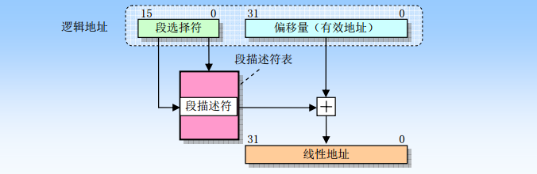
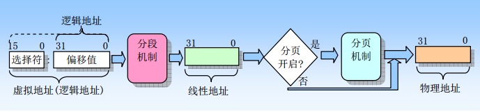
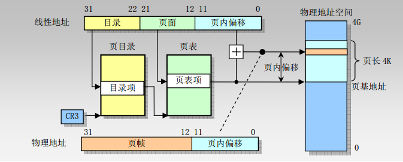

# 分段機制和分頁機制

一 分段機制

　　1、什麼是分段機制

　　 分段機制就是把虛擬地址空間中的虛擬內存組織成一些長度可變的稱為段的內存塊單元。

　　2、什麼是段

　　 每個段由三個參數定義：段基地址、段限長和段屬性。

　　 段的基地址、段限長以及段的保護屬性存儲在一個稱為段描述符的結構項中。

　　3、段的作用

　　 段可以用來存放程序的代碼、數據和堆棧，或者用來存放系統數據結構。

　　4、段的存儲地址

　　 系統中所有使用的段都包含在處理器線性地址空間中。

　　5、段選擇符

 　　邏輯地址包括一個段選擇符或一個偏移量，段選擇符是一個段的唯一標識，提供了段描述符表，段描述符表指明短的大小、訪問權限和段的特權級、段類型以及段的第一個字節在線性地址空間中的位置（稱為段的基地址）。邏輯地址的偏移量部分到段的基地址上就可以定位段中某個字節的位置。因此基地址加上偏移量就形成了處理器線性地址空間中的地址。

　　6 邏輯地址到線性地址的變換過程

如果沒有開啟分頁，那麼處理器直接把線性地址映射到物理地址，即線性地址被送到處理器地址總線上；如果對線性地址空間進行了分頁處理，那麼就會使用二級地址轉換把線性地址轉換成物理地址。

　　7、虛擬地址到物理地址的變換過程

1、什麼是分頁機制

　　 分頁機制在段機制之後進行的，它進一步將線性地址轉換為物理地址。

　　2、分頁機制的存儲

 　　分頁機制支持虛擬存儲技術，在使用虛擬存儲的環境中，大容量的線性地址空間需要使用小塊的物理內存（RAM或ROM）以及某些外部存儲空間來模擬。當使用分頁時，每個段被劃分成頁面（通常每頁為4K大小），頁面會被存儲於物理內存中或硬盤中。操作系統通過維護一個頁目錄和一些頁表來留意這些頁面。當程序（或任務）試圖訪問線性地址空間中的一個地址位置時，處理器就會使用頁目錄和頁表把線性地址轉換成一個物理地址，然後在該內存位置上執行所要求的操作。

　　3、線性地址和物理地址之間的變換過程

三 分段機制和分頁機制的區別

　　1、分頁機制會使用大小固定的內存塊，而分段管理則使用了大小可變的塊來管理內存。

　　2、分頁使用固定大小的塊更為適合管理物理內存，分段機制使用大小可變的塊更適合處理複雜系統的邏輯分區。

　　3、段表存儲在線性地址空間，而頁表則保存在物理地址空間。

