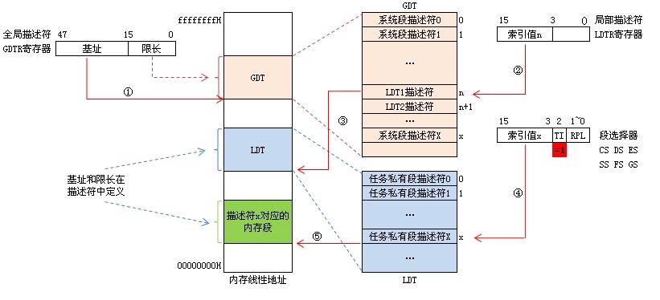
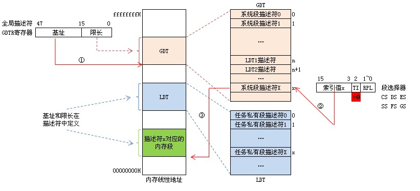

# 段選擇器 段描述符 段描述符表 線性地址形成


- 8086實模式地址的形成
    - 邏輯地址：
        - 段地址：偏移地址，如：8000：0100
        - 段地址由段寄存器CS,DS,SS,ES給出
        - 偏移地址由AX,BX,CX,DX,SP,BP,SI,DI等給出。

    - 物理地址：
        - 物理地址=段地址×10H+偏移地址

- 80386保護模式地址的形成
    - 邏輯地址:
        - 段選擇符:段內偏移
            - 選擇符由CS,DS,ES,FS,GS,SS等段寄存器出,為16位。
            - 段內偏移由EAX,EBX,ECX,EDX,ESP,EBP,ESI,EDI等寄存器給出,是32位。
    - 線性地址:
        - 段的基地址與偏移地址之和稱為線性地址。
            - 段的基地址由段描述符給出
            - 段描述符由段選擇符索引段描述符表得到。


- 32位元組合語言中16位元區段暫存器(CS、DS、ES、SS、FS、GS) 拿來保存　segment selector
- GDTR寄存器中獲得GDT基址

```
段描述符表：IA-32處理器把所有段描述符按順序組織成線性表放在主記憶體中，稱為段描述符表。
分為三類：全局描述符表GDT，局部描述符表LDT和中斷描述符表IDT。
GDT和IDT在整個系統中只有一張，而每個任務都有自己私有的一張局部描述符表LDT，
用於記錄本任務中涉及的各個代碼段、數據段和堆棧段以及本任務的使用的門描述符。
GDT包含系統使用的代碼段、數據段、堆棧段和特殊數據段描述符，以及所有任務局部描述符表LDT的描述符。

GDTR全局描述符寄存器：48位，高32位存放GDT基址，低16為存放GDT限長。
LDTR局部描述符寄存器：16位，高13為存放LDT在GET中的索引值。

目前使用的LDT, 其位址和大小存放在 LDTR暫存器中
主記憶體的GDT, 其位址和大小存放在 GDTR暫存器中

```

---

段選擇器:32位彙編中16位段寄存器(CS、DS、ES、SS、FS、GS)中不再存放段基址,而是段描述符在段描述符表中的索引值,D3-D15位是索引值,D0-D1位是優先級(RPL)用於特權檢查,D2位是描述符表引用指示位TI,**TI=0**指示從全局描述表GDT中讀取描述符，**TI=1**指示從局部描述符中LDT中讀取描述符。這些信息總稱段選擇器(段選擇子).

- 段描述符：8個字節64位，每一個段都有一個對應的描述符。根據描述符描述符所描述的對象不同，描述符可分為三類：儲存段描述符，系統段描述符，門描述符(控制描述符)。在描述符中定義了段的基址，限長和訪問內型等屬性。其中基址給出該段的基礎地址，用於形成線性地址；限長說明該段的長度，用於存儲空間保護；段屬性說明該段的訪問權限、該段當前在內存中的存在性，以及該段所在的特權級。

- 段描述符表：IA-32處理器把所有段描述符按順序組織成線性表放在內存中，稱為段描述符表。分為三類：全局描述符表GDT，局部描述符表LDT和中斷描述符表IDT。GDT和IDT在整個系統中只有一張，而每個任務都有自己私有的一張局部描述符表LDT，用於記錄本任務中涉及的各個代碼段、數據段和堆棧段以及本任務的使用的門描述符。GDT包含系統使用的代碼段、數據段、堆棧段和特殊數據段描述符，以及所有任務局部描述符表LDT的描述符。

GDTR全局描述符寄存器：48位，高32位存放GDT基址，低16為存放GDT限長。
LDTR局部描述符寄存器：16位，高13為存放LDT在GET中的索引值。

IA-32處理器仍然使用xxxx：yyyyyyyy（段選擇器：偏移量）邏輯方式表示一個線性地址，那麼是怎麼得到段的基址呢？在上面說明中我們知道，要得到段的基址首先通過段選擇器xxxx中TI位指定的段描述符所在位置：

當TI=0時表示段描述符在GDT中，如下圖所示：① 先從GDTR寄存器中獲得GDT基址。② 然後再GDT中以段選擇器高13位位置索引值得到段描述符。③ 段描述符符包含段的基址、限長、優先級等各種屬性，這就得到了段的起始地址（基址），再以基址加上偏移地址yyyyyyyy才得到最後的線性地址。





當TI=1時表示段描述符在LDT中，如下圖所示：① 還是先從GDTR寄存器中獲得GDT基址。② 從LDTR寄存器中獲取LDT所在段的位置索引(LDTR高13位)。③ 以這個位置索引在GDT中得到LDT段描述符從而得到LDT段基址。④ 用段選擇器高13位位置索引值從LDT段中得到段描述符。⑤ 段描述符符包含段的基址、限長、優先級等各種屬性，這就得到了段的起始地址（基址），再以基址加上偏移地址yyyyyyyy才得到最後的線性地址。



