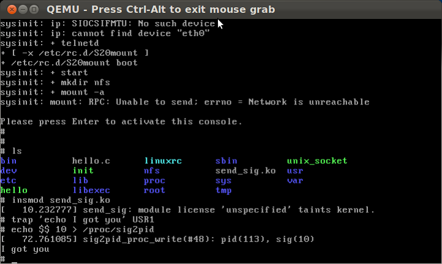

# send signal to user-space

某天有個需求是希望當kernel發生某事件時通知user-space的process，心裡想最快就是送signal，於是google一下，果然有人有類似的需求，signals handling in the kernel，於是改了一下把他放上來，值得一提的是，其實這樣並不被鼓勵的，而且原本的kill_proc_info並沒有被export出來，所以如果是module要使用的話，就必須把他export出來，EXPORT_SYMBOL(kill_proc_info)。



```c
#include <linux/module.h>
#include <linux/init.h>
#include <linux/moduleparam.h>

#include <linux/sched.h>
#include <linux/kernel.h> /* printk() */
// #include <linux/slab.h> /* kmalloc() */
#include <linux/errno.h>  /* error codes */
#include <linux/types.h>  /* size_t */
#include <linux/signal.h>
#include <linux/proc_fs.h>
#include <linux/uaccess.h>

#define PROC_NAME "sig2pid"

/**
 * 送signal 到pid去
 */
static int send_sig_to_pid(int sig, pid_t pid)
{
    struct siginfo info;

    info.si_signo = sig;
    info.si_errno = 0;
    info.si_code = SI_USER; // sent by kill, sigsend, raise
    info.si_pid = get_current()->pid; // sender's pid
    info.si_uid = current_uid(); // sender's uid

    return kill_proc_info(sig, &info, pid);
}

/**
 * /proc/sig2pid的write ops
 */
static int
sig2pid_proc_write(struct file *file, const char __user * buffer,
                     unsigned long count, void *data)
{
    int sig, pid, ret;
    char line[count];
    ret = copy_from_user(line, buffer, count);

    if (ret) {
        return -EFAULT;
    }
    sscanf(line, "%d %d", &pid, &sig);
    printk("%s(#%d): pid(%d), sig(%d)\n",
            __func__, __LINE__, pid, sig);
    send_sig_to_pid(sig, (pid_t) pid);
    return count;
}

/**
 * 建立/proc/sig2pid
 */
static int create_proc_file(void)
{
    struct proc_dir_entry *p;
    p = create_proc_entry(PROC_NAME, S_IFREG | S_IWUGO, NULL);
    if (!p) {
        printk("%s(#%d): create proc entry failed\n", __func__, __LINE__);
        return -EFAULT;
    }
    p->write_proc = sig2pid_proc_write;
    return 0;
}

int sig2pid_init_module(void)
{
    return create_proc_file();
}

void sig2pid_exit_module(void)
{
    remove_proc_entry(PROC_NAME, NULL);
}

module_init(sig2pid_init_module);
module_exit(sig2pid_exit_module);
```

```sh
# Comment/uncomment the following line to disable/enable debugging
#DEBUG = y

# EXTRA_CFLAGS += -Werror -Wall

# Add your debugging flag (or not) to CFLAGS
ifeq ($(DEBUG),y)
  EXTRA_CFLAGS += -O -g -DDEBUG # "-O" is needed to expand inlines
else
  EXTRA_CFLAGS += -O2
endif

ifneq ($(KERNELRELEASE),)
# call from kernel build system
obj-m	:= send_sig.o

else

KERNELDIR ?= /lib/modules/$(shell uname -r)/build
PWD       := $(shell pwd)

default:
	$(MAKE) -C $(KERNELDIR) M=$(PWD) modules
endif

clean:
	rm -rf *.o *~ core .depend .*.cmd *.ko *.mod.c .tmp_versions

depend .depend dep:
	$(CC) $(CFLAGS) -M *.c > .depend

ifeq (.depend,$(wildcard .depend))
include .depend
endif

```


#參考資料：

```
http://old.nabble.com/signals-handling-in-the-kernel-to12032525.html#a12032525 , signals handling in the kernel.
http://kerneltrap.org/node/5800, how to send signal from kernel space to user space.

github： https://github.com/brook-kuo/Linux_Module/tree/master/process/send_sig_to_userspace
```
