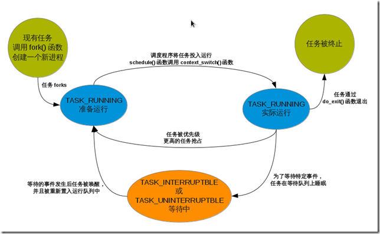

# Linux 行程


進程是所有操作系統的核心概念，同樣在linux上也不例外。

###主要內容：
```
進程和線程
進程的生命週期
進程的創建
進程的終止
```

## 1. 進程和線程

進程和線程是程序運行時狀態，是動態變化的，進程和線程的管理操作(比如，創建，銷燬等)都是有內核來實現的。

Linux中的進程於Windows相比是很輕量級的，而且不嚴格區分進程和線程，線程不過是一種特殊的進程。

所以下面只討論進程，只有當線程與進程存在不一樣的地方時才提一下線程。


進程提供2種虛擬機制：虛擬處理器和虛擬內存

每個進程有獨立的虛擬處理器和虛擬內存，

每個線程有獨立的虛擬處理器，同一個進程內的線程有可能會共享虛擬內存。


內核中進程的信息主要保存在task_struct中(include/linux/sched.h)

進程標識PID和線程標識TID對於同一個進程或線程來說都是相等的。

Linux中可以用ps命令查看所有進程的信息：
```sh
ps -eo pid,tid,ppid,comm
```

## 2. 進程的生命週期
進程的各個狀態之間的轉化構成了進程的整個生命週期。




## 3. 進程的創建

Linux中創建進程與其他系統有個主要區別，Linux中創建進程分2步：fork()和exec()。

fork: 通過拷貝當前進程創建一個子進程

exec: 讀取可執行文件，將其載入到內存中運行

創建的流程：


- 調用dup_task_struct()為新進程分配內核棧，task_struct等，其中的內容與父進程相同。
- check新進程(進程數目是否超出上限等)
- 清理新進程的信息(比如PID置0等)，使之與父進程區別開。
- 新進程狀態置為 TASK_UNINTERRUPTIBLE
- 更新task_struct的flags成員。
- 調用alloc_pid()為新進程分配一個有效的PID
- 根據clone()的參數標誌，拷貝或共享相應的信息
- 做一些掃尾工作並返回新進程指針

創建進程的fork()函數實際上最終是調用clone()函數。

創建線程和進程的步驟一樣，只是最終傳給clone()函數的參數不同。

比如，通過一個普通的fork來創建進程，相當於：clone(SIGCHLD, 0)

創建一個和父進程共享地址空間，文件系統資源，文件描述符和信號處理程序的進程，即一個線程：clone(CLONE_VM | CLONE_FS | CLONE_FILES | CLONE_SIGHAND, 0)

在內核中創建的內核線程與普通的進程之間還有個主要區別在於：內核線程沒有獨立的地址空間，它們只能在內核空間運行。

這與之前提到的Linux內核是個單內核有關。


## 4. 進程的終止

和創建進程一樣，終結一個進程同樣有很多步驟：

子進程上的操作(do_exit)
- 設置task_struct中的標識成員設置為PF_EXITING
- 調用del_timer_sync()刪除內核定時器, 確保沒有定時器在排隊和運行
- 調用exit_mm()釋放進程佔用的mm_struct
- 調用sem__exit()，使進程離開等待IPC信號的隊列
- 調用exit_files()和exit_fs()，釋放進程佔用的文件描述符和文件系統資源
- 把task_struct的exit_code設置為進程的返回值
- 調用exit_notify()向父進程發送信號，並把自己的狀態設為EXIT_ZOMBIE
- 切換到新進程繼續執行

子進程進入EXIT_ZOMBIE之後，雖然永遠不會被調度，關聯的資源也釋放掉了，但是它本身- 佔用的內存還沒有釋放，
比如創建時分配的內核棧，task_struct結構等。這些由父進程來釋放。

父進程上的操作(release_task)

父進程受到子進程發送的exit_notify()信號後，將該子進程的進程描述符和所有進程獨享的資源全部刪除。

從上面的步驟可以看出，必須要確保每個子進程都有父進程，如果父進程在子進程結束之前就已經結束了會怎麼樣呢？

子進程在調用exit_notify()時已經考慮到了這點。

如果子進程的父進程已經退出了，那麼子進程在退出時，exit_notify()函數會先調用forget_original_parent()，然後再調用find_new_reaper()來尋找新的父進程。

find_new_reaper()函數先在當前線程組中找一個線程作為父親，如果找不到，就讓init做父進程。(init進程是在linux啟動時就一直存在的)
