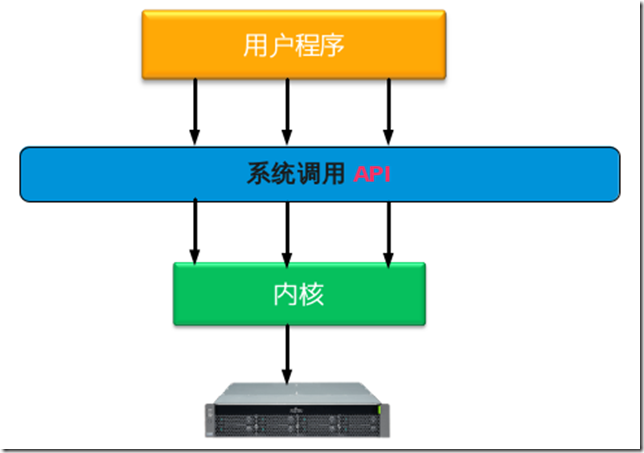

# 系統呼叫


###主要內容：

- 什麼是系統調用
- Linux上的系統調用實現原理
- 一個簡單的系統調用的實現

## 1. 什麼是系統調用
簡單來說，系統調用就是用戶程序和硬件設備之間的橋樑。

用戶程序在需要的時候，通過系統調用來使用硬件設備。

系統調用的存在，有以下重要的意義:

1）用戶程序通過系統調用來使用硬件，而不用關心具體的硬件設備，這樣大大簡化了用戶程序的開發。

    比如：用戶程序通過write()系統調用就可以將數據寫入文件，而不必關心文件是在磁盤上還是軟盤上，或者其他存儲上。

2）系統調用使得用戶程序有更好的可移植性。

    只要操作系統提供的系統調用接口相同，用戶程序就可在不用修改的情況下，從一個系統遷移到另一個操作系統。

3）系統調用使得內核能更好的管理用戶程序，增強了系統的穩定性。

    因為系統調用是內核實現的，內核通過系統調用來控制開放什麼功能及什麼權限給用戶程序。

    這樣可以避免用戶程序不正確的使用硬件設備，從而破壞了其他程序。

4）系統調用有效的分離了用戶程序和內核的開發。

    用戶程序只需關心繫統調用API，通過這些API來開發自己的應用，不用關心API的具體實現。

    內核則只要關心繫統調用API的實現，而不必管它們是被如何調用的。


用戶程序，系統調用，內核，硬件設備的調用關係如下圖：




## 2. Linux上的系統調用實現原理

要想實現系統調用，主要實現以下幾個方面：

- 通知內核調用一個哪個系統調用
- 用戶程序把系統調用的參數傳遞給內核
- 用戶程序獲取內核返回的系統調用返回值
下面看看Linux是如何實現上面3個功能的。

### 2.1 通知內核調用一個哪個系統調用

每個系統調用都有一個系統調用號，系統調用發生時，內核就是根據傳入的系統調用號來知道是哪個系統調用的。

在x86架構中，用戶空間將系統調用號是放在eax中的，系統調用處理程序通過eax取得系統調用號。

系統調用號定義在內核代碼：arch/alpha/include/asm/unistd.h 中，可以看出linux的系統調用不是很多。
### 2.2 用戶程序把系統調用的參數傳遞給內核

系統調用的參數也是通過寄存器傳給內核的，在x86系統上，系統調用的前5個參數放在ebx,ecx,edx,esi和edi中，如果參數多的話，還需要用個單獨的寄存器存放指向所有參數在用戶空間地址的指針。

一般的系統調用都是通過C庫(最常用的是glibc庫)來訪問的，Linux內核提供一個從用戶程序直接訪問系統調用的方法。

參見內核代碼：arch/cris/include/arch-v10/arch/unistd.h

裡面定義了6個宏，分別可以調用參數個數為0～6的系統調用

```c
_syscall0(type,name)
_syscall1(type,name,type1,arg1)
_syscall2(type,name,type1,arg1,type2,arg2)
_syscall3(type,name,type1,arg1,type2,arg2,type3,arg3)
_syscall4(type,name,type1,arg1,type2,arg2,type3,arg3,type4,arg4)
_syscall5(type,name,type1,arg1,type2,arg2,type3,arg3,type4,arg4,type5,arg5)
_syscall6(type,name,type1,arg1,type2,arg2,type3,arg3,type4,arg4,type5,arg5,type6,arg6)
```
超過6個參數的系統調用很罕見，所以這裡只定義了6個。

### 2.3 用戶程序獲取內核返回的系統調用返回值
獲取系統調用的返回值也是通過寄存器，在x86系統上，返回值放在eax中。

## 3. 一個簡單的系統調用的實現
瞭解了Linux上系統調用的原理，下面就可以自己來實現一個簡單的系統調用。

### 3.1 環境準備
為了不破壞現有系統，我是用虛擬機來實驗的。

主機：fedora16 x86_64系統 + kvm(一種虛擬技術，就像virtualbox，vmware等)

虛擬機: 也是安裝fedora16 x86_64系統(通過virt-manager很容易安裝一個系統)


下載內核源碼：www.kernel.org  下載最新的就行

### 3.2 修改內核源碼中的相應文件
主要修改以下文件：
```c
arch/x86/ia32/ia32entry.S
arch/x86/include/asm/unistd_32.h
arch/x86/include/asm/unistd_64.h
arch/x86/kernel/syscall_table_32.S
include/asm-generic/unistd.h
include/linux/syscalls.h
kernel/sys.c
```
我在sys.c中追加了2個函數:sys_foo和sys_bar

如果是在x86_64的內核中增加一個系統調用，只需修改 arch/x86/include/asm/unistd_64.h，比如sys_bar。

修改內容參見下面的diff文件：

```c
diff -r new/arch/x86/ia32/ia32entry.S old/arch/x86/ia32/ia32entry.S
855d854
<     .quad sys_foo
diff -r new/arch/x86/include/asm/unistd_32.h old/arch/x86/include/asm/unistd_32.h
357d356
< #define __NR_foo    349
361c360
< #define NR_syscalls 350
---
> #define NR_syscalls 349
diff -r new/arch/x86/include/asm/unistd_64.h old/arch/x86/include/asm/unistd_64.h
689,692d688
< #define __NR_foo            312
< __SYSCALL(__NR_foo, sys_foo)
< #define __NR_bar            313
< __SYSCALL(__NR_bar, sys_bar)
diff -r new/arch/x86/kernel/syscall_table_32.S old/arch/x86/kernel/syscall_table_32.S
351d350
<     .long sys_foo
diff -r new/include/asm-generic/unistd.h old/include/asm-generic/unistd.h
694,695d693
< #define __NR_foo 272
< __SYSCALL(__NR_foo, sys_foo)
698c696
< #define __NR_syscalls 273
---
> #define __NR_syscalls 272
diff -r new/kernel/sys.c old/kernel/sys.c
1920,1928d1919
<
< asmlinkage long sys_foo(void)
< {
<     return 1112223334444555;
< }
< asmlinkage long sys_bar(void)
< {
<     return 1234567890;
< }
```

### 3.3 編譯內核
```sh
#cd linux-3.2.28
#make menuconfig  (選擇要編譯參數，如果不熟悉內核編譯，用默認選項即可)
#make all  (這一步真的時間很長......)
#make modules_install
#make install  (這一步會把新的內核加到啟動項中)
#reboot  (重啟系統進入新的內核)
```
### 3.4 編寫調用的系統調用的代碼

```c
#include <unistd.h>
#include <sys/syscall.h>
#include <string.h>
#include <stdio.h>
#include <errno.h>


#define __NR_foo 312
#define __NR_bar 313

int main()
{
    printf ("result foo is %ld\n", syscall(__NR_foo));
    printf("%s\n", strerror(errno));
    printf ("result bar is %ld\n", syscall(__NR_bar));
    printf("%s\n", strerror(errno));
    return 0;
}
```
編譯運行上面的代碼：

```sh
#gcc test.c -o test
#./test
```
運行結果如下：

```c
result foo is 1112223334444555
Success
result bar is 1234567890
Success
```

