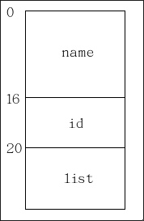
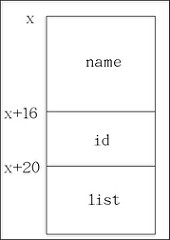

# Linux Kernel: 強大又好用的list_head結構

Linux Kernel: 強大又好用的list_head結構
程式設計者在設計一個doubly linked list時，通常會在所宣告的結構裡宣告兩個結構指標，如下所示：
```c
struct student {
    char name[16];
    int id;
    struct student *next, *prev;
};
```
只要經由prev與next兩個結構指標，便能取得該doubly linked list所有資訊。

然而，Linux kernel並非引用此種作法。因此，Linux kernel定義一通用結構 (struct list_head， include/linux/list.h)，用以實作doubly linked list，此結構相當簡單，如下所示：
```c
struct list_head {
    struct list_head *next, *prev;
};
```

所以物件student宣告為如下：
```c
struct student
{
    char name[16];
    int id;
    struct list_head list;
};
```
藉由list變數便能取得doubly linked list所有資訊。

###list_head相關Marco與Function


這裡僅介紹較常用的macro與function，如欲進一步得知其它marco請參考include/linux/list.h
```c
LIST_HEAD(name)
struct list_head name = { &(name), &(name) };
將next與prev指到自己，意味著此list為空的。

list_empty(const struct list_head *head)
retrun head->next == head;
檢查此list是否為空的。

list_add(struct list_head *new, struct list_head *head)
head->next->prev = new;
new->next = head->next;
new->prev = head;
head->next = new;
將資料加入至doubly linked list最前端。建議自己動手畫個圖，便可了解這幾個指標指到何處。

list_del(struct list_head *entry)
entry->next->prev = entry->prev;
entry->prev->next = entry->next;
將某一資料從中刪除。

list_entry(ptr,type,member)
((type *)((char *)(ptr)-(unsigned long)(&((type *)0)->member)))

透過此函式便能算出結構的起始位址，並做結構轉型便能取得結構的資料，此計算方式相當好用啊!!!
```
以struct student為例，如下所示：

`(unsigned long)(&((struct student *)0)->member)))` ==> 計算出list成員相對位址。通常看到這一個敘述，直覺地覺得應該會記憶體區段錯誤吧 (Segmentation Fault)!? 因為該敘述用NULL的pointer存取list成員，但在(struct student *)0)->member))前面加了&符號，就不會發生記憶體區段錯誤。因為&符號，只意味著存取list的位址，而不是資料， 經由此敘述便能取得list的位移植。如下圖所示，該敘述所得之位移植值為20。



`((type *)((char *)(ptr)-(unsigned long)(&((type *)0)->member)))` ==> 取得位移植之後，再將list的位址減去位移植，便能取得該結構的起始位址，如下圖所示 (假設結構起始位址為x)，最後再做結構轉型變大功告成。


```c
list_for_each(pos, head)
for (pos = (head)->next; pos != (head); pos = pos->next)
```
取得該doubly linked list所有資料。

- Makefile

```c
obj-m += list_head_ex.o

KDIR=/lib/modules/$(shell uname -r)/build

all:
	make -C $(KDIR) M=$(PWD) modules
clean:
	make -C $(KDIR) M=$(PWD) clean

```

-list_head_ex.c

```c
/*
 * =============================================================================
 *
 *       Filename:  list_head_ex.c
 *
 *    Description:  Write a doubly linked list by using list_head structure
 *
 *        Version:  1.0
 *        Created:  Fri Oct 19 14:14:57 GMT 2007
 *       Revision:  none
 *       Compiler:  gcc
 *
 *         Author:  Adrian Huang
 *        Web Site:  http://adrianhuang.blogspot.com/
 *
 * ============================================================================
 */

#include "list_head_ex.h"

int __init list_head_init(void)
{
	struct list_head	std_head, *next;
	struct student		sl[NR_STDS]; 		// student list
	struct student		*studentP; 	// student pointer
	int					idx;

	/* init std_head */
	INIT_LIST_HEAD(&std_head);

	/* Check whether the std_head is empty */
	if(list_empty(&std_head) == TRUE) {
		printk(KERN_INFO "[Adrian] std_head is NULL\n");
	}

	/* Add each element to student head (std_head) */
	for(idx=0;idx<sizeof(sl)/sizeof(struct student);idx++) {
		sprintf(sl[idx].name, "Adrian Huang");
		sl[idx].id = idx + 1;
		list_add(&sl[idx].list, &std_head);
	}

	printk(KERN_INFO "======dump all elements of the list by invoking "
					"'list_for_each'=========\n");
	/* Traverse all elements of the list */
	list_for_each(next, &std_head) {
		studentP = (struct student *) list_entry(next, struct student, list);
		printk(KERN_INFO "[Adrian] name: %s, id: %d\n",
							 studentP->name, studentP->id);
	}


	printk(KERN_INFO "\n======dump all elements of the list by invoking "
					"'list_entry'=========\n");
	/* Traverse all elements of the list and delete each of it */
	for(idx=0;idx<sizeof(sl)/sizeof(struct student);idx++) {
		studentP = (struct student *) list_entry(std_head.next,
									 struct student, list);

		printk(KERN_INFO "[Adrian] name: %s, id: %d\n",
							 studentP->name, studentP->id);

		list_del(std_head.next);
	}

	return 0;
}

void __exit list_head_exit(void)
{
	;
}

module_init(list_head_init);
module_exit(list_head_exit);

```

- list_head_ex.h

```c
/*
 * =============================================================================
 *
 *       Filename:  list_head_ex.h
 *
 *    Description: Write a doubly linked list by using list_head structure
 *
 *        Version:  1.0
 *        Created:  Fri Oct 19 14:17:58 GMT 2007
 *       Revision:  none
 *       Compiler:  gcc
 *
 *         Author:  Adrian Huang
 *       Web Site:  http://adrianhuang.blogspot.com/
 *
 * =============================================================================
 */

#ifndef  LIST_HEAD_EX_INC
#define  LIST_HEAD_EX_INC

#include <linux/module.h>	/* Needed by all modules */
#include <linux/kernel.h>	/* Needed for KERN_INFO */
#include <linux/jiffies.h>
#include <linux/list.h>		/* list_head structure	*/

#define	NR_STDS	5

struct student {
	char				name[16];
	int					id;
	struct list_head	list;
};

typedef enum _Boolean { FALSE = 0, TRUE = 1 } LHBOOL; // list head boolean

#endif   /* ----- #ifndef LIST_HEAD_EX_INC  ----- */
```

[code Download](./src/list_head_v1.tar.gz)
