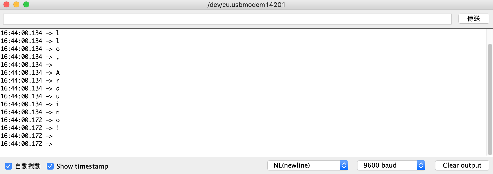
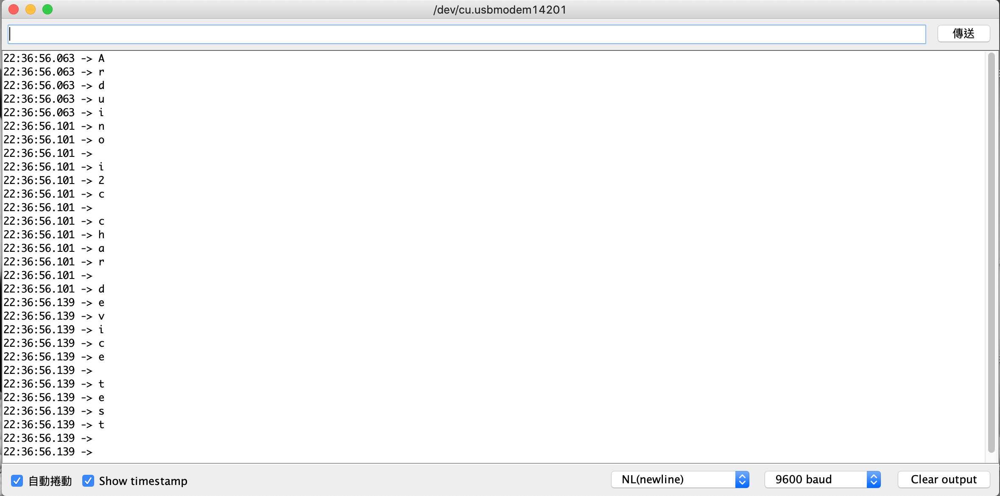

## Day 11：I2C Driver (Part 2) - 這是一個間諜檔案！把 I2C 的傳輸包成字元驅動程式


前面已經用了一個 i2c 的位址，但是什麼都沒有做。所以接下來就想要做多一點事情。最直覺的問題就是能不能傳輸一些資訊給 Arduino？答案是可以的。可以把 I2C 的傳輸用字元驅動程式 (*Character Device*) 包裝起來，然後就可以在 userspace 用讀寫檔案的那些系統呼叫，去做到 I2C 傳輸了！

硬體方面，就是 Raspberry Pi Model B 的 I2C 與 Arduino 的 I2C 對接 (`GPIO2` 跟 Arduino 的 `A4` 連接; 把 `GPIO3` 跟 Arduino 的 `A5` 連接。最後，再把地線接在一起，就完成硬體的設置了)。

## Part 1：I2C 傳輸的 API

首先來試試看怎麼使用核心中的 I2C 相關的 API。這方面可以參考核心文件中 [*Implementing I2C device drivers*](https://www.kernel.org/doc/html/latest/i2c/writing-clients.html#implementing-i2c-device-drivers) 中的 [*Sending and receiving*](https://www.kernel.org/doc/html/latest/i2c/writing-clients.html#sending-and-receiving) 一節。這篇當中有提到：

*If you can choose between plain I2C communication and SMBus level communication, please use the latter. All adapters understand SMBus level commands, but only some of them understand plain I2C!*

所以，雖然核心中有 i2c 的 API，不過接下來都會使用 SMBus 系列的。反正後面只是前面的子集嘛。

### Step 1 - 1：Arduino 程式

首先，Arduino 程式非常的簡單：他會讀到一個 byte 就印一個 byte：

```c
#include <Wire.h>
#define ARDUINO_ADDR 0x8

void setup()
{
    Wire.begin(ARDUINO_ADDR);
    Wire.onReceive(receiveEvent);
    Serial.begin(9600);
}

void loop()
{
    delay(100);
}

void receiveEvent(int nbyte)
{
    while (Wire.available()) {
        char c = Wire.read();
        Serial.println(c);
    }
}
```

接下來要想辦法生一個驅動程式寫東西給這個 Arduino。

### Step 1 - 2：Kernel Module 程式

現在先來測試看看核心中用來傳輸 I2C 的函數用起來是什麼樣子。現在先做一件事情：當這個 *Driver* 被配對到 Arduino 上面時，在 `probe` 的最後面傳輸 `Hello, Arduino!` 這個訊息給 Arduino：

```makefile
# include <linux/module.h>
# include <linux/kernel.h>
# include <linux/init.h>
# include <linux/i2c.h>
# include <linux/string.h>

static int dummy_probe(struct i2c_client *client, const struct i2c_device_id *id)
{
    pr_info("Dummy device is being probed.\n");
    char *info = "Hello, Arduino!\n";
    for (int i = 0; i < strlen(info); i++) {
    	i2c_smbus_write_byte(client, info[i]);
    }
    return 0;    
}

static int dummy_remove(struct i2c_client *client)
{
    pr_info("Dummy device is removing.\n");
    return 0;
}

static struct of_device_id dummy_id_tables [] = {
    { .compatible="arduino", },
    { }
};

MODULE_DEVICE_TABLE(of, dummy_id_tables);

static struct i2c_driver dummy_drv = {
    .probe = dummy_probe,
    .remove = dummy_remove,
    .driver = {
    	.name = "dummy device 0.1",
	.owner = THIS_MODULE,
	.of_match_table = dummy_id_tables,
    },
};

module_i2c_driver(dummy_drv);
MODULE_LICENSE("GPL");
```

### Step 1 - 3：測試結果

首先打開 Arduino IDE 的序列埠，接著準備把這個模組載入。假定這個模組叫做 `dummy_i2c_chrdrv.ko`，把他用 `insomod` 載入之後：

```shell
$ sudo insmod dummy_i2c_chrdrv.ko
```

就會發現 Arduino IDE 上出現了預期的輸出：



另外一方面，用 `dmesg` 的話，也可以找到 `probe` 函數中的資訊：

```c
...
[ 1380.449096] Dummy device is being probed.
```

## Part 2：Character Device 任務清單

接下來就是要正式寫一個字元驅動程式了！這個**字元驅動程式其實就是一個間諜檔案**：打開他的方法像檔案，寫他的方法像檔案，但寫的東西並不是變成檔案，而是傳輸給 I2C 上的 Arduino。而要做到這點，就要提供「要怎麼假裝成檔案」，也自己要提供一組檔案操作對應的實作。

關於 Character Device 的描述可以參考 [LDD3](https://www.oreilly.com/library/view/linux-device-drivers/0596005903/ch03.html) 關於字元驅動程式的描述。簡單來說，就是：

1. 要把 I2C 的傳輸包成一組檔案操作的函數
2. 把他註冊給核心

更詳細一點地說，這些任務包含了：

### 任務 1：實作 file_operations 的操作

這個意思是要提供指向一組 `open`, `read`, `write` 的 [`file_operations`](https://elixir.bootlin.com/linux/latest/source/include/linux/fs.h#L1837) 實作的函數指標形成的結構，讓這一切的傳輸可以「假裝」像是對一個檔案進行讀寫。使 User space 在進行 `read`, `write` 等等系統呼叫時，看起來就像是真的在跟檔案互動。這個結構在 [include/linux/fs.h](https://elixir.bootlin.com/linux/latest/source/include/linux/fs.h#L1837) 中：

```c
struct file_operations {
...
	loff_t (*llseek) (struct file *, loff_t, int);
	ssize_t (*read) (struct file *, char __user *, size_t, loff_t *);
	ssize_t (*write) (struct file *, const char __user *, size_t, loff_t *);
...
	long (*unlocked_ioctl) (struct file *, unsigned int, unsigned long);
	long (*compat_ioctl) (struct file *, unsigned int, unsigned long);
	int (*mmap) (struct file *, struct vm_area_struct *);
	unsigned long mmap_supported_flags;
	int (*open) (struct inode *, struct file *);
...
};
```

雖然說是一個很大的結構體，但實際上並不用每個方法都提供實作。比如說：[i2c-dev](https://elixir.bootlin.com/linux/latest/source/drivers/i2c/i2c-dev.c#L618) 這個例子中，提供的各種檔案操作是這樣：

```c
static const struct file_operations i2cdev_fops = {
	.owner		= THIS_MODULE,
	.llseek		= no_llseek,
	.read		= i2cdev_read,
	.write		= i2cdev_write,
	.unlocked_ioctl	= i2cdev_ioctl,
	.compat_ioctl	= compat_i2cdev_ioctl,
	.open		= i2cdev_open,
	.release	= i2cdev_release,
};
```

總之，任務就是想辦法提供 `read`, `write` 那些檔案操作。只要 userspace 對這個檔案進行各種檔案相關的系統呼叫時，可以這個 `file_operations` 可以把資料交差給 userspace，不管背後是哪邊來的資料，就安然無恙。

以這邊的例子為例，`write` 就是從 Raspberry Pi 透過 I2C 寫資料給 Arduino，所以這個 `write` 可能就會像這樣：

```c
static ssize_t arduino_i2c_write(struct file *file, char __user *buf, size_t count,
		loff_t *offset)
{
    ...
    i2c_smbus_write_byte(client, ...);
    return 0;
}

struct file_operations arduino_i2c_fops = {
    .write = arduino_i2c_write
};
```

這邊會發現有一個問題：`i2c_smbus_write_byte` 這個函數需要吃 `struct *i2c_client`，也就是他必須要知道寫的時候，i2c slave 的相關資訊。但是這個 `write` 的 prototype 中並沒有這個資料結構，所以要想辦法給他。

### 任務 2：提供 i2c_client

`struct i2c_client` 在 `probe` 開始進行的時候，就會得到了。也就是在這個函數的 `client` 那個參數：

```c
static int dummy_probe (struct i2c_client *client, const struct i2c_device_id *id)
{
    ...
}

static struct i2c_driver dummy_drv = {
    .probe = dummy_probe,
    .remove = dummy_remove,
    .driver = {
    	.name = "dummy device 0.1",
	.owner = THIS_MODULE,
	.of_match_table = dummy_id_tables,
    },
};
```

所以可以在 `probe` 開始的時候，就把這個東西紀錄下來，然後用某些方法提供給 `write` ，那就可以達成任務了。而要做到這件事，可以定義一個新的結構體：

```c
struct arduino_i2c_cdev {
    i2c_client *client;
    struct cdev cdev;
};
```

然後在 `probe` 裡面放進去：

```c
static int dummy_probe (struct i2c_client *client, const struct i2c_device_id *id)
{
    ...
    struct *arduino_i2c_cdev = kzalloc(sizeof(struct arduino_i2c_cdev));
    arduino -> client = client;
    ...
}
```

這樣就把 Arduino 在 I2C 上的資訊記錄下來了。不過，這似乎沒有解決問題，因為記錄下來之後還是要想辦法傳進 `read` 中。

### 任務 3：傳遞 i2c_client 給 write 函數

雖然 `i2c_client` 已經記錄下來了，不過在 `write` 的時候還是要想辦法傳進去。這時就把腦筋動到 `open` 上面。`open` 的時候可以把 `i2c_client` 放到 `struct file` 的 `private_data` 裡面，然後 `write` 在寫這個檔案時，就可以從裡面把他取出來。

```c
static ssize_t arduino_i2c_open(struct inode *inode, struct file *file)
{
    ...
    file -> private_data = client;
    ...
}

static ssize_t arduino_i2c_write(struct file *file, char __user *buf, size_t count,
		loff_t *offset)
{
    ...
    sturct *i2c_client client = file -> private_data;
    i2c_smbus_write_byte(client, ...);
    ...
}
```

不過，問題是這個 `client` 要怎麼出現在裡面？這時候可以把頭腦動到 `inode` 上面。參考 LDD3 中的[章節](https://www.oreilly.com/library/view/linux-device-drivers/0596005903/ch03.html)可知：`inode` 中有一個欄位是 `i_cdev`。當這個 `inode` 所屬的檔案是某個 character device 時這個欄位會自動指向對應的 `cdev` 結構。具體的程式可以參考 [include/linux/fs.h](https://elixir.bootlin.com/linux/latest/source/include/linux/fs.h#L736)：

```c
struct inode {
    ...
	union {
		const struct file_operations	*i_fop;	/* former ->i_op->default_file_ops */
		void (*free_inode)(struct inode *);
	};
	struct file_lock_context	*i_flctx;
	struct address_space	i_data;
	struct list_head	i_devices;
	union {
		struct pipe_inode_info	*i_pipe;
		struct block_device	*i_bdev;
		struct cdev		*i_cdev;
		char			*i_link;
		unsigned		i_dir_seq;
	};
    ...
};
```

不過，因為剛剛註冊 `cdev` 的時候，是用 `arduino -> cdev` 下去註冊的，所以在開這個檔案時，`i_cdev` 對應的 `struct cdev` 跟 `arduino` 中對應的 `cdev` 就會是同一個 (因為剛剛就是拿他下去註冊的嘛)。也就是下面兩個東西是一樣的：

1. `inode->i_cdev`
2. `&(arduino -> cdev)`

### 關鍵：container_of

這兩個東西一樣有什麼用處？答案是 `container_of` 這個巨集。他的原始程式可以字 [include/linux/kernel.h](https://elixir.bootlin.com/linux/latest/source/include/linux/kernel.h#L1001) 中找到。

假定 `type` 是某個結構體，而他的定義中有一個成員叫做 `member`。也就是像這樣：

```c
struct type {
    ...
    foo member;
};
```

而 `ptr` 現在指向某一個特定的 `type` 結構體中的 `member`。也就是：

```c
struct type *bar = ...;
foo *ptr = &(bar -> member);
```

那麼，跟 `container_of` 說「我現在知道 `ptr` 是個指向某一個 `type` 結構體中名稱是 `member` 的成員的指標。請告訴我那個包住 `ptr` 所指到的 `member` 的那個結構體 `type` 的起始位置在哪裡？」他就會把他生出來。也就是：

```c
container_of(ptr, type, member) // &bar
```

這個東西有什麼用呢？剛剛提到下面這兩個東西是指到同一個地方：

1. `inode->i_cdev`
2. `&(arduino -> cdev)`

現在有的事 1. ，可是同時也有 2. 的結構體定義。所以就可以在 `open` 中使用下面這個東西，找到 `cdev` 所屬的那個 `struct arduino_i2c_cdev` 的位置：

```c
struct arduino_i2c_cdev *arduino = 
        container_of(inode->i_cdev, struct arduino_i2c_cdev, cdev);
```

然後就可以用：

```c
struct i2c_client *client = arduino -> client;
```

來找出 `client` 在哪邊。

### 結論：怎麼把 i2c_client 丟給 write？

綜合以上，既然 `open` 中可以找到 `struct i2c_client`，就可以把他放到 `struct file` 中的 `private_data` 中，之後 `write` 在使用時，就可以知道要傳到哪邊。也就是：

1. 先用 `container_of` 去用 `inode-> cdev` 中的這個成員 (因為剛剛註冊的關係，所以跟 `struct arduino_i2c_cdev` 中的 `cdev` 成員會是同一個) 反找回原先的 `strct arduino_i2c_cdev` 的結構體的頭。
2. 找之後就可以順籐摸瓜，從 `strct arduino_i2c_cdev` 找出 `i2c_client`。
3. 找到之後 把 `i2c_client` 放到 `struct file` 中的 `void *private_data` 中。
4. 等到 `write` 的時候，就可以從 `struct file` 的指標中把他取出來。

具體來說，就是像下面這樣：

```c
static ssize_t arduino_i2c_open(struct inode *inode, struct file *file)
{
    struct arduino_i2c_cdev *arduino = NULL;    
    arduino = container_of(inode->i_cdev, struct arduino_i2c_cdev, cdev);
    file -> private_data = arduino -> client;
    ...
}

static ssize_t arduino_i2c_write(struct file *file, char __user *buf, size_t count,
		loff_t *offset)
{
    ...
    sturct *i2c_client = file -> private_data;
    i2c_smbus_write_byte(client, ...);
    ...
}
```

這樣一來，在 `write` 裡面時，就可以使用 `file->private_data` 這個欄位去取出對應的 `struct i2c_client`，然後用它進行 I2C 傳輸了。

### 任務 4：註冊 cdev

這個就是 Character Device 的一些標準流程：比如說要申請一組 major/minor number、初始化 `cdev`、在 `sysfs` 加上一些條目等等。一樣，這邊可以參考 [LDD3](https://www.oreilly.com/library/view/linux-device-drivers/0596005903/ch03.html)。大致上的流程會像下面這樣：

```c=
static int dummy_probe (struct i2c_client *client, const struct i2c_device_id *id)
{
    struct *arduino_i2c_cdev arduino = kzalloc(sizeof(struct arduino_i2c_cdev));
    ...
    alloc_chrdev_region(...);
    cdev_init(&arduino->cdev, &arduino_i2c_fops);       // initialize character device
    cdev_add(...);        // register character device
    class_create(...);    // add sysfs directory
    device_create(...);   // add sysfs file
    ...
    arduino -> client = client;
    ...
}
```

## Part 3：實作出來

下面其實就是依照 [LDD3](https://static.lwn.net/images/pdf/LDD3/ch03.pdf) 中第三章的部分乖乖的把註冊 character device 的流程走一遍，只是 `write` 的部分變成使用 I2C 傳送。

因為 `probe` 配對成功之後做的第一件事，就把所有 character device 的註冊流程都要在 `probe` 裡面做完，這樣 `probe` 完之後就自動有一個 Character Device 了。

### Step 2 - 1：註冊 major 跟 minor number

major 跟 minor number 是識別裝置驅動程式的一種依據。具體的細節可以去參考 LDD。而這兩個數字其實是 `dev_t` 的高位跟低位，而要申請到一組 major/minor number，可以用 `alloc_chrdev_region` 這個函數：

```c
static int dummy_probe(struct i2c_client *client, const struct i2c_device_id *id)
{
    ...
    dev_t *dev = NULL;
    int err = alloc_chrdev_region(dev, 0, 1, ARDUINO_DEV_NAME);
    if (err < 0) {
        pr_err ("Failed in alloc_chrdev_reion for arduino.\n");
	goto out_alloc_chrdev;
    }
    ...
```

### Step 2 - 2：加上 sysfs 目錄

這邊加上的 `class` 會變成 `sys` 底下的資料夾：

```c
    ...
    arduino_class = class_create(THIS_MODULE, ARDUINO_DEV_NAME);
    if (!arduino_class) {
    	pr_err ("Failed to create sysfs class.\n");
	goto out_sysfs_class;
    }
    ...
```

### Step 2 - 3：實作 open

這邊就是用剛剛的 `container_of` 把找出 `arduino_i2c_cdev` 起頭的位置，然後把他裝進 `filp` 的 `private_data` 中，等一下給 `write` 用：

```c
static ssize_t arduino_i2c_open(struct inode *inode, struct file *filp)
{
    struct arduino_i2c_cdev *arduino = container_of(inode->i_cdev, struct arduino_i2c_cdev, cdev);
    if (!arduino) {
    	pr_err("Cannot extrace aduino structure from i_cdev.\n");
	return -EINVAL;
    }
    filp -> private_data = arduino -> client;
    return 0;
}
```

這其實有點雞生蛋、蛋生雞的問題：因為這時候還沒把 `cdev` 註冊，所以這個 `inode->i_cdev` 有點像是天外飛來一筆。但反正等一下會在 `probe` 中把他生出來。這兩者當中總要有一個先做完。

### Step 2 - 4：實作 write

剛剛的 `open` 把 `struct i2c_client` 寄放在 `filp->private_data` 中之後，`write` 就可以把他拿來用：

```c
static ssize_t arduino_i2c_write(struct file *filp, const char __user *buf, size_t count,
		loff_t *offset)
{
    struct i2c_client *client = filp -> private_data;
    if (!client) {
    	pr_err("Failed to get struct i2c_client.\n");
	return -EINVAL;
    }
    for (int i = 0; i < count; i++) {
        i2c_smbus_write_byte(client, buf[i]);
    }
    return 0;
}
```

### Step 2 - 5：註冊 cdev

這裡就是把整個 `arduino_i2_cdev` 的結構生出來，然後對裡面的 `cdev` 成員做適當的註冊：

```c
    ...
    struct arduino_i2c_cdev *arduino = kzalloc(sizeof(struct arduino_i2c_cdev), GFP_KERNEL);
    if (!arduino) {
	pr_err("Failed to allocate memory.\n");
    	goto out_oom;
    }
    arduino -> client = client;

    cdev_init(&(arduino -> cdev), &arduino_i2c_fops);
    arduino->cdev.owner = THIS_MODULE;
    err = cdev_add(&(arduino -> cdev), dev, 1);
    if (err) {
	pr_err("Failed to register cdev.\n");
    	goto out_cdev_add;
    }
    ...
```

### Step 2 - 6：在 sysfs 目錄下新增裝置節點

剛剛做用了一個 `class_create` 在 `sysfs` 下創造了一個 `arduino` 的 `class`，現在則是在這個 `class` 之下，創造一個表示現在餓個裝置的 `arduino` 的節點：

```c
    ...
    struct device *device = device_create(arduino_class, NULL, dev, NULL, ARDUINO_DEV_NAME);
    if (!device) {
    	pr_err("Failed to create device entry under sysfs.\n");
	goto out_device;
    }
    ...
```

到這邊大致上的程式就完成了，剩下的主要是清理與例外處理的部分。完整的程式放在最後面的附錄。

## Part 4：實驗

接下來就看看剛剛說的東西有沒有真的動起來。

### Step 3 - 1：查看 sysfs

首先，載入模組之後，可以先看看 `sysfs` 中的條目：

```shell
$ ls /sys/class
```

就會發現有一個 `arduino` 出現在裡面：

```shell
arduino          i2c-adapter       misc          spi_master
bcm2708_vcio     i2c-dev           mmc_host      spi_slave
bcm2835-gpiomem  ieee80211         net           thermal
bdi              input             power_supply  tty
block            iscsi_connection  pwm           uio
bluetooth        iscsi_endpoint    raw           vc
bsg              iscsi_host        rc            vchiq
devcoredump      iscsi_iface       regulator     vc-mem
dma              iscsi_session     rfkill        vc-sm
dma_heap         iscsi_transport   rtc           video4linux
gpio             leds              scsi_device   vtconsole
graphics         lirc              scsi_disk     watchdog
hidraw           mdio_bus          scsi_host
hwmon            mem               sound
```

這時可以更近一步，進去這個資料夾中：

```shell
$ cd /sys/class/arduino
$ ls
```

這時就發現有 `arduino` 這個 *device* 的節點：

```
arduino
```

再進去這個資料夾之後，再 `ls` 一次可以，發現有一些資料夾：

```shell
dev  power  subsystem  uevent
```

其中，`dev` 裡面的兩個數字，就是 major 與 minor number：

```shell
$ cat dev 
239:0
```

### Step 3 - 2 測試程式

接下來寫一個簡單的程式，看看能不真的把東西寫到 Arduino 的序列埠中。首先打開 Arduino 的序列埠。假定現在有另外一個程式叫 test，長成下面這個樣子：

```c
#include <unistd.h>
#include <fcntl.h>
#include <string.h>
#include <stdio.h>

int main()
{
    int fd = open("/dev/arduino", O_WRONLY);
    if (fd < 0) {
    	printf("Error: cannot open file.\n");
	return -1;
    }
    char *msg = "Arduino i2c char device test\n";
    write(fd, msg, strlen(msg));
}
```

把他編譯之後，執行：

```shell
$ sudo ./test
```

這時候就可以在 Arduino 的序列埠看到對應的輸出了：



可以發現：這邊的 `open` 跟 `write` 其實都是同樣的系統呼叫，但實際上不是在讀寫儲存裝置上的檔案，而是在做 I2C 的傳輸。這件事字元驅動程式的精神，也是 UNIX 中 *Everything is a file* 的哲學展現！

## 附錄

### 附錄 1：完整程式

```c
#include <linux/module.h>
#include <linux/kernel.h>
#include <linux/init.h>
#include <linux/i2c.h>
#include <linux/string.h>
#include <linux/fs.h>
#include <linux/slab.h>
#include <linux/cdev.h>
#include <linux/device.h>

#define ARDUINO_DEV_NAME "arduino"
static struct class *arduino_class = NULL;
static dev_t dev = 0;

struct arduino_i2c_cdev {
    struct i2c_client *client;
    struct cdev cdev;
};

static ssize_t arduino_i2c_open(struct inode *inode, struct file *filp)
{
    struct arduino_i2c_cdev *arduino = container_of(inode->i_cdev, struct arduino_i2c_cdev, cdev);
    if (!arduino) {
    	pr_err("Cannot extrace aduino structure from i_cdev.\n");
	return -EINVAL;
    }
    filp -> private_data = arduino -> client;
    return 0;
}

static ssize_t arduino_i2c_write(struct file *filp, const char __user *buf, size_t count,
		loff_t *offset)
{
    struct i2c_client *client = filp -> private_data;
    if (!client) {
    	pr_err("Failed to get struct i2c_client.\n");
	return -EINVAL;
    }
    for (int i = 0; i < count; i++) {
        i2c_smbus_write_byte(client, buf[i]);
    }
    return 0;
}

struct file_operations arduino_i2c_fops = {
    .open = arduino_i2c_open,
    .write = arduino_i2c_write,
};


static int dummy_probe(struct i2c_client *client, const struct i2c_device_id *id)
{
    pr_info("Dummy device is being probed.\n");
    char *info = "Hello, Arduino!";
    for (int i = 0; i < strlen(info); i++) {
    	i2c_smbus_write_byte (client, info[i]);
    }

    int err = 0;

    err = alloc_chrdev_region(&dev, 0, 1, ARDUINO_DEV_NAME);
    if (err < 0) {
        pr_err ("Failed in alloc_chrdev_reion for arduino.\n");
	goto out_alloc_chrdev;
    }

    arduino_class = class_create(THIS_MODULE, ARDUINO_DEV_NAME);
    if (!arduino_class) {
    	pr_err ("Failed to create sysfs class.\n");
	goto out_sysfs_class;
    }

    struct arduino_i2c_cdev *arduino = kzalloc(sizeof(struct arduino_i2c_cdev), GFP_KERNEL);
    if (!arduino) {
	pr_err("Failed to allocate memory.\n");
    	goto out_oom;
    }
    arduino -> client = client;

    cdev_init(&(arduino -> cdev), &arduino_i2c_fops);
    arduino->cdev.owner = THIS_MODULE;
    err = cdev_add(&(arduino -> cdev), dev, 1);
    if (err) {
	pr_err("Failed to register cdev.\n");
    	goto out_cdev_add;
    }

    struct device *device = device_create(arduino_class, NULL, dev, NULL, ARDUINO_DEV_NAME);
    if (!device) {
    	pr_err("Failed to create device entry under sysfs.\n");
	goto out_device;
    }
    i2c_set_clientdata(client, arduino);
    return 0;

out_device:
    cdev_del(&arduino->cdev);
out_cdev_add:
    kfree(arduino);
out_oom:
    class_destroy(arduino_class);
out_sysfs_class:
    unregister_chrdev_region(dev, 1);
out_alloc_chrdev:
    return err;    
}

static int dummy_remove(struct i2c_client *client)
{
    pr_info("Dummy device is removing.\n");
    struct arduino_i2c_cdev *arduino = i2c_get_clientdata(client);
    device_destroy(arduino_class, dev);
    cdev_del(&(arduino->cdev));
    kfree(arduino);
    class_destroy(arduino_class);
    unregister_chrdev_region(dev, 1);
    return 0;
}

static struct of_device_id dummy_id_tables [] = {
    { .compatible="arduino", },
    { }
};

MODULE_DEVICE_TABLE(of, dummy_id_tables);

static struct i2c_driver dummy_drv = {
    .probe = dummy_probe,
    .remove = dummy_remove,
    .driver = {
    	.name = "dummy device 0.1",
	.owner = THIS_MODULE,
	.of_match_table = dummy_id_tables,
    },
};

module_i2c_driver(dummy_drv);
MODULE_LICENSE("GPL");
```

(其實這個程式有非常多可以改進的地方。比如說：如果有兩個程式同時讀這個驅動程式，那要怎麼避免 race condition？)

### 附錄 2：Makefile

```makefile
PWD := $(shell pwd)
KVERSION := $(shell uname -r)
KERNEL_DIR := /lib/modules/$(shell uname -r)/build

MODULE_NAME = dummy_i2c_chrdrv
obj-m := $(MODULE_NAME).o
ccflags-y += -std=gnu99

all:
	make -C $(KERNEL_DIR) M=$(PWD) modules
clean:
	make -C $(KERNEL_DIR) M=$(PWD) clean
```

## 後記

從這個例子可以發現：即使看起來很簡單的裝置驅動程式也可能會弄得很長。以 I2C 為例，直接用 `i2c-dev` 這個內建的字元驅動程式，搭配 `ioctl` 就可以對某條 I2C 上的裝置進行讀寫。在 2018 年的 ELCE 中，有一個演講為 [*How to Avoid Writing Device Drivers for Embedded Linux*](https://youtu.be/QIO2pJqMxjE)，大致上就是在說明如何使用這類現成的裝置驅動程式，來避免重造輪子。

不過，就實際體會驅動程式的實作來說，這也算是個有趣的體驗。因為搭配 Arduino 之後，就真的很有跟裝置互動的感覺 (至少相較於個人電腦上寫字元驅動程式來說)。