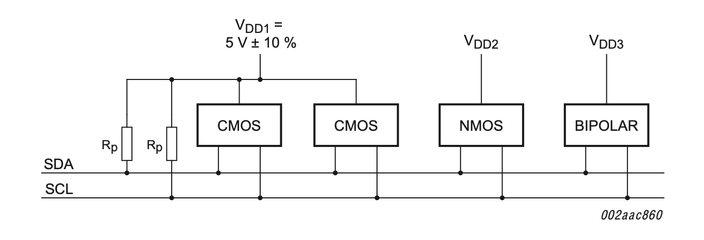
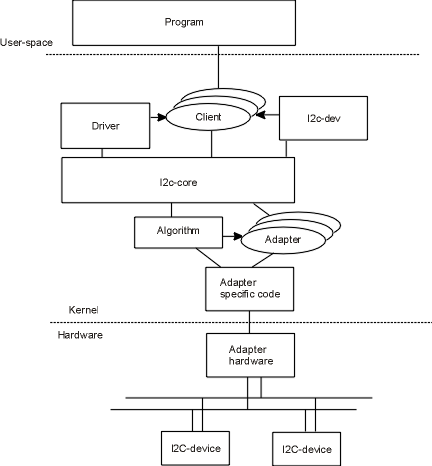

## Day 12：I2C Driver (Part 2) - 細節、追蹤與驗證

在驅動程式裡面打滾完之後，接下來看一些比較細節的部分。

## 上拉電組

這個其實不是 I2C 專屬的概念，但是滿常會看到這類「上拉」「下拉」這種術語的。就稍微補充一下。

邏輯電路中，資料的傳輸都是使用高低電位表示。這個「高」「低」電位直覺上來說就像是開關一樣，一個狀態是「打開」，一個狀態是「關閉」。而這個「開關」通常也不是實體的開關，通常是用電晶體：以 MOSFET 為例，假定 GDS 3 個極分別接上：

1. 源極 (S) 接高電位
2. 極集 (D) 接低電位
3. 閘極 (G) ：用他是「高電位」或「低電位」來控制是否導通。

閘極電壓在低電位的時候，閘極跟源極的電位差就是 0，根本沒辦法衝破 *threshold voltage*，所以汲極跟源極就不會導通; 反之，如果在閘極在高電位，那這時候源極跟汲極的電壓差瞬間會超過飽和電壓 (因為這時飽和電壓是閘極電壓 - *threshold voltage*，顯然比閘極電壓自己還要小)，所以就會瞬間飽和，變成導通的狀態。

不管用什麼方式，總之有接通時跟不接通時，就會剛好有兩種不同的電壓，所以就可以當作 0 跟 1...嗎？**如果僅僅只有開與關的狀態，那麼答案是未必**。因為斷路的狀況下，電壓值是未定的 (也就是 *float* 狀態)。所以這時候就沒有辦法確認電壓是多少。

> 「沒接東西」不代表「電位是 0」。舉例來說，兩個 IC 都沒有接地 (或者說沒有共地)，不代表這個 IC 的地線電位一樣。

上拉/下拉電組的功能就是避免「想要用通路/斷路製造兩種電位時，卻因為 *float* 而無法達到預期效果」。這時候可以把開關的線路上加一個電組，像這樣：


當開關接通時，邏輯閘的輸入端就會跟地面接通，因此輸入電位就是 0; 反之，如果是斷開的，因為連接了一個電阻的關係，電壓就會是一個確切的值。

這個電阻值的大小必須要跟整個系統做配合。兩個極端的例子就是：

1. 當這個電阻趨近 0 的時候，開關接通時就會變成短路
2. 而如果他的電阻非常大，開關斷開時這個電阻就會佔用很大的分壓，那麼邏輯閘的輸入電壓就會比預期的小很多，沒辦法被判斷為高電壓。

而 I2C 當中就是利用上拉電阻。可以參考 NXP 的 I2C [規格](https://www.nxp.com/docs/en/user-guide/UM10204.pdf) 中的附圖：



這張圖是示範如果有 3 種高電位的電壓準位，該怎麼配置。不過左半邊 CMOS 的部分所連接的 Rp ，就擔任前面說的上拉電阻的功能。

## Kernel 中的 I2C 架構

整個核心中的 I2C 子系統架構，依照核心文件的[參考資料](https://i2c.wiki.kernel.org/index.php/Driver_Architecture)可知，架構大概是下面這樣：



### Client：`struct i2c_client`

在核心的術語中，I2C 的從端 (slave) 不是用 slave 稱呼，而是稱為 *client*，對應的結構體是 `struct i2c_client`。也就是在 I2C `probe` 函數裡面會拿到的那個 `client` 變數。

### Driver：`struct i2c_driver`

而圖中的 Driver 則是對應到 `i2c_driver`，也就是要填 `probe` 跟 `remove` 的那個結構體。

### Adapter：`struct i2c_adapter`

除了代表 slave 的 *client* 之外，master 也有對應的結構。根據 Linux 在 I2C 中的[文件](https://www.kernel.org/doc/html/latest/i2c/summary.html)，Linux I2C 子系統中，I2C 的 *master* 用來控制 *bus* 的程式，會用 *adapter* 來稱呼 (而不會叫他 *bus controller* 或其他之類的稱呼)。而代表他的結構是 [`struct i2c_adapter`](https://elixir.bootlin.com/linux/latest/source/include/linux/i2c.h#L687)。從原始程式碼的註解中，也可以看到相關的說明：

*"i2c_adapter is the structure used to identify a physical i2c bus along with the access algorithms necessary to access it."*

而這個結構當中的 [`struct i2c_algorithm`](https://ithelp.ithome.com.tw/articles/10245130) 裡面負責提供特定 I2C bus 上的傳輸方法的實作：

```c
struct i2c_algorithm {
	/*
	 * If an adapter algorithm can't do I2C-level access, set master_xfer
	 * to NULL. If an adapter algorithm can do SMBus access, set
	 * smbus_xfer. If set to NULL, the SMBus protocol is simulated
	 * using common I2C messages.
	 *
	 * master_xfer should return the number of messages successfully
	 * processed, or a negative value on error
	 */
	int (*master_xfer)(struct i2c_adapter *adap, struct i2c_msg *msgs,
			   int num);
	int (*master_xfer_atomic)(struct i2c_adapter *adap,
				   struct i2c_msg *msgs, int num);
	int (*smbus_xfer)(struct i2c_adapter *adap, u16 addr,
			  unsigned short flags, char read_write,
			  u8 command, int size, union i2c_smbus_data *data);
	int (*smbus_xfer_atomic)(struct i2c_adapter *adap, u16 addr,
				 unsigned short flags, char read_write,
				 u8 command, int size, union i2c_smbus_data *data);

	/* To determine what the adapter supports */
	u32 (*functionality)(struct i2c_adapter *adap);

#if IS_ENABLED(CONFIG_I2C_SLAVE)
	int (*reg_slave)(struct i2c_client *client);
	int (*unreg_slave)(struct i2c_client *client);
#endif
};
```

最重要的東西就是那堆 `_xfer` 函數。而這也是 *i2c adapter* 驅動要實作的東西。像 [drivers/i2c/busses/i2c-altera.c](https://elixir.bootlin.com/linux/latest/source/drivers/i2c/busses/i2c-altera.c#L379) 這個例子這樣。而更近一步的說明可以在今年的 Open Source Summit 中的 [*"Tutorial: Introduction to I2C and SPI: Both In-kernel and In-userspace"*](https://youtu.be/c10wAKWpjts) 中得到。

## 用 ply 追蹤

如果用 `ply` 追蹤的話，也可以發現他們的蹤跡。比如說把上一篇的模組裝起來，然後去統計看看 stack：

```c=
kprobe:*_xfer / !strcmp(comm, "test") /
{
    @[stack] = count();
}
```

就會發現明顯出現了 i2c 相關的東西：

```c
@:
{ 
	__i2c_smbus_xfer
	i2c_smbus_write_byte+64
	brcmf_core_exit+118048
	__vfs_write+72
	vfs_write+180
	ksys_write+104
	__se_sys_write+24
	__hyp_idmap_text_start
}: 29
{ 
	i2c_smbus_xfer
	brcmf_core_exit+118048
	__vfs_write+72
	vfs_write+180
	ksys_write+104
	__se_sys_write+24
	__hyp_idmap_text_start
}: 29
```

去查看看這兩個函數，會發現 `arg1` 的參數都是 I2C slave 的位址，所以就可以看看他們是不是真的傳到 Arduino 那邊去 (之前在 Device Tree 中是設定成 `0x8`)：

```c
kprobe:*_xfer / !strcmp(comm, "test") /
{
    @[stack, arg1] = count();
}
```

然後就發現是：

```c
@:
{ 
	__i2c_smbus_xfer
	i2c_smbus_write_byte+64
	brcmf_core_exit+118048
	__vfs_write+72
	vfs_write+180
	ksys_write+104
	__se_sys_write+24
	__hyp_idmap_text_start
, 8 }: 29
{ 
	i2c_smbus_xfer
	brcmf_core_exit+118048
	__vfs_write+72
	vfs_write+180
	ksys_write+104
	__se_sys_write+24
	__hyp_idmap_text_start
, 8 }: 29
```

## 用 ftrace 追蹤

另外一件有趣的事情是：可以把上一篇的模組載入進去之後，用 `trace-cmd` 去看他的過程中會執行到核心的哪些東西：

```shell
$ sudo trace-cmd record -p function_graph -a -F ./test
```

> 按：`test` 程式可以參考上一篇。

等待執行結束後，請 `trace-cmd` 報告：

```shell
$ trace-cmd report | less
```

### 追蹤提供給驅動程式的 read

稍微搜尋一下 `i2c`，就會發現他呈現了字元驅動程式預期的行為：在 `sys_write` 呼叫之後，他去呼叫了之前實作的 `arduino_i2c_write`，這裡面就有使用 I2C 傳輸的部分：

```shell
+sys_write() {
  ksys_write() {
    __fdget_pos() {
      __fget_light();
    }
+   vfs_write() {
      rw_verify_area();
      __vfs_write() {
+       arduino_i2c_write() {
+         i2c_smbus_write_byte() {
+           i2c_smbus_xfer() {
              i2c_adapter_lock_bus() {
                rt_mutex_lock() {
                  _cond_resched() {
                    rcu_all_qs();
                  }
                }
              }
              __i2c_smbus_xfer() {
                __i2c_transfer() {
                  bcm2835_i2c_xfer() {
                    bcm2835_i2c_start_transfer();
                    bcm2836_arm_irqchip_handle_irq() {
                      handle_IPI() {
                        irq_enter() {
                          rcu_irq_enter();
                        }
                        __wake_up() {
                          __wake_up_common_lock() {
                            _raw_spin_lock_irqsave();
                            __wake_up_common();
                            _raw_spin_unlock_irqrestore();
                          }
                        }
[...]
```

### 追蹤提供給驅動程式的 open

又比如說開檔的部分，可以發現在檔案系統開檔時，就用到了之前實作字元驅動程式時，提供給 `struct file_operations` 的 `arduino_i2c_open` 函數：

```shell
[...]
vfs_open() {
  do_dentry_open() {
    path_get() {
      mntget();
    }
    try_module_get();
    chrdev_open() {
      _raw_spin_lock();
      cdev_get() {
        try_module_get();
      }
      try_module_get();
      module_put();
+     arduino_i2c_open();
    }
    file_ra_state_init();
  }
}
[...]
```