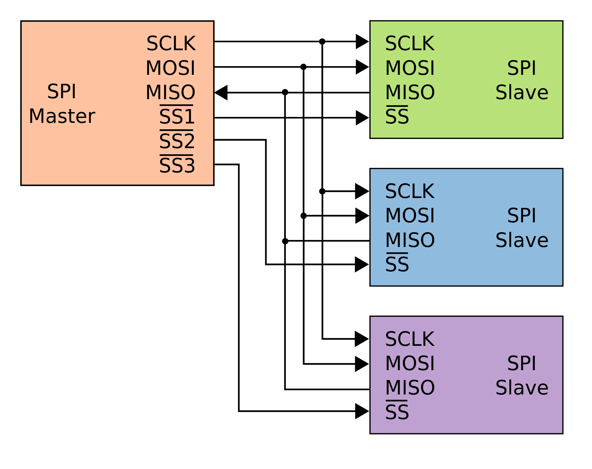
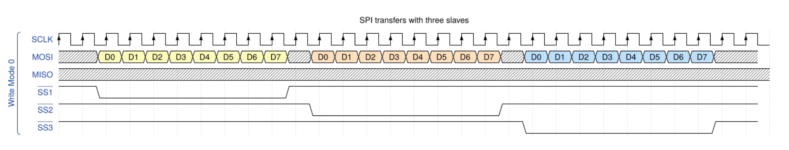
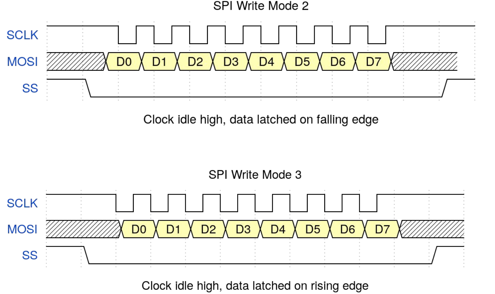
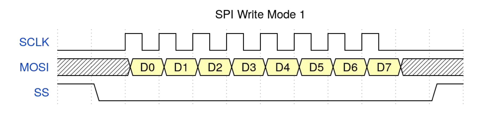
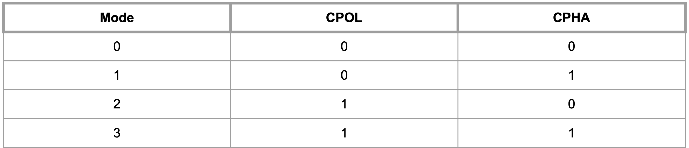

## Day 13：SPI (Part 1) - 原來是 Shift Register 啊！我還以為是 SPI 呢！

關於 SPI ，2017 年的 ELC 有一個 [*Groking the Linux SPI Subsystem*](https://youtu.be/MV8Sy6jGUIE) 的演講，對 SPI 的規格與核心的 SPI 的規格，以及核心中對應的子系統做了詳細的介紹。除此之外，2020 年的 OSS NA 中，也有一個 [*Introduction to I2C and SPI: Both In-kernel and In-userspace*](https://youtu.be/c10wAKWpjts) 演講，裡面也有介紹 SPI 子系統 (但我覺得前者介紹的比較詳細)。

文件方面，核心文件中的 [*Serial Peripheral Interface (SPI)*](https://www.kernel.org/doc/html/latest/spi/index.html) 一節就是專門介紹 SPI 的章節，雖然內容相對來說少了很多。而關於 Raspberry Pi 相關的 SPI 介紹，可以在文件中的 [*SPI*](https://www.raspberrypi.org/documentation/hardware/raspberrypi/spi/README.md) 一節中找到敘述。裡面包含了腳位配置、可以用的 Python 函式庫，以及可能的除錯技巧等等。

## 簡介

有人戲稱 SPI 協定是 *"A glorified shift register (with side effects)"*。而事情確實也看起來是這個樣子。

**SPI 由 4 個部分組成：\*MOSI\*、\*MISO\*、\*SCLK\*、\*SS\***。雖然最基本只要 4 條線，但實際上不同的硬體上有很多不同的變形。比如說 nrf24l01 雖然是用 SPI 傳輸，但除了 SPI 以外還需要更多腳位來進行額外的配置; 而有的使用 SPI 介面傳輸的電子紙，除了 SPI 的 4 個部分之外，還會有重設、忙碌、控制等等的腳位。除此之外，核心文件中的 [*Overview of Linux kernel SPI support*](https://www.kernel.org/doc/html/latest/spi/spi-summary.html) 一節也提醒 SPI 有一堆變形 (比如：把 MOSI 跟 MISP 合併，但是只能做到半雙工的版本)。相較之下，使用 I2C 的設備大部分使用 SDA 跟 SCL 兩條線就足夠。

## 選擇輸出：SS

`SS` 是 *Slave Select* 的縮寫，顧名思義就是**選擇要輸出給誰**。有時候會叫做 `CS` (Chip Select)。而傳輸要開始的第一步，就是把對應的 `SS` 拉低。過程大致上像這樣：

1. *master* 把 *slave* 所對應的 `SS` 拉低。
2. 開始傳資料：*master* 用 MOSI 傳資料給 *slave*; 而 *slave* 用 MISO 傳給 *master*。
3. 結束時把 *slave* 對應的 `SS` 拉高。

**要跟哪一個 \*slave\* 進行傳輸，就把誰的 `SS` 拉低**。比如說現在有 3 個 *slave*，現在要依序對 `SS1`、`SS2`、`SS3` 進行傳輸，那就依序把 3 裝置對應的 `SS` (圖中用 `SS1` 到 `SS3` 表示)拉低，傳輸完之後恢復拉高，再接著拉低接下來要傳輸的那個 *slave*。就像下面這個樣子：

聽起來很單純，不像 I2C 那樣有 *start state*、*ACK*、*NACK* 什麼的。不過這同時也是一個缺點：每一個 *slave* 都需要對應一個 `SS` 腳位，也就需要額外的硬體。而 I2C 在硬體方面就只要 `SDA` 跟 `SCL`，填個位址就可以多加一個硬體，簡單暴力。

## 輸入與輸出：MOSI 與 MISO

### MOSI：Master Output Slave Input

顧名思義，就是 *master* 輸出給 *slave* 會用的線。不過，不同的 *datasheet* 上會有很多不同的稱呼：*SOMI*、*SDI*、*DI*，有時候甚至會使用 *SDA* 這種 I2C 的用語。

### MISO：Master Input Slave Output

和剛剛類似，只是換成 *slave* 傳輸資訊給 *master*。 MOSI 類似，也有一堆其他不同的名字：*SOMI*、*SDO*、*DO*，甚至也會叫做 *SDA*。沒錯，就是兩個都叫 SDA！(不過通常 *datasheet* 會加上註記說明用處)。

由此可以發現：*master* 跟 *slave* 這兩個方向的傳輸有彼此獨立的線，所以可以做到「全雙工」(*full duplex*) 的傳輸，也就是 *master* 在講東西時，同時可以聽 *slave* 那邊傳來什麼東西。

## 時脈：SCLK

如他的名稱，這個位置對應的訊號，就是傳輸的時脈。不過跟 I2C 不一樣的是：**在沒有傳輸時 (也就是 \*idle\* 時)，時脈的狀態可以設定是高電位，也可以設定是低電位**; 而資料傳輸也可以自己選擇要在 **時脈的「前半個週期」或「後半個週期」進行傳輸** 。而這兩者則是依照 `CPOL` 與 `CPHA` 的狀態決定。

### CPOL：Clock Pokarity

**決定 \*idle\* 時，時脈的訊號是維持在高電壓或低電壓**。當 `CPOL` 為 `0` 時，時脈在沒傳輸資料的時候會維持低電位，; 而當 `CPOL` 為 `1` 時，時脈在沒有傳輸資料的時候會維持在高電位。所謂「沒有傳輸資料的時候會維持在高電位」意思是像下面這樣：

可以看到 SCLK 在沒有傳輸時 (最前面與最後面，`SS` 為高電位、`MOSI` 沒有資料的部分)，維持在高電位。

### CPHA：Clock Phase

顧名思義，就是決定在時脈的哪個相位把資料「鎖住」(*latch*)。**當 `CPHA` 是 `0` 的時候，是在時脈的前半個週期鎖住資資料; 而當 `SPHA` 是 `1` 的時候，就是時脈的後半個週期鎖住資料**。舉例來說：當 `CPOL` 是 `0` 時，`CPHA` 分別為 `0` 與 `1` 時，對應的傳輸狀態像下面這樣：

另外一方面，當 `CPOL` 是 `0` 時，他們所對應的狀態分別像下面這樣：

### Mode：上面兩個合在一起

有時候會有另外一個術語叫做 *mode*，不過這就只是把 `CPOL` 跟 `CPHA` 兩個位元合在一起變成一個 2 位元的數字：`CPAL` 在高位，`CPHA` 在低位。而這 4 種狀態就稱為 SPI 的 *mode*：

