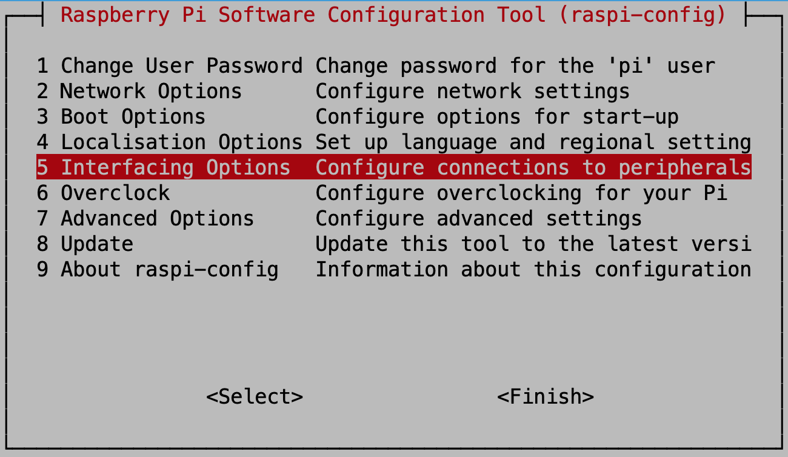
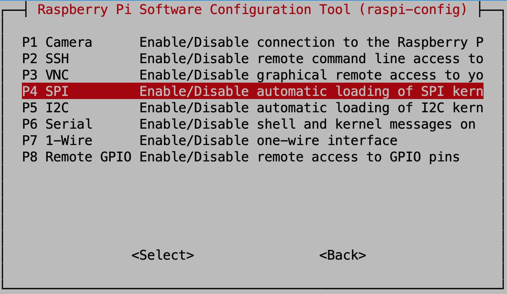
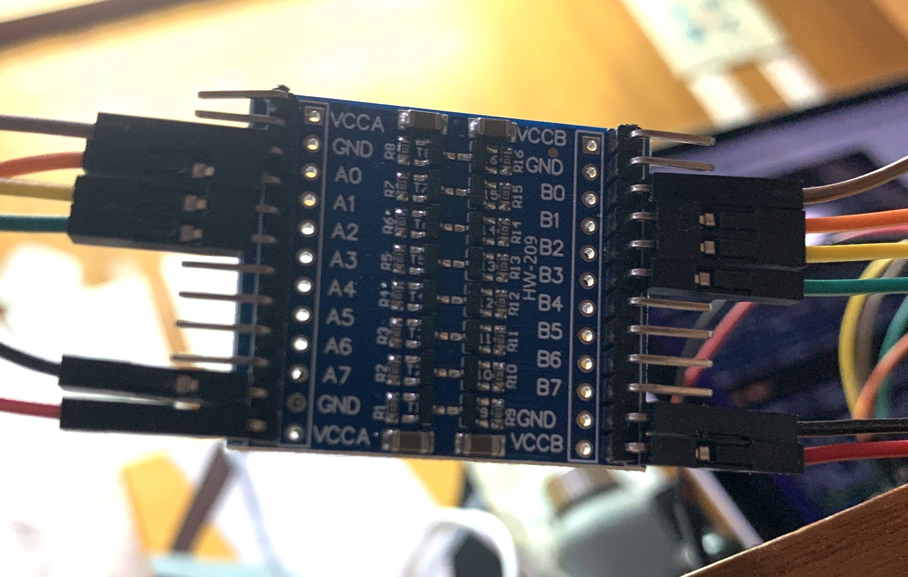
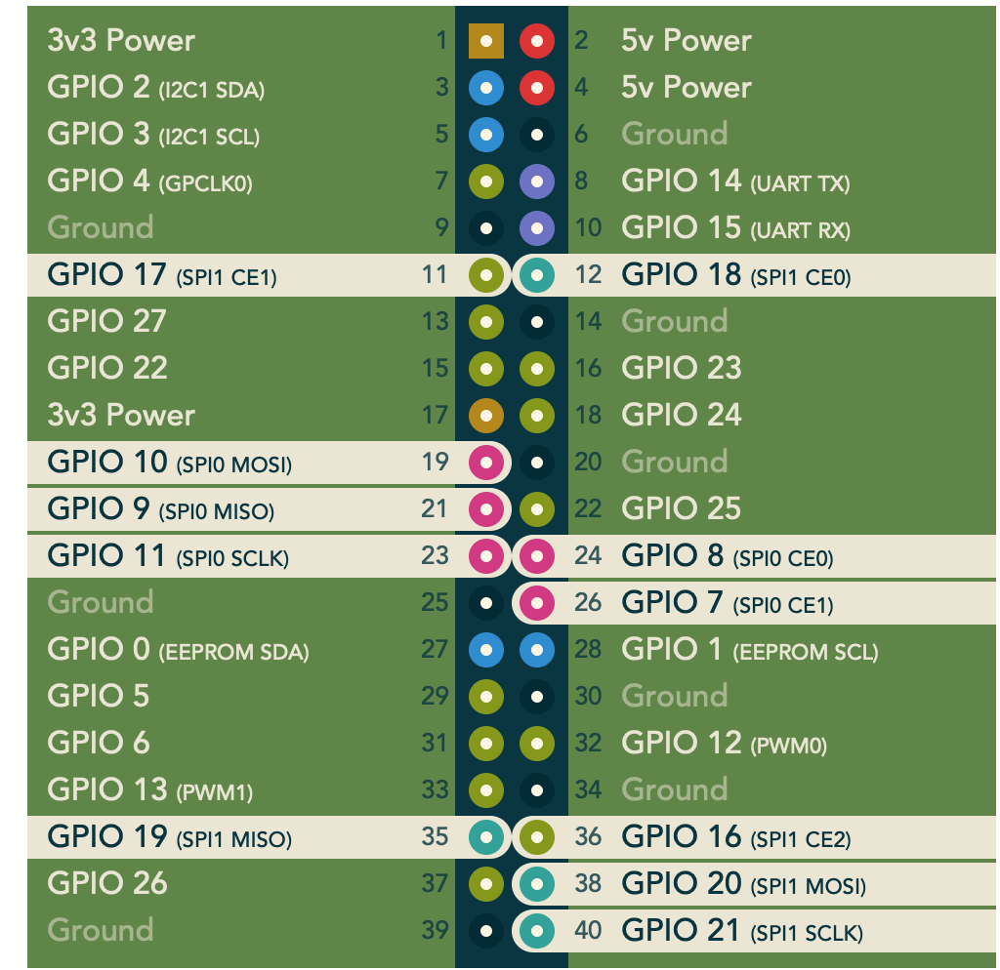
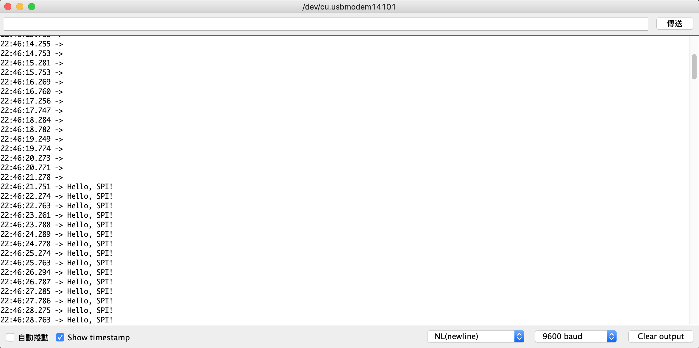

## Day 14：SPI (Part 2) - ftrace 啦！哪次不 ftrace?


[TOC]

了解了 SPI 基本的配置之後，就可以開始簡單的寫一些 SPI 的程式。接下來會展示 Raspberry Pi 跟 Arduino 中 SPI 的相關配置，並且在他們之間傳輸訊息。最後，再用 `ftrace` 看看傳輸的過程中用到了核心的哪些部分。

## 啟動 SPI (Device Tree 表示：)

在打開之前，可以先看看現在的 Device Tree 長什麼樣子：

```shell
$ dtc -I fs /proc/device-tree | less
```

就會找到下面 3 個跟 SPI 有關的部分：

### spi0

其實這邊一開始不會看到他是 `spi0`，而是之後去查了 `aliases` 的部分，才會知道他對應的是 `spi0`。不過為了標題看起來整齊，所以我就先把他補上去。

```python
spi@7e204000 {
         compatible = "brcm,bcm2835-spi";
         clocks = < 0x07 0x14 >;
         status = "disabled";
         #address-cells = < 0x01 >;
         interrupts = < 0x02 0x16 >;
         cs-gpios = < 0x10 0x08 0x01 0x10 0x07 0x01 >;
         #size-cells = < 0x00 >;
         dma-names = "tx\0rx";
         phandle = < 0x28 >;
         reg = < 0x7e204000 0x200 >;
         pinctrl-0 = < 0x0e 0x0f >;
         dmas = < 0x0b 0x06 0x0b 0x07 >;
         pinctrl-names = "default";

         spidev@1 {
                 compatible = "spidev";
                 #address-cells = < 0x01 >;
                 #size-cells = < 0x00 >;
                 phandle = < 0x68 >;
                 reg = < 0x01 >;
                 spi-max-frequency = < 0x7735940 >;
         };

         spidev@0 {
                 compatible = "spidev";
                 #address-cells = < 0x01 >;
                 #size-cells = < 0x00 >;
                 phandle = < 0x67 >;
                 reg = < 0x00 >;
                 spi-max-frequency = < 0x7735940 >;
         };
};
```

### spi1

```python
spi@7e215080 {
        compatible = "brcm,bcm2835-aux-spi";
        clocks = < 0x15 0x01 >;
        status = "disabled";
        #address-cells = < 0x01 >;
        interrupts = < 0x01 0x1d >;
        #size-cells = < 0x00 >;
        phandle = < 0x6d >;
        reg = < 0x7e215080 0x40 >;
};
```

### spi2

```python
spi@7e2150c0 {
        compatible = "brcm,bcm2835-aux-spi";
        clocks = < 0x15 0x02 >;
        status = "disabled";
        #address-cells = < 0x01 >;
        interrupts = < 0x01 0x1d >;
        #size-cells = < 0x00 >;
        phandle = < 0x6e >;
        reg = < 0x7e2150c0 0x40 >;
};
```

### aliases

去找 `aliases` 的部分，就會發現上面 3 個部分真的依序是對應到 `spi1`、`spi2`、`spi3`：

```python
aliases {
        ...
        spi2 = "/soc/spi@7e2150c0";
        ...
        spi0 = "/soc/spi@7e204000";
        ...
        spi1 = "/soc/spi@7e215080";
        ...
};
```

可以注意到 3 個區塊裡面，SPI 的狀態都是 `disabled`。現在用 `raspi-config` 去把 SPI 功能打開，在 *"Interfacing Option"* 中的 *"SPI"* 那個選項：





打開之後再看一次 Device Tree 長怎樣：

```shell
$ dtc -I fs /proc/device-tree | less
```

可以發現原來的 `spi0` 中，*status* 從 `disabled` 變成 `okay` 了 (但另外兩個仍然是 `disabled`)：

```c
spi@7e204000 {
        compatible = "brcm,bcm2835-spi";
        clocks = < 0x07 0x14 >;
+       status = "okay";
        #address-cells = < 0x01 >;
        interrupts = < 0x02 0x16 >;
        cs-gpios = < 0x10 0x08 0x01 0x10 0x07 0x01 >;
        #size-cells = < 0x00 >;
        dma-names = "tx\0rx";
        phandle = < 0x28 >;
        reg = < 0x7e204000 0x200 >;
        pinctrl-0 = < 0x0e 0x0f >;
        dmas = < 0x0b 0x06 0x0b 0x07 >;
        pinctrl-names = "default";

        spidev@1 {
                compatible = "spidev";
                #address-cells = < 0x01 >;
                #size-cells = < 0x00 >;
                phandle = < 0x68 >;
                reg = < 0x01 >;
                spi-max-frequency = < 0x7735940 >;
        };

        spidev@0 {
                compatible = "spidev";
                #address-cells = < 0x01 >;
                #size-cells = < 0x00 >;
                phandle = < 0x67 >;
                reg = < 0x00 >;
                spi-max-frequency = < 0x7735940 >;
        };
};
```

除此之外，如果去看 /boot/config.txt 的話，也可以發現 `dtparam=spi` 從原來的 `off` 變成 `on`：

```shell
# Uncomment some or all of these to enable the optional hardware interfaces
dtparam=i2c_arm=on
#dtparam=i2s=on
-dtparam=spi=off
+dtparam=spi=on
```

## 硬體配置

現在要讓 Raspbery Pi 跟 Arduino 互傳資料，但有一個問題是 Raspberry Pi 的電路準位是用 3.3V，而 Arduino 是 5V。所以這彼此之間需要一個轉換，否則 Arduino 傳 5V 的訊號給 Raspberry Pi 的時候，就會有毀壞的風險。不過這件事情也有專門的 IC 可以處理，只要搜尋 *Logic Level Shifter* 就可以找到很多相關的硬體資訊。像這樣：



而接下來的線路配置就很單純：MOSI、MISO、SCLK、SS (也就是 CS、CE。都是指同一個東西) 透過 *Logic Level Shifter* 對接，然後也把對應的電壓 (Arduino 5V、Raspberry Pi 3.3V) 各自接上 *Logic Level Shifer* 對應的電壓輸入即可。

### 硬體：Arduino

Arduino 的 SPI 相關說明可以參考官方文件中的 [*SPI library*](https://www.arduino.cc/en/reference/SPI) 一節。以 Ardino UNO 為例，4 個腳位分別對應為：

| FUNCTION | NUMBER |
| :------: | :----: |
|   MOSI   |   11   |
|   MISO   |   12   |
|   SCLK   |   13   |
|    SS    |   10   |
|   VCC    |   5V   |
|   GND    |  GND   |

### 硬體：Raspberry Pi

根據 [pinout.xyz](https://pinout.xyz/pinout/spi) 中對於 SPI 的描述，可以找到 SPI 有下面幾點：



其翁，GPIO 7, 8, 9, 10, 11 的部分，對應到的是 `spi0`，也就是 `rspi-config` 會啟動的部分; 而 GPIO 16, 17, 18, 19, 20, 21 則對應到 `spi1`，由上面的敘述可知：可以在 `/boot/config.txt` 中加上啟動 device tree overlay 來使用：

*"You can enable SPI1 with a dtoverlay configured in "/boot/config.txt""*

而至於要怎麼啟動更多的 SPI，可以參考 Raspberry Pi 的 github 帳號中，*firmware* 這個 repo 中的 [*blob/master/boot/overlays/README*](https://github.com/raspberrypi/firmware/blob/master/boot/overlays/README#L2483) 檔案。比如說要打開 `spi1` 並且加上 3 個 SS 的話，可以找到下面的說明：

```shell
Name:   spi1-3cs
Info:   Enables spi1 with three chip select (CS) lines and associated spidev
        dev nodes. The gpio pin numbers for the CS lines and spidev device node
        creation are configurable.
        N.B.: spi1 is only accessible on devices with a 40pin header, eg:
              A+, B+, Zero and PI2 B; as well as the Compute Module.
Load:   dtoverlay=spi1-3cs,<param>=<val>
Params: cs0_pin                 GPIO pin for CS0 (default 18 - BCM SPI1_CE0).
        cs1_pin                 GPIO pin for CS1 (default 17 - BCM SPI1_CE1).
        cs2_pin                 GPIO pin for CS2 (default 16 - BCM SPI1_CE2).
        cs0_spidev              Set to 'disabled' to stop the creation of a
                                userspace device node /dev/spidev1.0 (default
                                is 'okay' or enabled).
        cs1_spidev              Set to 'disabled' to stop the creation of a
                                userspace device node /dev/spidev1.1 (default
                                is 'okay' or enabled).
        cs2_spidev              Set to 'disabled' to stop the creation of a
                                userspace device node /dev/spidev1.2 (default
                                is 'okay' or enabled).
```

可以知道：要在 `/boot/config.txt` 的 `dtoverlay` 加上：

```shell
dtoverlay=spi1-3cs
```

這看起來也滿好理解的，因為 `3cs` 就是 *3 chip select* 的縮寫嘛。而文件上面也有描述到：可以用 `<param>=<val>` 來指定要用哪個 GPIO 的腳位作 SS，以及要不要在 `sysfs` 中加入對應的檔案。而這邊為了方便，就使用 `spi0` 。他們的腳位配置分別是：

| FUNCTION | NUMBER |
| :------: | :----: |
|   MOSI   |   19   |
|   MISO   |   21   |
|   SCLK   |   23   |
|   SS0    |   24   |
|   SS1    |   26   |
|   VCC    |   1    |
|   GND    |   9    |

## 程式

### 程式：Arduino

由 Arduino 官方網站的 [*SPI Library*](https://www.arduino.cc/en/reference/SPI) 文件中，可以發現 Arduino 的函式庫中，僅提供了將 Arduino 作為 SPI master 的功能，而 slave 端的功能則沒有實作在預設的函式庫中。所以就要土炮地註冊 ISR。而關於這方面的資訊可以參考 [*Introduction to the Serial Peripheral Interface*](https://www.arduino.cc/en/Tutorial/SPIEEPROM) 裡面的範例。Arduino 關於 SPI 的設定，可以用 `SPCR` 這個暫存器來設定：

```shell
SPCR
| 7    | 6    | 5    | 4    | 3    | 2    | 1    | 0    |
| SPIE | SPE  | DORD | MSTR | CPOL | CPHA | SPR1 | SPR0 |

SPIE - Enables the SPI interrupt when 1
SPE - Enables the SPI when 1
DORD - Sends data least Significant Bit First when 1, most Significant Bit first when 0
MSTR - Sets the Arduino in master mode when 1, slave mode when 0
CPOL - Sets the data clock to be idle when high if set to 1, idle when low if set to 0
CPHA - Samples data on the falling edge of the data clock when 1, rising edge when 0
SPR1 and SPR0 - Sets the SPI speed, 00 is fastest (4MHz) 11 is slowest (250KHz)
```

事實上，有一些函式庫中函數的實作也只是直接修改暫存器。比如說 [*SPI.h*](https://github.com/arduino/ArduinoCore-avr/blob/master/libraries/SPI/src/SPI.h) 中，`attatchInterrupt` 這個函數的[實作](https://github.com/arduino/ArduinoCore-avr/blob/master/libraries/SPI/src/SPI.h#L309) 就是直接 mask 上 `SPIE` 那個位元：

```c=
inline static void attachInterrupt() { SPCR |= _BV(SPIE); }
```

所以在程式方面，就是把暫存器的值設好：

```c
#include <SPI.h>
void setup() {
    Serial.begin(9600);
    pinMode(MISO, OUTPUT);
    pinMode(MOSI, INPUT);
    SPCR |= _BV(SPE);
    SPCR |= _BV(SPIE);
    SPCR &= ~(_BV(MSTR));
}
```

設定完之後，幫 `SPI_STC_vect` 註冊一個 ISR。這個 ISR 很單純，就是開一個 circular buffer，有東西傳進去就往上堆：

```c
#define BUF_LEN 128
char buf[BUF_LEN + 1] = {0};
int top = -1;
ISR(SPI_STC_vect)
{
    buf[(++top) % BUF_LEN] = SPDR;
}
```

最後主程式的地方是 0.5 秒把這個 circular buffer 中的資料倒出來一遍，看看長什麼樣子：

```c
void loop() {
    Serial.println(buf);
    delay(500);
}
```

### 程式：Raspberry Pi

在 userspace 使用 python 的程式。這邊函式庫滿多的：`pigpio`、`spidev` 等等。這邊則使用 `spidev` 這個函式庫。要安裝的話可以用 `pip3`：

```shell
$ sudo apt install python3-pip
```

然後：

```shell
$ pip3 install spidev
```

而程式也很單純：給定 SPI bus 的編號 (也就是 `spiN` 後面的 `N`。比如說 `spi0` 就是 `0`)，以及 Chip Enable 的編號 (也就是 `SS`，比如說 Arduino 是在 Raspberry Pi 的 `CE0`，那就是 `0`)。設定適當的頻率之後，從輸入拿一個字串傳給 Arduino。假定這個程式叫做 `spidev-example`：

```python
import spidev
SPI_BUS = 0
SPI_SS = 0

spi0 = spidev.SpiDev()
spi0.open(SPI_BUS, SPI_SS)
spi0.max_speed_hz = 5000

msg = input("msg> ");
spi0.xfer([ord(c) for c in msg])
```

### 結果

打開 Arduino 的序列埠監控視窗，然後在 Raspberry Pi 上執行 python 程式，並且輸入一個字串 (比如說 `Hello, SPI!`)：

```shell
$ python3 spidev-example.py 
msg> Hello, SPI!
```

這時就可以看到輸出了：



## 追蹤：ftrace 怎麼說？

```shell
$ sudo trace-cmd record -p function_graph -a -F python3 spidev-example.py 
  plugin 'function_graph'
msg> Hello, SPI
```

紀錄完之後看 `trace-cmd report`，然後稍微搜尋一下 `spi` 有關的東西，

### spidev_open

就會發現這個程式看起來像是在開某個 module，而且開的時候用到了某個 `spidev_open` 函數：

```diff=
vfs_open() {
  do_dentry_open() {
    path_get() {
      mntget();
    }
    try_module_get();
+   chrdev_open() {
      _raw_spin_lock();
      cdev_get() {
        try_module_get();
      }
      try_module_get();
      module_put();
+     spidev_open() {
        ...
      }
    }
    file_ra_state_init();
  }
}
[...]
```

### spidev_ioctl

除了這之外，也有另外一個 `ioctl`。而且這個 `ioctl` 裡面看起來像是在設定某個 GPIO：

```diff=
do_vfs_ioctl() {
+ spidev_ioctl() {
    _raw_spin_lock_irq();
    get_device();
    mutex_lock() {
      _cond_resched() {
        rcu_all_qs();
      }
    }
+   spi_setup() {
      bcm2835_spi_setup() {
        arm_dma_sync_single_for_device() {
          dma_cache_maint_page();
        }
      }
+     spi_set_cs() {
+       gpiod_set_value_cansleep() {
          validate_desc();
+         gpiod_set_value_nocheck() {
+           gpiod_set_raw_value_commit() {
              bcm2835_gpio_set() {
                gpiochip_get_data();
              }
            }
          }
        }
      }
    }
    mutex_unlock();
    put_device();
  }
}
[...]
```

### spidev_read

最後還發現有 `spidev_read`：

```diff=
vfs_read() {
  rw_verify_area();
  __vfs_read() {
+   spidev_read() {
      mutex_lock() {
        _cond_resched() {
          rcu_all_qs();
        }
      }
+     spidev_sync() {
        _raw_spin_lock_irq();
+       spi_sync() {
          mutex_lock() {
            _cond_resched() {
              rcu_all_qs();
            }
          }
+         __spi_sync() {
            __spi_validate();
            _raw_spin_lock_irqsave();
            _raw_spin_unlock_irqrestore();
            _raw_spin_lock_irqsave();
            _raw_spin_unlock_irqrestore();
            _raw_spin_lock_irqsave();
            __spi_queued_transfer() {
              _raw_spin_lock_irqsave();
              _raw_spin_unlock_irqrestore();
            }
[...]
```

### 推論

到這邊就可以猜測這個 `spidev` 可能跟 `i2c-dev` 類似，是某種揭露給 userspace 的 *character driver*，然後 userspace 可以搭配 `ioctl` 等等檔案操作，進行 SPI 的設定與輸入輸出。而事實上，把 `spidev_` 系列的函數拿去餵 bootlin，就會發現這些都是 [drivers/spi/spidev.c](https://github.com/torvalds/linux/blob/master/drivers/spi/spidev.c) 中的函數，而他正好是一個這樣的驅動程式。

除此之外，也可以發現：`spi_sync` 這個函數在 `spidev` 相關的檔案操作的實作中一直出現。

有了這兩個情報之後，接下來就可以以他們為基礎，試著去看核心當中哪些部分負責 SPI 了。