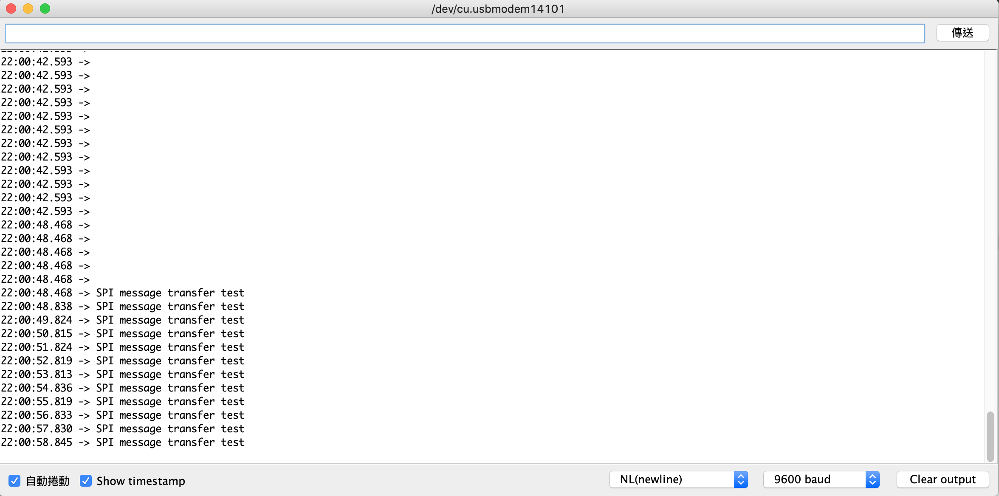

## Day 16：SPI Driver (Part 2) - 傳簡單的訊息！


## 任務：傳訊息

接下來會做的事情是：試著用 SPI 的 API 傳輸一些簡單的東西。

由核心文件中 *The Linux driver implementer’s API guide* 中的 [*Serial Peripheral Interface (SPI)*](https://www.kernel.org/doc/html/v4.14/driver-api/spi.html) 章節可以看到下面的資訊：

*"The I/O model is a set of queued messages. Protocol drivers submit one or more `struct spi_message` objects, which are processed and completed asynchronously. (There are synchronous wrappers, however.) Messages are built from one or more `struct spi_transfer` objects, each of which wraps a full duplex SPI transfer..."*

所以簡單來說就是：一個 `struct spi_message` 由很多 `struct spi_transfer` 組成。不過這樣看起來還不是很確定要怎麼使用。這時候就想到：現在已經有一個現成的驅動程式了，就是 [`spidev`](https://elixir.bootlin.com/linux/latest/source/drivers/spi/spidev.c)。把他打開來看一看。

## 例子：spidev

因為已經知道這是一個字元驅動程式，所以第一件事情就開開看他的 `struct file_operations` 裡面的 [`write`](https://elixir.bootlin.com/linux/latest/source/drivers/spi/spidev.c#L652) 長什麼樣子。就會發現：

```c
static const struct file_operations spidev_fops = {
	.owner =	THIS_MODULE,
	/* REVISIT switch to aio primitives, so that userspace
	 * gets more complete API coverage.  It'll simplify things
	 * too, except for the locking.
	 */
	.write =	spidev_write,
	.read =		spidev_read,
	.unlocked_ioctl = spidev_ioctl,
	.compat_ioctl = spidev_compat_ioctl,
	.open =		spidev_open,
	.release =	spidev_release,
	.llseek =	no_llseek,
};
```

除此之外，也可以發線這個結構體被[註冊](https://elixir.bootlin.com/linux/latest/source/drivers/spi/spidev.c#L839)到字元驅動程式裡面的部分，看來他就是對應的檔案操作了。把 [`spidev_write`](https://elixir.bootlin.com/linux/latest/source/drivers/spi/spidev.c#L175) 拿出來看看，會發現除了一些檢查程序跟資料複製之外，傳送的動作都在 [`spidev_sync_write`](https://elixir.bootlin.com/linux/latest/source/drivers/spi/spidev.c#L113) 當中。這邊就可以看到 `spi_message` 的用法：

```c
static inline ssize_t
spidev_sync_write(struct spidev_data *spidev, size_t len)
{
	struct spi_transfer	t = {
			.tx_buf		= spidev->tx_buffer,
			.len		= len,
			.speed_hz	= spidev->speed_hz,
		};
	struct spi_message	m;

	spi_message_init(&m);
	spi_message_add_tail(&t, &m);
	return spidev_sync(spidev, &m);
}
```

其中，最後的 `spidev_sync` 其實就是檢查跟鎖住一些資源之後，把 `m` 丟給 `spi_sync`：

```c
static ssize_t
spidev_sync(struct spidev_data *spidev, struct spi_message *message)
{
	int status;
	struct spi_device *spi;

	spin_lock_irq(&spidev->spi_lock);
	spi = spidev->spi;
	spin_unlock_irq(&spidev->spi_lock);

	if (spi == NULL)
		status = -ESHUTDOWN;
	else
		status = spi_sync(spi, message);

	if (status == 0)
		status = message->actual_length;

	return status;
}
```

### 結論：傳輸的流程

所以，現在大致上有個概念，流程可能會像是：

1. 初始化一個 `struct spi_message`。
2. 初始化 `spi_transfer` ，並把他加入 `spi_message`：這邊是使用 `spi_message_add_tail`。而且以寫入為例，他提供了 `tx_buf`。
3. 使用 `spi_sync`，把 `spi_message` 傳出去。

## 文件表示：

看完文件跟例子之後，接下來看看 [*Serial Peripheral Interface (SPI)*](https://www.kernel.org/doc/html/v4.14/driver-api/spi.html) 中的資料結構中的說明：

### Step 1：初始化 struct spi_message

文件在[這裡](https://www.kernel.org/doc/html/v4.14/driver-api/spi.html#c.spi_message)。裡面提到：

*"A spi_message is used to execute an atomic sequence of data transfers, each represented by a struct spi_transfer. The sequence is “atomic” in the sense that no other spi_message may use that SPI bus until that sequence completes."*

然後有一個文件中沒有提到，但是從剛剛的 `spidev` 的例子，以及 [spi.h](https://elixir.bootlin.com/linux/latest/source/include/linux/spi/spi.h) 中有的 [`spi_message_init`](https://elixir.bootlin.com/linux/latest/source/include/linux/spi/spi.h#L1017) 原始程式碼來看，他的功能是用來初始化`spi_message`。

### Step 2：初始化 struct spi_transfer

首先去翻文件中，關於 [`struct spi_transfer`](https://www.kernel.org/doc/html/v4.14/driver-api/spi.html#c.spi_transfer) 的部分。可以發現他開宗明義就說：

*"a read/write buffer pair"*

從他的成員中可以看到，最主要是 `tx_buf` 與 `rx_buf`。由 `spidev` 的例子可以推測裡面放得是要傳輸的資料，或是寫入時使用的 buffer。

從 [`struct message`](https://elixir.bootlin.com/linux/latest/source/include/linux/spi/spi.h#L975) 的結構來看，這些 `spi_transfer` 在 `spi_message` 中，是由 `struct list_head` 串起來的。所以應該會期待有某種 *linked-list* 的操作。而從 `spidev` 的例子來看，應該是用 [`spi_message_add_tail`](https://elixir.bootlin.com/linux/latest/source/include/linux/spi/spi.h#L1024) 這個函數。而他的實作也根本就是 *linked-list* 的插入：

```c
static inline void
spi_message_add_tail(struct spi_transfer *t, struct spi_message *m)
{
	list_add_tail(&t->transfer_list, &m->transfers);
}
```

### Step 3：spi_sync

*"blocking/synchronous SPI data transfers"*

在這之前應該先看看 asynchronous 的 `spi_async`。文件裡面說到：

*"The basic I/O primitive is spi_async(). Async requests may be issued in any context (irq handler, task, etc) and completion is reported using a callback provided with the message. After any detected error, the chip is deselected and processing of that spi_message is aborted."*

而關於 `spi_sync`，則有以下的描述：

*"There are also synchronous wrappers like spi_sync(), and wrappers like spi_read(), spi_write(), and spi_write_then_read(). These may be issued only in contexts that may sleep, and they’re all clean (and small, and “optional”) layers over spi_async()."*

因此可以看得出來：除了同步與不同步之外，這些建立在 `spi_async` 之上的功能，還會有休眠的問題。但總之，`spi_sync` 是個 `spi_async` 的 *wrapper*，用來傳輸 `spi_message` 。

### 其他 wrapper

從文件看來，除了像 `spidev` 中的使用方法，還有一些變種。比如說給一個 `spi_transfer` 陣列，然後會幫忙初始化好並且傳過去的 [`spi_message_init_with_transfers`](https://www.kernel.org/doc/html/v4.14/driver-api/spi.html#c.spi_message_init_with_transfers); 給定一個 `spi_transfer` 陣列，然後會把那個陣列裡面的 `spi_transfer` 通通發出去的 [`spi_sync_transfer`](https://www.kernel.org/doc/html/v4.14/driver-api/spi.html#c.spi_sync_transfer)、或是跟 `write` 很像，給字串與長度進行傳輸的 [`spi_write`](https://www.kernel.org/doc/html/v4.14/driver-api/spi.html#c.spi_write)等等。

## 程式

接下來在 `probe` 時除了會在 `dmesg` 中印出訊息，也會在 `probe` 裡面透過 SPI 傳送一個訊息給 Arduino：

### Raspberry Pi

為了方便，就只列出 `probe` 的部分：

```c
static int dummy_probe(struct spi_device *spi)
{
    int status = 0;
    char *msg = "SPI message transfer test";
    int len = strlen(msg);
    struct spi_transfer t = {
        .tx_buf = msg,
	.len = len,
    };
    struct spi_message m;

    pr_info("Dummy SPI device being probed.\n");

    spi -> max_speed_hz = 400000;
    spi_setup(spi);

    spi_message_init(&m);
    spi_message_add_tail(&t, &m);
    spi_sync(spi, &m);

    if (status) {
        pr_err("SPI transfer failed.\n");
	return status;
    }
    return 0;
}
```

### Arduino

一樣是一個 *circular buffer*，有新資料進來就把他推進去，並且每一秒印出一次 *buffer* 中的內容：

```c
#include <SPI.h>
void setup() {
    Serial.begin(9600);
    pinMode(MISO, OUTPUT);
    pinMode(MOSI, INPUT);
    SPCR |= _BV(SPE);
    SPCR |= _BV(SPIE);
    SPCR &= ~(_BV(MSTR));
}

#define BUF_LEN 128
char buf[BUF_LEN + 1] = {0};
int top = -1;
ISR(SPI_STC_vect)
{
    buf[(++top) % BUF_LEN] = SPDR;
}

void loop() {
    Serial.println(buf);
    delay(1000);
}
```

## 結果

打開 Arduino 的序列埠，並且載入模組。就會發現訊息成功被傳送了：

