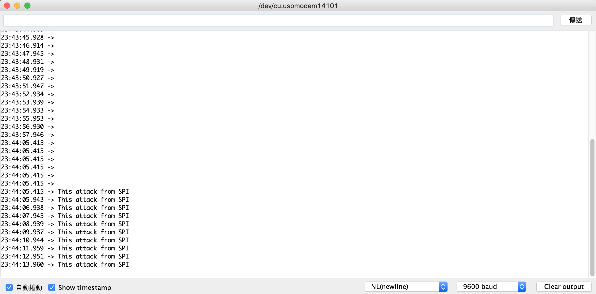
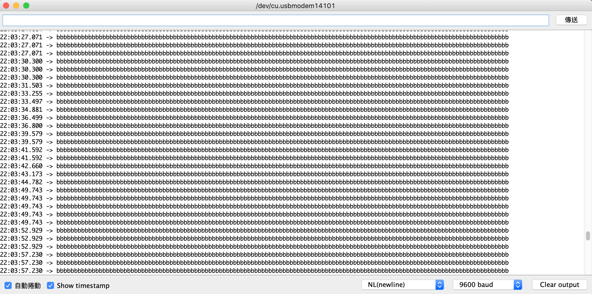
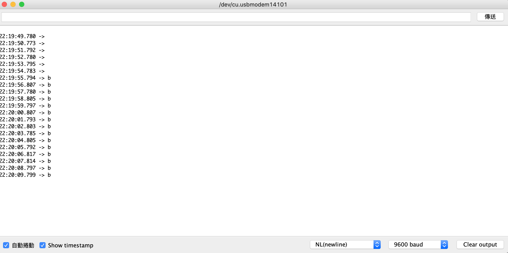

## Day 17：SPI Driver (Part 3) -- 又是一個間諜檔案！


## 目標：包成一個可以寫的檔案

看起來流程都很類似，都是在 `probe` 裡面註冊該註冊的東西，然後該管理的資源好。聽起來很簡單吧？吧？吧？

請看今天的幕後花絮！

### 實作 open

`open` 的實作跟之前差不多，只是 `private_data` 換成傳 `spi_device`：

```c
static ssize_t arduino_spi_open(struct inode *inode, struct file *filp)
{
    struct arduino_spi_cdev *arduino = container_of(inode->i_cdev, struct arduino_spi_cdev, cdev);
    if (!arduino) {
    	pr_err("Cannot extrace aduino structure from i_cdev.\n");
	return -EINVAL;
    }
    filp -> private_data = arduino -> spi;
    return 0;
}
```

### 實作 write

簡單地說，就是先把 *userspace* 的東西複製到 *kernel* 中，然後再用 `spi_write` 傳出去：

```c
static ssize_t arduino_spi_write(struct file *filp, const char __user *buf, size_t count,
		loff_t *offset)
{
    int err = 0;
    struct spi_device *spi = filp -> private_data;
    if (!spi) {
    	pr_err("Failed to get struct spi_device.\n");
	return -EINVAL;
    }
    char *msg = kzalloc(count + 1, GFP_KERNEL);
    copy_from_user(msg, buf, count);
    err = spi_write(spi, msg, count);
    kfree(msg);
    return err ? err : count;
}
```

> 這邊的回傳值沒有做好。因為照理說應該要回傳讀寫的確切值。比較正確的作法應該要從 `spi_device` 中的 [`struct spi_statistic`](https://elixir.bootlin.com/linux/latest/source/include/linux/spi/spi.h#L56) 來找出實際傳輸的位元資料。

如果沒有複製到 kernel 會發生什麼事？請看幕後花絮

### 實作 probe

`probe` 幾乎跟 I2C 的一樣，只是把對應的東西換成 SPI 的東西：

```c
static int dummy_probe(struct spi_device *spi)
{
    int err = 0;
    pr_info("Dummy device is being probed.\n");

    err = alloc_chrdev_region(&dev, 0, 1, ARDUINO_DEV_NAME);
    if (err < 0) {
        pr_err ("Failed in alloc_chrdev_reion for arduino.\n");
	goto out_alloc_chrdev;
    }

    arduino_class = class_create(THIS_MODULE, ARDUINO_DEV_NAME);
    if (!arduino_class) {
    	pr_err ("Failed to create sysfs class.\n");
	goto out_sysfs_class;
    }

    struct arduino_spi_cdev *arduino = kzalloc(sizeof(struct arduino_spi_cdev), GFP_KERNEL);
    if (!arduino) {
	pr_err("Failed to allocate memory.\n");
    	goto out_oom;
    }
    arduino -> spi = spi;

    cdev_init(&(arduino -> cdev), &arduino_spi_fops);
    arduino->cdev.owner = THIS_MODULE;
    err = cdev_add(&(arduino -> cdev), dev, 1);
    if (err) {
	pr_err("Failed to register cdev.\n");
    	goto out_cdev_add;
    }

    struct device *device = device_create(arduino_class, NULL, dev, NULL, ARDUINO_DEV_NAME);
    if (!device) {
    	pr_err("Failed to create device entry under sysfs.\n");
	goto out_device;
    }
    spi->max_speed_hz = 400000;
    dev_set_drvdata(&(spi->dev), arduino);
    return 0;

out_device:
    cdev_del(&arduino->cdev);
out_cdev_add:
    kfree(arduino);
out_oom:
    class_destroy(arduino_class);
out_sysfs_class:
    unregister_chrdev_region(dev, 1);
out_alloc_chrdev:
    return err;    
}
```

這時有另外一個問題：SPI 沒有像 `i2c_client_setdata` 這類的函數。不過可以用 `dev_set_drvdata` 把他加在 `spi->dev` 底下，就解決問題了。

## 實驗

其實跟 I2C 的狀況差不多，只是這次改成使用 python 來簡單測試~~然後就多了一個幕後花絮~~。把模組編譯好裝上去之後，打開 Arduino 的序列埠觀察。

### Arduino 程式

跟上一篇一模一樣。為了版面簡潔就暫時省略。

### Raspberry Pi 程式

這次改用 python：

```python
arduino_spi = open('/dev/arduino', 'w')
#arduino_spi = open('/tmp/test', 'w')
s = input("msg> ")
arduino_spi.write(s)
```

也滿直接的，就是開那個裝置檔案，然後寫一個訊息。

### 結果

假定上面的檔案叫做 `write_test.py`，執行它之後輸入 "This attack from SPI"：

```shell
$ sudo python3 write_test.py 
msg> This attack from SPI
```

然後序列埠就出現對應的訊息了：



## 完整程式

因為完整的程式有點長，所以就把裝置樹、Makefile、Arduino 的程式都放在 [gist](https://gist.github.com/0xff07/3d874b77e1488a060a3b7c1c377b4d41) 上。

## 幕後花絮

大致上放一些過程中發生的 bug。雖然發生的當下有點怒，但幕後花絮畢竟滿好玩的

### 就跟你說不要相信 userspace

總之在 I2C 的時候，我忽略了一件事情。根據 [*Unreliable Guide To Hacking The Linux Kernel*](https://www.kernel.org/doc/html/v4.16/kernel-hacking/hacking.html#copy-to-user-copy-from-user-get-user-put-user)：

*"A pointer into userspace should never be simply dereferenced: data should be copied using these routines. Both return -EFAULT or 0."*

一開始是直接 `spi_write(spi, buf, count)`，然後就炸裂了：

```shell
[  704.908567] 8<--- cut here ---
[  704.910606] Unable to handle kernel paging request at virtual address 01178fc8
[  704.912688] pgd = e5083e32
[  704.914739] [01178fc8] *pgd=00000000
[  704.916811] Internal error: Oops: 5 [#1] SMP ARM
[  704.918882] Modules linked in: dummy_spi_chrdrv(O) cmac bnep hci_uart btbcm bluetooth ecdh_generic ecc squashfs 8021q garp stp llc binfmt_misc spidev brcmfmac brcmutil sha256_generic libsha256 cfg80211 rfkill i2c_bcm2835 raspberrypi_hwmon snd_bcm2835(C) bcm2835_codec(C) bcm2835_v4l2(C) snd_pcm bcm2835_isp(C) v4l2_mem2mem snd_timer bcm2835_mmal_vchiq(C) videobuf2_dma_contig videobuf2_vmalloc videobuf2_memops videobuf2_v4l2 videobuf2_common snd spi_bcm2835 videodev mc vc_sm_cma(C) uio_pdrv_genirq uio fixed i2c_dev ip_tables x_tables ipv6 nf_defrag_ipv6
[  704.934836] CPU: 1 PID: 178 Comm: spi0 Tainted: G         C O      5.4.59-v7-with-eBPF+ #1
[  704.939535] Hardware name: BCM2835
[  704.941945] PC is at bcm2835_spi_transfer_one+0x304/0xbcc [spi_bcm2835]
[  704.944418] LR is at bcm2835_spi_transfer_one+0x138/0xbcc [spi_bcm2835]
[  704.946799] pc : [<7f086bcc>]    lr : [<7f086a00>]    psr: 20000013
[  704.949178] sp : b3ff3e50  ip : b4d81e80  fp : b3ff3e9c
[  704.951567] r10: 00061a80  r9 : b3d22400  r8 : 7f08a000
[  704.953962] r7 : 80d04f88  r6 : b3caa000  r5 : b1fede30  r4 : b3caa380
[  704.956403] r3 : 01178fc8  r2 : 00000001  r1 : 01178fc9  r0 : 00000001
[  704.958800] Flags: nzCv  IRQs on  FIQs on  Mode SVC_32  ISA ARM  Segment user
[  704.961211] Control: 10c5383d  Table: 31d2006a  DAC: 00000055
[  704.963663] Process spi0 (pid: 178, stack limit = 0x43866c56)
[...]
[  705.037405] Backtrace: 
[  705.039115] [<7f0868c8>] (bcm2835_spi_transfer_one [spi_bcm2835]) from [<80685158>] (spi_transfer_one_message+0x1e4/0x594)
[  705.042559]  r10:ffffe000 r9:b65aa810 r8:b3caa2b8 r7:b3caa000 r6:b1feddd4 r5:b1fede30
[  705.045968]  r4:00000000
[  705.047608] [<80684f74>] (spi_transfer_one_message) from [<80685828>] (__spi_pump_messages+0x320/0x6c0)
[  705.050907]  r10:b65aa810 r9:b65aa810 r8:a0000013 r7:b1feddf8 r6:b1feddd4 r5:b1fedd90
[  705.054185]  r4:b3caa000
[  705.055767] [<80685508>] (__spi_pump_messages) from [<80685be8>] (spi_pump_messages+0x20/0x24)
[  705.058947]  r10:b3faba94 r9:80d04f88 r8:b3caa220 r7:80de79c4 r6:ffffe000 r5:b3caa21c
[  705.062119]  r4:b3caa240
[  705.063645] [<80685bc8>] (spi_pump_messages) from [<80148b70>] (kthread_worker_fn+0xc0/0x210)
[  705.066712] [<80148ab0>] (kthread_worker_fn) from [<80148aac>] (kthread+0x170/0x174)
[  705.069769]  r9:80148ab0 r8:b3caa21c r7:b3ff2000 r6:00000000 r5:b2d612c0 r4:b4ffd980
[  705.072964] [<8014893c>] (kthread) from [<801010ac>] (ret_from_fork+0x14/0x28)
[...]
[  705.090539] ---[ end trace b9f2e801c86990d5 ]---
```

於是後來把東西先從 userspace 複製過來：

```c
static ssize_t arduino_spi_write(struct file *filp, const char __user *buf, size_t count,
		loff_t *offset)
{
    int err = 0;
    struct spi_device *spi = filp -> private_data;
    if (!spi) {
    	pr_err("Failed to get struct spi_device.\n");
	return -EINVAL;
    }
-   spi_write(spi, msg, count);
+   char *msg = kzalloc(count + 1, GFP_KERNEL);
+   copy_from_user(msg, buf, count);
+   err = spi_write(spi, msg, count);
+   kfree(msg);
-   return 0;
+   return err ? err : count;
}
```

### container_of 亂用

一開始並不是用 `dev` 底下的 `dev_set_drvdata` 去管理私有的資料~~而是亂用 `container_of`~~：

```c
static int dummy_remove(struct spi_device *spi)
{
    pr_info("Dummy device is removing.\n");
+   struct arduino_spi_cdev *arduino = dev_get_drvdata(&(spi->dev));
-   struct arduino_spi_cdev *arduino = container_of(&spi, struct arduino_spi_cdev, spi);
    device_destroy(arduino_class, dev);
    cdev_del(&(arduino->cdev));
    kfree(arduino);
    class_destroy(arduino_class);
    unregister_chrdev_region(dev, 1);
    return 0;
}
```

然後就是整個 `remove` 爆開了。不過因為這個的 oops 太長了，所以就暫時不附上來。

### 暴走的 python

一開始本來想說用 python 去測試，程式類似這樣：

```python
arduino_spi = open('/dev/arduino', 'w')
s = input("msg> ")
arduino_spi.write(s)
```

然後就發現一件奇怪的事情：這個狀況之下似乎會不斷地重新傳輸。從 Arduino 序列埠上面的輸出來看，*buffer* 瞬間~~變成沙包~~被塞爆，而且除非 ctrl + C，否則不會停下來：



但如果是一樣的 C 程式：

```c
#include <unistd.h>
#include <fcntl.h>
#include <string.h>
#include <stdio.h>

int main()
{
    int fd = open("/dev/arduino", O_WRONLY);
    if (fd < 0) {
    	printf("Error: cannot open file.\n");
	return -1;
    }
    char *msg = "b";
    write(fd, msg, strlen(msg));
    close(fd);
}
```

就只會輸出一次：



用 `ply` 去追蹤的話：

```c
kprobe:spi_sync*
{
    @[stack()] = count();
}
```

會發現更有趣的事情：`python` 版本的真的是會瘋狂輸出不會停：

```c
ply: active
^Cply: deactivating

@:
{
        spi_sync
        cleanup_module+56272
        __vfs_write+72
        vfs_write+180
        ksys_write+104
        __se_sys_write+24
        __hyp_idmap_text_start
 }: 165788
```

相較之下，前面 C 語言的程式就真的只會傳輸一次：

```c
ply: active
^Cply: deactivating

@:
{
        spi_sync
        cleanup_module+56272
        __vfs_write+72
        vfs_write+180
        ksys_write+104
        __se_sys_write+24
        __hyp_idmap_text_start
 }: 1
```

後來發現，關鍵似乎是在 `write` 的回傳值。在實作中，回傳值設成 0：

```c
static ssize_t arduino_spi_write(struct file *filp, const char __user *buf, size_t count,
		loff_t *offset)
{
    struct spi_device *spi = filp -> private_data;
    if (!spi) {
    	pr_err("Failed to get struct spi_device.\n");
	return -EINVAL;
    }
    char *msg = kzalloc(count + 1, GFP_KERNEL);
    copy_from_user(msg, buf, count);
    spi_write(spi, msg, count);
    kfree(msg);
    return 0;
}
```

依照 `write` 系統呼叫的文件，他應該由回傳「實際上讀寫的位元組數目」，或著是對應的錯誤編號的負值。如果把他改成：

```c
static ssize_t arduino_spi_write(struct file *filp, const char __user *buf, size_t count,
		loff_t *offset)
{
+   int err = 0;
    struct spi_device *spi = filp -> private_data;
    if (!spi) {
    	pr_err("Failed to get struct spi_device.\n");
	return -EINVAL;
    }
    char *msg = kzalloc(count + 1, GFP_KERNEL);
    copy_from_user(msg, buf, count);
-   spi_write(spi, msg, count);
+   err = spi_write(spi, msg, count);
    kfree(msg);
-   return 0;
+   return err ? -err : count;
}
```

再用 `python` 下去測試，就不會發生了。