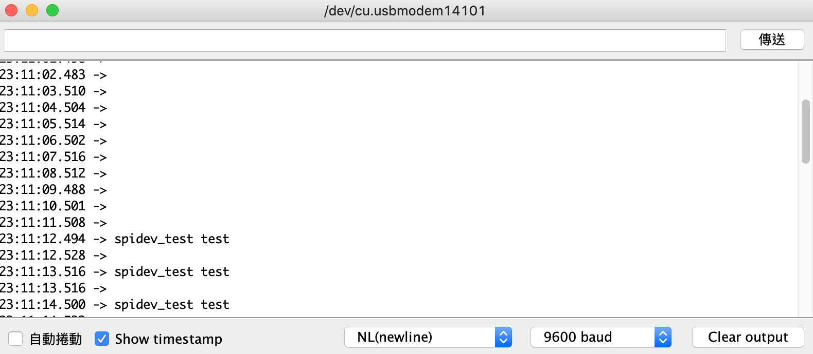

## Day 18：spidev - 辣個 userspace 的驅動程式


如同 I2C 有 `i2c-dev` 這個揭露給 userspace 的字元驅動程式，SPI 子系統也有一個角色類似的字元驅動程式，那就是 (前幾篇文章多少有提到的) `spidev`。在 userspace 中對 `spidev` ，就可以對 SPI 裝置進行輸入輸出。而一些 Raspbery Pi 上常見的 SPI 函式庫，比如說 python 的 spidev.py 函式庫，本質上也是對 `spidev` 的檔案操作來實作。

關於 `spidev` 的文件，主要紀錄在核心文件中的 [*SPI userspace API*](https://www.kernel.org/doc/html/latest/spi/spidev.html) 中。不過如果需要例子，可以去 [linux/tools/spi/spidev_test.c](https://github.com/torvalds/linux/blob/master/tools/spi/spidev_test.c) 這個例子看。在 linux/tools 這個資料夾下有一些不同子系統的工具，這個 `spidev_test.c` 顧名思義功能就是拿來測試 `spidev` 上掛的不同節點的一個程式。

## 機制

spidev 掛上去時，他會幫每一個 *bus* 的每一個 *Chip Select* 在 `/dev/` 下新增名稱具有 `spidevM.N` 形式的節點，其中 `M` 是 *bus* 的編號，`N` 是那個 *bus* 之下對應的 *Chip Select* 編號。比如說 *bus 0* 的 *Chip Select* 有 0 跟 1 兩個，所以就會新增 `spidev0.0` 與 `spi0.1` 兩個檔裝置節點。這點文件中有說明：

*For a SPI device with chipselect C on bus B, you should see:*

***/dev/spidevB.C …***
*character special device, major number 153 with a dynamically chosen minor device number. This is the node that userspace programs will open, created by “udev” or “mdev”.*

而 `spidev` 這個模組建立的這些節點都是字元驅動程式，所以對這些節點進行檔案操作，就可以對對應的裝置進行輸入輸出。

### 實驗：Raspberry Pi OS 中的裝置節點

依照文件的描述，去看看 /dev/ 裡面有的 `spidev` 開頭的裝置：

```shell
$ ls /dev/ | grep spidev
```

就會發現出現了一個 `spidev0.1`：

```shell
$ ls /dev/ | grep spidev
spidev0.1
```

在前幾天的實驗中，在 Raspberry Pi OS 預設的裝置樹中，因為發現 `spi0` 中的兩個 *Chip Select* 都被 `spidev` 給佔去，所以那時候用 Device Tree Overlay 停用了兩個 *Chip Select* 的其中一個。所以在這之前，要先去 `/boot/config.txt` 移除覆蓋上去的部分：

```diff
-dtoverlay=arduino-spi
+# dtoverlay=arduino-spi
```

移除之後重新開機，就會看到兩個 `spidev` 開頭的裝置：

```shell
$ ls /dev/ | grep spidev
spidev0.0
spidev0.1
```

### 實驗：Python 中的 spidev 模組

除了這之外，在 SPI 第二天的實驗中，用了 `ftrace` 去追蹤 python 中的 spidev.py 函式庫。也就是下面這個 python 程式：

```python
import spidev
SPI_BUS = 0
SPI_SS = 0

spi0 = spidev.SpiDev()
spi0.open(SPI_BUS, SPI_SS)
spi0.max_speed_hz = 5000

msg = input("msg> ");
spi0.xfer([ord(c) for c in msg])
```

假定這個檔案叫做 `spidev-example.py`，使用 `ftrace` 去追蹤：

```shell
$ sudo trace-cmd record -p function_graph -F python3 spidev-example.py 
```

隨便輸入一個字串，然後請 `trace-cmd` 去報告：

```shell
$ trace-cmd report | less
```

因為前幾天已經知道：`spi_sync` 或 `spi_async` 是 SPI 子系統中傳輸的 API，所以第一件事情就是去找 `spi_sync` 等函數。然後就發現在某個 `ioctl` 裡面找到他：

```diff=
sys_ioctl() {
  ksys_ioctl() {
    __fdget() {
      __fget_light();
    }
    do_vfs_ioctl() {
+     spidev_ioctl() {
        _raw_spin_lock_irq();
        get_device();
        mutex_lock() {
          _cond_resched() {
            rcu_all_qs();
          }
        }
        memdup_user() {
          __kmalloc_track_caller() {
            kmalloc_slab();
            _cond_resched() {
              rcu_all_qs();
            }
            should_failslab();
          }
          arm_copy_from_user();
        }
        __kmalloc() {
          kmalloc_slab();
          _cond_resched() {
            rcu_all_qs();
          }
          should_failslab();
        }
        arm_copy_from_user();
+       spidev_sync() {
          _raw_spin_lock_irq();
+         spi_sync() {
            mutex_lock() {
              _cond_resched() {
                rcu_all_qs();
              }
[...]
```

那確實這也是用 `ioctl` 傳輸的。因為從 [*SPI userspace API*](https://www.kernel.org/doc/html/latest/spi/spidev.html#basic-character-device-api) 文件中，可以找到以下的敘述：

*"Standard read() and write() operations are obviously only half-duplex, and the chipselect is deactivated between those operations. Full-duplex access, and composite operation without chipselect de-activation, is available using the SPI_IOC_MESSAGE(N) request.""*

所以要用全雙工模式，就要用 `ioctl`。而在 linux/tools/spi/ 中的 [`spidev_test.c`](https://github.com/torvalds/linux/blob/master/tools/spi/spidev_test.c#L150) 中，可以看到以下的程式碼：

```c
[...]
	ret = ioctl(fd, SPI_IOC_MESSAGE(1), &tr);
	if (ret < 1)
		pabort("can't send spi message");
[...]
```

所以驗證的 python 的函式庫確實也用到了 `spidev` 這個裝置。

## 例子：spidev_test

是 [linux/tools/spi/](https://github.com/torvalds/linux/tree/master/tools/spi) 底下的工具程式，可以用來操作 `spidev` 所建立的那些字元驅動程式 (也就是傳輸訊息或讀訊息、調整頻率、調整 CPOL 跟 CPHA 等等)。除了作為使用 `spidev` 的示範，也可以作為測試與效能分析使用。直接去核心原始碼中的 `tools/spi/` 下 `make`：

```shell
$ cd tools/spi/
$ make
```

之後就會發現裡面有一個 `spidev_test` 程式。隨便打個選項進去看說明：

```shell
$ ./spidev_test -h
./spidev_test: invalid option -- 'h'
Usage: ./spidev_test [-DsbdlHOLC3vpNR24SI]
  -D --device   device to use (default /dev/spidev1.1)
  -s --speed    max speed (Hz)
  -d --delay    delay (usec)
  -b --bpw      bits per word
  -i --input    input data from a file (e.g. "test.bin")
  -o --output   output data to a file (e.g. "results.bin")
  -l --loop     loopback
  -H --cpha     clock phase
  -O --cpol     clock polarity
  -L --lsb      least significant bit first
  -C --cs-high  chip select active high
  -3 --3wire    SI/SO signals shared
  -v --verbose  Verbose (show tx buffer)
  -p            Send data (e.g. "1234\xde\xad")
  -N --no-cs    no chip select
  -R --ready    slave pulls low to pause
  -2 --dual     dual transfer
  -4 --quad     quad transfer
  -S --size     transfer size
  -I --iter     iterations
```

比如說，假定 `test.bin` 的內容是長這樣：

```shell
$ cat test.bin 
spidev_test test
```

把 Arduino 接上 SPI，並且把 Slave 接到 `CE0`。並且使用以下的程式接收從 Raspberry Pi 來的傳輸：

```c
#include <SPI.h>
void setup() {
    Serial.begin(9600);
    pinMode(MISO, OUTPUT);
    pinMode(MOSI, INPUT);
    SPI.setClockDivider(SPI_CLOCK_DIV128);
    SPCR |= _BV(SPE);
    SPCR |= _BV(SPIE);
    SPCR &= ~(_BV(MSTR));
}

#define BUF_LEN 128
char buf[BUF_LEN + 1] = {0};
int top = -1;
ISR(SPI_STC_vect)
{
    buf[(++top) % BUF_LEN] = SPDR;
}

void loop() {
    Serial.println(buf);
    delay(1000);
}
```

打開序列埠，用 400kHz 的頻率，以 `test.bin` 當輸入，對 `spidev0.0` 寫入：

```shell
$ sudo ./spidev_test -s 400000 -i test.bin -D /dev/spidev0.0 
spi mode: 0x4
bits per word: 8
max speed: 400000 Hz (400 KHz)
```

就會發現序列埠出現結果了：

