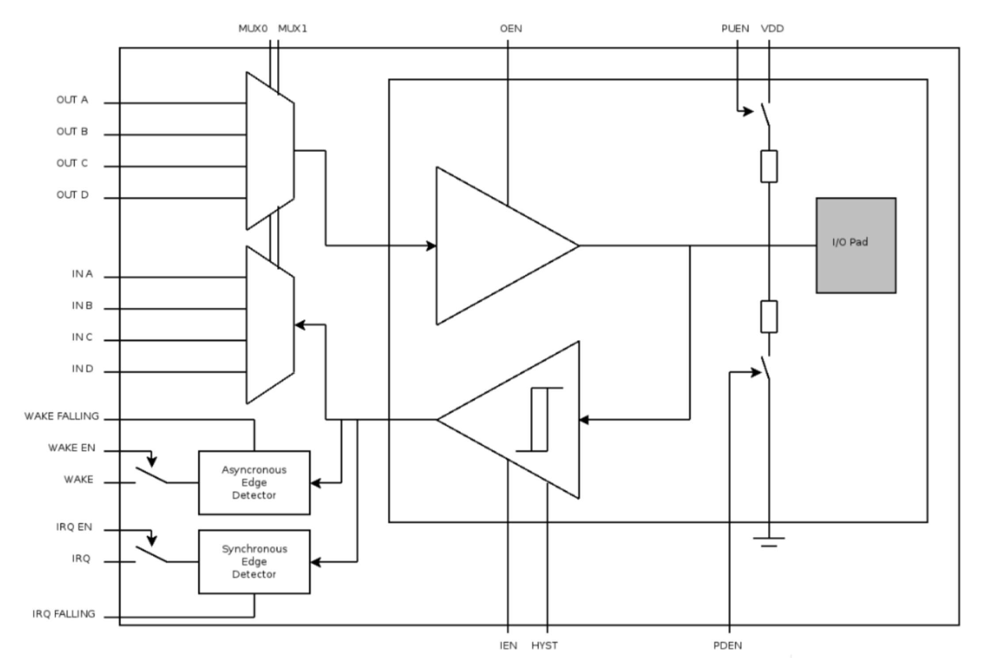
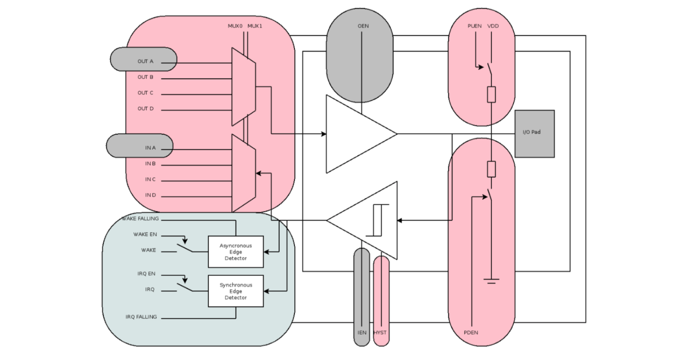
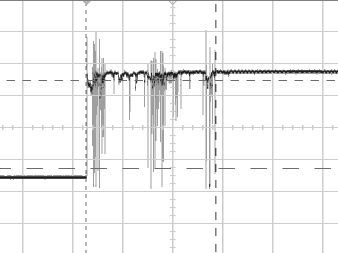

## Day 19：GPIO (Part 1) -- 人生的謊言：GPIO 很簡單


標題這句話可不是我說的。是 GPIO 子系統的維護者 -- Linux Walleij 在 2016 年的 ELCE 中講的話。~~然後就發現這句話是真的~~

## 簡介

GPIO 子系統在 userspace 的介面於 4.8 版後有了大幅度的更動，而這幾年大部分在 Linux Foundation 的演講也多半都跟這些更動有關。這些演講也多半很詳細的回顧舊的子系統，以及介紹新的子系統。

關於核心內部的實作，GPIO 子系統的主要維護者 -- *Linus Walleij* (另外一個 Linus!)，在 2016 年的 ELCE 中發表了一個 [*GPIO for Engineers and Makers*](https://youtu.be/lQRCDl0tFiQ) 演講。裡面詳細介紹了 GPIO 子系統的歷史與實作，包含舊的 GPIO 實作，以及新的以 *GPIO descriptor* 為主的 GPIO 子系統。除此之外，他也是 Pin Control 子系統的維護者，2018 年他也講了一個 [*GPIO and Pin Control for Embedded Systems*](https://youtu.be/AvuOKGvka9g)，著墨在比較多硬體的議題上。

而關於 userspace ABI 的介紹，則屬 *Bartosz Golaszewski* 在各大研討會發表的演講為代表。在 [2017 年的 ELCE](https://youtu.be/cdTLewJCL1Y)、[2018 年的 Kernel Recipe](https://youtu.be/XVFht4MkIl4) 都以 *New GPIO interface for linux user space* 為主題 (兩個演講的標題一模一樣) 介紹了這件事。同樣標題的演講中，最新的版本是去年在俄羅斯的 [*Open Source Tech Conference* 的版本](https://youtu.be/BK6gOLVRKuU)。而最新進度應該是他在 2020 年的 OSS NA 上 [*Linux GPIO: Evolution and Current State of the User API*](https://youtu.be/0APvuY2eLkY) 演講。影片 3 個禮拜前才放上去，非常新鮮的資料！

而關於怎麼依照自己的需求調整 Device Tree，可以參考 2020 年 OSS NA 的 [*Tutorial: Spelunking for Hardware Data*](https://youtu.be/HO68sK6E0B8) 演講，裡面示範了怎麼樣依照 data sheet 去修改相關的 Device Tree。演講最後面還有提供練習題跟解答！

## 硬體

一個典型的 GPIO 硬體大致上像這個樣子：



最主要的輸入與輸出是在左方，比如說輸出的來源是 `OUT A` 到 `OUT D`，而輸入的來源就是 `IN A` 到 `IN B`。他們中間則是經過運算放大器 (放大輸出電壓) 與[施密特觸發器](https://zh.wikipedia.org/wiki/施密特触发器) (用來整理輸入電壓)。

除了這幾個主要的元件之外，當然還有一些上拉與下拉電組在旁邊，他們可以透過 `PDEN` (*Pull-Down Enable*)與 `PLEN` (*Pull-Down Enable*) 來控制是某要使用。

### 輸出：由左向右

輸出的路徑是「由左向右」。要輸出的訊號訊號來自於 `OUT A` 到 `OUT B`，也就是最右上角的部分。經過多工器的選取之後，輸出的訊號經過運算放大器放大到足夠的電壓，並且輸出給作右方的 I/O Pad 進行輸出。

### 輸入：由右向左

輸入的路徑則相反，是「由右到左」。訊號的來源是 I/O Pad，送給施密特觸發器去箝制電壓，並且輸入給左方的 `IN A` 到 `IN B`，或是送給最右下角的 *Edge Detector*，依照波形的 *falling edge* 或是 *rising edge* 去作為 IRQ 等等的來源。

## 不同子系統負責不同部分

雖然說整體電路的雛形像是這個樣子，但實際上這一個看起來簡單的架構中，不同的部分是由核心不同的子系統負責的。如果用這個模型來看，大致上可以區分成下列幾個區塊：



([圖片來源](https://linux.globallogic.com/materials2018/))

### 紅色：PINCTRL

選擇哪個輸入輸出，以及是否要啟動上拉、下拉電阻等等。這一部分是由 [*Pin Control*](https://www.kernel.org/doc/html/latest/driver-api/pinctl.html) 子系統 (或是簡稱為 *pinctrl* 子系統) 來控制。這看起來不像是需要一個專門的子系統來控制他...嗎？看到後面就會發現事情沒有那麼單純了。

### 灰色：GPIO

灰色的部分：讀、寫，還有 *input enable* 與 *output enable* 等等，由 GPIO 子系統控制。

### 藍色：IRQ

就左下角連接的部分。這個部分是將 GPIO 的邊緣觸發與 IRQ 作關聯，讓他們可以作為 IRQ 的來源。

## 問題：有哪些東西需要控制？

除了多工器要選擇哪個 `IN A` 到 `IN D` 哪個輸入或是 `OUT A` 到 `OUT D` 當中哪一個輸入之外，由上面的硬體配置還可以知道：這整個電路有很多地方可以配置，比如現在是輸入還是輸出？上拉下拉電阻要不要啟動？等等。而根據文件中的 [*GPIO electrical configuration*](https://www.kernel.org/doc/html/latest/driver-api/gpio/driver.html#gpio-electrical-configuration) 中的說明，對應上面的圖片來說明一個 GPIO 有哪些東西可以控制。

### 要不要啟動上拉、下拉電組？

就是上圖的 `PLEN`、`PDEN` 等等。

### 運算放大器：Open Drain/Open Source

這邊對應到的就是上圖中的運算放大器的部分。那個運算放大器可以用一個 CMOS 作為模型 ~~「*Sedra & Smith*，你今晚的惡夢！」~~：

```shell
                 VDD
                  |
        OD    ||--+
     +--/ ---o||     P-MOS-FET
     |        ||--+
IN --+            +----- out
     |        ||--+
     +--/ ----||     N-MOS-FET
        OS    ||--+
                  |
                 GND
```

控制 PMOS 跟 NMOS 兩端的開關分別是 `OD` 與 `OS`，這兩個名字也很好理解：當僅有 `OD` 打開不接通，而 `OS` 接通時，這時候就是 *Open Drain* 的配置; 而如果相反：`OD` 接通，但是 `OS` 打開不接通，那就是 *Open Source* 的配置; 若兩者均接通，那麼他就會變成一個 *push-pull* 電路。

而可以想見上述這些都可以透過設定某些暫存器的某些位元來做到。說[這裡](https://elixir.bootlin.com/linux/latest/source/drivers/gpio/gpio-adp5588.c#L84) 就是一個例子。

### Debouncing

有時候訊號輸入會因為物理機制，而產生上下抖動。比如說打開開關時，開關的撞擊可能會產生震動，使得電壓產生波動。像是[圖片](https://learn.adafruit.com/debouncer-library-python-circuitpython-buttons-sensors/basic-debouncing) 這樣：



可以想見：如果現在有一個中斷是透過邊緣觸發的話，這樣的波動就會在短時間內重複地觸發中斷，但這並不是預期的結果。要處理這件事情可以比如說等一小段時間。而 [`gpiod_set_debounce`](https://www.kernel.org/doc/html/latest/driver-api/gpio/index.html?highlight=gpio_chip#c.gpiod_set_debounce) 就可以負責這類功能。

### 這樣就結束了嗎？

其實不是。不同裝置有不同的硬體，會對上面有不同程度的支援。像比如說：未必每一種硬體都有上拉/下拉電阻。除此之外，還有比如 *power source*、*sleep state setup*、*slew rate* 等等可能的配置。

### 誰負責誰：PINCTRL 代打，或是自行實作

在核心中，主要是由 [`struct gpio_chip`](https://www.kernel.org/doc/html/latest/driver-api/gpio/index.html?highlight=gpio_chip#c.gpio_chip) 這個結構來代表 GPIO Chip。一個 GPIO Chip 的驅動程式，就是要提供這些功能的實作：

```c
struct gpio_chip {
	const char		*label;
	struct gpio_device	*gpiodev;
	struct device		*parent;
	struct module		*owner;

	int			(*request)(struct gpio_chip *gc,
						unsigned int offset);
	void			(*free)(struct gpio_chip *gc,
						unsigned int offset);
	int			(*get_direction)(struct gpio_chip *gc,
						unsigned int offset);
	int			(*direction_input)(struct gpio_chip *gc,
						unsigned int offset);
	int			(*direction_output)(struct gpio_chip *gc,
						unsigned int offset, int value);
	int			(*get)(struct gpio_chip *gc,
						unsigned int offset);
	int			(*get_multiple)(struct gpio_chip *gc,
						unsigned long *mask,
						unsigned long *bits);
	void			(*set)(struct gpio_chip *gc,
						unsigned int offset, int value);
	void			(*set_multiple)(struct gpio_chip *gc,
						unsigned long *mask,
						unsigned long *bits);
	int			(*set_config)(struct gpio_chip *gc,
					      unsigned int offset,
					      unsigned long config);
	int			(*to_irq)(struct gpio_chip *gc,
						unsigned int offset);

	void			(*dbg_show)(struct seq_file *s,
						struct gpio_chip *gc);

	int			(*init_valid_mask)(struct gpio_chip *gc,
						   unsigned long *valid_mask,
						   unsigned int ngpios);

	int			(*add_pin_ranges)(struct gpio_chip *gc);

	int			base;
	u16			ngpio;
	const char		*const *names;
	bool			can_sleep;
  const char              *const *names;
[...]
};
```

GPIO 的控制則是由這個結構中實作的函式來決定，比如說可以看到 `direction_input` 或 `diretion_output` 來控制方向。而當中有一個 `set_config` 這個函式來負責控制上面這些東西。而有時候 `set_config` 直接用 `gpiochip_generic_config()` 這個函數作為預設，這時就會以 PINCTRL 子系統中來作為 *backend*。