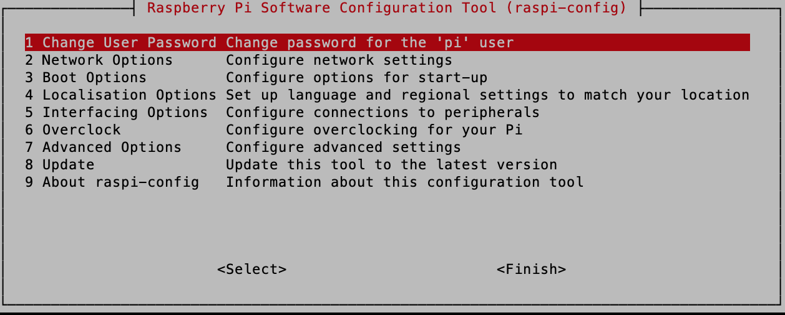
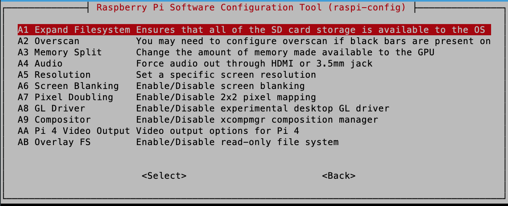
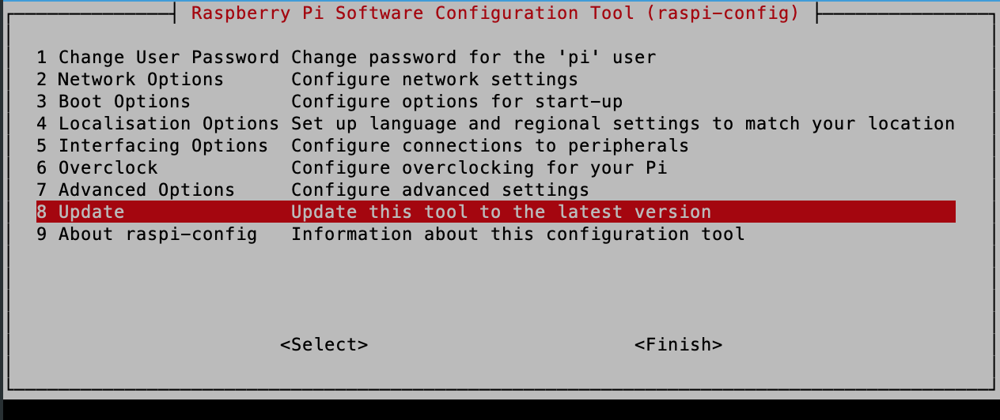
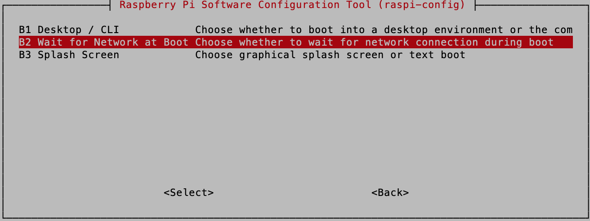
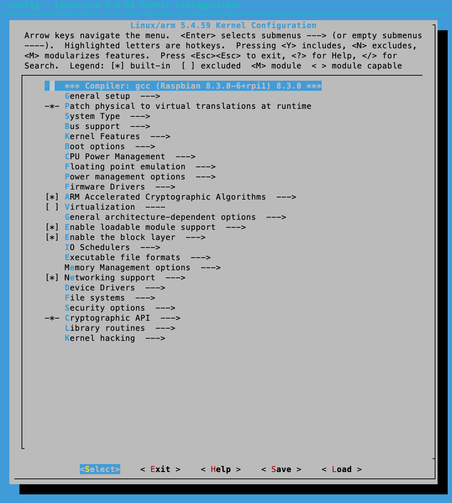
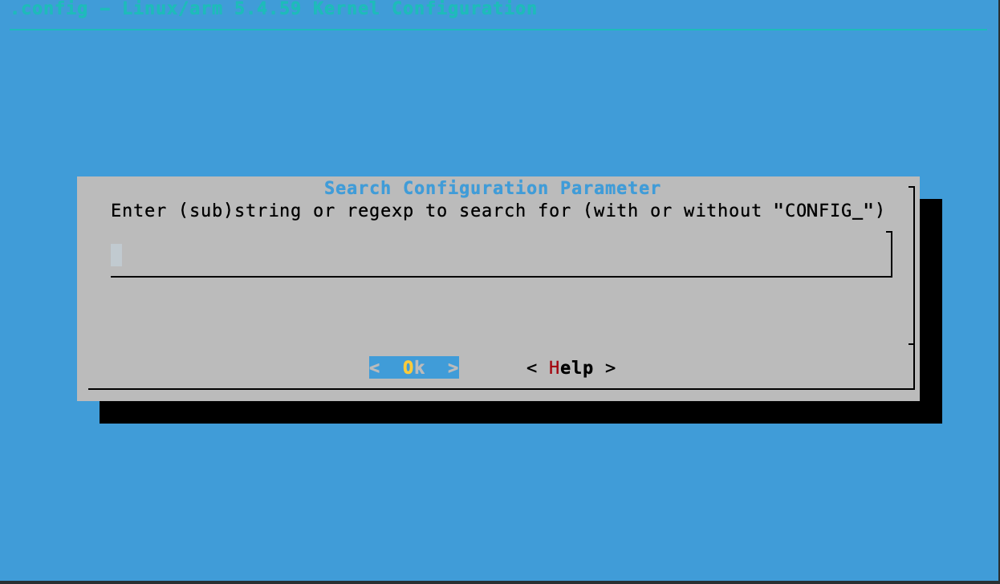
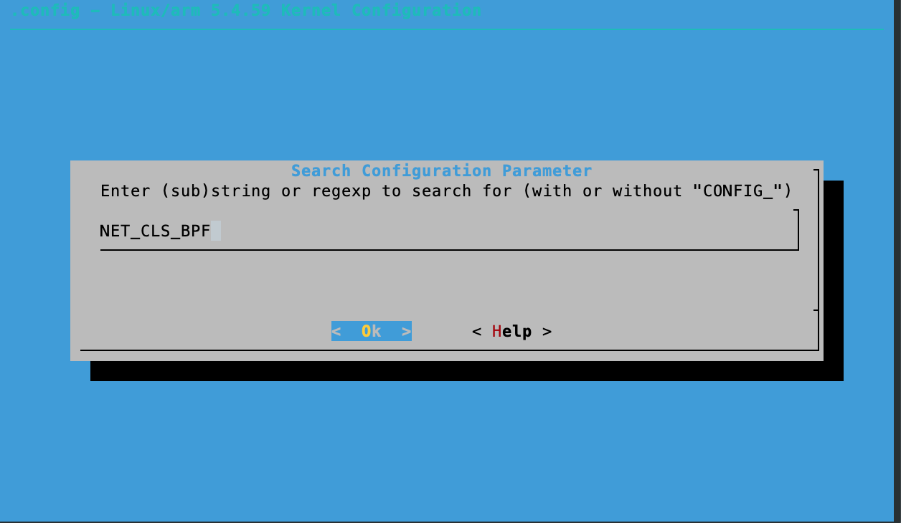
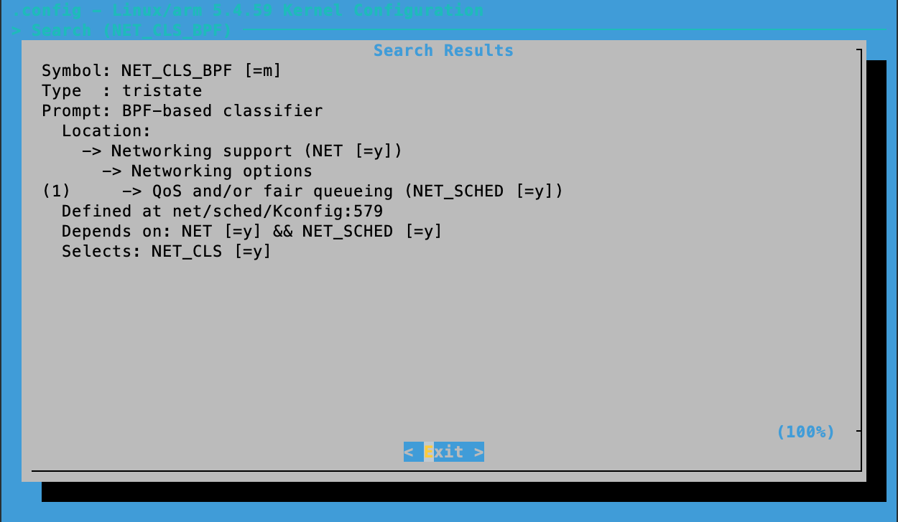

## Day 2：「我需要 perf！」「請給我 eBPF！」


# Day 2：不會交叉編譯也可以自己編譯核心

雖然 Raspberry Pi OS 的核心是 5.4 版，eBPF 的實作大致上已經具備，但現在執行在 Raspberry Pi OS 的 eBPF 的功能並沒有「包含」在這個作業系統的預設配置中。更明確地說：他的核心組態 (kernel config) 中並沒有啟動 eBPF 相關的選項。因此，要想辦法生一個「開啟了 eBPF」的 Linux 核心出來。這方面有幾個作法：

1. 在 Raspberry Pi OS 上編譯一個新的核心：官方有相關[教學](https://www.raspberrypi.org/documentation/linux/kernel/building.md)。這個方法就是像平常編譯其他程式一樣，決定好參數之後直接下 `make`。優點是操作簡單，缺點是通常會很慢，畢竟執行編譯任務的是 Raspberry Pi 本人。
2. 交叉編譯：負責編譯程式的硬體 (通常稱作 *host*) 跟要用這個程式的硬體 (通常稱為 *target*)不是同樣的平台。比如說現在用筆電 (x86 架構) 編譯出可以在 Raspberry Pi Os (arm) 上執行的核心。[同樣一份](https://www.raspberrypi.org/documentation/linux/kernel/building.md)官方教學中也有提到如何交叉編譯核心。而這個的好壞處就跟前者「原生編譯」相反：需要的準備稍多，但編譯時間多半會比較快。舉例來說，交叉編譯時，需要另外準備交叉編譯的工具鏈，比如說要找到「在 x86 上執行，但輸出的可執行檔是可以執行在 arm 架構的編譯器」。畢竟現在要生出一個給另外一個硬體架構執行的可執行檔嘛！
3. Buildroot/Yocto 等 Build System：可以從工具鏈、核心、系統函式庫、root file system 都高度客製化，不過相對來說操作較複雜。

接下來會使用的是第 1. 個方法，因為這大概是最好重現的方法了。比如說：很多交叉編譯的工具鏈都是基於 Linux 的，所以如果平常沒在用 Linux，可能就要想辦法生一個 Linux 的環境 (比如說虛擬機); 但直接在 Raspberry Pi 上就可以簡單快速的開始。不過，簡單快速的開始不代表簡單快速的結束，編譯的時間非常非常久 (就會非常有學習交叉編譯的動力)。

接下來說明如何在 Raspberry 3 Model B 裡面編譯具備 eBPF 功能的 Linux 核心。

## Part 1：生出一個能動的 Raspberry Pi 作業系統。

首先裝一個能動的 Raspberry Pi OS！

### Step 1：燒錄映像檔

去[官方網站](https://www.raspberrypi.org/downloads/raspberry-pi-os/)找到合適的映像檔，並且燒錄到 SD 卡中。

> 如果要直接在 Raspberry Pi 上進行編譯，建議記憶卡可以用 8G 或以上的，畢竟還要下載核心的原始程式碼。

燒錄的方法可以參考官方網站的 [*Installing operating system images*](https://www.raspberrypi.org/documentation/installation/installing-images/README.md) 中，*Writing the image* 一節。我使用的是 *Raspberry Pi OS (32-bit) Lite*，2020-08-20 的版本 (可以參考 [release notes](http://downloads.raspberrypi.org/raspios_armhf/release_notes.txt) 上面的資訊)。

> 映像檔的選擇看個人。如果是需要使用桌面環境的，比如說你想要直接把 Raspberry Pi 接上螢幕或鍵盤操作，那麼可以考慮用桌面版。如果是想要用 SSH 遠端連線，反正桌面環境也看不到，所以既可以考慮用 Lite。

以下會用 Lite 來示範，並且使用 headless 的方式進行設定 (不用外接鍵盤或顯示器)。下面的步驟可以搭配官方的 [*Setting up a Raspberry Pi headless*](https://www.raspberrypi.org/documentation/configuration/wireless/headless.md) 一文，以及 [*Remote Access*](https://www.raspberrypi.org/documentation/remote-access/README.md) 一文中的 [*SSH (Secure Shell)*](https://www.raspberrypi.org/documentation/remote-access/ssh/README.md) 章節。

### Step 2：Wifi

> 接下來會使用 headless 的方式設置 Raspberry Pi，也就是在沒有在 Raspberry Pi 上外接顯示器、鍵盤等硬體的設置方式。
>
> 如果自己有習慣的使用方式 (比如說習慣直接使用 VNC 跟 Raspberry Pi 的桌面環境、或是習慣外接鍵盤顯示器等等)，那也可以跳過下面這些步驟，直接開始編譯核心的部分。總之只要可以裝上去用就可以。

在 SD 卡裡面的最上層中，新增一個 `wpa_supplicant.conf` 的檔案內容：

```bash
ctrl_interface=DIR=/var/run/wpa_supplicant GROUP=netdev
update_config=1
country=TW

network={
 ssid="<Name of your wireless LAN>"
 psk="<Password for your wireless LAN>"
}
```

其中，`ssid` 是預設 WiFi 的名稱，`psk` 填 WiFi 密碼。這可以用參考 [*Setting up a wireless LAN via the command line*](https://www.raspberrypi.org/documentation/configuration/wireless/wireless-cli.md) 一文中的 *Adding the network details to the Raspberry Pi* 一節來看如何加密使用 `wpa_passphrase` 加密。

### Step 3：啟動 SSH

在 SD 卡最上層新增一個名為 `ssh` 的空白檔案。不管是 `touch ssh` 或是拖曳大法(?)。

### Step 4：找到 Raspberry Pi 的 IP

可以參考官方文件中的 [*IP Address*](https://www.raspberrypi.org/documentation/remote-access/ip-address.md) 章節。比如你可以說使用 `ping`：

```shell=
$ ping raspberrypi.local
```

如果成功連線的話，就會發現以下的

```shell
$ ping raspberrypi.local
PING raspberrypi.local (172.20.10.4): 56 data bytes
64 bytes from 172.20.10.4: icmp_seq=0 ttl=64 time=9.253 ms
64 bytes from 172.20.10.4: icmp_seq=1 ttl=64 time=9.160 ms
64 bytes from 172.20.10.4: icmp_seq=2 ttl=64 time=10.580 ms
64 bytes from 172.20.10.4: icmp_seq=3 ttl=64 time=43.283 ms
64 bytes from 172.20.10.4: icmp_seq=4 ttl=64 time=8.124 ms
64 bytes from 172.20.10.4: icmp_seq=5 ttl=64 time=8.192 ms
64 bytes from 172.20.10.4: icmp_seq=6 ttl=64 time=14.043 ms
64 bytes from 172.20.10.4: icmp_seq=7 ttl=64 time=12.170 ms
64 bytes from 172.20.10.4: icmp_seq=8 ttl=64 time=12.216 ms
64 bytes from 172.20.10.4: icmp_seq=9 ttl=64 time=11.172 ms
^C
--- raspberrypi.local ping statistics ---
10 packets transmitted, 10 packets received, 0.0% packet loss
round-trip min/avg/max/stddev = 8.124/13.819/43.283/9.988 ms
```

### Step 5：使用 SSH 連線

就像標題所示：SSH 來一發：

```shell
$ ssh pi@<IP Address>
```

上面找到的東西位址是 `172.20.10.4`，所以

```=
$ ssh pi@172.20.10.4
```

會出現：

```bash
$ ssh pi@172.20.10.4
The authenticity of host '172.20.10.4 (172.20.10.4)' can't be established.
ECDSA key fingerprint is SHA256:CktI0Jinn0n21IqFXe3++BSUzKiemWGEPFXDpcg+CPE.
Are you sure you want to continue connecting (yes/no/[fingerprint])? yes
```

輸入 `yes` 之後，就會出現以下輸出：

```
Warning: Permanently added '172.20.10.4' (ECDSA) to the list of known hosts.
pi@172.20.10.4's password: 
```

然後輸入密碼。預設的密碼是 `raspberry`，所以就把 `raspberry` 當作密碼打進去。就可以進去了：

```bash
Linux raspberrypi 5.4.51-v7+ #1333 SMP Mon Aug 10 16:45:19 BST 2020 armv7l

The programs included with the Debian GNU/Linux system are free software;
the exact distribution terms for each program are described in the
individual files in /usr/share/doc/*/copyright.

Debian GNU/Linux comes with ABSOLUTELY NO WARRANTY, to the extent
permitted by applicable law.

SSH is enabled and the default password for the 'pi' user has not been changed.
This is a security risk - please login as the 'pi' user and type 'passwd' to set a new password.
```

### Step 6：raspi-config

可以登入之後，先做一些設定：

```shell
$ sudo raspi-config
```

會出現以下的畫面：



1. 改密碼：第一個 *Change User Password Change password for the 'pi' user* 的選項就是了：

    

2. 啟動 SSH：在 *Interfacing Option* 的地方，會看到這個選項

    

    點進去會問要不要，就選要。

3. 擴大檔案系統：*Advanced Option* 裡面的 *A1 Expand Filesystem Ensures that all of the SD card storage is available to the OS* 選項：

    

4. 更新相關套件：最後一個

    

5. 在 *Boot Options* 中，有一個選項是 *Wait for Network at Boot*，有時候可能會有用。

    

## Part 2：編譯核心

> 查閱 BCC 中提示的核心組態選項之後，發現 Raspberry Pi OS 預設的核心組態沒有啟動 BPF JIT Compiler，所以重新編譯一次。

### Step 7：查看核心組態

在這之前，可能會先想看一下核心組態是什麼。

```shell
pi@raspberrypi:~ $ sudo modprobe configs
pi@raspberrypi:~ $ zcat /proc/config.gz > .config
pi@raspberrypi:~ $ cat .config
```

這時候會跑出很多組態。可以用 `grep` 找到感興趣的。比如說找跟 BPF 有關的選項：

```bash
pi@raspberrypi:~ $ cat .config | grep BPF
CONFIG_CGROUP_BPF=y
CONFIG_BPF=y
CONFIG_BPF_SYSCALL=y
CONFIG_NETFILTER_XT_MATCH_BPF=m
# CONFIG_BPFILTER is not set
# CONFIG_NET_CLS_BPF is not set
# CONFIG_NET_ACT_BPF is not set
# CONFIG_BPF_JIT is not set
# CONFIG_BPF_STREAM_PARSER is not set
CONFIG_HAVE_EBPF_JIT=y
CONFIG_BPF_LIRC_MODE2=y
# CONFIG_NBPFAXI_DMA is not set
CONFIG_BPF_EVENTS=y
# CONFIG_TEST_BPF is not set
```

就可以發現大部分的組態都沒有打開。又比如想要看 `perf` 的選項：

```bash
$ cat .config | grep PERF_EVENT
```

就會發現都有開：

```bash
CONFIG_HAVE_PERF_EVENTS=y
CONFIG_PERF_EVENTS=y
CONFIG_HW_PERF_EVENTS=y
```

或是 `FTRACE` 的選項：

```bash
$ cat .config | grep FTRACE
CONFIG_HAVE_DYNAMIC_FTRACE=y
CONFIG_HAVE_DYNAMIC_FTRACE_WITH_REGS=y
CONFIG_HAVE_FTRACE_MCOUNT_RECORD=y
CONFIG_FTRACE=y
# CONFIG_FTRACE_SYSCALLS is not set
CONFIG_DYNAMIC_FTRACE=y
CONFIG_DYNAMIC_FTRACE_WITH_REGS=y
CONFIG_FTRACE_MCOUNT_RECORD=y
# CONFIG_FTRACE_STARTUP_TEST is not set
```

### Step 8：編譯核心

可以參考官方的[文件](https://www.raspberrypi.org/documentation/linux/kernel/building.md)。首先安裝必要的套件：

```bash
$ sudo apt install git bc bison flex libssl-dev make
```

然後先使用預設的配置：

```bash
$ cd linux/
$ KERNEL=kernel7
$ make bcm2709_defconfig
```

接下來要自己調整核心的組態。這個配置除了自己暴力修改 `.config` 檔之外，可以使用 `menudonfig` 這個東西配置，先安裝 `libcurses`：

```bash
$ sudo apt install libncurses-dev
```

然後使用：

```bash
$ make menuconfig
```

就會出現像下面這樣的畫面：



接著就開始找出 eBPF 需要的核心組態。從 [BCC](https://github.com/iovisor/bcc/blob/master/INSTALL.md#kernel-configuration) 的安裝指示中，可以知道有哪些核心組態需要開啟：

```bash
CONFIG_BPF=y
CONFIG_BPF_SYSCALL=y
# [optional, for tc filters]
CONFIG_NET_CLS_BPF=m
# [optional, for tc actions]
CONFIG_NET_ACT_BPF=m
CONFIG_BPF_JIT=y
# [for Linux kernel versions 4.1 through 4.6]
CONFIG_HAVE_BPF_JIT=y
# [for Linux kernel versions 4.7 and later]
CONFIG_HAVE_EBPF_JIT=y
# [optional, for kprobes]
CONFIG_BPF_EVENTS=y
```

除了上面這個之外，我還想要開 ftrace 跟 uprobe，所以也另外開了：

```bash
CONFIG_FTRACE_SYSCALLS=y
CONFIG_UPROBE_EVENTS=y
```

menuconfig 有搜尋功能，可以從名稱去搜尋在哪一個目錄中。比如說想知道 `CONFIG_NET_CLS_BPF` 這個選項在哪邊設定，可以使在畫面中按下 `/` ，就會出現搜尋畫面：



打入需要的選項 (前面的 `CONFIG` 字樣可以省略)。比如說：



然後就可以找到對應的東西在選單的哪些子項目了。



依照選項，按下 `m` 或 `y` 進行配置。

最後，去 General Setup 中的 Local Version 改一個喜歡的版本，比如說我的是叫做 `-v7-with-eBPF`。然後就準備開始編譯了：

> 後來發現這樣 `uname -r` 後面也會加上 `-v7-with-eBPF`，所以日後安裝 *header* 的時候可能要直接把 `5.4` 的版本打上去。

```bash
$ make -j4 zImage modules dtbs
```

這個東西要邊超級超級久，在 Raspberry Pi 3 Model B 上，編譯時間超過 3 個小時。

### Step 9：換上新的核心

```shell
$ sudo make modules_install
$ sudo cp arch/arm/boot/dts/*.dtb /boot/
$ sudo cp arch/arm/boot/dts/overlays/*.dtb* /boot/overlays/
$ sudo cp arch/arm/boot/dts/overlays/README /boot/overlays/
```

編完的核心是那個 `arch/arm/boot/zImage`。所以把他變成自喜歡的名字，然後搬到 `/boot` 底下：

```bash
$ sudo cp arch/arm/boot/zImage /boot/<name>.img
```

比如說把 `<name>` 叫做 `kernelebpf`，那就是：

```bash
$ sudo cp arch/arm/boot/zImage /boot/kernelebpf.img
```

最後，修改 `/boot/config.txt` 中的 `kernel` 選項，把他改成新的核心：

```bash
$ sudo vim /boot/config.txt
```

編輯這個檔案，在最後面加上 `kernel=<name>.img`，其中 `<name>` 就是剛剛取的名字。以這邊為例，就是像下面這樣：

```bash
# For more options and information see
# http://rpf.io/configtxt
# Some settings may impact device functionality. See link above for details

[...]

# Additional overlays and parameters are documented /boot/overlays/README

# Enable audio (loads snd_bcm2835)
dtparam=audio=on

[pi4]
# Enable DRM VC4 V3D driver on top of the dispmanx display stack
dtoverlay=vc4-fkms-v3d
max_framebuffers=2

[all]
#dtoverlay=vc4-fkms-v3d

+# Boot to kernel with eBPF
+kernel=kernelebpf.img
```

然後重開：

```bash
$ sudo reboot
```

### Step 10：確認結果

重開機登入之後，檢查核心的版本：

```bash
$ uname -a
```

就會發現變成剛剛編譯的核心了：

```bash
$ uname -a
Linux raspberrypi 5.4.59-v7-with-eBPF+ #1 SMP Tue Sep 1 16:59:18 BST 2020 armv7l GNU/Linux
```

> 或是用前面的方法直接查詢現在的核心組態中，剛剛調整過的組態是否有開啟。(事實上我覺得這才是比較好的作法)