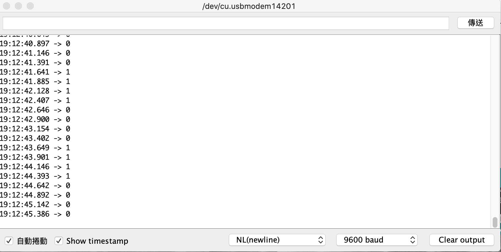
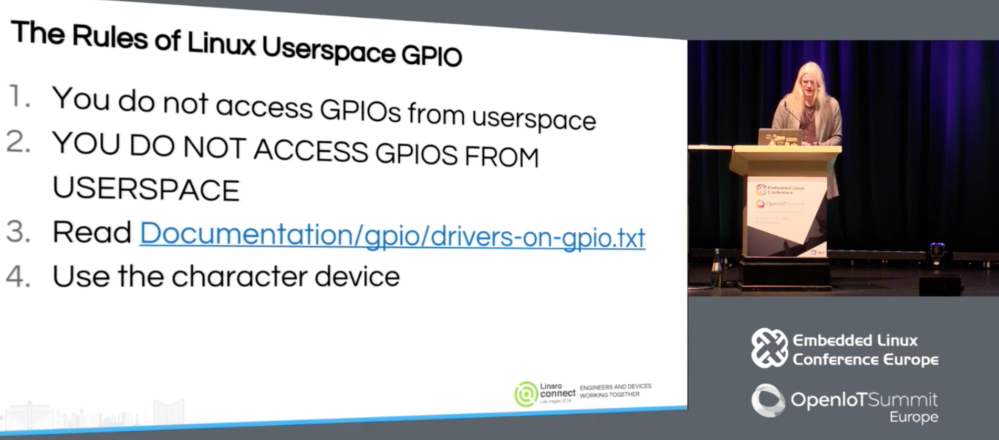

## Day 20：GPIO (Part 2) - 沒有用到 GPIO 子系統的 GPIO


## 前言

依照 I2C 跟 SPI 那時的模式，我這時候應該要找一個 python 的 GPIO 函式庫，然後用 `ftrace` 去追看看發生了什麼事。

不過，這件事情在 GPIO 上碰到了一點障礙。

Raspberry Pi OS 內建的 `RPi.GPIO` 函式庫並不是用核心中的 GPIO 子系統。所以函式庫的實作並不像 SPI、I2C 那樣藉由子系統揭露的 `i2c-dev` 或 `spidev` 這類字元驅動程式實作，而是**直接把控制 GPIO 的記憶體區塊映射給 userspace**。然後在這之上，在 userspace 以 *bit-banging* 的模式實作更多功能 (比如說 PWM)。這個實作繞開了核心中 GPIO 的子系統，所以就沒辦法藉由追縱 `RPi.GPIO` 這個函式庫來理解運作的方式。

事實上，GPIO 也像 I2C、SPI 那樣有揭露給 userspace 的字元驅動程式，而這個版本 (按：5.4 版) 的核心與 Raspberry Pi OS 有支援。但至少在今年 (2020 年 6 月) 的 OSS NA 上的資訊，維護者之一的 *Bartosz Golaszewski* 認為這個功能的實作還沒有穩定，可能會有第二個版本出現。關於這點可以看看今天的幕後花絮。

雖然說如此，為了去追 GPIO 子系統的功能，這邊還是暫時現有的 userspace 字元驅動程式寫一些簡單的程式，並且試著去追蹤核心在這當中做了什麼事。

## RPi.GPIO

如同剛剛所說，Raspberry Pi 內建的 GPIO 機制是實作了一個 `/dev/gpiomem` 裝置節點，把 GPIO 對應的記憶體映射揭露給 userspace。而 `RPi.GPIO` 這個函式庫的實作，本質上就是對 `/dev/gpiomem` 這個檔案進行記憶體映射後操作。

### 實驗：ftrace + RPi.GPIO

這件事情可以先用 `ftrace` 驗證。假定現在用的是以下的 Python 程式：

```python
$ cat hello_GPIO_once.py 
import RPi.GPIO as GPIO
import time
gpio_out = 17

GPIO.setmode(GPIO.BCM)
GPIO.setup(gpio_out, GPIO.OUT)

GPIO.output(gpio_out, GPIO.HIGH)
time.sleep(0.5)
GPIO.output(gpio_out, GPIO.LOW)
time.sleep(0.5)

GPIO.cleanup()
```

使用 `ftrace` 去追蹤：

```shell
$ sudo trace-cmd record \
    -p function_graph \
    -a \
    -F python3 hello_GPIO_once.py 
```

並且看看結果：

```shell=
$  trace-cmd report
```

如果去從這個紀錄中搜尋 gpio 的部分，就會發現找不到那些核心中的 GPIO 子系統用的 `gpiod_*` 函式，而是會找到名字中帶有 `gpiomem` 的相關函式。比如說 `open`：

```c
sys_openat() {
    ...
    vfs_open() {
        do_dentry_open() {
            path_get() {
                mntget();
            }
            try_module_get();
            chrdev_open() {
                _raw_spin_lock();
                cdev_get();
                try_module_get();
                module_put();
+               bcm2835_gpiomem_open();
            }
            ...
        }
    }
}
```

除此之外，這個檔案打開之後，對他進行的檔案操作並不是讀寫他，而是使用 `mmap`：

```c
sys_mmap_pgoff() {
    ksys_mmap_pgoff() {
         ...
+            bcm2835_gpiomem_mmap() {
                 phys_mem_access_prot() {
                    pfn_valid() {
                        memblock_is_map_memory();
                    }
                 }
          ... 
    }
}
```

去 Raspberry Pi 官方維護的 Linux 找看看有沒有類似名稱的函式，可以發現他是在 [*drivers/char/broadcom/bcm2835-gpiomem.c*](https://github.com/raspberrypi/linux/blob/rpi-5.4.y/drivers/char/broadcom/bcm2835-gpiomem.c)，這個驅動程式中。再找一下可以發現是在這個 [commit](https://github.com/raspberrypi/linux/pull/1112/files#diff-ad8414e52a943a289ddae2d79a23b22e) 開始出現的。總之，可以觀察到：這個驅動程式並沒有使用到 GPIO 子系統，而是直接實作了 `mmap` ，把對應的記憶體區塊映射出來。對應的程式碼如下：

```c
static int bcm2835_gpiomem_mmap(struct file *file, struct vm_area_struct *vma)
{
	/* Ignore what the user says - they're getting the GPIO regs
	   whether they like it or not! */
	unsigned long gpio_page = inst->gpio_regs_phys >> PAGE_SHIFT;

	vma->vm_page_prot = phys_mem_access_prot(file, gpio_page,
						 PAGE_SIZE,
						 vma->vm_page_prot);
	vma->vm_ops = &bcm2835_gpiomem_vm_ops;
	if (remap_pfn_range(vma, vma->vm_start,
			gpio_page,
			PAGE_SIZE,
			vma->vm_page_prot)) {
		return -EAGAIN;
	}
	return 0;
}

static const struct file_operations
bcm2835_gpiomem_fops = {
	.owner = THIS_MODULE,
	.open = bcm2835_gpiomem_open,
	.release = bcm2835_gpiomem_release,
	.mmap = bcm2835_gpiomem_mmap,
};
```

### 觀察：RPi.GPIO 的實作

除了 `ftrace` 之外，也可以直接去找 [RPi.GPIO](https://pypi.org/project/RPi.GPIO/#files) 的原始程式碼。在 `c_gpio.c` 這個檔案中，可以找到像下面這樣的程式：

```c
int setup(void)
{

...

    // try /dev/gpiomem first - this does not require root privs
    if ((mem_fd = open("/dev/gpiomem", O_RDWR|O_SYNC)) > 0)
    {
        if ((gpio_map = (uint32_t *)mmap(NULL, BLOCK_SIZE, PROT_READ|PROT_WRITE, MAP_SHARED, mem_fd, 0)) == MAP_FAILED) {
            return SETUP_MMAP_FAIL;
        } else {
            return SETUP_OK;
        }
    }

    // revert to /dev/mem method - requires root

    // determine peri_base
    if ((fp = fopen("/proc/device-tree/soc/ranges", "rb")) != NULL) {
        // get peri base from device tree
        fseek(fp, 4, SEEK_SET);
        if (fread(buf, 1, sizeof buf, fp) == sizeof buf) {
            peri_base = buf[0] << 24 | buf[1] << 16 | buf[2] << 8 | buf[3] << 0;
        }
        fclose(fp);
    } else {
        // guess peri base based on /proc/cpuinfo hardware field
        if ((fp = fopen("/proc/cpuinfo", "r")) == NULL)
            return SETUP_CPUINFO_FAIL;

        while(!feof(fp) && !found && fgets(buffer, sizeof(buffer), fp)) {
            sscanf(buffer, "Hardware    : %s", hardware);
            if (strcmp(hardware, "BCM2708") == 0 || strcmp(hardware, "BCM2835") == 0) {
                // pi 1 hardware
                peri_base = BCM2708_PERI_BASE_DEFAULT;
                found = 1;
            } else if (strcmp(hardware, "BCM2709") == 0 || strcmp(hardware, "BCM2836") == 0) {
                // pi 2 hardware
                peri_base = BCM2709_PERI_BASE_DEFAULT;
                found = 1;
            }
        }
        fclose(fp);
        if (!found)
            return SETUP_NOT_RPI_FAIL;
    }
...
}
```

可以發現這裡的準備動作是直接 `mmap` 那個 `/dev/gpiomem` 裝置 (還有針對舊版 Raspberry Pi 的各種 workarounds)。但總之，整個機制並沒有使用核心的 GPIO 子系統。

### 觀察：PWM 的實作

甚至連 PWM 都是用 `pthread` 加上 *bit-banging* 的機制做的 ~~*Linus Walleij* 在你後面。詳見「幕後花絮」的部分~~。在 `source/soft_pwm.c` 裡面可以看到：

```c
void pwm_start(unsigned int gpio)
{
    struct pwm *p;

    if (((p = find_pwm(gpio)) == NULL) || p->running)
        return;

    p->running = 1;
    if (pthread_create(&threads, NULL, pwm_thread, (void *)p) != 0)
    {
        // btc fixme - error
        p->running = 0;
        return;
    }
    pthread_detach(threads);
}
```

其中， `pthread_create` 創造的執行緒中，執行的是下面的函式：

```c
void *pwm_thread(void *threadarg)
{
    struct pwm *p = (struct pwm *)threadarg;

    while (p->running)
    {

        if (p->dutycycle > 0.0)
        {
            output_gpio(p->gpio, 1);
            full_sleep(&p->req_on);
        }

        if (p->dutycycle < 100.0)
        {
            output_gpio(p->gpio, 0);
            full_sleep(&p->req_off);
        }
    }

    // clean up
    output_gpio(p->gpio, 0);
    free(p);
    pthread_exit(NULL);
}
```

可以發現他做的事情就是：在結束之前 (`p->running` 沒有被設成 0 之前)，他會一直交替地依照 *duty cycle* 時間輪流把 GPIO 設成高與低，然後依照對應的時間休眠。其中那個 `full_sleep` 是個 `nanosleep` 的 *wrapper*，目的是如果有訊號把 `nanosleep` 中斷，那麼在訊號結束之後，可以繼續把剩下的時間休眠完：

```c
void full_sleep(struct timespec *req)
{
    struct timespec rem = {0};

    if (nanosleep(req,&rem) == -1)
        full_sleep(&rem);
}
```

而關於 PWM，上個月 (2020 年 9 月) 的 mailing list 中，出現了一個用 *bit-banging* 來模擬 PWM 的 [patch](https://lwn.net/ml/devicetree/20200902121236.20514-3-vincent.whitchurch@axis.com/)。不過從 mailing list 的討論來看，目前應該還在審查當中。

按：Adafruit 之前有維護一個 Raspberry Pi 的 [Linux 核心](https://github.com/adafruit/adafruit-raspberrypi-linux)，裡面有一個 PWM 的驅動程式，在 [drivers/pwm/pwm-bcm2835.c](https://github.com/adafruit/adafruit-raspberrypi-linux/blob/rpi-4.9.y/drivers/pwm/pwm-bcm2835.c) 這裡。不過是 4.9 版的核心。

## 字元驅動程式的介面

雖然這個 python 函式庫中沒有用到 GPIO 的子系統，不過從 `/dev` 底下的檔案看來：

```shell
$ ls /dev | grep gpio
gpiochip0
gpiochip1
gpiochip2
gpiomem
```

並不是完全沒有 GPIO 的驅動程式，只是函式庫的實作並沒有用到他們。所以接下來就退而求其次，對 `sysfs` 中的 GPIO 的相關節點進行檔案操作，然後用 `ftrace` 看看有沒有什麼有趣的東西。

### 硬體配置

由 Raspberry Pi 的 [GPIO10](https://pinout.xyz/pinout/pin19_gpio10) (也就是可以作為 SPI 中 MOSI 的那個腳位) 連接 *Logic Level Shifter* 之後，將輸出接到 Arduino 編號 11 的腳位。

### 程式：Raspberry Pi 方

目前的 GPIO userspace 字元驅動程式使用方法，可以參考 *Bartosz Golaszewski* 在 2018 年的 [*New GPIO interface for linux user space*](https://youtu.be/BK6gOLVRKuU) 演講。文件中關於這方面的資訊幾乎沒有，(至少在 GPIO 的章節中) 只有 [*Legacy GPIO Interfaces*](https://www.kernel.org/doc/html/latest/driver-api/gpio/legacy.html) 中有提到，而且還是 *Linus Walleij* 四年前的演講中就已經表明是 *"depricated"* 的內容。所以這邊就參考 *Bartosz Golaszewski* 的演講內容撰寫：

1. 開啟 `/dev/gpiochipN` 名字的節點。以這邊為例是開 `/dev/gpiochip0`。
2. 填寫 `struct gpiohandle_request` 這個結構：其中 `lines` 是放「總共要對幾個 GPIO 輸入/輸出」，而 `lineoffsets` 這個陣列依序放 GPIO 的編號。而 `ioctl` 的 `cmd` 則依照希望對 GPIO 進行的操作 (如：輸入或輸出) 填寫。
3. 填寫好之後，對第一次開檔得到的 *file descripor* 以剛剛填的 `struct gpiohandle_request` 為輸入進行 `ioctl`。這時這個結構中的 `fd` 成員會被填入另外一個 *file descriptor*
4. 取出這個新拿到的 *file descriptor*，就可以對他用 `ioctl` 去控制 GPIO。這時的 `ioctl` 的參數要放 `struct gpiohandle_data`，而這個結構的 `values` 陣列的第 `i` 個元素，要填入對第一次 `ioctl` 時的 `lineoffsets` 中，第 `i` 個編號的 GPIO 線的輸出。

假設現在對 Raspberry Pi 的 GPIO 10 作輸出，每 1 秒變換一次電壓高低，那麼程式碼大致上如下所示：

```c
#include <linux/gpio.h>
#include <fcntl.h>
#include <stdio.h>
#include <sys/ioctl.h>
#include <unistd.h>

int main()
{
    struct gpiochip_info info;
    int err = 0;

    int fd = open("/dev/gpiochip0", O_RDONLY); 
    if (fd < 0) {
	printf("Failed to open gpiochip.\n");
	return 1;
    }

    struct gpiohandle_request req = {
        .lineoffsets[0] = 10,
	.lines = 1,
	.flags = GPIOHANDLE_REQUEST_OUTPUT,
	.consumer_label = "blinker",
    };

    err = ioctl(fd, GPIO_GET_LINEHANDLE_IOCTL, &req);
    if (err < 0) {
    	printf("Failed to get gpio handler.\n");
	return err;
    }

    struct gpiohandle_data data;
    while (1) {
        data.values[0] = 1;
    	err = ioctl(req.fd, GPIOHANDLE_SET_LINE_VALUES_IOCTL, &data);
    	if (err < 0) {
    	    printf("Failed to set gpio output as high.\n");
	    return err;
   	}
 	sleep(1);
    	data.values[0] = 0;
    	err = ioctl(req.fd, GPIOHANDLE_SET_LINE_VALUES_IOCTL, &data);
    	if (err < 0) {
    	    printf("Failed to set gpio output as low.\n");
	    return err;
    	}
        sleep(1);
    }
    return 0;
}
```

並且編譯以上的程式：

```shell
$ gcc blink.c -o blink
```

### 程式：Arduino 方

Arduino 一方的程式很直接：每 0.25 秒檢測一次 GPIO 高低的變化：

```c
#define RPI_DATA_PIN 11
#define DELAY_INTERVAL 250

void setup() {
    Serial.begin(9600);
    pinMode(RPI_DATA_PIN, INPUT);
}

void loop() {
    Serial.println(digitalRead(RPI_DATA_PIN));
    delay(DELAY_INTERVAL);
}
```

### 執行結果

打開 Arduino IDE 的序列埠，就可以發現每秒 1 次的電壓變化：



(可以觀察時間戳記上的時間得知)

## ftrace 結果

使用 `ftrace` 去追蹤：

```shell
$ sudo trace-cmd record -p function_graph -a -F ./blink
```

`trace-cmd` 輸出的資訊中會有時間戳記。又因為 Raspberry Pi 的程式中，GPIO 輸出是每秒變化一次，所以從 `trace-cmd report` 的結果中，找出「**每秒重複出現的 GPIO 子系統相關函式**」，就有可能是用來設定 GPIO 高低的函式; 而其餘 GPIO 子系統中的函式，就有可能是用於初始化或是清理的功能。

### 觀察：每秒出現的東西

```diff=
+4492.310069:              |  sys_ioctl() {
4492.310071:               |    ksys_ioctl() {
4492.310073:               |      __fdget() {
4492.310074:    1.823 us   |        __fget_light();
4492.310078:    5.208 us   |      }
4492.310079:               |      do_vfs_ioctl() {
4492.310081:               |        linehandle_ioctl() {
4492.310083:    1.823 us   |          arm_copy_from_user();
+4492.310087:              |          gpiod_set_array_value_complex() {
+4492.310091:              |            gpio_chip_set_multiple() {
4492.310093:               |              bcm2835_gpio_set() {
+4492.310095:    1.719 us  |                gpiochip_get_data();
4492.310098:    5.105 us   |              }
4492.310100:    8.802 us   |            }
4492.310101:  + 14.167 us  |          }
4492.310103:  + 21.667 us  |        }
4492.310105:  + 25.469 us  |      }
4492.310106:  + 35.781 us  |    }
4492.310108:  + 39.219 us  |  }

[...]

+4493.310980:              |  sys_ioctl() {
4493.310984:               |    ksys_ioctl() {
4493.310987:               |      __fdget() {
4493.310990:    3.072 us   |        __fget_light();
4493.310995:    8.958 us   |      }
4493.310999:               |      do_vfs_ioctl() {
4493.311002:               |        linehandle_ioctl() {
4493.311006:    3.177 us   |          arm_copy_from_user();
+4493.311012:              |          gpiod_set_array_value_complex() {
+4493.311017:              |            gpio_chip_set_multiple() {
4493.311020:               |              bcm2835_gpio_set() {
+4493.311023:    2.916 us  |                gpiochip_get_data();
4493.311029:    8.854 us   |              }
4493.311032:  + 15.052 us  |            }
4493.311035:  + 23.489 us  |          }
4493.311038:  + 35.573 us  |        }
4493.311040:  + 42.135 us  |      }
4493.311043:  + 59.948 us  |    }
4493.311046:  + 65.833 us  |  }
```

從最上層的 `gpiod_set_array_value_complex()` 來看，他是一個在 [drivers/gpio/gpiolib.c](https://elixir.bootlin.com/linux/latest/source/drivers/gpio/gpiolib.c#L3966) 中的函式庫。而原始程式碼裡面的[說明](https://elixir.bootlin.com/linux/latest/source/drivers/gpio/gpiolib.c#L3943) 如下：

*"set multiple outputs on the same chip;"*

所以這是一個跟 GPIO 輸出有關的函數。而如果再進去看裡面的實作，可以發現在下一層的呼叫中，他呼叫了 `gpio_chip_set_multiple()`，而這個函數裡面又 `struct gpio_chip` 這個結構體裡面提供的函數：

```c
static void gpio_chip_set_multiple(struct gpio_chip *gc,
				   unsigned long *mask, unsigned long *bits)
{
	if (gc->set_multiple) {
		gc->set_multiple(gc, mask, bits);
	} else {
		unsigned int i;

		/* set outputs if the corresponding mask bit is set */
		for_each_set_bit(i, mask, gc->ngpio)
			gc->set(gc, i, test_bit(i, bits));
	}
}
```

而前一天的文章中恰好提到：`struct gpio_chip` 是一個代表硬體 GPIO Controller 的一個 *abstraction*，所以會在這邊使用到他看起來也很合理。

### 觀察：第一個 ioctl 做了什麼？

接下來再看看第一個 `ioctl` 時，做了什麼事。這也許有助於理解這個子系統大致上的使用流程是什麼：

```diff=
 sys_ioctl() {
   ksys_ioctl() {
     __fdget() {
       __fget_light();
     }
     do_vfs_ioctl() {
+      gpio_ioctl() {
         linehandle_create() {
           arm_copy_from_user();
           kmem_cache_alloc_trace() {
             _cond_resched() {
               rcu_all_qs();
             }
             should_failslab();
           }
```

去查了一下可以發現他也在 [*drivers/gpio/gpiolib.c*](https://elixir.bootlin.com/linux/latest/source/drivers/gpio/gpiolib.c#L1245) 當中，而且裡面的註解中寫到：

*"gpio_ioctl() - ioctl handler for the GPIO chardev"*

看來就是用來處理開檔之後第一個 `ioctl` 的相關設定。因為這個函數內部呼叫的路徑很深，並且也用到不少 pinctrl 子系統中的東西，比較難直接看出來具體的初始化過程是什麼。因此只能另外再去翻文件。

## 幕後花絮

GPIO 子系統除了意外的複雜外，在尋找相關資料時，也發現了一些有趣的事情。

### Linus Walleij 的搜尋結果

在 Google 搜尋 *Linus Walleij* (Linux 中 GPIO 子系統的維護者)，會出線類似藝人的搜尋結果 (他有個人音樂的[部落格](https://dflund.se/~triad/audio/stygg.html)，並且會建議你去他的[另外一個網站](https://dflund.se/~triad/index.html)看看)。並且搜尋結果會提供影片、歌曲等資訊欄：


但如果去點「其他人也搜尋了」的標籤，建議選項不是其他藝人，而是如 *Greg KH*、*Thomas Gleixner* 這些核心的維護者：


### Linus Walleij 對濫用 userspace GPIO 的斥責

*Linus Walleij* 曾經在 2016 年的 ELCE 中，名為 [*GPIO for Engineers and Makers*](https://youtu.be/lQRCDl0tFiQ) 的演講中有講到：**在 userspace 使用 GPIO 的準則就是「不要在 userspace 使用 GPIO」**。可能因為很重要，所以他重複了兩遍~~還順便抱怨了工程師跟 Maker 是有差的~~：

*"(按：37:42 的時候) The rules of linux userspace GPIO: you do not access GPIO in userspace. **YOU DO NOT ACCESS GPIO IN USERSPACE**. All of you do it. My God... for push buttons, for sound source, any bit-bang GPIO I2C SPI traffic, 1-wire... whatever you are doing, **write freaking kernel drivers!** Don't bit-bang stuffs from userspace. I know it's fun, it's very Arduino to do it, but it's not engineering."*



~~聽到這裡我替我在機械系作的專題們感到中槍~~。不過他也說了：

*"**But there are use cases where you have to do userspace GPIO.** I have been convinced. Industrial automation, factory lines doing with the Linux systems. I don't want, like, random kernel driver for rally express, bottle filler or whatever. That doesn't make sense. Of course you want to drive that in userspace. Controll system, industrial control, robot systems, fire alarms, door openers... **I don't want a door opener driver in my kernel.** I understand that you want to use character device."*

順帶一提，他建議在真的寫驅動程式之前，先看看文件中的 [*Subsystem drivers using GPIO*](https://www.kernel.org/doc/html/latest/driver-api/gpio/drivers-on-gpio.html#subsystem-drivers-using-gpio) 裡面列出的那些核心模組，看看有沒有已經適合的應用。

### 還沒做好的字元驅動程式

GPIO 的字元驅動程式做出來之後發現有一些需要改進的地方，所以現在 ABI 其實還不穩定。在今 (2020) 年的 OSS NA 中，*Bartosz Golaszewski* (GPIO 子系統的另外一個維護者) 原先預定以 [*Linux GPIO: Evolution and Current State of the User*](https://youtu.be/0APvuY2eLkY) 為題做介紹。但後來因為諸多問題 (參考演講中 19:42 開始的部分)，所以現在的字元驅動程式仍然會在將來有所更動。而投影片標題也變成了 [*Linux GPIO: A Lesson in user API design*](https://elinux.org/images/c/cb/Linux_GPIO-Evolution_and_Current_State_of_the_User_API.pdf)。更進一步的討論可以參考 [`linux-gpio`](https://www.spinics.net/lists/linux-gpio/) 的 mailing list。