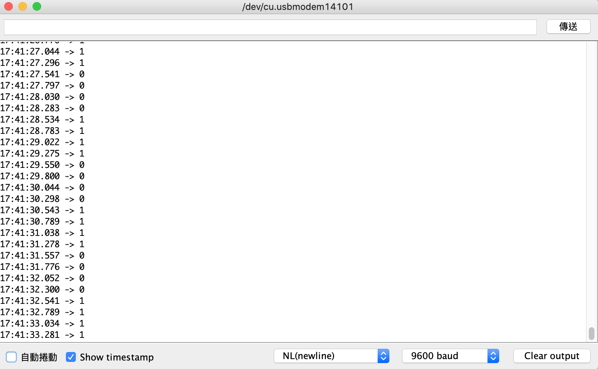

## Day 22：GPIO (Part 4) - 今晚，我想來點驅動程式佐 GPIO


## pinctrl

一個 GPIO 的硬體可能同時兼具很多不同的功能。比如說一個 GPIO 可能也可以是 SPI、輸出 PWM、UART 等等。除此之外，就算知道功能是 GPIO，前面也知道 GPIO 有很多不同的設定：*active high/active low*？有沒有上拉/下拉電組？作為輸入或輸出？等等更詳細的設定。

既然這樣，在裝置樹當中除了列舉出某個硬體，也必須要說明這樣的硬體要提供什麼樣的功能與設定。就 GPIO 而言，至少有兩個部分需要在裝置樹中說明：

1. 一個裝置節點下要用哪些 GPIO？
2. 現在這個 GPIO 的設定是什麼？

## 例子：Arduino GPIO

接下來的實驗中，會將 Raspberry Pi 的 `GPIO17` 腳位「分配」給一個自己撰寫的驅動程式。並且在裡面使用這個 GPIO 跟 Arduino 簡單的互動。

1. 在 `gpio` 這個節點底下提供一個特殊的節點。這個節點描述的是一組 `gpio` 當中的 GPIO 節點的設定。
2. 在根節點下，設置一個專門描述 Arduino 的節點。這個節點必須描述 Arduino 需要使用哪些 Raspberry Pi 上的硬體。而這個描述必須包含該使用哪些 Raspberry Pi 上的 GPIO？這些 GPIO 的設定又為何 (即：要使用在 1. 中節點描述的哪一組設定)？

## 硬體配置

Raspberry Pi 的 `GPIO17` 經過 *Logic Level Shifter* 之後，去接 Arduino 的`7` 號腳位。

## 任務一：提供一組 GPIO 與配置 (pinctrl)

首先，要在裝置樹中**安排一組給 Arduino 用的 GPIO，並且給出這組 GPIO 該有的設定**。這一組 GPIO 的資訊與設定，最後會被另外一個描述 Arduino 的節點拿來用。後面會看到那個「描述要用哪一組 GPIO」的屬性恰好叫做 `pinctrl`。

以 DHT11 為例，他預設使用 `GPIO4`。所以 `gpio` 節點底下，就有一個「需要第 4 號 GPIO。除此之外，要這個 GPIO 要啟動下拉電阻，功能是輸入」這組描述：

```python
gpio {
    ...
    dht11_pins@0 {
        brcm,pins = < 0x04 >;
        phandle = < 0x86 >;
        brcm,pull = < 0x00 >;
        brcm,function = < 0x00 >;
    };
    ...
};
```

==注意這邊的 phandle 數值是 0x86，等一下第二個部分的舉例會參考到他。==

在這當中， `brcm,pins` 描述需要使用的 GPIO 編號。因為他只用 4 號角位，所以只有 1 個; 而另外兩個 `brcm,pull` 與 `brcm,function` 則是跟設定與功能有關的描述： `brcm,pull` 表示上拉/下拉的模式，而 `brcm,function` 則是輸入與輸出。

不過，究竟要怎麼描述這樣一組設定呢？每個硬體會有不同的方法，要去查各自的文件。但滿大的機會可以在 *Ducumentation/devicetree/bindings/pinctrl* 底下找到的。以 Raspberry Pi 3 Model B 的例子來說，在 [*Broadcom BCM2835 GPIO (and pinmux) controller*](https://www.kernel.org/doc/Documentation/devicetree/bindings/pinctrl/brcm,bcm2835-gpio.txt) 中找到。

在這個文件中提到 2 種 *binding* 的方法，其中一種是舊式的 *binding* 方法，(很不幸地) 就是目前的 Raspberry Pi OS 使用的方法：

```diff
Legacy pin configuration and multiplexing binding:
*** (Its use is deprecated, use generic multiplexing and configuration
*** bindings instead)

Required subnode-properties:
- brcm,pins: An array of cells. Each cell contains the ID of a pin. Valid IDs
  are the integer GPIO IDs; 0==GPIO0, 1==GPIO1, ... 53==GPIO53.
  
Optional subnode-properties:
- brcm,function: Integer, containing the function to mux to the pin(s):
  0: GPIO in
  1: GPIO out
  2: alt5
  3: alt4
  4: alt0
  5: alt1
  6: alt2
  7: alt3
- brcm,pull: Integer, representing the pull-down/up to apply to the pin(s):
  0: none
  1: down
  2: up
```

另一個則是更一般的，`pinctrl` 子系統文件中建議的方法：

```diff
The BCM2835 pin configuration and multiplexing supports the generic bindings.
For details on each properties, you can refer to ./pinctrl-bindings.txt.

Required sub-node properties:
  - pins
  - function

Optional sub-node properties:
  - bias-disable
  - bias-pull-up
  - bias-pull-down
  - output-high
  - output-low
```

而為了一致性，所以現在就先使用舊的方法。

首先，要在 `gpio` 節點下，描述現在要用的這組 (給 Arduino 用的) GPIO 中，有哪些 GPIO？以及這些 GPIO 的設定如了？從文件中知道：這兩個屬性分別是用 `brcm,pins` 與 `brcm,function` 描述。所以這個節點大致上看起來像是這樣：

```python
    arduino_gpio: arduino_gpio_conf {
        brcm,pins = ....;
        brcm,function = ....;
    };
```

### brcm,pin：這組描述要設定哪些 GPIO？

關於這個屬性詳細的描述，可以在剛剛的文件中找到。比如說：關於 `brcm,pins`，可以找到以下的描述：

*"brcm,pins: An array of cells. Each cell contains the ID of a pin. Valid IDs are the integer GPIO IDs; 0 == GPIO0, 1 == GPIO1, ... 53 == GPIO53."*

因此可以知道：**`brcm,pins` 這個屬性，是指這組設定中的描述，是用來設定哪些編號的 GPIO**。因為現在這邊只有要用 `GPIO17` ，所以裡面就只放一個 `0x11`。如果需要更多的話，就依序把需要的編號放進去。

### brcm,function：這些 GPIO 拿來做什麼？

接著是 `brcm,function`。文件中描述到：

```shell
Optional subnode-properties:
- brcm,function: Integer, containing the function to mux to the pin(s):
  0: GPIO in
  1: GPIO out
  ...
```

因此，可以知道：**`brcm,function` 描述的是 GPIO 用於輸入或輸出**。因為現在是要「輸出」給 Arduino，所以就依照文件把他設定成 `0x1`。

### brcm,pull：上拉下拉？

除此之外，假定現在希望使用下拉電阻，依照文件的說明：

```shell
- brcm,pull: Integer, representing the pull-down/up to apply to the pin(s):
  0: none
  1: down
  2: up
```

把 `brcm,pull` 的屬性設定成 `0x1`。

### 全部的 DT Overlay (之一)

綜合以上，這個部分的 DT Overlay 如下面這樣：

```python
/dts-v1/;
/plugin/;
/ {
    compatible="brcm,brcm2835";
    fragment@0 {
        target = <&gpio>;
        __overlay__ {
            arduino_gpio: arduino_gpio_conf {
                brcm,pins = <0x11>;
                brcm,function = <0x1>;
                brcm,pull = <0x1>;
            };
        };
    };
};
```

注意遮邊有給這組描述檔加上 label，以就是那個 `arduino_gpio`。因為之後需要在 Arduino 的節點下，引用到這組設定。所以最好留下一個 label 方便之後用 `&` 引用。

### 驗證：疊加的結果

編譯之後：

```shell
$ dtc -@ -I dts -O dtb -o arduino-gpio.dtbo arduino-gpio.dts
```

把他複製進去 `/boot/overlays` 當中：

```shell
$ sudo cp arduino-gpio.dtbo /boot/overlays/
```

接著修改 `/boot/config.txt`，把需要 Overlay 的地方加進去：

```diff
+# Uncomment this to access arduino gpio pins
+dtoverlay=arduino-gpio
+dtdebug=1
```

在重開機之前，可能會想要紀錄現在的裝置樹方便比較。如果想要這樣做的話，可以先把他存起來。比如說把下面這個東西導向到一個自己喜歡的檔案裡：

```shell
$ dtc -I fs /proc/device-tree > old_dt
```

接著重新開機。比較前後裝置樹的差異，就會發現在 `gpio` 底下，出現了一個新的 `arduino_gpio_conf` 節點：

```diff
@@ -101,8 +101,8 @@
 		gpios = < 0x10 0x04 0x00 >;
 		compatible = "dht11";
 		status = "okay";
-		phandle = < 0x87 >;
-		pinctrl-0 = < 0x86 >;
+		phandle = < 0x88 >;
+		pinctrl-0 = < 0x87 >;
 		pinctrl-names = "default";
 	};
 
@@ -402,7 +402,7 @@
 
 			dht11_pins@0 {
 				brcm,pins = < 0x04 >;
-				phandle = < 0x86 >;
+				phandle = < 0x87 >;
 				brcm,pull = < 0x00 >;
 				brcm,function = < 0x00 >;
 			};
@@ -608,6 +608,13 @@
 				brcm,function = < 0x05 >;
 			};
 
+			arduino_gpio_conf {
+				brcm,pins = < 0x11 >;
+				phandle = < 0x86 >;
+				brcm,pull = < 0x01 >;
+				brcm,function = < 0x01 >;
+			};
+
```

## 任務二：描述 Arduino 要使用的硬體

給出一組 GPIO 與其配置之後，就可以在描述該外加硬體的節點中，引這組配置。由 DHT11 的例子：

```python
    dht11@0 {
            gpios = < 0x10 0x04 0x00 >;
            compatible = "dht11";
            status = "okay";
            phandle = < 0x87 >;
            pinctrl-0 = < 0x86 >;
            pinctrl-names = "default";
    };
```

可以發現他在 `gpios` 給出了需要使用的 GPIO 相關描述，而且也在 `pinctrl-0` 這個屬性引用到了 `0x86`，也就是剛剛 `gpio` 節點底下，重點畫起來的 `dht11_pins` 的 phandle。

### 已經熟悉的屬性：phandle, compatible, status

在這當中，扣掉編譯時會自行加上去的 `phandle`，下面兩個是已經熟悉的屬性：

1. `compatible`：用來跟 *Driver* 配對的字串。
2. `status`：是否啟動。

### 準備填入的屬性：gpios、pinctrl-0、pinctrl-names

而下面幾個是之前沒看過的部分：

1. `gpios`
2. `pinctrl-0`
3. `pinctrl-names`

### 用哪些 GPIO：gpios

其中，`gpios` 可以參考 `gpios` *binding* 的[文件](https://www.kernel.org/doc/Documentation/devicetree/bindings/gpio/gpio.txt)。裡面提到：

```python
The following example could be used to describe GPIO pins used as device enable
and bit-banged data signals:

	gpio1: gpio1 {
		gpio-controller;
		#gpio-cells = <2>;
	};
	[...]

	data-gpios = <&gpio1 12 0>,
		     <&gpio1 13 0>,
		     <&gpio1 14 0>,
		     <&gpio1 15 0>;

In the above example, &gpio1 uses 2 cells to specify a gpio. The first cell is
a local offset to the GPIO line and the second cell represent consumer flags,
such as if the consumer desire the line to be active low (inverted) or open
drain. This is the recommended practice.
```

也就是說：**`gpios` 的 <...> 中，依序要擺「GPIO Controller 的 phandle」「GPIO 編號」「這個編號的 GPIO 的設定」**。在這邊的例子中

1. GPIO Controller 的 phandle 可以接用 `&gpio` 得到
2. 現在要使用的 GPIO 的編號是 17，也就是 `0x11`
3. 編號是設定成輸出，文件說要設成 `0x0`。

綜合以上， `gpios` 的屬性就要填入下面這樣：

```=
gpios = <&gpio 0x11 0x0>;
```

### 用哪組設定：pinctrl-N

而 `pinctrl-0` ，參考文件中的[說明](https://www.kernel.org/doc/Documentation/devicetree/bindings/pinctrl/pinctrl-bindings.txt)，可以看到以下內容：

*"...List of phandles, each pointing at a pin configuration node."*

因此，就是要填到上一個部分中，在 `gpio` 底下加入的那組設定，也就是剛剛的 `arduino_gpio`。因此就是直接用 `&label` 的方式取得這個組設定的 phandle：

```
pinctrl-0 = <&arduino_gpio>;
```

> 儘管現在只有 `arduino_gpio` 這個配置，但實際上配置可以有很多個。比如說休眠時使用的腳位，跟正常運作時的使用到的腳位可能有所不同。那這不同的腳位配置就依序設定成 `pinctrl-0`, `pinctrl-1`, `pinctrl-2` 依序往上編號。

### 設定的名稱：pinctrl-name

最後，`pinctrl-names` 從同一份文件中知道要「依序放入每一個`pinctrl` 配置的名稱」。這當中第 0 個字串是 `pinctrl-0` 對應的名稱、第 1 個就是 `pinctrl-1` 的...依此類推。

因為現在這邊只有 `pinctrl-0` 這一個配置，所以 `pinctrl-name` 也就只會有一個。一般來說這時就會把這組配置稱為 `"default"`。

```
pinctrl-names = "default";
```

### 全部的 DT Oerlay (之二)

綜合以上，新加入的 DT overlay ，就會像下面這個樣子：

```diff
/dts-v1/;
/plugin/;
/ {
    compatible="brcm,brcm2835";
    fragment@0 {
        target = <&gpio>;
        __overlay__ {
            arduino_gpio: arduino_gpio_conf {
                brcm,pins = <0x11>;
                brcm,function = <0x1>;
                brcm,pull = <0x1>;
            };
        };
    };
+   fragment@1 {
+       target-path = "/";
+       __overlay__ {
+           arduino: arduino_gpio {
+               gpios = <&gpio 0x11 0x0>;
+               compatible = "arduino";
+               status = "ok";
+               pinctrl-0 = <&arduino_gpio>;
+               pinctrl-names = "default";
+           };
+       };
+   };
};
```

### 疊加與驗證

重新編譯這個新的裝置樹，並且複製到 `/boot/overlays` 中：

```shell
$ dtc -@ -I dts -O dtb -o arduino-gpio.dtbo arduino-gpio.dts
$ sudo cp arduino-gpio.dtbo /boot/overlays/
```

重開機之後，若比較一下跟沒有加上 Overlay 的裝置樹，可以發現根節點之下，還多了一個 `arduino_gpio` 的節點：

```diff
@@ -101,8 +101,8 @@
 		gpios = < 0x10 0x04 0x00 >;
 		compatible = "dht11";
 		status = "okay";
-		phandle = < 0x87 >;
-		pinctrl-0 = < 0x86 >;
+		phandle = < 0x89 >;
+		pinctrl-0 = < 0x88 >;
 		pinctrl-names = "default";
 	};
 
@@ -402,7 +402,7 @@
 
 			dht11_pins@0 {
 				brcm,pins = < 0x04 >;
-				phandle = < 0x86 >;
+				phandle = < 0x88 >;
 				brcm,pull = < 0x00 >;
 				brcm,function = < 0x00 >;
 			};
@@ -608,6 +608,13 @@
 				brcm,function = < 0x05 >;
 			};
 
+			arduino_gpio_conf {
+				brcm,pins = < 0x11 >;
+				phandle = < 0x86 >;
+				brcm,pull = < 0x01 >;
+				brcm,function = < 0x01 >;
+			};
+
 			spi0_cs_pins {
 				brcm,pins = < 0x08 0x07 >;
 				phandle = < 0x0f >;
@@ -1253,6 +1260,15 @@
 		};
 	};
 
+	arduino_gpio {
+		gpios = < 0x10 0x11 0x00 >;
+		compatible = "arduino";
+		pinctrl-names = "default";
+		status = "ok";
+		phandle = < 0x87 >;
+		pinctrl-0 = < 0x86 >;
+	};
+
 	aliases {
 		intc = "/soc/interrupt-controller@7e00b200";
 		i2c10 = "/soc/i2c0mux/i2c@1";
```

到這邊為止，就完成裝置樹的綁定了！接下來就開始撰寫核心模組。

## 撰寫驅動程式

有了硬體資訊之後，接下來就寫模組看看能不能順利使用描述的義挺。

這邊要做的模組功能是這樣：在 `probe` 的過程中，**每 1 秒會變更一次 GPIO 腳位的電壓高低，持續 5 次**。

### 程式：Raspberry Pi

要每秒閃一次，可以透過在 [workqueue](https://www.kernel.org/doc/html/latest/core-api/workqueue.html) 中，排進 5 個工作來做。Workqueue 是以 `struct work_struct` 為基本單位。其使用的基本的流程如下：

1. 寫一個 `void (*job)(struct work_struct *)` 函式。這就是待回 workqueue 要做的事。
2. 用 `INIT_WORK` 來把一個 `struct work_struct` 初始化。這個步驟需要以剛剛的 `void (*job)(struct work_struct *)` 做參數。
3. 利用 `schedule_work()` 把工作放進全域的 workqueue 中，等待被執行。

`INIT_WORK` 的原型如下：

```c
INIT_WORK(struct work_struct *work, void (*foo)(void *))
```

在這當中，要怎麼傳遞執行 `foo` 執行時需要使用的資料呢？可以利用 `container_of`。把`struct work_struct` 嵌入在一個更大的結構中，然後在函式中用 `container_of` 把這個更大的資料結構找出來，藉此取得其他資料。舉例來說，把 `struct work_struct` 嵌入在 `struct job_instance` 中：

```c
struct job_instance {
    int delay;
    struct work_struct job;
} jobs[5];
```

然後就可以用 `container_of` 反找出結構的起始位置，就能夠在函式中取出對應的資料：

```c
void invert_output(struct work_struct *work)
{
    struct job_instance *w = 
        container_of(work, struct job_instance, job);
    ...
}
```

因為任務是每秒變換一次 GPIO 的值，所以就可以把 `delay` 需要延遲的時間放在 `struct job_instance` 當中的 `delay`，然後在 Workqueue 的工作中把他取出來：

```c
void invert_output(struct work_struct *work)
{
    struct job_instance *w = container_of(work, struct job_instance, job);
    msleep((w->delay) * 1000);
    arduino.gpio_state = !gpiod_get_value(arduino.gpio);
    pr_info("Inverting GPIO outut to %d.\n", arduino.gpio_state);
    gpiod_set_value(arduino.gpio, arduino.gpio_state);
}
```

其中，`arduino` 是把 `struct gpio_desc` 跟 GPIO 腳位狀態紀錄下來的一個結構：

```c
struct arduino {
    struct gpio_desc *gpio;
    int gpio_state;
} arduino;
```

有了上面這些東西之後，就可以在 `probe` 時，把「改變 GPIO 電位高低」的任務排進 Workqueue 中。再搭配 `msleep`，就可以製造「第 N 秒時做第 N 個工作」：

```c
static int arduino_probe(struct platform_device *pdev)
{
    int i = 0;
    pr_info("Arduino gpio consumer being probed.\n");
    arduino.gpio = devm_gpiod_get(&(pdev->dev), NULL, GPIOD_OUT_LOW);
    if (IS_ERR(arduino.gpio)) {
        pr_err("Error when assigning GPIO.\n");
        return -22;
    }
    for (i = 0; i < 5; i++) {
        jobs[i].delay = i + 1;
        INIT_WORK(&(jobs[i].job), invert_output);
        schedule_work(&(jobs[i].job));
    }
    return 0;
}
```

最後，別忘了在移除時清理 GPIO，用 `devm_gpiod_put` 把他「還」回去：

```c
static int arduino_remove(struct platform_device *pdev)
{
    pr_info("Arduino gpio consumer being removed.\n");
    gpiod_set_value(arduino.gpio, 0);
    devm_gpiod_put(&(pdev->dev), arduino.gpio);
    return 0;
}
```

完整的程式跟 Makefile 附在 [gist](https://gist.github.com/0xff07/d286f45649a7e05c32c4523631bd15e0) 上面。

### 程式：Arduino

這個程式非常單純，就是每 0.25 秒讀一次 GPIO 對應腳位的值：

```c
#define RPI_DATA_PIN 7
#define DELAY_INTERVAL 250

void setup() {
    Serial.begin(9600);
    pinMode(RPI_DATA_PIN, INPUT);
}

void loop() {
    Serial.println(digitalRead(RPI_DATA_PIN));
    delay(DELAY_INTERVAL);
}
```

### 執行結果

上傳程式，打開 Arduino 的序列埠之後，裝上模組。就可以發現讀到的 GPIO 的數值每秒產生變化：



除此之外，`dmesg` 中也會印出對應的訊息。可以注意訊息的間隔大致上是每秒 1 次：

```python
[ 4657.443604] Arduino gpio consumer being probed.
[ 4658.499204] Inverting GPIO outut to 1.
[ 4659.459203] Inverting GPIO outut to 0.
[ 4660.499214] Inverting GPIO outut to 1.
[ 4661.459214] Inverting GPIO outut to 0.
[ 4662.499220] Inverting GPIO outut to 1.
```

## 附註：-gpios 的前綴

雖然 Raspberry Pi 的例子中沒有看到，但是文件中有提到 可以在裝置的 `gpios` 前面加上前綴，去做比較好的抽象化。像這樣：

```diff
/dts-v1/;
/plugin/;
/ {
    compatible="brcm,brcm2835";
    fragment@0 {
        target = <&gpio>;
        __overlay__ {
            arduino_gpio: arduino_gpio_conf {
                brcm,pins = <0x11>;
                brcm,function = <0x1>;
                brcm,pull = <0x1>;
            };
        };
    };
    fragment@1 {
        target-path = "/";
        __overlay__ {
            arduino: arduino_gpio {
+               arduino-gpios = <&gpio 0x11 0x0>;
                compatible = "arduino";
                status = "ok";
                pinctrl-0 = <&arduino_gpio>;
                pinctrl-names = "default";
            };
        };
    };
};
```

接著可以用前綴 (以這邊為例，是 `"arduino"`) 去找這個屬性中的第幾個 GPIO：

```c
static int arduino_probe(struct platform_device *pdev)
{
    ...
+   arduino.gpio = 
+       devm_gpiod_get_index(&(pdev->dev), "arduino", 0, GPIOD_OUT_LOW);
    ...
}
```

## 彩蛋

今日的彩蛋主要是一些過程中發生的有趣 (?) 錯誤。

### 記得加 s

一開始我把 `brcm,pins` 這個屬性打成 `brcm,pin` (沒有加上 `s`，所以屬性的名稱是錯的)：

```diff
/dts-v1/;
/plugin/;
/ {
    compatible="brcm,brcm2835";
    fragment@0 {
        target = <&gpio>;
        __overlay__ {
            arduino_gpio: arduino_gpio_conf {
-               brcm,pins = <0x11>;
+               brcm,pin = <0x11>;
                brcm,function = <0x1>;
                brcm,pull = <0x1>;
            };
        };
    };
};
```

如果是這樣的話，`probe` 的時候就會跑出像下面這樣的錯誤訊息：

```python
[  721.615095] arduino_gpio_module: loading out-of-tree module taints kernel.
[  721.615533] pinctrl-bcm2835 3f200000.gpio: /soc/gpio@7e200000/arduino_gpio_conf: missing brcm,pins property
[  721.615551] Arduino GPIO Consumer: probe of arduino_gpio failed with error -22
```

### GPIO 被其他模組搶先拿走

最一開始我用的 GPIO 並不是 `GPIO17`，而是 `GPIO10`，也就是 SPI 的其中一個腳位。不過如果這時有 SPI 的模組在跑，比如說 `spidev` 或是 `brcm2835_spi`，那麼在安裝模組 `probe` 的時候，就會出現像下面的錯誤訊息：

```diff
 [   43.504498] arduino_gpio_module: loading out-of-tree module taints kernel.
+[   43.504968] pinctrl-bcm2835 3f200000.gpio: pin gpio10 already requested by 3f204000.spi; cannot claim for arduino_gpio
 [   43.504977] pinctrl-bcm2835 3f200000.gpio: pin-10 (arduino_gpio) status -22
 [   43.504987] pinctrl-bcm2835 3f200000.gpio: could not request pin 10 (gpio10) from group gpio10  on device pinctrl-bcm2835
 [   43.504994] Arduino GPIO Consumer arduino_gpio: Error applying setting, reverse things back
 [   43.505018] Arduino GPIO Consumer: probe of arduino_gpio failed with error -22
```

這時可以在 *device tree* 中換一個沒人用的 GPIO，或是把正在使用 SPI 的模組移除掉，然後再載入一次模組。

### 記得有借有還

如果只有 `gpiod_get` 而沒有在模組移除之後做後續清理的話，移除模組之後如果試著重新載入，就會出現下面這個問題：

```diff
[ 1101.720478] Error when assigning GPIO.
[ 1101.720518] Arduino GPIO Consumer: probe of arduino_gpio failed with error -22
```

### 假裝自己是 DHT11

如果真的非常非常非常非常不想碰裝置樹，但是又想要有一個現成的，可以直接用 GPIO 的裝置樹來直接練習 GPIO 子系統的程式的話，一個方法是找一個幫既有的裝置寫好的 DT Overlay 裝上去，然後在自己寫的模組中用 `compatible` 字串來「假裝」自己就是那個裝置。

舉例來說：Raspberry 有幫 `dht11` 寫好的裝置樹與驅動程式。所以可以在在 `/boot/config.txt` 中加入了 `dtoverlay=dht11`。重開機之後，去查看一下模組：

```shell
$ lsmod | grep dht11
```

就會發現裡面有一個 `dht11` 的核心模組。而且這個模組歸類在 IIO subsystem 底下：

```shell
$ lsmod | grep dht
dht11                  16384  0
industrialio           69632  1 dht11
```

這時可以「偷天換日」，首先把這個模組卸載掉：

```shell
$ sudo rmmod dht11 
```

然後換上自己寫的驅動程式，並且把裡面 `compatible` 字串設定成 `dht11`：

```c
#include <linux/kernel.h>
#include <linux/module.h>
#include <linux/init.h>
#include <linux/platform_device.h>
#include <linux/of.h>

static int arduino_probe(struct platform_device *pdev)
{
    pr_info("Arduino gpio consumer being probed.\n");
    return 0;
}

static int arduino_remove(struct platform_device *pdev)
{
    pr_info("Arduino gpio consumer being removed.\n");
    return 0;
}

static struct of_device_id arduino_id_tables[] = {
    {.compatible="dht11", },
    {}
};
MODULE_DEVICE_TABLE(of, arduino_id_tables);

static struct platform_driver arduino_drv = {
    .probe = arduino_probe,
    .remove = arduino_remove,
    .driver = {
        .name = "Arduino GPIO Consumer",
	.owner = THIS_MODULE,
	.of_match_table = arduino_id_tables,
    },
};

module_platform_driver(arduino_drv);
MODULE_LICENSE("GPL");
```

編譯之後，把他安裝上去：

```shell
$ sudo insmod arduino_gpio_module 
```

接著看看 `dmesg` 裡面出現了什麼訊息：

```shell
$ dmesg
```

就會發現這個假裝成 `dht11` 驅動程式的東西被 `probe` 到了：

```python
[ 2257.958796] arduino_gpio_module: loading out-of-tree module taints kernel.
[ 2405.508482] Arduino gpio consumer being probed.
```

會展示這個例子是因為：做到一半如果發現有什麼問題，不確定自己哪邊做錯時，就可以回過頭用這個例子來比較看看究竟哪邊可能有問題。