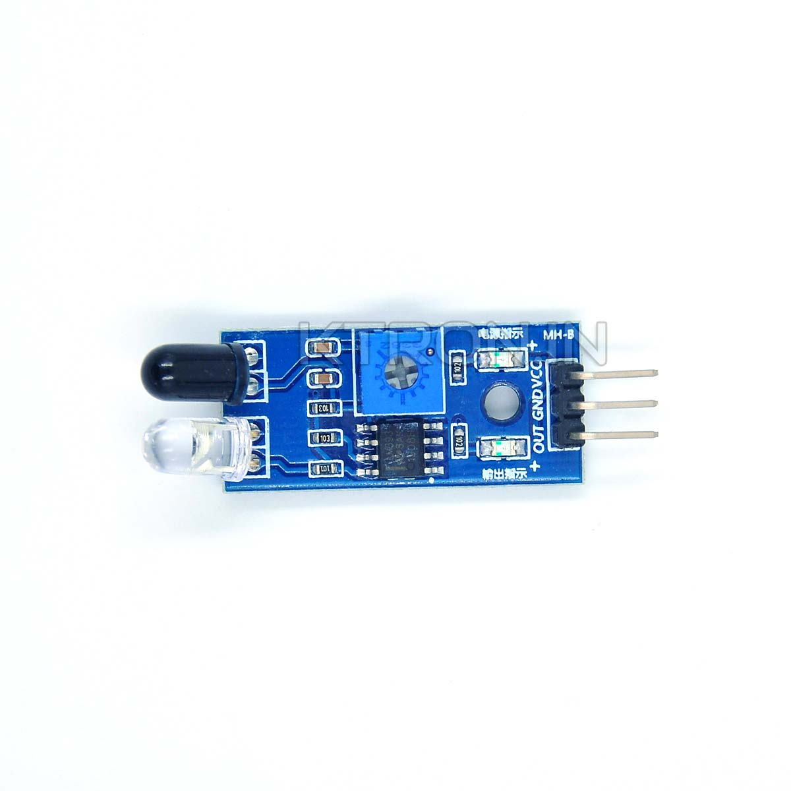

## Day 26：IIO (Part 4) - 幫感應器寫驅動程式！以 TCRC5000 為例


這篇將會綜合前面的 GPIO 與 IIO 的知識，幫一個常見的紅外線感測器 -- TCRC5000 實作 Linux 上的 IIO 驅動程式。

## 簡介：TCRC5000

這是一個紅外線感應模組。以紅外線作為距離感應，當距離小於閾值時，輸出高電位; 反之則輸出低電位。而這個閾值大小可以透過調整其上的可變電阻更動。更多敘述可以參考 [OSOYOO](https://www.amazon.co.uk/OSOYOO-Infrared-Obstacle-Avoidance-Arduino/dp/B01I57HIJ0) 公司底下的 *Product description* 一節。



### 硬體配置

`VCC` 接 Raspberry Pi 的 5V，`GND` 接 Raspberry Pi 的任意 `GND`; `OUT` 接 `GPIO17`。如圖所示：


### 裝置樹

這個 *Device Tree Overlay* 的部分跟前幾天 GPIO 的部分幾乎一樣，除了把名稱更換掉，以及 GPIO 由輸入改為輸出以外：

```c
/dts-v1/;
/plugin/;
/ {
    compatible="brcm,brcm2835";
    fragment@0 {
        target = <&gpio>;
        __overlay__ {
            tcrc5000: tcrc5000_gpio_pins {
                brcm,pins = <0x11>;
                brcm,function = <0x0>;
                brcm,pull = <0x1>;
            };
        };
    };
    fragment@1 {
        target-path = "/";
        __overlay__ {
            tcrc5000 {
                tcrc5000-gpios = <&gpio 0x11 0x0>;
                compatible = "tcrc5000";
                status = "ok";
                pinctrl-0 = <&tcrc5000>;
                pinctrl-names = "default";
            };
        };
    };
};
```

## Step 1：資料結構

為了方便，把這個資料結構中需要的硬體資源相關的資料結構，包成一個結構體：

```c
struct tcrc5000 {
    struct gpio_desc *gpiod;
    struct mutex mutex;
    struct device *dev;
};
```

這邊的 `gpiod` 就是讀取時對應的 GPIO 所對應的 *GPIO Descriptor*。除此之外，還配置一個 `mutex` 來保護。避免 IIO 的 `sysfs` 介面有不同的執行單元同時讀取。

## Step 2：申請 iio_dev 與 GPIO

首先在 `probe` 中，先幫各種資料結構配置空間。為了方便資源管理，這邊使用 `devm_*` 系列的函數 (因為所這個模組中的資源都是以 `devm_*` 函數配置的，所以就沒有實作 `remove`)。在 `devm_gpiod_get_index` 當中 ，`tcrc5000` 的參數是搭配裝置樹使用的。因為前面處理裝置樹時，這個感測器所使用的 GPIO 編號，是放在這個感測器對應的裝置節點的 `tcrc5000-gpios` 屬性中，所以就可以直接用 `*gpiod_get_index` 函數找出「前綴 (也就是 `tcrc5000`) 對應的第 0 個 GPIO」：

```c
static int tcrc5000_probe(struct platform_device *pdev)
{
    ...
    iio = devm_iio_device_alloc(dev, sizeof(struct tcrc5000));
    tcrc5000 = iio_priv(iio);
    tcrc5000->dev = dev;
    tcrc5000->gpiod = devm_gpiod_get_index(dev, "tcrc5000", 0, GPIOD_IN);
    mutex_init(&tcrc5000->mutex);
    ...
}
```

## Step 3：給定 iio_chan_spec

因為感應器現在只有一道輸出 (就是那個 `OUT`)。所以在 `iio_chan_spec` 中就只給宣告一道輸出。又因為這是屬於接近相關的感測器，所以種類為 `IIO_PROXIMITY`：

```c
#define IIO_CHANNEL_DEFINE(num)    {\
        .type = IIO_PROXIMITY,\
        .indexed = 1,\
        .channel = (num),\
	    .info_mask_separate = BIT(IIO_CHAN_INFO_PROCESSED),\
    }\

static const struct iio_chan_spec tcrc5000_channels[] = {
    IIO_CHANNEL_DEFINE(0)
};
```

## Step 4：讀取資料

這邊就是實作 `iio_info` 中的 `read_raw` 函數。現在的數值是從 Raspberry Pi 上的其中一個 GPIO 讀取，那麼就把那個 GPIO 的輸入用 `gpiod_get_value` 讀取，接著存到 `*val0` 當中 (也就是最終會在 `sysfs` 檔案中出現的值)。最後用回傳值 `IIO_VAL_INT` 提醒現在回傳的東西是一個整數：

```c
static int tcrc5000_read_raw (struct iio_dev *iio, struct iio_chan_spec const *chan,
		int *val0, int *val1, long mask)
{
    struct tcrc5000 *tcrc5000;
    struct gpio_desc *gpiod;
    
    tcrc5000 = iio_priv(iio);
    gpiod = tcrc5000 -> gpiod;
    mutex_lock(&tcrc5000->mutex);
    (*val0) = gpiod_get_value(gpiod);
    mutex_unlock(&tcrc5000->mutex);
    return IIO_VAL_INT;
}
```

## Step 5：填寫 iio_info 與 iio_dev

實作完之後，填寫對應的 `iio_info`：

```c
struct iio_info tcrc5000_info = {
    .read_raw = tcrc5000_read_raw,
};
```

並且回到 `probe` 當中，把剩下的初始化做完：

```c
static int tcrc5000_probe(struct platform_device *pdev)
{
    ...
    ...
    iio -> name = pdev->name;
    iio -> info = &tcrc5000_info;
    iio -> modes = INDIO_DIRECT_MODE;
    iio -> channels = tcrc5000_channels;
    iio -> num_channels = ARRAY_SIZE(tcrc5000_channels);

    return devm_iio_device_register(dev, iio);
}
```

## 安裝並執行

裝置樹疊加的步驟，以及 Makefile 都與之前相同，僅有檔案名稱不同而已，這邊就不再重複內容。安裝上模組之後，可以在 `/sys/bus/iio/devices/` 底下找到對應的裝置節點。以這邊為例，是 `iio:device1`：

```shell
$ cd /sys/bus/iio/devices/iio\:device1
$ ls
dev  in_proximity0_input  name  power  subsystem  uevent
```

在距離不同的狀況下，`in_proximity0_input` 的檔案內容會有所不同。如果距離低於閾值，那麼結果將會是 0：

```shell
$ cat in_proximity0_input
0
```

反之，結果會是 1：

```shell
$ cat in_proximity0_input
1
```

如果執行以下的 `python` 程式：

```python
import os
from time import sleep
iio_oneshot_path = "/sys/bus/iio/devices/iio:device1/in_proximity0_input"
while 1:
    fd = open(iio_oneshot_path, "r")
    res = fd.read()
    print(res.strip())
    sleep(0.025)
    fd.close()
```

就可以觀察到「讀值隨距離產生變化」的結果。實驗的影片在 [這個連結中](https://imgur.com/a/mYPsqwH)。

## 完整程式

```c
#include <linux/kernel.h>
#include <linux/init.h>
#include <linux/module.h>
#include <linux/platform_device.h>
#include <linux/gpio/consumer.h>
#include <linux/iio/consumer.h>
#include <linux/iio/iio.h>
#include <linux/of.h>
#include <linux/gpio/consumer.h>
#include <linux/mutex.h>

struct tcrc5000 {
    struct gpio_desc *gpiod;
    struct mutex mutex;
    struct device *dev;
};

#define IIO_CHANNEL_DEFINE(num)    {\
        .type = IIO_PROXIMITY,\
        .indexed = 1,\
        .channel = (num),\
	    .info_mask_separate = BIT(IIO_CHAN_INFO_PROCESSED),\
    }\


static const struct iio_chan_spec tcrc5000_channels[] = {
    IIO_CHANNEL_DEFINE(0)
};

static int tcrc5000_read_raw (struct iio_dev *iio, struct iio_chan_spec const *chan,
		int *val0, int *val1, long mask)
{
    struct tcrc5000 *tcrc5000;
    struct gpio_desc *gpiod;
    
    tcrc5000 = iio_priv(iio);
    gpiod = tcrc5000 -> gpiod;
    mutex_lock(&tcrc5000->mutex);
    (*val0) = gpiod_get_value(gpiod);
    mutex_unlock(&tcrc5000->mutex);
    return IIO_VAL_INT;
}

struct iio_info tcrc5000_info = {
    .read_raw = tcrc5000_read_raw,
};

static int tcrc5000_probe(struct platform_device *pdev)
{
    struct device *dev = &(pdev-> dev);
    struct iio_dev *iio;
    struct tcrc5000 *tcrc5000;

    iio = devm_iio_device_alloc(dev, sizeof(struct tcrc5000));
    if (!iio) {
        dev_err(dev, "Failed to allocate IIO/.\n");
	    return -ENOMEM;
    }

    tcrc5000 = iio_priv(iio);
    tcrc5000->dev = dev;
    tcrc5000->gpiod = devm_gpiod_get_index(dev, "tcrc5000", 0, GPIOD_IN);
    if (IS_ERR(tcrc5000->gpiod)) {
        dev_err(dev, "Failed to get gpio descriptor.\n");
        return PTR_ERR(tcrc5000 -> gpiod);
    }
    mutex_init(&tcrc5000->mutex);

    iio -> name = pdev->name;
    iio -> info = &tcrc5000_info;
    iio -> modes = INDIO_DIRECT_MODE;
    iio -> channels = tcrc5000_channels;
    iio -> num_channels = ARRAY_SIZE(tcrc5000_channels);

    return devm_iio_device_register(dev, iio);
}

static const struct of_device_id tcrc5000_ids[] = {
    {.compatible = "tcrc5000",},
    {}
};

static struct platform_driver tcrc5000_driver = {
    .driver = {
        .name = "tcrc5000",
	    .of_match_table = tcrc5000_ids,
    },
    .probe = tcrc5000_probe
};
MODULE_LICENSE("GPL");
module_platform_driver(tcrc5000_driver);
```

## 附註：安裝模組時出現 Unknown symbol

在嘗試 IIO 的其他功能的時候，有時候安裝模組時會出現類似下面，`Unknown symbol ... (err -2)` 的訊息：

```python
[ 3508.195974] tcrc5000: Unknown symbol devm_iio_triggered_buffer_setup (err -2)
```

除了可能是 *License* 不相容之外，另外一個可能的原因是：在編譯核心的時候，一部分的功能在配置時被設為以「模組」形式編譯 (也就是 `m` 選項)，而不是直接編在核心中 (`y` 選項)。比如說如果去查詢核心的配置：

```python
CONFIG_IIO=m
CONFIG_IIO_BUFFER=y
CONFIG_IIO_BUFFER_CB=m
# CONFIG_IIO_BUFFER_HW_CONSUMER is not set
CONFIG_IIO_KFIFO_BUF=m
CONFIG_IIO_TRIGGERED_BUFFER=m
# CONFIG_IIO_CONFIGFS is not set
CONFIG_IIO_TRIGGER=y
CONFIG_IIO_CONSUMERS_PER_TRIGGER=2
# CONFIG_IIO_SW_DEVICE is not set
# CONFIG_IIO_SW_TRIGGER is not set
```

就會發現這當中，`CONFIG_IIO_TRIGGERED_BUFFER` 被設為 `m`。這時如果把對應的模組安裝回去：

```shell
$ sudo modprobe industrialio-triggered-buffer
```

就可以順利載入模組了。