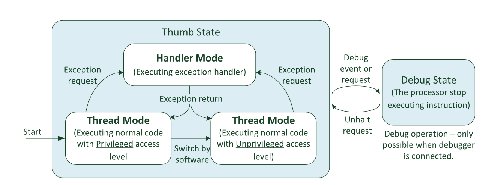
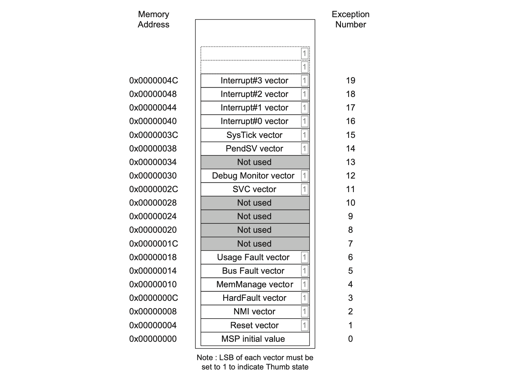

## Day 27：IRQ (Part 1) - 斷開魂結！

## 簡介

中斷這個機制因為 *busy waiting* 的等待很浪費處理器的資源，所以會希望有一個機制可以做到類似「到貨通知」的效果。

### 大原則：有人插隊 = 有人要等更久

因為 *interrupt* 是一件「停下目前執行流程，轉而處理其他事情」的執行過程，這表示 **原先的工作會被延後**，但是又不得不給 *interrupt* 「插隊」。無論如何要記住：**當得到一段「可以插隊」的時間時，這是以其他執行單元的延遲換取的**，所以最好這個插隊的時間不要拖太久。才不會拖到其他事情。因此，概念上來說，會把一個中斷要執行的任務，分成兩個部分：

1. 那些希望利用「插隊時間」處理的部分，也稱為「上半部」(*top-half*)
2. 不用現在立刻處理的部分，也就是「下半部」(*bottom-half*)。

### 上半部：盡量不拖延

上半部是插隊換來的時間，而且因為無法預期 *interrupt* 什麼時候會發生，所以這種「插隊」可以說是突發狀況。為了避免突發狀況讓本來預定的工作延遲太久，所以應變要能快就快。

這時候會做的事通常是釐清有什麼事情要處理，然後把工作交給適當的執行單元執行。比如交給 *Workqueue*、*tasklet* 等等可以更有效率安排與執行工作的機制來代為執行。這類「可以把工作推給他們」的機制，通稱 *work deferring mechanism*，*Workqueue*、*tasklet*、*softirq* 等等都可以幫忙執行。雖然是稍微久遠的資料，但[這裡面](https://linux-kernel-labs.github.io/refs/heads/master/labs/deferred_work.html)有簡單介紹各種這樣的機制。

而那些「交給這些延遲執行的機制」部分的工作，就稱為「下半部」。

### 下半部：剩下的就是下半部的事了

這就是指 *interrupt* 發生之後，那些「請其他執行單元代為執行」的工作。這些機制有的也是另外一種 *interrupt*; 有的則是另外一個行程。這兩種不同的執行狀態

## 兩種 Context：Interrupt 與 Process

### Interrupt：實實在在的 ISR

中斷發生時會跳到某些預先定義好的函式的進入點。這些函式稱作 *interrupt service routine*。他們存在特定的中斷向量表之中，一旦被觸發，處理器就要模式切換過去~~服侍~~處理它。以 Cortex-M 為例，這些 *interrupt service routines* 的進入點，就是下面對應的中斷向量。**執行中斷的意思，就是跳轉到那些中斷向量中執行**：

### Process：人為的抽象結構

相較於 *interrupt* 這種在硬體中有特殊地位的執行方式，***process\* 的概念是人為定義的**，本質是作業系統設計者定義的，「**一個可以描述工作進度的資料結構**」。比如說：你覺得一個工作的進度，可以用 9 個暫存器加上 *program counter* 與 *link register* 描述，那這就可以拿來當一個抽象化的行程。

像是在 (空一格) [這個例子](https://github.com/jserv/mini-arm-os/blob/master/02-ContextSwitch-1/context_switch.S) 中，一個行程只是一組 `{r4, r5, r6, r7, r8, r9, r10, r11, ip, lr}` 暫存器形成的有序對。對於多個這樣的有序對所代表的任務，你可以：

1. 把現在這一組有序對的數值[存到記憶體](https://github.com/jserv/mini-arm-os/blob/master/02-ContextSwitch-1/context_switch.S#L8)中。
2. 接著[載入](https://github.com/jserv/mini-arm-os/blob/master/02-ContextSwitch-1/context_switch.S#L16)另外一組這樣的有序對到處理器中。
3. 讓處理器開始執行這新的一組有序對所代表的工作進度。

*Boom!* 你完成 *context switch* 了！**處理器輪流在多個代表任務的資料結構進行替換，就製造了「多個行程在執行」的~~假象~~抽象化**。

而用來描述工作進度與執行狀態的資料結構，不僅限於是一組暫存器形成的有序對，也可以是一個複雜的資料結構。像是 Linux 中的 [`struct task_struct`](https://elixir.bootlin.com/linux/latest/source/include/linux/sched.h#L631)。行程就是很多這種而形成的~~假象~~抽象化。

但最終，這些「行程」是人為設計出來的東西，就是一組用以描述與恢復工作進度的 *metadata* 。不管這組 *metadata* 的形式是特定幾個暫存器的數值，或是其他特別的資料結構，處理器把這些特定形式的 *metadata* 輪流拿起來看一看，把他們上面描述的工作進度做一點點，然後丟到旁邊換下一個。**輪流在這個抽象的工作進度之間不斷切換執行，就是人所看到的「行程正在往下執行」**。

### 兩種 Context

從上面的例子可以知道：***process\* 的執行，是處理器在不同代表「任務進度」的資料結構間，不斷切換執行，形成的~~假象~~抽象化; 而 \*interrupt\* 的執行則無關乎這樣的抽象化存不存在**。這就造就了兩種不同的 *context*：前者執行時仰賴行程這個抽象化的設計，但後者不用。

> 有時候會有以 `current` 巨集作為兩者的指標。比如說文件中 [*Unreliable Guide To Hacking The Linux Kernel*](https://www.kernel.org/doc/html/v4.14/kernel-hacking/hacking.html#user-context) 的章節就有提到。

### 補充：Threaded IRQ

雖然說看起來 *interrupt* 的工作就是在 *interrupt context* 執行; 而行程就是在 *process context* 執行。但 Linux 也有把 *interrput* 移往 *process context* 處理的機制，稱作 *threaded IRQ*。這是為了 PREEMPT_RT 設計的機制：這樣中斷的執行就可以像行程一樣被搶佔與排程。

> 按：雖然說就算沒有 *threaded IRQ*，有的處理器 (比如說 Cortex-M 的 NVIC 有優先權高低的機制) 也可以使中斷被其他中斷搶佔。但我想不到把所有內容編排在一起的合適寫法。

### 術語：Atomic Context

「執行時沒有人可以打斷他」的執行狀態，稱作 *atomic context*。與之對立的就是 *non-atomic context*，比如說像行程，他可以被排程，或是「執行尚未結束時，有人可以把他送去等待或睡眠」，這種中斷的狀況，就不是 *atomic context*。這時候如果去休眠，沒有機制可以改變他的執行狀態，所以這會決定這個裡面能做什麼事 (比如說：能不能持有會導致休眠的鎖)。可以參考 [LWN](https://lwn.net/Articles/274695/) 的文章。

聽起來有點像 *interrupt context*，但其實要考慮這個核心有沒有 *threaded IRQ* 的機制。所以就把他放在最後面才提出來。