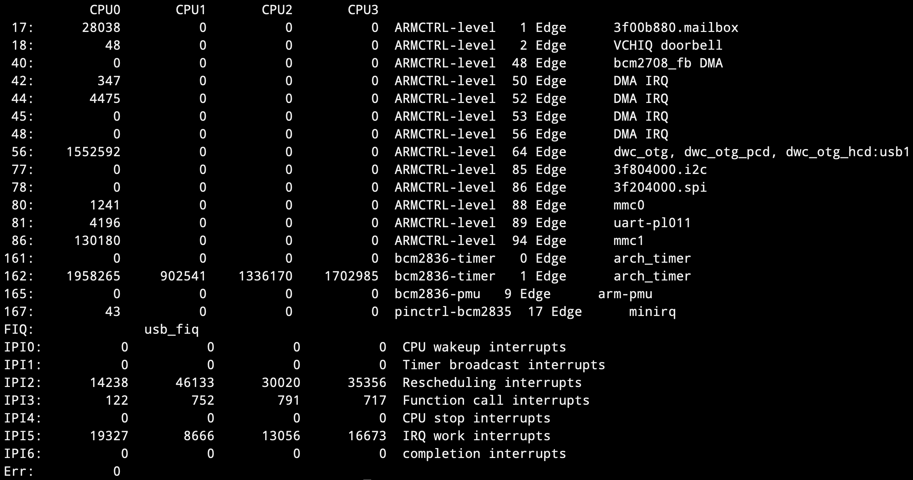
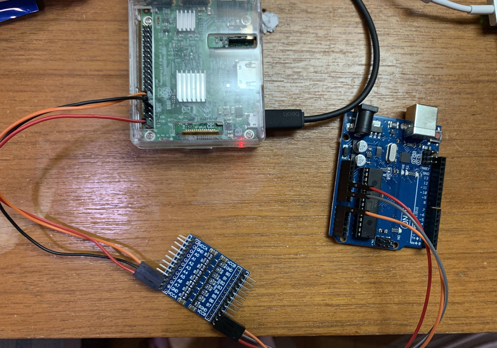

## Day 28：IRQ (Part 2) - 中斷突進！簡單的 IRQ 程式


接下來的實驗中，會寫一個把 GPIO 當作是中斷的來源的程式。這個 GPIO 由 Arduino 發出，每當邊緣上升時，忌諱觸發一次 IRQ。

這個應用比如說 DHT11 在核心的驅動程式，就是用這種機制來實作從 DHT11 收到的訊號：每次發生 *edge-triggered* 時，都把資料紀錄推進 *buffer* 最後方，最後再解析整個 *buffer* 的內容，去判斷讀取的數值是多少。

## /proc/interupts: 目前的 IRQ

在這之前，可能會想先知道一下關於目前的 IRQ 相關的資訊與統計資料。這可以透過察看 `/proc/interrupts` 這個內容得知：

```shell
$ cat /proc/interrupts
```

會出現類似以下的輸出：



這個檔案中會顯示每個 CPU 處理中斷的次數。接下來會比較載入模組前後不同的地方。為了方便，等一下在比較的時候，會省略掉中間 CPU 的執行次數，只留下第一欄的 IRQ 編號，以及最後 4 攔的說明。

## 硬體配置

Raspberry Pi 的 `GPIO17` 透過 *Logic Level Shifter* 連接給 Arduino 的 `A0`，並且在 *Logic Level Shifter* 的兩端都加上適當的供電。如下圖：



## 程式：Raspberry Pi

在程式能執行之前，當然少不了裝置樹的準備。不過這個跟前面大同小異，所以就把內容放在附錄。

### Step 1：資料結構

這邊資料結構的設計，就是把 `irq` 編號跟對應的 *gpio descriptor* 形成一個結構體：

```c
struct minirq_dev {
    struct gpio_desc *gpiod;
    struct work_struct work;
    int irq;
};
```

### Step 2：資源配置

就是在 `probe` 當中，把對應的資源，比如說記憶體空間與 GPIO 等等進行初始化：

```c
static int minirq_probe(struct platform_device *pdev)
{
    struct device *dev = &(pdev-> dev);
    struct minirq_dev *minirq;
    int ret = 0;
    minirq = devm_kzalloc(dev, sizeof(struct minirq_dev), GFP_KERNEL);
    minirq->gpiod = devm_gpiod_get_index(dev, "minirq", 0, GPIOD_IN);
    ...
}
```

為了清楚，錯誤處理的程式沒有列出來。詳細的程式會於最後面附上。

### Step 3：找到 GPIO 對應的 IRQ

參考 GPIO 文件的 [*GPIOs mapped to IRQs*](https://www.kernel.org/doc/html/latest/driver-api/gpio/consumer.html#gpios-mapped-to-irqs)：

```c
static int minirq_probe(struct platform_device *pdev)
{
    ...
    minirq->irq = gpiod_to_irq(minirq->gpiod);
    ...
}
```

這邊有個前提是：GPIO 的 *controller* 要可以作為中斷的來源，才可以這樣做。關於這點可以去看裝置樹：

```shell
$ dtc -I fs /proc/device-tree | less
```

就會在 GPIO 的部分，發現 *interrupts* 相關的屬性：

```python
gpio@7e200000 {
        compatible = "brcm,bcm2835-gpio";
        gpio-controller;
        #interrupt-cells = < 0x02 >;
        interrupts = < 0x02 0x11 0x02 0x12 >;
        phandle = < 0x10 >;
        reg = < 0x7e200000 0xb4 >;
        #gpio-cells = < 0x02 >;
        pinctrl-names = "default";
        interrupt-controller;
    ...
};
```

### Step 4：實作上半部

上半部要實作一個 *prototype* 為：

```c
irqreturn_t (*irq_handler_t)(int, void *);
```

的函數。其中，第一個參數是剛剛得到的 `irq` 編號，而第二個參數是一個「能用以辨認裝置的唯一結構」。不過通常都是把類似 `struct platform_device`，或是 `struct device` 這類的資料結構傳進去：

```c
static irqreturn_t irq_top_half(int irq, void *p)
{
    struct platform_device *pdev = p;
    struct minirq_dev *minirq;

    minirq = platform_get_drvdata(pdev);
    schedule_work(&(minirq -> work));
    return IRQ_HANDLED;
}
```

在這個 *top-half* 中，做的事情就是把一個工作用 `schedule_work` 推給一個核心全域的 *Workqueue* 做，然後就結束。而這個回傳的值必須是個 `irqreturn_t`，相關的定義可以在[這裡](https://elixir.bootlin.com/linux/latest/source/include/linux/irqreturn.h#L11)找到：

```c
enum irqreturn {
	IRQ_NONE		= (0 << 0),
	IRQ_HANDLED		= (1 << 0),
	IRQ_WAKE_THREAD		= (1 << 1),
};
typedef enum irqreturn irqreturn_t;
```

其中，如果這個 IRQ 是現在這個執行單元需要負責處理的，那麼處理完之後就回傳 `IRQ_HANDLED`。而那個 `IRQ_NONE` 會出現的原因是：不同的執行單元有可能會同時幫一個 IRQ 註冊各自的 *IRQ handler*。這時如果有 IRQ，那麼這所有的 *handler* 就會同時被觸發。

如果這種共享的狀況可能發生，那麼在 *handler* 裡面就要判斷被觸發時，是不是當下的執行單元需要去理會的？如果發現不是，就什麼都不做，直接回傳 `IRQ_NONE` 就好; 反之，如果是的話，就去把它處理掉，最後再回傳 `IRQ_HANDLED`。

而如同昨天描述的，上半部是 *interrupt context*，所以不能在裡面休眠。而且處理要快，所以這邊就把工作交給 *Workqueue* 去處理，然後就速速離開。這個下半部也可以比如說是 *tasklet* 或 *kthread*，或是整個用 *threaded IRQ* 來處理。但總之這邊使用 *Workqueue*。

### Step 5：實作下半部

至於要把什麼樣的工作推給 *Workqueue* 呢？這邊的 `struct work_struct` 是嵌入在剛剛的 `minirq` 中的那個成員。我們就把他在 `probe` 裡面時初始化成下面這個東西：

```c
static int minirq_probe(struct platform_device *pdev)
{
    ...
    INIT_WORK(&minirq->work, irq_bottom_half);
    ...
}
```

其中，`irq_bottom_half` 是一個下面這樣的函數：

```c
void irq_bottom_half(struct work_struct *work)
{
    pr_info("Rising edge detected!\n");
    return;
}
```

沒錯，他就是簡單印出一個資料，讓我們知道 IRQ 被觸發了：

### Step 6：註冊 IRQ

上半部跟下半部都處理好之後，接著就在 `probe` 當中幫這個 IRQ 「註冊」這個 *IRQ handler*：

```c
static int minirq_probe(struct platform_device *pdev)
{
    ...
    ret = devm_request_irq(dev, minirq->irq, irq_top_half, 
            IRQF_TRIGGER_RISING, "minirq", pdev);
    ...
}
```

首先，這個函式有幾種變形。最一開始的是 [`request_irq()`](https://www.kernel.org/doc/html/latest/core-api/genericirq.html#c.request_irq)：

```c
int request_irq(unsigned int irq, irq_handler_t handler, 
        unsigned long flags, const char * name, void * dev)
```

其中，`irq` 是 IRQ 編號; `handler` 就是前面所說的，上半部的函式：

```c
irqreturn_t (*irq_handler_t)(int irq, void *p);
```

而 `flag` 則是這個 IRQ 的細部調整，比如說是上升觸發還是下降觸發？有沒有跟其他裝置共享？是不是 *timer* 觸發的？等等。詳細的敘述可以在[*include/linux/interrupt.h*](https://elixir.bootlin.com/linux/latest/source/include/linux/interrupt.h#L29) 中找到。最後，那個 `dev` 會在參數中的 `handler` 被呼叫時，作為他的二個參數傳給 `handler`。

而如果使用 `request_irq`，那麼事後就要有對應的 [`free_irq`](https://www.kernel.org/doc/html/latest/core-api/kernel-api.html#c.free_irq)。而類似地，雖然文件中沒有寫到，但這個函數有 `devm_*` 版本的函式，會自動跟裝置有關的資源 (也就是這裡使用的)，因此就不用擔心清理的問題。

最後一個版本是 *threaded IRQ*，雖然說用法很類似 (事實上是更方便)，但本質上跟現在這個 IRQ 不同。這個之後會另外介紹。

### Step 7：其他工作

大致上就是裝置樹的配置、提供 `of_device_id`、模組的初始化、提供 `platform_driver` 的資料結構等等。為版面簡潔，這邊就不多贅述。完整程式碼附於後方。

## 程式：Arduino

每 0.5 秒改變一次電位高低：

```c
void setup() {
    pinMode(A0, OUTPUT);
    Serial.begin(9600);
}

void loop() {
    digitalWrite(A0, HIGH);
    delay(500);
    digitalWrite(A0, LOW);
    delay(500);
}
```

換句話說，每 1 秒會有一個上升的邊緣。

## 結果

載入模組之後，再去用 `/proc/interrupts` 觀察，既可以發現 `pinctrl-brcm2835` 後面出現了一個 `minirq` 的裝置：

```diff
 161:  bcm2836-timer    0 Edge     arch_timer
 162:  bcm2836-timer    1 Edge     arch_timer
 165:  bcm2836-pmu      9 Edge     arm-pmu
-167:  pinctrl-bcm2835 17 Edge   
+167:  pinctrl-bcm2835 17 Edge     minirq
 FIQ:  usb_fiq
 IPI0: CPU wakeup interrupts
 IPI1: Timer broadcast interrupts
```

除此之外，用 `dmesg` 也可以看見每秒一次印出的訊息：

```python
[ 4222.224497] Rising edge detected!
[ 4223.225439] Rising edge detected!
[ 4224.226387] Rising edge detected!
[ 4225.227340] Rising edge detected!
[ 4226.228285] Rising edge detected!
[ 4227.229231] Rising edge detected!
[ 4228.230173] Rising edge detected!
[ 4229.231120] Rising edge detected!
[ 4230.232070] Rising edge detected!
[ 4231.233014] Rising edge detected!
[ 4232.233958] Rising edge detected!
```

## 附錄：完整程式

### 裝置樹：minirq.dts

裝置樹的部分跟 IIO 時類似，只是名稱有所不同：

```python
/dts-v1/;
/plugin/;
/ {
    compatible="brcm,brcm2835";
    fragment@0 {
        target = <&gpio>;
        __overlay__ {
            minirq: minirq_gpio_pins {
                brcm,pins = <0x11>;
                brcm,function = <0x0>;
                brcm,pull = <0x1>;
            };
        };
    };
    fragment@1 {
        target-path = "/";
        __overlay__ {
            minirq {
                minirq-gpios = <&gpio 0x11 0x0>;
                compatible = "minirq";
                status = "ok";
                pinctrl-0 = <&minirq>;
                pinctrl-names = "default";
            };
        };
    };
};
```

### Raspberry Pi：minirq.c

```c
#include <linux/kernel.h>
#include <linux/init.h>
#include <linux/module.h>
#include <linux/platform_device.h>
#include <linux/gpio/consumer.h>
#include <linux/of.h>
#include <linux/gpio/consumer.h>
#include <linux/interrupt.h>
#include <linux/workqueue.h>

struct minirq_dev {
    struct gpio_desc *gpiod;
    struct work_struct work;
    int irq;
};

void irq_bottom_half(struct work_struct *work)
{
    pr_info("Rising edge detected!\n");
    return;
}

static irqreturn_t irq_top_half(int irq, void *p)
{
    struct platform_device *pdev = p;
    struct minirq_dev *minirq;

    minirq = platform_get_drvdata(pdev);
    schedule_work(&(minirq -> work));
    return IRQ_HANDLED;
}

static int minirq_probe(struct platform_device *pdev)
{
    struct device *dev = &(pdev-> dev);
    struct minirq_dev *minirq;
    int ret = 0;

    minirq = devm_kzalloc(dev, sizeof(struct minirq_dev), GFP_KERNEL);
    if (!minirq) {
        dev_err(dev, "Failed to allocate memory.\n");
	    return -ENOMEM;
    }

    minirq->gpiod = devm_gpiod_get_index(dev, "minirq", 0, GPIOD_IN);
    if (IS_ERR(minirq->gpiod)) {
        dev_err(dev, "Failed to get gpio descriptor.\n");
        return PTR_ERR(minirq -> gpiod);
    }
    
    ret = gpiod_to_irq(minirq->gpiod);
    if (ret < 0) {
        dev_err(dev, "Failed to get irq from gpiod.\n");
        return ret;
    }
    minirq->irq = ret;

    INIT_WORK(&minirq->work, irq_bottom_half);

    ret = devm_request_irq(dev, minirq->irq, irq_top_half, 
            IRQF_TRIGGER_RISING, "minirq", pdev);

    if (ret < 0) {
        dev_err(dev, "Failed to request IRQ.\n");
        return ret;
    }

    platform_set_drvdata(pdev, minirq);
    return 0;
}

static const struct of_device_id minirq_ids[] = {
    {.compatible = "minirq",},
    {}
};

static struct platform_driver minirq_driver = {
    .driver = {
        .name = "minirq",
	    .of_match_table = minirq_ids,
    },
    .probe = minirq_probe
};
MODULE_LICENSE("GPL");
module_platform_driver(minirq_driver);
```

### Makefile

```makefile
PWD := $(shell pwd)
KVERSION := $(shell uname -r)
KERNEL_DIR := /lib/modules/$(shell uname -r)/build

MODULE_NAME = minirq
obj-m := $(MODULE_NAME).o

all:
	make -C $(KERNEL_DIR) M=$(PWD) modules
clean:
	make -C $(KERNEL_DIR) M=$(PWD) clean
	rm -f $(MODULE_NAME).dtbo
dts:
	dtc -@ -I dts -O dtb -o	$(MODULE_NAME).dtbo $(MODULE_NAME).dts
```

順帶一提，可以直接：

```c=
$ make dts
```

來編譯 `.dtbo`。