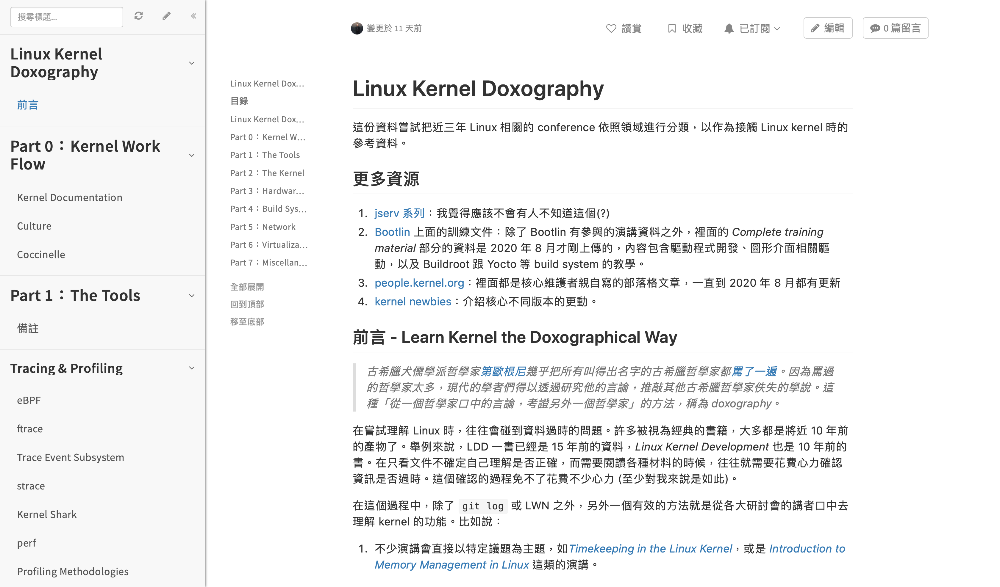

## Day 30：賽後感言

這其實是有點長的故事，但我覺得這種緣分有點有趣，所以就決定在最後一天整理一下。

## 從開賽前幾天說起

在比賽開前的一陣子，無意間把 Linux Foundation 舉辦的研討會依照主題，整理了一份 [資料](https://hackmd.io/@0xff07/doxolinux)。剛好在一個念德文的學姊揪的 Python 讀書會中，認識了同校電機系的學長 [shnovaj30101](https://ithelp.ithome.com.tw/users/20107274/articles) 學長，也知道了有這樣一個比賽。所以就決定拿這個剛整理好的素材庫去設計實驗寫看看吧！

## 核心維護者的斷簡殘篇？

「斷簡殘篇」是 [*doxography*](https://plato.stanford.edu/entries/doxography-ancient/) 的中文翻譯 (可能不是很好的翻譯)，這個術語是研究「蘇格拉底以前的古希臘哲學」的學者常用的詞。現代學者在研究蘇格拉底以前的哲學家時，往往會碰到著作佚失的問題。因此他們的研究方法，就是看其他同期人物口中是怎麼說這位哲學家的。比如說，如果有發現當時有人嗆哲學家 A 的紀錄：

**「你這傢伙腦袋壞去！居然覺得你我萬物都是水構成的！」**

這句話在研究「先蘇哲學」的現代學者眼裡，就會變成：

**「原來哲學家 A 曾經主張萬物本質是水！」**

這類的資料就稱作 *doxography*，中文通常會稱呼上面這種資料為「先蘇哲學家的斷簡殘篇」。有一天我就突然覺得：這跟之前學 Linux 的狀況好像滿像的！專門的書籍幾乎都是 10 年以上的書，不知為何 2010 年之後，幾乎沒有像 *LDD* 或 *Linux Kernel Development* 這種專書。而且這幾本書看了也不知道哪邊是過時的，往往要另外花心力去考證。核心文件有時候又寫得很簡略，也得擔心自己理解有沒有正確。

剛好之前在機械系上課時，有整理資料並且用 Hackmd 的 Book Mode 整理成冊的習慣。不管是像 [機械製造](https://hackmd.io/@0xff07/H1Wlgto2U)、[數位控制導論](https://hackmd.io/@0xff07/SkIKS6n5E)、[系統動態學](https://hackmd.io/@0xff07/rJccAcuhf) 這種比較專業的科目，還是 [西洋哲學史](https://hackmd.io/@0xff07/HJiF98u5H)、[國際關係](https://hackmd.io/@0xff07/ir2) 這種比較文組的科目，或是像[代數導論](https://hackmd.io/@0xff07/BJWaeWArL)、[分析(高等微積分)](https://hackmd.io/@0xff07/SkIJ5tU9B) 這種數學課。既然這樣，不如發揮一下之前整理筆記的精神，整理一下過去幾年 Linux Foundation 的演講。看看能不能像研究先蘇哲學的學者們那樣有所啟發。整理完之後看起來就像[這樣](https://hackmd.io/@0xff07/doxolinux)：

整理完的時候~~發現自己真是嗨到不行~~突然有種「**我剛剛是聽懂台上的人在講什麼了嗎？**」的感覺，所以就很想要真的去弄弄看上面的程式有什麼。剛好之前在一個 Python 的讀書會上，認識了電機系的學長 [shnovaj30101](https://ithelp.ithome.com.tw/users/20107274/articles) 學長，知道了有這樣一個比賽。所以就決定拿這個剛整理好的素材庫去設計實驗寫看看吧！

那要從哪邊開始呢？這時就突然想到機械系的學生常常會用一些很 Maker 的方法來做專題，不過滿多時候就僅止於 Maker 式的工具，不如就來想想這些東西在 Linux 中是什麼樣子好了。而且就有之前專題留下來的現成硬體，非常方便。恰好之前也參與過 (空一格) `jserv` 老師的課程幾次，對於系統程式跟核心的一些背景知識也多少有一些基本概念。不過除了學到電腦科學的知識以外，影響最深的其實是這門課大力提倡的方法論：不確定的東西要查文件或規格、盡量找第一手資料、不要盲目閱讀程式碼、要設計實驗驗證、要盡量留下紀錄等等。總之，現在有了地圖，也有了基本的方法，也有了硬體。看起來是一件有趣的事。

## Never Waste a Good Crisis

雖然說是如此，但一開始還是有一點暈頭轉向。比如覺得裝置樹到底在幹嘛、 `probe` 一直失敗等等。不過這個問題意外地很快解決了。其中一個原因是今年的 [OSS NA](https://www.youtube.com/playlist?list=PLbzoR-pLrL6oyIqGsEZdb1E4pWzWn9qOZ) 因為疫情的關係改成線上，而且多了**超級無敵多**的 *tutorial*， 到 [裝置樹](https://youtu.be/N6IW7JJQASc) 到從 [把 Data Sheet 的資訊反映在裝置樹上](https://youtu.be/HO68sK6E0B8)到 [U-boot](https://youtu.be/INWghYZH3hI) 到 [SPI、I2C](https://youtu.be/c10wAKWpjts) ，根本一條龍式整個包辦一堆硬體相關的入門主題。這麼完整的資源，有的還是第一線的維護者出面，親自講解自己維護的子系統。根本就是第一手資料中的第一手資料啊！

除了這之外，在一些演講中也知道了以前不知道或不熟練的工具：比如說 eBPF 跟 ftrace。這些工具根本就是 Linux 核心的 X 光機，瞬間就可以看到核心內部在幹嘛了！在盯著 Bootlin 的 elixir 點來點去找原始程式碼之前，先用這些工具追蹤一遍，再去找出現過的東西就好，追蹤程式碼的效率大大提升。不趁這個好機會把他們學起來，實在是太可惜了，那就用鐵人賽的機會把他們弄一遍吧！

## 檢討

與其說這是有系統的文章，不如說是學習過程中的實驗記錄，幾乎每一個子系統都是從零開始學習。而且滿常兩三天前才在想「接下來應該可以試試看這個部分」的。所以也常常出現「本來以為行為是 A，結果發生了完全不在預期內的事情」，以致於寫的時候有些趕稿性質，筆誤也隨之而生。而且實作的程式都是一些 *trivial* 的程式，比較不敢大膽的嘗試，畢竟還是會擔心每天截稿前還沒有做出來。除此之外，也只理解了一些跟周邊有關的子系統而已，跟真正的核心恐怕還有點距離。

不過，相較於 30 天以前，在這 30 天之中，用相對好取得的硬體 (Raspberry Pi & Arduino) 開闢了一個可以去實驗與觀測核心功能的遊戲場，方便日後繼續深入學習。也培養了比直接閱讀原始碼還要有效率的理解與實驗方法。這些大概就是這 30 天最大的收穫了！

最後，雖然滿多人會留自己的部落格或粉專，不過我其實比較希望留 hackmd 的[帳號](https://hackmd.io/@0xff07)。