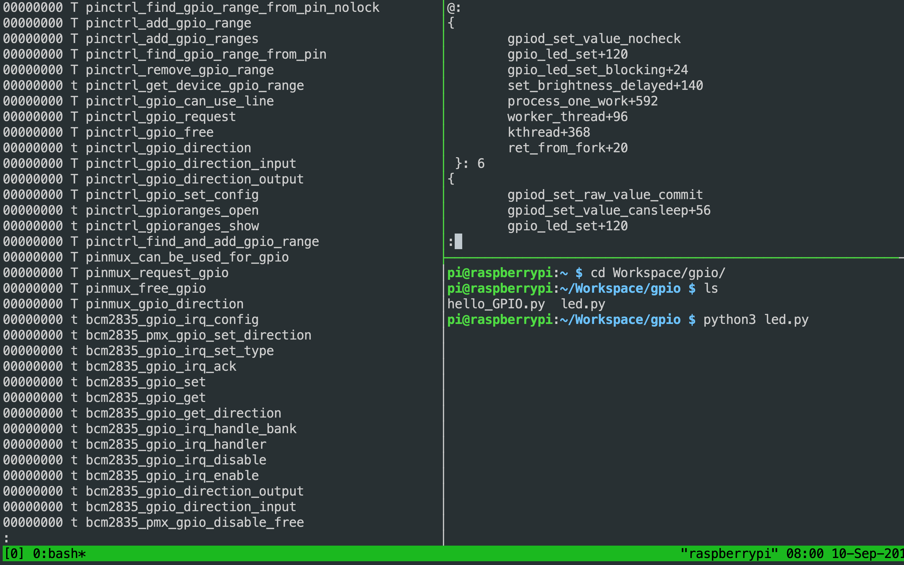

## Day 4：小試身手 -- 是誰住在 Rpi 的 LED 裡？


在正式地介紹 `ply` 的語法之前，先看看一個例子來展示一下如何使用他來追蹤程式碼。以下要追蹤的是關於 Raspberry Pi 3 Model B 板子上的那個綠色 LED，看看背後是核心中的哪些功能在控制他的明滅。

## Step 1：猜測可能有關的子系統

講既然是個 LED，可能會想猜背後是某種 GPIO。接下來的目標就是是試試看追蹤核心中跟 GPIO 有關的函式，然後看看 LED 在開啟跟關閉時，追縱到的東西有沒有不同？就可以推測是否追蹤到正確的東西。

## Step 2：找到有關那個子系統的函數

目前我們知道準備要追蹤的是跟 GPIO 有關的函式，不過這樣還是有點模糊，因為現在根本不知道這些函數長什麼樣子？或是整個子系統的大致架構如何？這時就可以去核心的文件找一些提示。比如說 [General Purpose Input/Output (GPIO)](https://www.kernel.org/doc/html/v4.17/driver-api/gpio/index.html) 這個章節中，就介紹了 GPIO 子系統。不過，這時可以注意到 *Introduction* 下有一段這樣的話：

*...The remainder of this document applies to the new descriptor-based interface. gpio-legacy.txt contains the same information applied to the legacy integer-based interface.*

也就是說，核心中有另外一套遺留的 GPIO 架構。再閱讀一下文件，可以在 [GPIO Descriptor Consumer Interface](https://www.kernel.org/doc/html/v4.17/driver-api/gpio/consumer.html) 一章節中，可以知道新的 GPIO 的架構中，是以 `gpio_desc` 作為描述 GPIO 的資料結構，並且相關的函式的命名，都是 `gpiod_*` 的形式。

有了這個之後，就知道要去找哪些可能跟 GPIO 有關的函式了。而這剛好可以用 `/proc` 中提供資訊去看看。

### Step 2-1：/proc

`/proc` 是一個虛擬的檔案系統，他會把 Linux 的一些核心資料結構揭露出來，讓使用者可以用讀寫檔案的方式讀取這些核心的資料結構的內容。比如說 `ls` 一下看看裡面有什麼檔案：

```bash
$ ls /proc
```

可以發現類似以下的輸出：

```bash
1     183  366  60   8            fb             partitions
10    184  373  600  80           filesystems    sched_debug
100   19   374  605  81           fs             schedstat
1010  2    378  606  82           interrupts     self
1035  20   380  61   83           iomem          slabinfo
1049  23   395  62   883          ioports        softirqs
1050  230  4    63   9            irq            stat
1052  239  409  64   942          kallsyms       swaps
1053  24   444  65   945          keys           sys
108   240  457  66   asound       key-users      sysrq-trigger
11    25   466  661  buddyinfo    kmsg           sysvipc
116   28   477  664  bus          kpagecgroup    thread-self
12    29   483  67   cgroups      kpagecount     timer_list
13    3    484  68   cmdline      kpageflags     tty
133   30   485  69   consoles     latency_stats  uptime
14    306  52   70   cpu          loadavg        version
145   32   53   71   cpuinfo      locks          vmallocinfo
147   33   54   73   crypto       meminfo        vmstat
15    34   55   75   devices      misc           zoneinfo
165   346  57   76   device-tree  modules
178   348  58   77   diskstats    mounts
18    35   59   78   driver       net
181   363  6    79   execdomains  pagetypeinfo
```

可以發現裡面有很的關於作業系統本身的資訊。像 `device-tree`(一種描述周邊硬體的語言)、`cpuinfo` (cpu 供應商提供的資訊)，還有不同 `pid` 的行程對應的相關資訊等等。而這邊有興趣的是 `kallsyms`，裡面有核心的符號表，以及核心模組中提供出來的函數。

### Step 2-2：/proc/kallsyms

`/proc/kallsym` 裡面是核心的符號表。可以從這裡面的內容，搭配核心的原始程式碼，藉由名字搭配核心的原始程式碼及文件，去推測哪個子系統可能用到哪些函數。可以先看看裡面有什麼：

```bash
$ cat /proc/kallsyms
```

會出線一大堆函數的名稱。為了方便，可以善用 `grep` 跟 `less` (或是把 `tmux` 設置成滑鼠可以捲動等等)。比如說：把 `cat` 的「導向」給 `less`，這樣就可以用上下鍵捲動：

```bash
$ cat /proc/kallsyms | less
```

又比如說如果想要找 GPIO 相關的函式，可以試著把 `cat` 的輸出塞給 `grep` 搜尋，接著再塞給`less` 以方便捲動閱讀：

```bash
$ cat /proc/kallsyms | grep gpio | less
```

預計出現類似以下的輸出：

```bash
00000000 T pinctrl_find_gpio_range_from_pin_nolock
00000000 T pinctrl_add_gpio_range
00000000 T pinctrl_add_gpio_ranges
00000000 T pinctrl_find_gpio_range_from_pin
00000000 T pinctrl_remove_gpio_range

[...]

00000000 T pinctrl_find_and_add_gpio_range
00000000 T pinmux_can_be_used_for_gpio
00000000 T pinmux_request_gpio
00000000 T pinmux_free_gpio
00000000 T pinmux_gpio_direction
00000000 t bcm2835_gpio_irq_config
00000000 t bcm2835_pmx_gpio_set_direction

[...]

00000000 t bcm2835_gpio_direction_output
00000000 t bcm2835_gpio_direction_input
00000000 t bcm2835_pmx_gpio_disable_free
00000000 T desc_to_gpio
00000000 T gpiod_to_chip
00000000 T gpiochip_line_is_valid
00000000 T gpiochip_get_data

[...]

00000000 T gpiochip_lock_as_irq
00000000 T gpiochip_irq_domain_activate
00000000 t gpiodevice_release
00000000 T gpiod_set_debounce
00000000 T gpiod_set_transitory
00000000 T gpiod_is_active_low
00000000 T gpiod_cansleep
00000000 T gpiod_set_consumer_name

[...]
```

就可以過濾出跟 GPIO 有關的可能函數了。

### Step 2-3：插入 kprobe

比如說：有一大類函數是 `pinctrl_` 開頭的，那就可以在他們上面插上 `kprobe`，這是一個核心當中的基礎設施，可以在執行到某一道指令前，觸發其他的程式片段，然後再繼續執行該指令。現在插上 `kprobe`，看看他們在閃燈時做了什麼：

```=
$ sudo ply 'kprobe:pinctrl_* { @[stack] = count(); }'
```

根據 ply 的文件，可以用萬用字元 `*` 來一口氣把 kprobe 插在所有名字以 `pinctrl_` 為開頭的函數中。而不難猜測上述的程式用意是：從給每一個名字前綴是 `pinctrl_` 的函數，都插上 kprobe。而當 kprobe 被觸發時，要做的事情是統計不同的「呼叫堆疊」出現了幾次。

執行上述指令，會得到以下的輸出：

```bash
ply: active
```

在執行一段時間 (大概數秒) 之後，按下 Ctrl + c 終止 `ply`，會發現以下的輸出：

```bash
^Cply: deactivating

@:
```

這時就發先沒有輸出。接著試試開頭為 `bcm2835_gpio_*` 的函數，也會發現有類似的結果。再試到 `gpiod_*` 名字為開頭的相關函數時：

```bash
$ sudo ply 'kprobe:gpiod_* { @[stack] = count(); }'
```

就出現了有趣的東西：

```bash
ply: active
^Cply: deactivating

@:
{ 
	gpiod_set_value_nocheck
	gpio_led_set+120
	gpio_led_set_blocking+24
	set_brightness_delayed+140
	process_one_work+592
	worker_thread+96
	kthread+368
	ret_from_fork+20
 }: 10
{ 
	gpiod_set_raw_value_commit
	gpiod_set_value_cansleep+56
	gpio_led_set+120
	gpio_led_set_blocking+24
	set_brightness_delayed+140
	process_one_work+592
	worker_thread+96
	kthread+368
	ret_from_fork+20
 }: 10
{ 
	gpiod_set_value_cansleep
	gpio_led_set_blocking+24
	set_brightness_delayed+140
	process_one_work+592
	worker_thread+96
	kthread+368
	ret_from_fork+20
 }: 10
```

開始有呼叫堆疊的統計出現了！這其實也不奇怪，因為剛剛從核心 GPIO 子系統的[文件](https://www.kernel.org/doc/html/latest/driver-api/gpio/consumer.html)可以知道：新的 GPIO 子系統是使用 *gpio descriptor* 的 `gpiod_*` 系列函數作為控制，而這大類函數的命名大致上都是以 `gpiod_` 為開頭。

這邊補充一個工具：如果是使用 SSH 操縱 Raspberry Pi 的話，可以考慮使用 `tmux` 這個工具。`tmux` 是個 terminal multiplexer，可以把同一個 *session* 的終端機畫面用分割的方式集中在一起，像下面這樣：



這樣就可以一邊查 `kallsyms`，一邊執行 `ply`，一邊做其他的事情，不用因為視窗被 `ply` 阻塞而沒辦法做其他事情。

## Step 3：關 LED 並重新追蹤

為了更近一步證實這個呼叫是用來控制上面那顆綠色的 LED 燈的，可以透過讀寫 `sysfs` 的檔案[控制](https://www.raspberrypi.org/forums/viewtopic.php?t=12530#p136266) 他。修改 `sysfs` 中的數值把他的亮度調成 0：

```bash
$ sudo su
# echo 0 >/sys/class/leds/led0/brightness
# exit
```

接著再執行一次 `ply`：

```=
$ sudo ply 'kprobe:gpiod_* { @[stack] = count(); }'
```

一段時間之後按下 Ctrl + c 終止 `ply`，就會發現這次沒有東西了：

```bash
ply: active
^Cply: deactivating

@:
```

然後也可以用肉眼觀察發現綠燈都不會亮了。因此可以更加確認這確實是用來控制綠燈的。順帶一提，如果要把綠燈的亮度設定回原來的樣子，可以用：

```bash
$ sudo su
# echo mmc0 >/sys/class/leds/led0/trigger
# exit
```

肉眼就可以發現綠燈又重新發亮了。