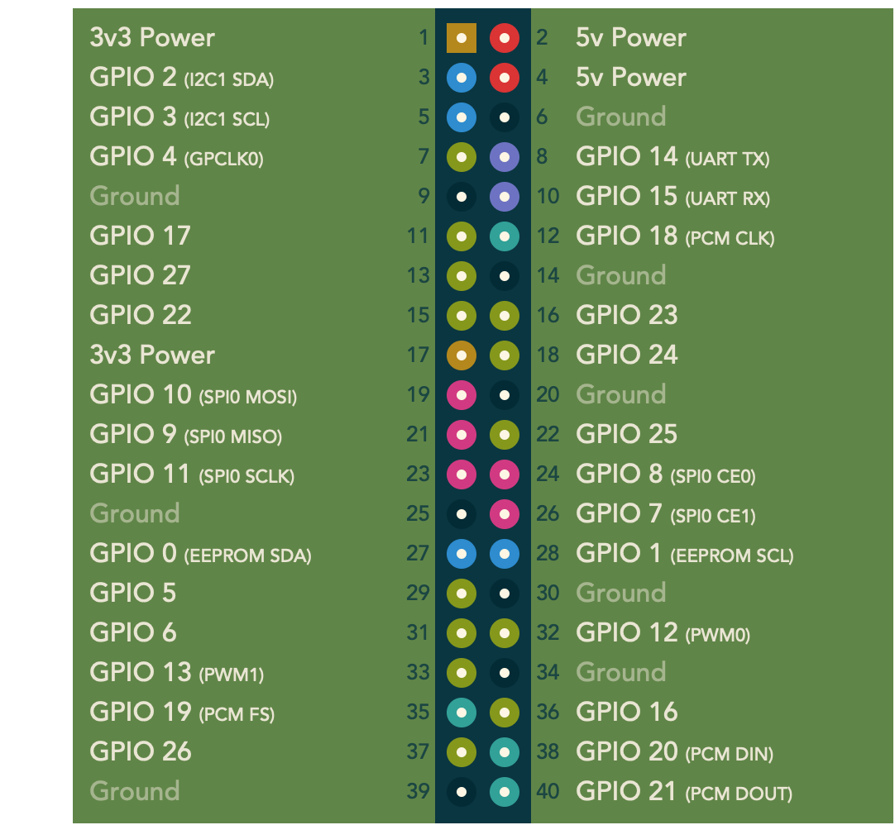
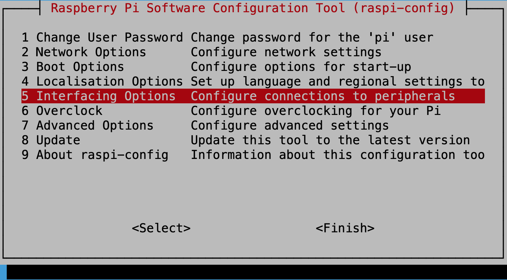
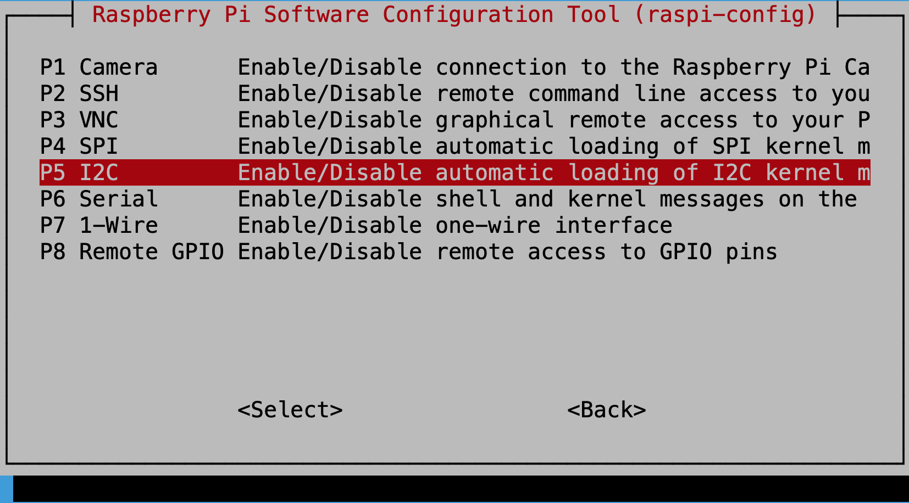

## Day 6：I2C (Part 1) - 簡介與環境設置

關於 Linux 的 I2C 子系統，在 2020 年的 ELCE 上有一個 *Tutorial: Introduction to I2C and SPI: Both In-kernel and In-userspace* 的演講，裡面大致介紹了 I2C 的協定，以及核心當中 I2C 子系統的架構。而這個演講中的 I2C 部分，跟 2018 年 Southern California Linux Expo 中，一個名為 *Linux, I2C, and me* 的演講中幾乎一樣 (至少投影片根本一樣)。雖然音質頗差，但內容比前者更詳細。

為了展示 Linux 在使用 I2C 時發生了什麼事，接下來的實驗將使用一個 Raspberry Pi 作為 master，以及一個 Arduino UNO 作為 slave，並且從 Raspberry Pi 以 I2C 傳輸資料給 Arduino UNO 時，觀察使用了哪些函數，並且搭配核心的文件進行參考。

## I2C Protocol

I2C 是 Inter-Intergrated Circuit 的縮寫，最早是 Philips 在 1982 年開發的，而現在他則是 NXP 的一部分。所以正式的規格可以在 NXP 的 [*I2C-bus specification and user manual*](https://www.nxp.com/docs/en/user-guide/UM10204.pdf) 文件上找到。

### 物理層簡介

I2C 需要兩條線路傳輸，一個是 SDA (傳輸資料)，另外一個是 SCL (提供時脈)。支援 *nulti-master* *multi-slave* (不過大部分的狀況下都是只有一個 master)，並且最多可以連接 127 個裝置。在一開始的規格中，每個裝置都會有一個 7 位元的「位址」。

除了 I2C 之外，根據 *Tutorial: Introduction to I2C and SPI: Both In-kernel and In-userspace* 中提到：另外一個類似的協定叫做 SMBus，是一個 I2C 協定的子集，所以也常常在 I2C 的子系統中出現。

### 傳輸協定


(來源：[維基百科](https://zh.wikipedia.org/wiki/I²C))

I2C 當中，開始傳輸前，SDA 與 SCL 一開始都處於高電位。要開始傳輸時：

1. **進入 start condition (S)**：master 把 SDA 拉低。如果 SDA 拉低時，SCL 仍然持平在高電位，這個狀態稱作 *start condition* (`S`)。隨後 SCL 跟著拉低，並且準備開始傳輸。
2. SDA 傳輸資料。資料的傳輸則是跟著 SCL 的時脈走：當 SCL 為高電位時，傳輸 SDA 當時的高低狀態。而這傳輸的資料中，又大致上分成兩個階段：
    1. **傳送 7 位元位址**：master 在 *start condition* 之後，會傳一個 7 位元的資訊。這 7 個位元表示要讀或寫哪個 slave (也就是 slave 的位址)。
    2. **傳送第 8 位元表示讀或寫**：7 個位元的位址之後，接著傳輸地 8 個位元。這個位元決定的是 master 要「讀」或是「寫」。
    3. **Slave ACK 一次確認**：傳送玩 8 個位元之後，收到的 Slave 就要 ~~舉手喊有~~ ACK 一次。ACK 的方法是 Slave 要把 SDA 拉低。
    4. **傳輸資料**：之後就開始依照時脈傳輸資料。如果是 master 要寫，那就是 slave 依照時脈讀讀取 SDA; 如果是 master 要讀，那就是 slave 透過 SDA 搭配時脈讀取 SDA 的高低電壓。除此之外，每 8 個位元會傳輸一個 ACK。如果是 master 寫，那麼就是接收資料的 slave 要 ACK 說有收到; 如果是 master 從 slave 讀東西，那就是 master 要 ACT 說有收到。
    5. **資料結束**：如果是 master 寫，那麼其實 slave 沒有辦法選擇自己要不要停，只能逆來順受被 master 餵資料，直到最後傳完 ACK 才能停; 而如果是 master 讀，當 master 不需要資料時，傳一個 NA 給 slave 知會一聲就可以了。
3. **進入 stop condition**：SCL 先拉高，隨後 SDL 跟著拉高。

所以，如果用 `[]` 表示從 Slave 傳輸的資料，那麼 master 寫時，大概像這樣：

```
S Addr W [A] Data0 [A] Data1 [A] ... [A] dataN [A] P
```

相反地，若是 master 讀的時候，狀態順序大概像下面這樣：

```
S Addr R [A] [Data0] A [Data1] A ... A [dataN] NA P
```

## Step 1：Arduino 上的 I2C (硬體)

前面知道：I2C 需要 SDA 與 SCL 兩條線來傳輸資訊，而根據 Arduino 官方的[文件](https://www.arduino.cc/en/reference/wire) 可以查到如下資料：

```bash
Board	I2C / TWI pins
Uno, Ethernet	A4 (SDA), A5 (SCL)
Mega2560	    20 (SDA), 21 (SCL)
Leonardo	    2 (SDA), 3 (SCL)
Due	            20 (SDA), 21 (SCL), SDA1, SCL1
```

因此，就 Arduino UNO 而言，若想要使用 I2C，需要使用 `A4` 為 SDA，`A5` 為 SCL。

## Step 2：Arduino 上的 I2C (軟體)

程式方面，Arduino IDE 內建的 `Wire.h` 函式庫中，可以使用 I2C。用法可以參考官方網站的 [Master Writer/Slave Receiver](https://www.arduino.cc/en/Tutorial/MasterWriter) 例子略知一二。以下程式修改自其中：

```c
#include <Wire.h>
#define ARDUINO_ADDR 0x8
char buf[128];

void setup()
{
    Wire.begin(ARDUINO_ADDR);
    Wire.onReceive(receiveEvent);
    Serial.begin(9600);
}

void loop()
{
    delay(100);
}

void receiveEvent(int nbyte)
{
    buf[nbyte] = 0;
    for (int i = 0; Wire.available(); i++)
        buf[i] = Wire.read();
    Serial.println(buf);
}
```

## Step 3：Raspberry Pi 上的 I2C (硬體)

從 [pinout.xyz](https://pinout.xyz/) 可以知道 Raspberry Pi 中，`GPIO2` 可以作為 SDA; `GPIO3` 可以作為 SCL。所以，把 `GPIO2` 跟 Arduino 的 `A4` 連接; 把 `GPIO3` 跟 Arduino 的 `A5` 連接。最後，再把地線接在一起，就完成硬體的設置了。



(來源：[pinout.xyz](https://pinout.xyz/))

## Step 4：啟動 Raspberry Pi 上的 I2C

首先，要先用 `raspi-config` 來啟動 I2C。這個在 *Interfacing Options* 中的 *I2C* 選項中：





## Step 5：Raspberry Pi 上的 I2C (軟體)

就安裝 Raspberry Pi OS 而言，畢竟是個 Linux，所以基本的 I2C 資訊就可以從核心文件中的 [I2C/SMBus Subsystem](https://www.kernel.org/doc/html/latest/i2c/index.html) 來得到。比如說在 [*Implementing I2C device drivers in userspace*](https://www.kernel.org/doc/html/latest/i2c/dev-interface.html) 的章節中，就有出現如何在 User Space 去使用 I2C。

而除了這個之外，也可以在 python 使用 smbus 這個套件。可以用以下方式安裝：

```shell
$ sudo apt-get install python3-smbus
```

安裝這個東西會自帶 `i2c-tools`，比如說可以用 `i2cdetect` 這個工具去看看哪一條 bus 上面的哪個位置有 i2c 裝置：

```shell
$ i2cdetect -y 1
```

在什麼都沒有時，就會像下面這個樣子：

```bash
$ i2cdetect -y 1
     0  1  2  3  4  5  6  7  8  9  a  b  c  d  e  f
00:          -- -- -- -- -- -- -- -- -- -- -- -- -- 
10: -- -- -- -- -- -- -- -- -- -- -- -- -- -- -- -- 
20: -- -- -- -- -- -- -- -- -- -- -- -- -- -- -- -- 
30: -- -- -- -- -- -- -- -- -- -- -- -- -- -- -- -- 
40: -- -- -- -- -- -- -- -- -- -- -- -- -- -- -- -- 
50: -- -- -- -- -- -- -- -- -- -- -- -- -- -- -- -- 
60: -- -- -- -- -- -- -- -- -- -- -- -- -- -- -- -- 
70: -- -- -- -- -- -- -- --   
```

接下來就開始寫 Raspberry Pi 端的 master 吧：

```python
from smbus import *

ARDUINO_ADDR = 0x8
I2C_BUS_NO = 1

i2c_bus = SMBus(I2C_BUS_NO)

while 1:
    try:
        message = input("Message to be send: ")
    except:
        break
    for a in [ord(c) for c in message]:
        i2c_bus.write_byte(ARDUINO_ADDR, a)
```

## Step 5：連接裝置

將程式上傳到 Arduino 中，並且將 Raspberry Pi 的 `A4` 接到 `GPIO2`、`A5` 接到 `GPIO3`，並且連接。最後把傳輸線插到電腦並打開序列埠，觀察 I2C 的輸出。

在連接完之後，使用 `i2cdetect`：

```shell
$ i2cdetect -y 1
```

就可以發現剛剛指定的 Arduino I2C 的位置 (`0x8`) 出現在輸出上：

```shell
$ i2cdetect -y 1
     0  1  2  3  4  5  6  7  8  9  a  b  c  d  e  f
00:          -- -- -- -- -- 08 -- -- -- -- -- -- -- 
10: -- -- -- -- -- -- -- -- -- -- -- -- -- -- -- -- 
20: -- -- -- -- -- -- -- -- -- -- -- -- -- -- -- -- 
30: -- -- -- -- -- -- -- -- -- -- -- -- -- -- -- -- 
40: -- -- -- -- -- -- -- -- -- -- -- -- -- -- -- -- 
50: -- -- -- -- -- -- -- -- -- -- -- -- -- -- -- -- 
60: -- -- -- -- -- -- -- -- -- -- -- -- -- -- -- -- 
70: -- -- -- -- -- -- -- --   
```

順帶一提一件有趣的事情是：雖然這邊的連接都是 I2C，但可以找到的範例程式幾乎都是 SMBus 的例子，比如說使用 `python3-smbus` 這個函式庫。這個或許可以從核心文件的 [*Implementing I2C device drivers*](https://www.kernel.org/doc/html/latest/i2c/writing-clients.html#sending-and-receiving) 的 *Sending and receiving* 章節中找到為什麼：

*If you can choose between plain I2C communication and SMBus level communication, please use the latter. All adapters understand SMBus level commands, but only some of them understand plain I2C!*