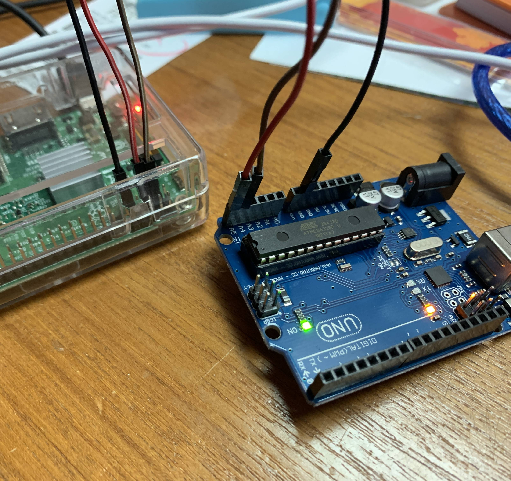
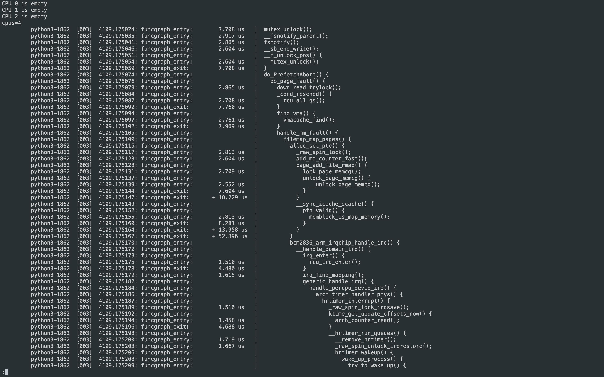
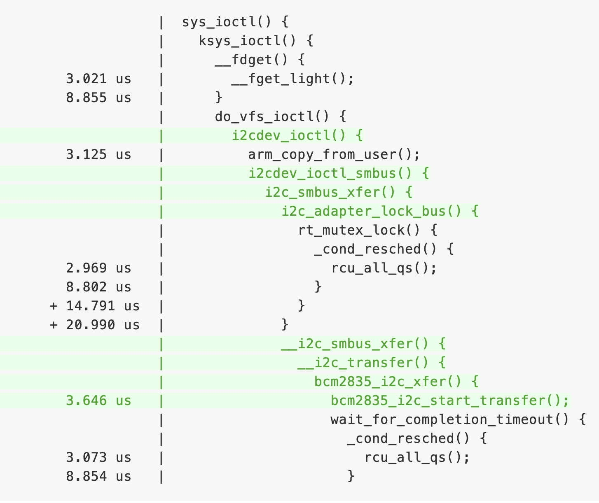

## Day 7：I2C (Part 2) - ftrace 爽颯登場！


接下來想要討論的是：**在 Raspberry Pi 的 python 函式庫進行 I2C 的傳輸時，核心的哪些部分做了哪些事？** 想要做到這件事情，可以請出號稱「Linux 核心的官方 tracer」-- `ftrace`。這句話可不是隨便講講的，是核心開發者 Steven Rostedt (rt patch 的主力開發者之一兼維護者) 在他的 *Learning the Linux Kernel with tracing* 演講中自己講的 (雖然 `ftrace` 就是他本人寫的)。

## 新朋友：ftrace

`ftrace` 並不像 `ptrace`、`strace` 、`ltrace` 等等那些很有名的 `*trace` 程式那樣是一個單一的可執行檔。**`ftrace` 更明確地說是一個像 `sysfs` 那樣的檔案系統=**，可以透過讀寫這個檔案系統中的特定檔案，來設定要追蹤什麼樣的事件，以及讀取追蹤的結果。Steven Rostedt 曾經在 [*Learning the Linux Kernel with tracing*](https://youtu.be/JRyrhsx-L5Y) 這個演講中提到：因為 ftrace 這個工具的用法是個檔案系統，所以只要可以 `cat` 跟 `echo` 就可以開始使用。這使得一些只有 `busybox` 的嵌入式系統上，也可以很方便地使用。

雖然是這樣，但是要一直 `cat` 跟 `echo` 很麻煩。所以 `ftrace` 這也有一個命令列工具 -- `trace-cmd`。要安裝 `trace-cmd`，就跟安裝其他套件是一模一樣的：

```shell
$ sudo apt install trace-cmd
```

接下來就看看 `ftrace` 這個號稱 Linux 官方的 tracer 怎麼幫助理解核心的運作吧！

## 例子：與 Arduino 通訊

現在的硬體配置是這樣：

1. Raspberry Pi 作為 master ，以 I2C 傳送給 Arduino 資料。
2. Arduino 作為 slave ，並且透過傳輸線與電腦連接。在收到資料時，會把他以 `Serial.println` 印出來。

整體的配置如圖所示。因為 Raspberry Pi 3 Model B 跟 Arduino Uno 的 SDA 跟 SCL 各自都只有一個，所以如果要用 I2C 通訊，那麼這兩個很顯然就是個自對接，然後共地。所以就只附照片，不附線路配置。



其中，Arduino 作為 slave 的程式如下：

```c++
#include <Wire.h>
#define ARDUINO_ADDR 0x8
char buf[128];

void setup()
{
    Wire.begin(ARDUINO_ADDR);
    Wire.onReceive(receiveEvent);
    Serial.begin(9600);
}

void loop()
{
    delay(100);
}

void receiveEvent(int nbyte)
{
    buf[nbyte] = 0;
    for (int i = 0; i < nbyte && i < 128; i++)
        buf[i] = Wire.read();
    Serial.println(buf);
}
```

而 Raspberry Pi 作為 master 傳送資料的程式如下：

```python
from smbus import *

ARDUINO_ADDR = 0x8
I2C_BUS_NO = 1

i2c_bus = SMBus(I2C_BUS_NO)

while 1:
    try:
        message = input("Message to be send: ")
    except:
        break
    for a in [ord(c) for c in message]:
        i2c_bus.write_byte(ARDUINO_ADDR, a)
```

為了方便，假定這個程式叫做 `smbus_example.py`。

> SMBus 跟 I2C 是很相近的傳輸協定，在核心中也都是由 I2C 子系統負責。在核心的 [*I2C and SMBus Subsystem*](https://www.kernel.org/doc/html/latest/driver-api/i2c.html) 文件中有提到：
>
> *"...The System Management Bus (SMBus) is a sibling protocol. Most SMBus systems are also I2C conformant. The electrical constraints are tighter for SMBus, and it standardizes particular protocol messages and idioms. Controllers that support I2C can also support most SMBus operations, but SMBus controllers don’t support all the protocol options that an I2C controller will.*
>
> 也就是說，SMBus (幾乎)相容於 I2C，但反之則不然。而 Raspberry Pi 中常見的函式庫也多半都是使用 SMBus，所以以下會將兩者混合使用。

## 問題：Raspberry Pi 傳輸時，用到了哪些東西？

在要討論的是：在 Raspberry Pi 傳輸資料的過程中，主要用到核心中的哪些功能來進行 i2c 的傳送？為了回答這個問題，可以叫 `ftrace` 把整個程式執行過程中，可以追蹤的函數通通追蹤起來，然後再慢慢看哪邊可能是有興趣的地方。

用以下方法來追蹤 python 執行這個程式時，所用到的核心中的函數：

```shell
$ sudo trace-cmd record \
    -p function_graph \
    -F python3 smbus_example.py 
```

這些選項中：

1. `record` 類似 `perf record`，用來生成一個之後能用 `trace-cmd report` 輸出成完整的統計。
2. `-p` 表示使用什麼「功能」。比如說現在要使用是 `function_graph` (函數之間的呼叫關係)。除了這之外，也有 `function` (特定函數內部執行的 code path)。
3. `-F` 表示只追蹤跟後面那個可執行檔有關的部分。

這時會出現 `function_graph` 被啟動的字樣，並且接著就是原先的 python 程式中，請求輸入訊息的資訊：

```bash
plugin 'function_graph'
Message to be send: B
Message to be send: 
```

為求簡單，這邊只輸入一個單一字元 (也就是 `B`) 便停止。之後中止程式 (Ctrl + c)，就可以看到 `trace-cmd` 顯示輸出結果：

```bash
CPU0 data recorded at offset=0x355000
    0 bytes in size
CPU1 data recorded at offset=0x355000
    0 bytes in size
CPU2 data recorded at offset=0x355000
    0 bytes in size
CPU3 data recorded at offset=0x355000
    5808128 bytes in size
```

接著就像 `perf` 一樣，使用 `report` 選項輸出報告。這邊為了方便閱讀，把他導向到 `less` 中：

```shell
$ trace-cmd report | less
```

## 觀察：trace-cmd 的輸出

這時候會出現數量極為驚人的資訊。因為這當中也包含了 `python` 執行時期時請作業系統幫忙做的事：



而這個看起來也滿好閱讀：最左邊是看這個可執行檔是誰？PID 是多少？以及進入及離開各個函數的時間戳記與間隔。最右方則是 code path，也就是現在要關注的重點。

雖然是一個非常大的清單，但現在焦點在於 I2C。所以就用 `less` 的搜尋 (按下 `/` + 想搜尋的關鍵字) 去找找看有沒有 `i2c` 。這時就發現了幾個地方：

### 1. vfs_open

可以發現在這當中，有一個 `vfs_open` 裡面呼叫的 `i2cdev_open()` 這個函數。而且還看得出來他正要打開一個字元驅動程式：



> 按：為了完整呈現 `trace-cmd` 的輸出，所以這邊保留他的原始輸出。在下面的輸出區塊中，往左邊移動就可以看到函數的呼叫關係。

```bash
         python3-1862  [003]  4109.511768: funcgraph_entry:                   |          vfs_open() {
         python3-1862  [003]  4109.511770: funcgraph_entry:                   |            do_dentry_open() {
         python3-1862  [003]  4109.511772: funcgraph_entry:                   |              path_get() {
         python3-1862  [003]  4109.511774: funcgraph_entry:        1.823 us   |                mntget();
         python3-1862  [003]  4109.511778: funcgraph_exit:         5.729 us   |              }
         python3-1862  [003]  4109.511780: funcgraph_entry:        1.875 us   |              try_module_get();
+        python3-1862  [003]  4109.511784: funcgraph_entry:                   |              chrdev_open() {
         python3-1862  [003]  4109.511786: funcgraph_entry:        1.928 us   |                _raw_spin_lock();
         python3-1862  [003]  4109.511790: funcgraph_entry:                   |                cdev_get() {
         python3-1862  [003]  4109.511792: funcgraph_entry:        2.344 us   |                  try_module_get();
         python3-1862  [003]  4109.511797: funcgraph_exit:         6.980 us   |                }
         python3-1862  [003]  4109.511799: funcgraph_entry:        1.875 us   |                try_module_get();
         python3-1862  [003]  4109.511802: funcgraph_entry:        1.823 us   |                module_put();
+        python3-1862  [003]  4109.511806: funcgraph_entry:                   |                i2cdev_open() {
         python3-1862  [003]  4109.511809: funcgraph_entry:                   |                  i2c_get_adapter() {
         python3-1862  [003]  4109.511811: funcgraph_entry:                   |                    mutex_lock() {
         python3-1862  [003]  4109.511813: funcgraph_entry:                   |                      _cond_resched() {
         python3-1862  [003]  4109.511815: funcgraph_entry:        1.718 us   |                        rcu_all_qs();
         python3-1862  [003]  4109.511818: funcgraph_exit:         5.312 us   |                      }
         python3-1862  [003]  4109.511820: funcgraph_exit:         8.802 us   |                    }
         python3-1862  [003]  4109.511823: funcgraph_entry:        2.240 us   |                    try_module_get();
         python3-1862  [003]  4109.511827: funcgraph_entry:        2.083 us   |                    get_device();
         python3-1862  [003]  4109.511831: funcgraph_entry:        1.771 us   |                    mutex_unlock();
         python3-1862  [003]  4109.511834: funcgraph_exit:       + 26.145 us  |                  }
         python3-1862  [003]  4109.511836: funcg
         [...]
```

### 2. sys_ioctl

除此之外，在某個 `ioctl` 當中，也呼叫了一系列相關的函數： `i2cdev_ioctl()`、`i2cdev_ioctl_smbus()`、`i2c_smbus_xfer()` 等等：


完整輸出如下：

```bash
         python3-1862  [003]  4117.264165: funcgraph_entry:                   |  sys_ioctl() {
         python3-1862  [003]  4117.264168: funcgraph_entry:                   |    ksys_ioctl() {
         python3-1862  [003]  4117.264171: funcgraph_entry:                   |      __fdget() {
         python3-1862  [003]  4117.264174: funcgraph_entry:        3.021 us   |        __fget_light();
         python3-1862  [003]  4117.264180: funcgraph_exit:         8.855 us   |      }
         python3-1862  [003]  4117.264183: funcgraph_entry:                   |      do_vfs_ioctl() {
+        python3-1862  [003]  4117.264186: funcgraph_entry:                   |        i2cdev_ioctl() {
         python3-1862  [003]  4117.264189: funcgraph_entry:        3.125 us   |          arm_copy_from_user();
+        python3-1862  [003]  4117.264195: funcgraph_entry:                   |          i2cdev_ioctl_smbus() {
+        python3-1862  [003]  4117.264199: funcgraph_entry:                   |            i2c_smbus_xfer() {
+        python3-1862  [003]  4117.264203: funcgraph_entry:                   |              i2c_adapter_lock_bus() {
         python3-1862  [003]  4117.264206: funcgraph_entry:                   |                rt_mutex_lock() {
         python3-1862  [003]  4117.264209: funcgraph_entry:                   |                  _cond_resched() {
         python3-1862  [003]  4117.264212: funcgraph_entry:        2.969 us   |                    rcu_all_qs();
         python3-1862  [003]  4117.264218: funcgraph_exit:         8.802 us   |                  }
         python3-1862  [003]  4117.264221: funcgraph_exit:       + 14.791 us  |                }
         python3-1862  [003]  4117.264224: funcgraph_exit:       + 20.990 us  |              }
+        python3-1862  [003]  4117.264227: funcgraph_entry:                   |              __i2c_smbus_xfer() {
+        python3-1862  [003]  4117.264231: funcgraph_entry:                   |                __i2c_transfer() {
+        python3-1862  [003]  4117.264236: funcgraph_entry:                   |                  bcm2835_i2c_xfer() {
+        python3-1862  [003]  4117.264240: funcgraph_entry:        3.646 us   |                    bcm2835_i2c_start_transfer();
         python3-1862  [003]  4117.264247: funcgraph_entry:                   |                    wait_for_completion_timeout() {
         python3-1862  [003]  4117.264250: funcgraph_entry:                   |                      _cond_resched() {
         python3-1862  [003]  4117.264253: funcgraph_entry:        3.073 us   |                        rcu_all_qs();
         python3-1862  [003]  4117.264258: funcgraph_exit:         8.854 us   |                      }
```

## 討論：I2C 在這個例子是怎麼傳輸的？

看到 `open` 又看到 `ioctl`，十之八九就會想猜這當中有某個字元驅動程式 (character device)。把這些函數拿去 [Bootlin](https://elixir.bootlin.com/linux/latest/source) 搜尋，就會發現這一系列函數是在 [drivers/i2c/i2c-dev.c](https://elixir.bootlin.com/linux/v5.4.49/source/drivers/i2c/i2c-dev.c) 這個檔案中。並檔案最前面有提到：

*"i2c-dev.c - i2c-bus driver, char device interface"*

這句話的意思大致是說： `i2c-dev` 這個驅動程式是一個 i2c bus 的驅動程式，只不過他幫這個 bus 提供的是一個「字元驅動程式」的介面 (而不是 Linux driver model 中所稱的 bus driver)。「字元驅動程式」的意思，大致上是指提供一組如 `open`、`ioctl` 等等虛擬檔案系統抽象層的實作，使得使用者能夠用讀寫檔案的方式來與這個 i2c bus 進行互動。從原始程式碼中觀察會更了解是什麼意思：

```c
static const struct file_operations i2cdev_fops = {
	.owner		= THIS_MODULE,
	.llseek		= no_llseek,
	.read		= i2cdev_read,
	.write		= i2cdev_write,
	.unlocked_ioctl	= i2cdev_ioctl,
	.compat_ioctl	= compat_i2cdev_ioctl,
	.open		= i2cdev_open,
	.release	= i2cdev_release,
};
```

關於 `i2c-dev` 的資訊也可以在 Linux 核心文件中與 I2C 有關的部分找到。在 [*Implementing I2C device drivers in userspace*](https://www.kernel.org/doc/html/latest/i2c/dev-interface.html) 一節中有提到：

*"Usually, I2C devices are controlled by a kernel driver. But it is also possible to access all devices on an adapter from userspace, through the /dev interface. You need to load module i2c-dev for this."*

另外，可以發現：需要載入的 `i2c-dev` 模組，恰好就是剛剛 `trace-cmd` 追蹤到的那些函數所屬的模組，表示剛剛 Raspberry Pi 執行的程式用到了 `i2c-dev` 這個裝置驅動程式; 除此之外，另一個可以注意的地方是：同一篇文件中示範在 User space 中使用 `i2c-dev` 的流程，也大致跟剛剛的觀察吻合：是先對 file descriptor 進行 `ioctl`，然後再對他進行讀寫。

## 觀察：用 ply 驗證

可以發現他的操作用到了 `i2c_smbus_xfer` 這個函數，而裡面的 `addr` 恰好就是 I2C slave 的位址。所以如果正個過程中 `addr` 都恰好是 Arduino slave 的位址 (以這邊為例是 `0x8`)，那麼就可確定這在傳輸的過程中有被使用到。找出他的[原始程式碼](https://elixir.bootlin.com/linux/v5.4.49/source/drivers/i2c/i2c-core-smbus.c#L525)：

```c
/**
 * i2c_smbus_xfer - execute SMBus protocol operations
 * @adapter: Handle to I2C bus
 * @addr: Address of SMBus slave on that bus
 * ...
 * @read_write: I2C_SMBUS_READ or I2C_SMBUS_WRITE
 * ...
 * This executes an SMBus protocol operation, and returns a negative
 * errno code else zero on success.
 */

s32 i2c_smbus_xfer(struct i2c_adapter *adapter, u16 addr,
		   unsigned short flags, char read_write,
		   u8 command, int protocol, union i2c_smbus_data *data)
```

裡面第 1 個變數恰好是 `addr`，所以用 `ply` 把他撈出來。除此之外，也把是讀是寫的那個變數一起找出來 (也就是 `read_write`)。由該函數的說明，並且參考 [i2c.h](https://elixir.bootlin.com/linux/v5.4.49/source/include/uapi/linux/i2c.h#L144) 中的定義可知：若 `read_write` 為 `I2C_SMBUS_READ`，也就是 `0` 的狀況下，表示該動作為寫入。

因此，現在 `ply` 的追蹤程式就變成像下面這樣：

```=
kprobe:i2c_smbus_xfer
{
    @[stack, arg1, arg3] = count();
}
```

其中，`arg` 就是 `addr`; `arg3` 就是 `read_write`。

先把 `ply` 跑起來，然後再另外執行 (按：可以用 `tmux`) 前面的 python 程式。python 程式中僅傳輸一個 `Hello, World!` 字串
：

```bash
Message to be send: Hello, World!
Message to be send:
```

終止 python 程式，再終止 `ply`。就會發現`ply` 跑出下面這樣的統計：

```bash
@:
{ 
	i2c_smbus_xfer
	cookie_v6_check+131140
	do_vfs_ioctl+192
	ksys_ioctl+68
	__se_sys_ioctl+24
	__hyp_idmap_text_start
, 8, 0 }: 13
```

其中可以發現：`arg1`，也就是即將讀寫的 I2C 的位址，恰好就是 `8`，也就是 Arduino 的位址; 而準備進行的動作是 `0`，也就是寫入。因此就證明了呼叫到這些函數，是真的是用來傳輸資料給 Arduino 的。

## 結論

由上面的追蹤結果，可以知道 `python3-smbus` 這個函式庫的背後，是以 `i2c-dev` 這個字元驅動程式提供的介面，來對 Raspberry Pi 的 I2C 線上的不同裝置進行溝通 (而不是用 platform driver 處理)。

> 