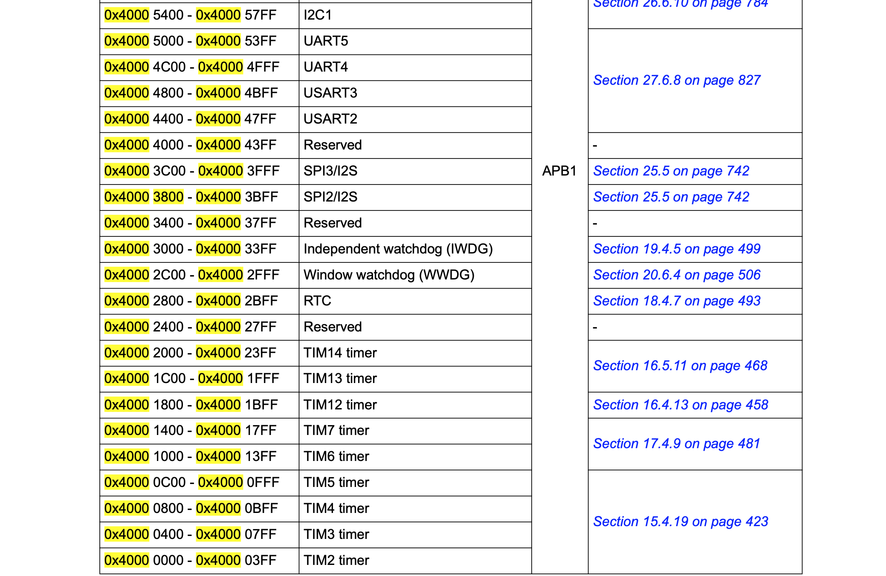
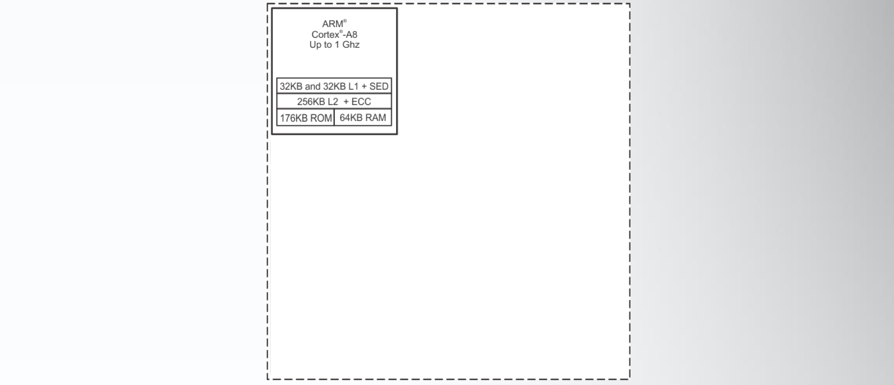
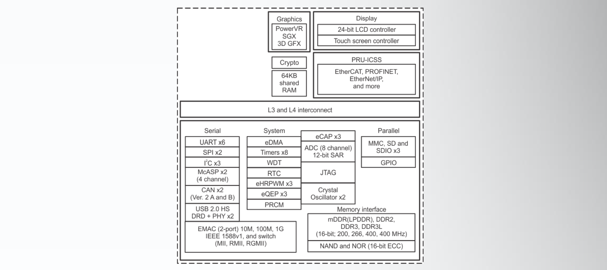
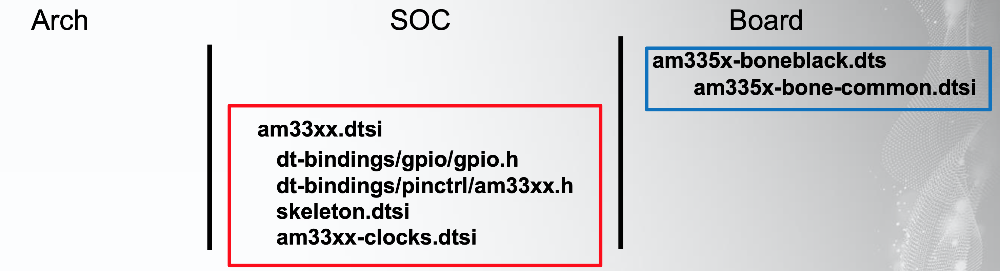

## Day 8：Device Tree (Part 1)


## 前言：應用情境與歷史

再開始看這個東西之前可以思考一個情境：假設現在有一個板子的規格書上描述了一堆 MMIO 的區域，比如說設定 GPIO 對應的暫存器記憶體映射在哪、I2C 的記憶體映射在哪等等。該如何讓程式知道這些跟硬體有關的映射呢？

一個可能的情境就是：把這些記憶體映射的位址，通通寫死在程式中。比如說：把這些東西都寫在一個標頭檔裡面，像 [Arduino](https://github.com/arduino/ArduinoCore-avr/blob/master/variants/standard/pins_arduino.h) 把各個腳位配置寫死在 `pin_arduino.h` 這個標頭檔中一樣。像這樣：

```c
...
#define PIN_SPI_SS    (10)
#define PIN_SPI_MOSI  (11)
#define PIN_SPI_MISO  (12)
#define PIN_SPI_SCK   (13)

static const uint8_t SS   = PIN_SPI_SS;
static const uint8_t MOSI = PIN_SPI_MOSI;
static const uint8_t MISO = PIN_SPI_MISO;
static const uint8_t SCK  = PIN_SPI_SCK;
...
```

而不同的硬體因為配置不同，所以這些描述硬體的標頭檔也可能不同。比如說 [Arduino core 的原始碼](https://github.com/arduino/ArduinoCore-avr/tree/master/variants) 中，就針對 Mega、Yun、Gema 等等不同變體的 Arduino，分別定義了獨立的 `pins_arduino.h` 檔案 (在名稱對應的資料夾中)。

### 問題 1：重用性不佳

不過 Linux 要支援的硬體非常多，這類描述硬體的標頭檔往往缺乏一致的實作標準，而且又不得不放在核心的程式碼裡面。一個板子就一個檔案，而同一系列的硬體往往僅有些為差異，因此程式的重用性並不好。比如說上面 Arduino 的例子中，一個板子就有一個自己的 `pins_arduino.h` 檔案。

### 問題 2：不利維護

除此之外，多人協作的時候會有更麻煩的問題。比如說 A 公司的不同團隊同時更動了某一個描述硬體的標頭檔，這時的 *conflict* 會反映在上游的核心開發工作上。但既然是描述 A 公司硬體的檔案，為什麼反而是核心的維護人員要處理呢？ Linus Torvalds 則表示：[*"Guys, this whole ARM thing is a f\*cking pain in the ass."*](https://lkml.org/lkml/2011/3/17/492)

為了使硬體描述與核心的原始碼脫鉤，就有了 *device tree* 這個東西。在比較初期的一些演講中會有更多相關的說明。比如這個 2013 年在 ELCE 的演講 [*Devicetree: The Disaster so Far*](https://youtu.be/xamjHjjyeBI)。這個演講中大約到 6:28 秒前，有大概提到 device tree 的歷史跟動機：不同的供應商在處理硬體相關的程式碼時，並沒有一致的方法。而且相關的參數都寫死在 *board file* 中，檔案的重用性跟維護性就面臨挑戰，稍微改變周邊的硬體配置時還要將核心重新編譯一次，維護上很麻煩。

而 Device Tree 就是一個針對這個問題的解決方案。這是一種「硬體描述」的語言，以巢狀的階層來表示不同硬體之間的連接關係。

## 例子：STM32F429-Discovery

以 STM32F429-Discovery 為例子，它位於 [arch/arm/boot/dts](https://elixir.bootlin.com/linux/latest/source/arch/arm/boot/dts) 當中。若搜尋 stm32，可以找到一些副檔名為 `dts` 與 `dtsi` 的檔案，這些都是 Device Tree 的一部分。通常 `dtsi` 僅有部分的 Device Tree，是用來給其他 `dts` 檔引入，以增加重用性。而 `dts` 就是代表某個特定板子的硬體 Device Tree。

舉例來說，在[arch/arm/boot/dts/stm32f429-disco.dts](https://elixir.bootlin.com/linux/latest/source/arch/arm/boot/dts/stm32f429-disco.dts#L48) 中，可以看見開頭引入了 `stm32f429.dtsi` 與 `stm32f429-pinctrl.dtsi` 兩個檔案：

```c
/dts-v1/;
#include "stm32f429.dtsi"
#include "stm32f429-pinctrl.dtsi"
#include <dt-bindings/input/input.h>
```

其中，第二個 [stm32f429.dtsi](https://elixir.bootlin.com/linux/latest/source/arch/arm/boot/dts/stm32f429.dtsi#L338) 檔案，可以發現以下內容 (部分內容省略)：

```c
		spi2: spi@40003800 {
			#address-cells = <1>;
			#size-cells = <0>;
			compatible = "st,stm32f4-spi";
			reg = <0x40003800 0x400>;
			interrupts = <36>;
			clocks = <&rcc 0 STM32F4_APB1_CLOCK(SPI2)>;
			status = "disabled";
		};

		spi3: spi@40003c00 {
			#address-cells = <1>;
			#size-cells = <0>;
			compatible = "st,stm32f4-spi";
			reg = <0x40003c00 0x400>;
			interrupts = <51>;
			clocks = <&rcc 0 STM32F4_APB1_CLOCK(SPI3)>;
			status = "disabled";
		};

		usart2: serial@40004400 {
			compatible = "st,stm32-uart";
			reg = <0x40004400 0x400>;
			interrupts = <38>;
			clocks = <&rcc 0 STM32F4_APB1_CLOCK(UART2)>;
			status = "disabled";
		};

		usart3: serial@40004800 {
			compatible = "st,stm32-uart";
			reg = <0x40004800 0x400>;
			interrupts = <39>;
			clocks = <&rcc 0 STM32F4_APB1_CLOCK(UART3)>;
			status = "disabled";
			dmas = <&dma1 1 4 0x400 0x0>,
			       <&dma1 3 4 0x400 0x0>;
			dma-names = "rx", "tx";
		};

		usart4: serial@40004c00 {
			compatible = "st,stm32-uart";
			reg = <0x40004c00 0x400>;
			interrupts = <52>;
			clocks = <&rcc 0 STM32F4_APB1_CLOCK(UART4)>;
			status = "disabled";
		};

		usart5: serial@40005000 {
			compatible = "st,stm32-uart";
			reg = <0x40005000 0x400>;
			interrupts = <53>;
			clocks = <&rcc 0 STM32F4_APB1_CLOCK(UART5)>;
			status = "disabled";
		};

        ...
```

對照[使用手冊](https://www.st.com/resource/en/reference_manual/cd00171190-stm32f101xx-stm32f102xx-stm32f103xx-stm32f105xx-and-stm32f107xx-advanced-arm-based-32-bit-mcus-stmicroelectronics.pdf) p. 52 的記憶體映射區域：



可以發現 Device Tree 中描述的位址恰好就對應 `usart` 與 `spi` 的描述。其他如 timer、i2c 的周邊描述，也都紀錄在其中。

關於 Device Tree 在 Linux 中的歷史，比較早期的介紹是 Thomas Petazzoni 在 2013 年的 [*Device Tree for Dummies!*](https://youtu.be/m_NyYEBxfn8) 這個演講。不過這個演講有一部分的內容是過時的。舉例來說：裡面有提到關於 Device Tree 的相關文件很少，並且建議可以參考 ePAPR (他是 Device Tree 規格參考的原型)。但現在 Device Tree 的標準已經由 [devicetree.org](https://www.devicetree.org/) 這個單位專門負責，當中也明確包含了[規格文件](https://www.devicetree.org/specifications/)。而在 2020 年的 Open Source Summit 則出了一個 Device Tree 的教學 [*Tutorial: Device Tree (DTS), Linux Board Bring-up and Kernel Version Changing*](https://youtu.be/N6IW7JJQASc)。

## 流程：先引入，後覆蓋

一個硬體的 Device Tree 並不是從 0 開始寫出來的。既然是以階層來描述硬體，所以就會由上往下結合這個硬體所包含的各種成分的 Device Tree。下游硬體供應商看看用了什麼上游的硬體，然後把他們一個一個引入，最後再「覆蓋」上自己新曾的部分

舉例來說： SoC 的設計者可能會「引入」上游處理器預設的 Device Tree ，並以之為基礎，「疊加」上這個 SoC 上需要使用處理器哪些硬體部分，或是新增某些周邊的硬體描述。處理器原來的 Device Tree 跟「疊加」上去的 SoC 的硬體描述，合起來就成為 SoC 的 Device Tree ，並且給下游需要這個硬體描述的供應商 (比如說某個開發版的供應商) 作為參考。

類似地，板子的供應商拿到 SoC 預設的 Device Tree，也遵循類似的流程：「引入」 SoC 供應商提供的預設的 SoC Device Tree 為基礎，「別家」上板子上其他硬體的描述，生出板子的 Device Tree，並且給下游 (比如說 Linux kernel) 使用。

所以總和上述的資訊，在使用 Device Tree 的過程大致上是下面 2 個步驟：

### Step 1：引入預設的 Device Tree

引入既有硬體的 Device Tree 之後，決定要使用既有硬體的哪些資源，然後在現在的 Device Tree 檔案中把需要用的東西寫出來。這些 Device Tree 通常會以 `.dtsi` 為副檔名：

```c
/dts-v1/;
+#include "lorem-ipsum.dtsi"
.
.
#include <dolor-sit-amet.h>

/{
    /* Modification */
}
```

除了引入既有的 Device Tree 之外，還可以引入 C 語言的巨集。不過，這邊的巨集通常是用來定義常數，以避免一堆數字造成可讀性上的困難：

```c
/dts-v1/;
#include "lorem-ipsum.dtsi"
.
.
+#include <dolor-sit-amet.h>

/{
    model =  "Consectetur Adipiscing Board Design"
    .
    .
}
```

### Step 2：疊加上需要改變的部分

剛剛 `#include` 進的東西是目前具有的硬體資源的描述。接下來就要看這些資源當中，自己需要哪些資源，然後描述在 `\{ ... }` 的範圍內：

```c
/dts-v1/;
#include "lorem-ipsum.dtsi"
.
.
#include <dolor-sit-amet.h>

+/ {
+
+    /* Modification */
+
+}
```

## 例子：SoC 供應商的角度

SoC 拿到某個處理器的硬體描述，所以在 SoC 的 Device Tree 中引加預設的處理器的 Device Tree：



```diff=
/dts-v1/;
+ #include "processor.dtsi"

/{

}
```

這些通常是由供應商提供，可以供參考的 Device Tree。如 [arch/arm/boot/dts](https://elixir.bootlin.com/linux/latest/source/arch/arm/boot/dts) 裡面的[armv7-m.dtsi](https://elixir.bootlin.com/linux/latest/source/arch/arm/boot/dts/armv7-m.dtsi)。再依照 SoC 的設計，決定需要處理器的哪些硬體，以及加上其他硬體周邊的描述：



```c
/dts-v1/;
#include "processor.dtsi"

+/{
+    /* Modification */
+}
```

## 例子：開發版供應商的角度

有了 SoC 的硬體描述之後，設計板子的人拿到 SoC 的 Device Tree，就換成使用預設的 SoC Devie Tree，再自己的板子需要哪些 SoC 的硬體功能 (比如說：SoC 可能有 6 個 uart，但現在只需要一個，那麼就只要提供一個 uart 的資訊給核心就可以了)，然後加入相關的描述。以及增加板子上的其他周邊或硬體的硬體描述。

所以這一連串的引入關係就會像是這樣：



SoC 供應商會引入與處理器架構有關的 Device Tree，並且在這個 SoC 的 Device Tree 中決定哪些部分需要使用; 而板子的供應商又引入 SoC 供應商的 Device Tree，並且以其為基礎決定哪些 SoC 上的硬體需要使用。