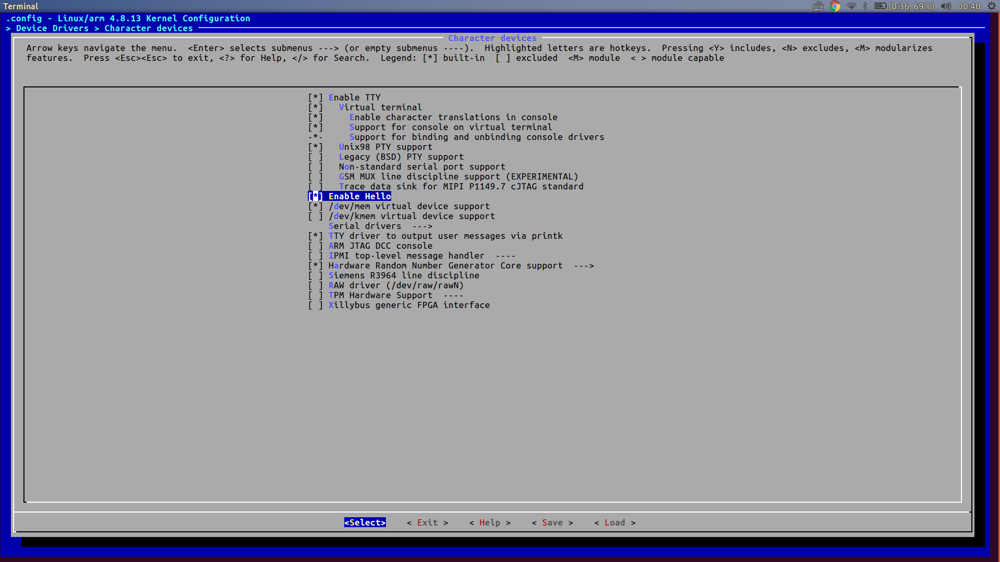

# ch8: 裝置驅動程式的基本知識


>小弟不是電類的,若以下筆記有錯誤歡迎任何指教,謝謝。

環境
```
ubuntuDistributor ID:	Ubuntu
Description:	Ubuntu 16.04.1 LTS
Release:	16.04
Codename:	xenial
kernel version:4.9.0-999-generic
```


[TOC]
# 驅動裝置的基本概念
裝置驅動程式是為了隱藏硬體的複雜性和多變性,幫助使用者能夠簡單的呼叫函式即能完成複雜的工作，並和使用者的程式隔離,並免直接存取核心資料結構駭硬體裝置。

>在本章裝置驅動程式(device driver)、可動態載入模組(loadable module)、可動態載入核心模組(loadable kernel device,LKM)、模組(module),通通都是指核心裝置驅動模組(kernel device driver module),因為好像沒有統一的術語。

## 可動態載入模組
linux提供界面方便使用者在開機後動態的移除或加入模組到核心中,當核心完成啟動後,開始安裝動態組(loadable module)，或是透過script安裝模組,當模組需要使用時,才要求載入模組,那麼動態載入模組有什麼好處呢?
1. 可以任意將組插入或移除正在運行的裝置
2. 可以直接更新模組,不須重新啟動
3. 嵌入式裝置的容量有限,可以將模組放在其他除存裝置中

當然我們也可以透過重新編譯核心將驅動裝置直接編譯進核心,或是透過[Chapter 6 : User Space Initialization](https://hackmd.io/s/H1DqYq3bl#)將需要的模組和載入模組的script放進Initial RAM Disk這樣就可以直接在開機時啟動模組。

## 裝置驅動程式架構
簡略分為兩類
|裝置|字元裝置(character devices)|區塊裝置(block devices)|
|:-------|:-------------------------|:--------------------|
|讀寫方式|serial|以block為單位,進行讀寫|
|舉例|keyboard,arduino|硬碟,隨身碟|

## 裝置驅動程式範例
project tree:


hello.c
```c
#include <linux/module.h>
#include <linux/kernel.h>
#include <linux/init.h>

static int __init hello_init(void) //初始化
{
    printk(KERN_INFO "Hello world!");
    return 0;
}

static void __exit hello_exit(void) //還原初始化
{
    printk(KERN_INFO "bye bye world");
}

module_init(hello_init);
module_exit(hello_exit);

MODULE_AUTHOR("splasky");
MODULE_DESCRIPTION("Hello world example!");
MODULE_LICENSE("GPL");


```
接下來我們要將寫好的模組加入到kernel中,步驟如下
1. 下載linux kernel source code

```
wget wget https://cdn.kernel.org/pub/linux/kernel/v4.x/linux-4.8.13.tar.xz
tar Jxvf linux-4.8.13
cd linux 4.8.13
```
2. 進入.../driver/char 並建立hello directory，這個資料夾就是我們等等要將我們寫的模組source code放置的位置

```
cd drivers/char
mkdir hello
cp hello.c .../drivers/char/hello
```
3. 在hello中新增編譯hello模組的makefile

```
splasky@splasky-XPS13→ [~/workspace/linux-4.8.13] $ cat drivers/char/hello/Makefile 
obj-$(CONFIG_HELLO) +=hello.o
```
4. 在核心組態設定檔中加入選單表示hello模組，可以指定是否內建或是可動態載入核心模組

```
splasky@splasky-XPS13→ [~/workspace/linux-4.8.13] $ cat drivers/char/Kconfig |head -n 20
#
# Character device configuration
#

menu "Character devices"

source "drivers/tty/Kconfig"

config HELLO
    tristate "Enable Hello"
	default m
	help
      Example Hello module
```
修改完後就可以在menuconfig看見核心組態檔(Kconfig)的編譯選項



5. 修改.../drivers/char/Makefile,決定建構時要不要包含此目錄 

```
splasky@splasky-XPS13→ [~/workspace/linux-4.8.13] $ cat drivers/char/Makefile 
#
# Makefile for the kernel character device drivers.
#

obj-y				+= mem.o random.o
...
obj-$(CONFIG_HELLO) 		+= hello/
```
到這邊修改完後我們就可以開始建構驅動程式模組了!
## 建構與安裝驅動程式模組
```
splasky@splasky-XPS13→ [~/workspace/linux-4.8.13] $ make ARCH=arm CROSS_COMPILE=arm-linux-gnueabi- defconfig
*** Default configuration is based on 'multi_v7_defconfig'
#
# configuration written to .config
#
splasky@splasky-XPS13→ [~/workspace/linux-4.8.13] $ make ARCH=arm CROSS_COMPILE=arm-linux-gnueabi- modules
...compiling...
splasky@splasky-XPS13→ [~/workspace/linux-4.8.13] $ ls drivers/char/hello/
hello.c  hello.ko  hello.mod.c  hello.mod.o  hello.o  Makefile  modules.order  Module.symvers
```
hello.ko模組就是我們的模組

>不知道有沒有其他方法可以直接上傳模組到qemu虛擬機裡,或是直接透過qemu掛載模組,小弟這邊是透過NFS掛載於qemu，想知道一般大家都是怎麼做的?
>如何掛載NFS可以參考[這裡](https://balau82.wordpress.com/2010/04/27/linux-nfs-root-under-qemu-arm-emulator/)

## 載入模組
接下來我們嘗試在qemu上掛載我們編譯好的hello.ko

首先先更改console的級別才能將log的訊息列印到console上

```
$ cat /proc/sys/kernel/printk
4 4 1 7
$ cat /proc/sys/kernel/printk
7	4	1	7 
```
更詳習的規則可以參考[這裡](http://man7.org/linux/man-pages/man2/syslog.2.html)

接著掛載module
```
$ cp mnt/hello.ko /lib/modules/4.8.13/kernel/
$ depmod
$ modprobe hello
Hello world!$ 
```
就可以發現init的message列印於當前console下
移除已掛載的module也很簡單
```
modprobe -r hello
```

## 模組參數
現在讓我們為模組增加參數,讓其可以透過insmod輸入模組參數

```
splasky@school->[~/workspace/module] (master) 166h10m $ cat src/hello2.c
```

```c
#include <linux/module.h>
#include <linux/kernel.h>
#include <linux/init.h>

static int debug_enable = 0; //宣告靜態變數debug_enable
module_param(debug_enable, int, 0);
MODULE_PARM_DESC(debug_enable, "Enable module debug mode.");

static int __init hello_init(void)
{
    printk(KERN_INFO "debug mode is %s\n", debug_enable ? "enable" : "disable");
    return 0;
}

static void __exit hello_exit(void)
{
    printk(KERN_INFO "bye bye world\n");
}

module_init(hello_init);
module_exit(hello_exit);

MODULE_AUTHOR("splasky");
MODULE_DESCRIPTION("Hello world example!");
MODULE_LICENSE("GPL");
```
module_param定義於.../include/linux/moduleparam.h中,由modules.h引入,作用是將模組參數向核心模組子系統做註冊
MODULE_PARM_DESC向核心註冊參數說明的字串
接著讓我們看看如何在載入模組時使用引數
```
splasky@school->[~/workspace/module] (master) 166h26m $ sudo insmod src/hello2.ko debug_enable=1
splasky@school->[~/workspace/module] (master) 166h27m $ dmesg |tail -n 2
[451967.837106] bye bye world
[451972.059004] debug mode is enable
```
也可以直接引入
```
splasky@school->[~/workspace/module] (master) 166h28m $ sudo insmod src/hello2.ko
splasky@school->[~/workspace/module] (master) 166h28m $ dmesg |tail -n 2
[452079.503340] bye bye world
[452085.328312] debug mode is disable
```

# 模組工具
模組工具在前一小節已經介紹過,如果你想要更詳細的說明請參考manual
## insmod
insmod 接收一個模組的==絕對路徑==,並將模組載入核心
```
sudo insmod src/hello2.ko
```
## lsmod
將載入到核新的模組清單印出

```
splasky@school->[~/workspace/module] (master) 166h28m $ sudo lsmod
[sudo] password for splasky: 
Module                  Size  Used by
hello2                 16384  0
cdc_acm                36864  0
btrfs                 987136  0
ufs                    73728  0
gf128mul               16384  1 lrw
...
```
最右邊的欄位Uesd by表示該模組正在使用中,並列出相依性

## modprobe
modprobe可以幫我們解決模組間相依的問題,舉例來說上例的gf128mul需要lrw模組才能使用,modprobe能幫我解決這個問題,並以正確的順序載入。
```
modprobe gf128mul
```
會將lrw與gf128mul都載入
```
modprobe -r gf128mul
```
則會將兩個模組都移除
:::info
使用modeprobe載入module時要先將module複製至/lib/modules/$(uname -r)/kernel 下
:::

## depmod
modprobe必須依賴modules.dep來知道模組間的相依關係,而depmod負責為我們產生這個檔案,這個檔案內含一份核心建構系統有啟用的模組清單。
這個檔案放至於/lib/modules/4.4.0-($uname -r)/modules.dep 下
```
cat /lib/modules/4.4.0-51-generic/modules.dep
```
格式為
\[模組\]:\[關聯模組\]
## rmmod
移除核心中的模組,不需要路徑,不會移除相依的模組
```
rmmod hello2
```
## modinfo
檢視module的詳細資訊
```
splasky@school->[~/workspace/module] (master) 167h38m $ modinfo hello2 
filename:       /lib/modules/4.4.0-51-generic/kernel/hello2.ko
license:        GPL
description:    Hello world example!
author:         splasky
srcversion:     CE729C455AA625EF69A6DDB
depends:        
vermagic:       4.4.0-51-generic SMP mod_unload modversions 
parm:           debug_enable:Enable module debug mode. (int)
```

# 與驅動程式溝通
接下來我們將介紹如何由module提供介面函式給user space application

## 驅動程式的檔案系統操作函式

```c
#include <linux/module.h>
#include <linux/kernel.h>
#include <linux/init.h>
#include <linux/fs.h>

#define DEVICE_NAME "hello3"
static int debug_enable = 0;
module_param(debug_enable, int, 0);
MODULE_PARM_DESC(debug_enable, "Enable module debug mode.");

struct file_operations hello_fops;
static int hello_open(struct inode *inode, struct file *file)
{
    printk("Hello open: successful\n");
    return 0;
}

static int hello_release(struct inode *inode, struct file *file)
{
    printk("Hello release: successful\n");
    return 0;
}

static ssize_t hello_read(struct file *file, char *buf, size_t count, loff_t *ptr)
{
    printk("Hello read: returning zero bytes\n");
    return 0;
}

static ssize_t hello_write(struct file *file, const char *buf, size_t count, loff_t *ppos)
{
    printk("Hello write: accepting zero bytes\n");
    return 0;
}

static long hello_ioctl(struct file *file, unsigned int cmd, unsigned long arg)
{
    printk("Hello ioctl:cmd=%ud, arg=%lu\n", cmd, arg);
    return 0;
}

static int __init hello_init(void)
{
    int ret=0;
    printk(KERN_INFO "debug mode is %s\n", debug_enable ? "enable" : "disable");

    ret = register_chrdev(234, DEVICE_NAME, &hello_fops);

    if (ret < 0)
    {
        printk(KERN_ALERT"ERROR registering hello device\n");
        goto hello_fail;
    }

    printk(KERN_INFO "Hello module registered successfully!\n");

    /* init process here */


    return 0;
hello_fail:
    return ret;
}

static void __exit hello_exit(void)
{
    printk(KERN_INFO "Hello exit\n");
}

/* 透過建立一個file operation 來和character裝製做connect */
struct file_operations hello_fops =
{
owner:
    THIS_MODULE,
read:
    hello_read,
write:
    hello_write,
unlocked_ioctl:
    hello_ioctl,
open:
    hello_open,
release:
    hello_release,
};

module_init(hello_init);
module_exit(hello_exit);

MODULE_AUTHOR("splasky");
MODULE_DESCRIPTION("Hello world example!");
MODULE_LICENSE("GPL");
```

## 裝置節點與mknod
裝置節點是一種特殊的檔案類型,linux用這種檔案來代表裝置,幾乎所有linux distribution都將裝置節點放在/dev下,我們會透過mknod產生裝置節點。


```
mknod /dev/hello3 c 234 0
```
mknod \[裝置節點位置\] \[檔案類型\] \[主編號\] \[次編號\]
我們透過裝置節點來跟已安裝的驅動程式做銜接，當程式透過open系統呼叫時,核心會透過主編號(此範例中為234)將驅動程式和裝置節點做連接，作業系統並不理會次編號，會把次編號直接傳給驅動裝置，讓一個驅動程式可以處理多個子裝置。
:::info
裝置節點一般是透過udev產生,後面章節會介紹到，另外本章的範例是透過手動直接把裝置主編號直接指定在source code中,這樣做並不好,應該透過kernel指定一個給驅動程式，詳細作法Linux Device Drivers的第三章有說明到。
:::
>還要再研究

## 整合為一體
現在我們創立一個use-hello3.c 來運用我們寫的驅動程式

```c
#include <stdio.h>
#include <stdlib.h>
#include <sys/types.h>
#include <sys/stat.h>
#include <fcntl.h>
#include <unistd.h>

int main(int argc, char *argv[])
{
    /* our file descriptor */
    int fd=0,rc=0;
    
    char *rd_buf[16];
    printf("%s: entered\n",argv[0]);

    /* open device */
    fd = open("/dev/hello3",O_RDWR);
    if(fd==-1){
        perror("open failed");
        rc=fd;
        exit(-1);
    }

    printf("open successful!\n");

    /* Issue a read */
    rc=read(fd,rd_buf,0);
    if(rc==-1){
        perror("read failed");
        close(fd);
        exit(-1);
    }
    printf("read:returning %d bytes!\n",rc);
    close(fd);
    return 0;
}
```

最後執行我們的use-hello
```
splasky@splasky-XPS13→ [~/workspace/kernel_module/module] (master) 237h25m $ ls -l /dev/hello*
ls: cannot access '/dev/hello*': No such file or directory
splasky@splasky-XPS13→ [~/workspace/kernel_module/module] (master) 237h26m $ sudo mknod /dev/hello3 c 234 0
[sudo] password for splasky: 
splasky@splasky-XPS13→ [~/workspace/kernel_module/module] (master) 237h26m $ sudo insmod src/hello3.ko 
splasky@splasky-XPS13→ [~/workspace/kernel_module/module] (master) 237h27m $ sudo ./use-hello 
./use-hello: entered
open successful!
read:returning 0 bytes!
splasky@splasky-XPS13→ [~/workspace/kernel_module/module] (master) 237h29m $ dmesg | tail -n 8
[  193.437511] hello3: loading out-of-tree module taints kernel.
[  193.437724] hello3: module verification failed: signature and/or required key missing - tainting kernel
[  193.438665] debug mode is disable
[  193.438678] Hello module registered successfully!
[  204.570530] Hello open: successful
[  204.570534] Hello read: returning zero bytes
[  204.570537] Hello release: successful
[  300.054926] mce: [Hardware Error]: Machine check events logged

```

# GPL
https://www.gnu.org/licenses/quick-guide-gplv3.html

# 作者推薦的參考書目
[Linux Device Drivers](http://www.oreilly.com.tw/product_linux.php?id=a184):臺灣:Linux 驅動程式, 3/e (Linux Device Drivers, 3/e) 
[Essential Linux Device Drivers](https://www.amazon.com/Essential-Device-Drivers-Sreekrishnan-Venkateswaran/dp/0132396556)有中文版
[Filesystem Hierarchy Standard](https://zh.wikipedia.org/wiki/%E6%96%87%E4%BB%B6%E7%B3%BB%E7%BB%9F%E5%B1%82%E6%AC%A1%E7%BB%93%E6%9E%84%E6%A0%87%E5%87%86)

# 參考資料
[Loda's blog](http://loda.hala01.com/2009/04/linux-%E5%8B%95%E6%85%8B%E8%BC%89%E5%85%A5module%E4%BB%8B%E7%B4%B9/)
[The Linux Kernel Module Programming Guide](http://www.tldp.org/LDP/lkmpg/2.6/html/lkmpg.html)
[開機流程、模組管理與 Loader](http://linux.vbird.org/linux_basic/0510osloader.php#kernel)
>本參考資料中也含有模組工具的使用

[Linux Modules（1.1）module parameters](http://nano-chicken.blogspot.tw/2011/01/linux-modules11module-parameters.html)