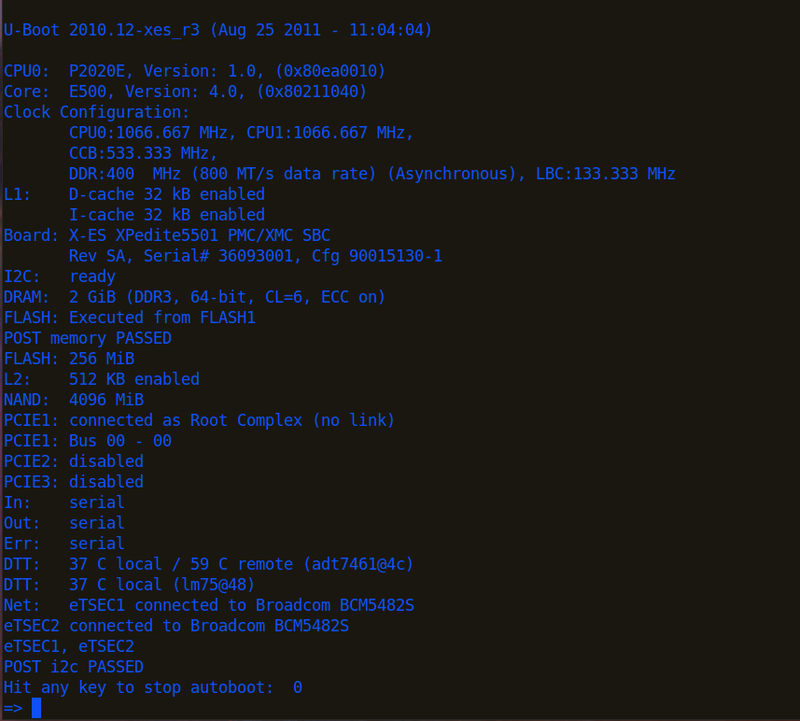
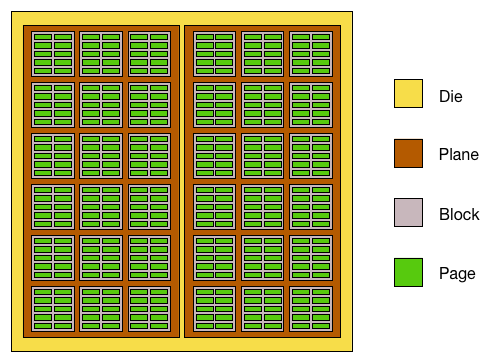
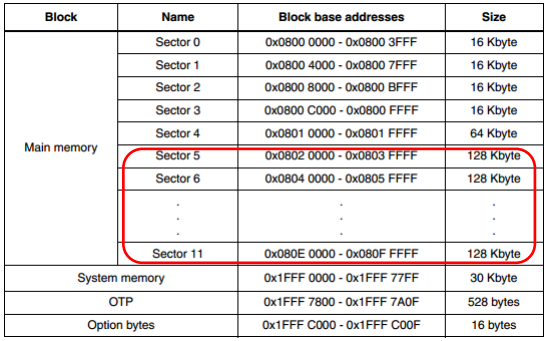
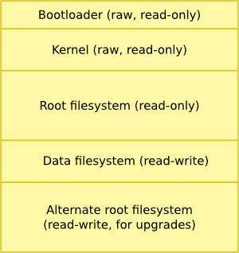
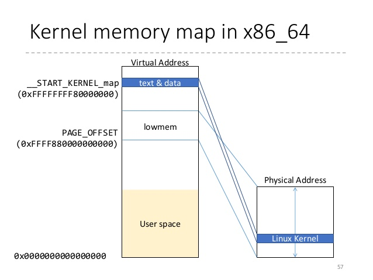

Chapter 2: The Big Picture
===

###### tags: `gnitnaw` `twlkh`

## 2.1 何謂嵌入式系統？
嵌入式系統通常俱備以下條件：
- 有一個『根據被下達的指令知道自己該做啥』的大腦，例如一般的MCU，有個大腦才知道每隔多久要重複一樣的動作。
- 通常會針對某種應用做出特別的設計，例如要偷拍正妹就要搭解析度高的鏡頭，反應也要夠快。
- 通常含有可跟使用者互動的介面。
- 為了cost-down所以能運用的資源有限，不把系統cost-down的話就輪到人被cost-down了。
- 有時需要使用電池，所以要儘量控制電力消費以增加續航力。
- 通常需要特製的計算平台或作業系統。
- 通常只能使用內建軟體，不能安裝使用者自訂的軟體。然後軟硬體一起打包賣。
- 軟體的設計傾向於減少人為干預，使用者不需要費太多力氣就能輕鬆使用。

### 2.1.1 BIOS vs. Bootloader
BIOS ~ Basic Input/Output Software，雖然名字是那樣但是根本一點都不basic。它是一個相對複雜的系統軟體，其包含了一些對於個人電腦系統底層(low-level)的詳細設定。

當電腦開機的那一刻，存在flash memory裡的BIOS會先拿到該電腦的控制權，然後將週邊硬體(包含硬碟或記憶體等)初始化，最後才載入作業系統並把控制權交出。

但是在開發嵌入式系統時，是沒有BIOS可以用的，我們需要自己製作bootloader去執行BIOS該做的事，包括：

- 初始化重要的周邊硬體，例如SDRAM，I/O或圖形介面控制。
- 初始化記憶體以便把控制權交付作業系統。
- 分配系統資源(記憶體區塊或中斷)給外設裝置。
- 提供載入作業系統的方式
- 載入作業系統並交出控制權，同時給予作業系統需要的資料。

## 2.2 Anatomy of an Embedded System
### 2.2.3 Booting the Kernel

以下是一個bootloader(U-boot/XPedite5501)的實例：



由此可大略了解bootloader對於周邊硬體的初始化步驟。
初始化完，bootloader需載入作業系統，以U-boot為例：
```
tftp 600000 uImage
tftp c00000 dtb
bootm 600000 - c00000
```
以上的步驟是先將kernel image載入到記憶體位址為0x60000的地方，然後載入device tree binary(dtb)到0xc00000。最後bootm開始執行boot(執行在0x600000的uImage以及在0xc00000的dtb)，自此之後控制權完全交給kernel，bootloader的工作結束。

### 2.2.4 Kernel Initialization: Overview

在你能login之前，Linux需要掛上root檔案系統(**Linux一定需要一個檔案系統**)。我在RPi上確認了一下：
```
pi@raspberrypi:~ $ dmesg | grep root
[    0.000000] Kernel command line: dma.dmachans=0x7f35 bcm2708_fb.fbwidth=656 bcm2708_fb.fbheight=416 bcm2708.boardrev=0x10 bcm2708.serial=0x38df2486 smsc95xx.macaddr=B8:27:EB:DF:24:86 bcm2708_fb.fbswap=1 bcm2708.uart_clock=48000000 bcm2708.disk_led_gpio=47 bcm2708.disk_led_active_low=0 vc_mem.mem_base=0x1ec00000 vc_mem.mem_size=0x20000000  dwc_otg.lpm_enable=0 console=ttyAMA0,115200 console=tty1 root=/dev/mmcblk0p2 rootfstype=ext4 elevator=deadline fsck.repair=yes rootwait
[    3.323626] VFS: Mounted root (ext4 filesystem) readonly on device 179:2.
```
在RPi的booting這個步驟算很前面(dmesg最後的time stamp是25.844491)。
我的筆電(Ubuntu 16.04)上也有
```
dmesg | grep root
[    0.000000] Command line: BOOT_IMAGE=/vmlinuz-4.4.0-45-generic root=UUID=c7de25fa-ec42-4c09-99e3-45003a423bef ro locale=zh_TW quiet splash vt.handoff=7
[    0.000000] Kernel command line: BOOT_IMAGE=/vmlinuz-4.4.0-45-generic root=UUID=c7de25fa-ec42-4c09-99e3-45003a423bef ro locale=zh_TW quiet splash vt.handoff=7

```

### 2.2.5 First User Space Process: init

當kernel已經完成所有初始程序也掛上root檔案系統，就會開始跑init，他會在user space執行並使用user space context，此意味著它是user space process，有下列特點：
- user space process對於系統的存取是受限的，它必須使用系統呼叫請求kernel提供服務以便使用系統資源。
- user space process由kernel掌管並排程。
- user space process運用virtual memory，kernel負責記憶體管理與虛擬/實體記憶體轉換。

這樣安排的優點是系統不會因為一個使用者的程式就會整個崩潰。

不過不管是RPi或筆電我都沒在dmesg裏面看到類似這種INIT開始的訊息：
```
INIT: version 2.86 booting
```

## 2.3 Storage Considerations

不管是傳統硬碟還是SSD都不適合作為嵌入式系統用的儲存裝置，因為太大、太脆弱、耗太多電。現在多使用快閃記憶體(flash memory)，有NOR跟NAND兩種。

### 2.3.1 Flash Memory

特點：1->0很容易，0->1(erase)很麻煩，需要對整個block來做。
所以如果要更改儲存資料，必須把那塊block整個erase然後重新寫入，所以比一般硬碟慢很多。為了能更方便做0->1(erase block)的動作，通常會把空間分成很多block，讀取或寫入以page為單位，清除以block為單位：



有時候為了某些讀寫策略(安排需要頻繁讀寫的部份有較好效能)，flash memory裡面的block大小會不同，例如stm32F407：


如果要修改flash memory上某block的資料(不管改1bit或1byte)，其步驟為：
- 將該block讀進RAM
- 改變RAM裡該block的資料
- 清除block(全部bit 0->1)
- 依照RAM裡該block的每個page的資訊，將資料寫回該block

如果寫的資料量夠大，那block size的增加有助於減少一次修改所需時間。

#### NOR 跟 NAND 的差異

架構上不太一樣，NOR的記憶體陣列為並聯，NAND為串聯。以房子比喻的話，NOR像一群透天厝，貴，能塞的人少，要找人要挨家挨戶問，但是比較好找人(單位成本高，資料密度低，讀寫慢，但支援隨機存取，有時甚至可以不需要把資料載入RAM便可執行)；NAND像一群高樓大廈每間比較便宜，塞的人多可是要找人得靠電梯，至少電梯比走路快(資料密度高，單位成本低，讀寫快，多用於大量數據資料連續存取)。


由於NAND成本低資料密度高，一般在出廠時就會有部份的晶片(Chip)含有壞區塊(Bad/Invalid Block)，所以使用上一定要搭配控制器去作壞區塊管理(Bad Block Management)。NOR一般出廠時是沒有壞區塊，但是不論NAND還是NOR用久了一樣會壞，所以壞區塊管理還是有必要的[^13]。

### 2.3.3 Flash Usage

如果要把Linux安裝在空間有限的flash memory上，通常策略如下(Raw表示無使用檔案系統)：



通常kernel和ramdisk檔案系統的image都是壓縮過的，由`bootloader`去解壓縮。

### 2.3.4 Flash File Systems

這節提到[耗損平均技術(wear leveling)](https://zh.wikipedia.org/zh-tw/%E8%80%97%E6%90%8D%E5%B9%B3%E5%9D%87%E6%8A%80%E8%A1%93)。可以將讀寫的區域分散，進而延長flash memory因為重複讀寫耗損的壽命。

:::info
Viller Hsiao補充：
wear leveling 就我的了解，是因為 flash 有寫的次數限制，但使用上有可能某些區塊因為頻率較高的被寫到，造成這些 block 較其他容易損壞，而別的 block 可能根本沒用幾次。
所以我們可以這樣做，假設要寫到 offset 0x1000 的 block，軟體再幫忙轉一層 mapping table，最後真正寫到一個 random 的 block（比如說第一次轉寫到 0x1234，第二次寫就 轉 mapping 到 0x4567）。讓每個 block 被寫的次數可以比較平均。現在這層的動作可能在軟體底層實現或是 flash controller 裡面的 MCU 就幫你做掉了。
:::

:::info
本書(第2版)成書於2011，當時NAND可能壽命較NOR長[^1]。不過近年來因為製程微縮跟wear leveling的提升[^2]，NAND的可erase次數已經限縮到100,000左右[^3]。

Wear leveling的實作預設由flash controller進行。不過Linux亦提供[Memory Technology Device(MTD)](https://zh.wikipedia.org/wiki/MTD)可以代為管理wear leveling(使用選擇特定filesystem的方式，如JFFS2、YAFFS2、UBI、UBIFS等)[^4][^14]。(MTD的部份Ch.10會提到)
:::

### 2.3.5 Memory Space

通常physical address會這樣安排：SDRAM最底(0000_0000)，Flash memory(如果裡頭有bootloader的話)最高(FFFF_FFFF)，peripheral或PCI的外部裝置夾在中間。


通常MCU會搭配Memory Management Unit (MMU)去負責管理存取限制(acess right)跟位址解析(memory translation ，即virtual和physical address的轉換)[^5][^11][^12]。有了MMU的幫助，Linux kernel可以創造出virtual memory。Virtual memory的size看起來比可利用的physical memory大，可以讓記憶體能更有效的被利用。Kernel也可以加強不同process/task之間的記憶體管理，不會讓不該侵入僅屬於某process的記憶體區塊被別的process存取。

### 2.3.6 Execution Contexts

當Linux kernel把MMU設置完成，kernel就會使用自己的virtual memory space。目前的kernel版本是把virtual kernel space設成 0xC0000000開始(位址比這個小的都算user space)。


這邊我去看了RPi的System.map(在source裡面，[此處有github連結](https://raw.githubusercontent.com/raspberrypi/firmware/master/extra/System.map))。這邊有一段：
```
00001240 T vector_fiq_offset
c0004000 A swapper_pg_dir
c0008000 T _text
c0008000 T stext
```
剛好是0x00001240後跳到0xc0000000以後。這個切法是3G(user)/1G(kernel)。user space process用的記憶體就是user區。kernel space process一般來說是用kernel區，kernel區的memory裏面又有所謂的highmem跟lowmem去解決並非所有實體記憶體都有機會被對應到這kernel 1GB的記憶體空間的問題(kernel 本身的 text, data 等等就佔一堆)[^10]。


郭小偉：high memory是為了要解決32 bits現有的kernel address space無法1-on-1 map所有記憶體空間所產生的觀念。如果要map high memory是使用kmap_atomic這個function。打個比方x86_32的PAE mode下可支援64GB的physical address space，但是卻只有32bits的virtual address space。
以ARM來說high memory暫時map的window範圍是從FIXADDR_START~FIXADDR_END(3MB)的空間。

```c
#define FIXADDR_START 0xffc00000UL
#define FIXADDR_END 0xfff00000UL
```

舉個例子，如果今天ARM kernel發生do_anoymous_page，kernel會先透過buddy system從high memory要到一個page，之後用kmap_atomic把他map進去上面的空間範圍，之後進行clear_page清為零的動作，隨即kunmap。清除完了以後再把page給user space address做pte map。然而實際的情況卻沒有這麼單純，還需要考量cache aliasing的問題，kernel需要map一塊和user space相同color bit的address才能避免cache aliasing的問題。不過這裡就扯遠了。


Viller Hsiao 補充：2.3.6 的問題我猜作者應該只是要闡述 kernel space 的 address space 是在 high address 的地方，事實上 32 bit architecture 較多人用的有 [2G/2G 或者是 3G/1G 的切割方式](https://www.ibm.com/.../j-nativ.../windows_address_space.gif)。我的 rpi codebase 就是 2G/2G 切割，位址從 0x80000000 開始。

在x86_64的情況則類似下圖，0xffffffff80000000 以上都是保留給 kernel 用的。而在 x86_64 vmlinux，他把 0xffffffff81000000 拿來當作 _text 開頭。
:::



當使用者執行程式要去存取需要權限的resource(例如I/O等)，其步驟為：
1. 使用者在user space執行process A
2. A 執行read()函式。
3. read()對kernel提出I/O存取的要求(system call)，其結果為一個context switch：從user轉到kernel
4. kernel開始提供I/O存取服務：叫硬體(，假設為IDE driver)提供data
5. 當data已經準備好，硬體給處理器一個中斷(interrupt)
6. kernel收到中斷，開始從硬體讀進data
7. kernel把context switch 回user
8. read()收到回傳。

4-6步驟是process context。
像步驟5-6這樣，interrupt service routine (ISR)處理IDE中斷的步驟稱為 interrupt context。
ISR能做的事很有限，不能sleep或呼叫可能會導致阻塞的kernel函式。

### 2.3.7 Process Virtual Memory

當一個process開始執行，kernel會分配一塊記憶體並指定一個範圍的virtual memory給該process[^6]。但是此virtual memory實際指到的physical memory可能不是連續的(keyword: paging, swapping)。

:::info
如果在kernel中想要分配連續的physical address空間，可以用`kmalloc`或 [CMA (Continuous Memory Allocator)](https://l.facebook.com/l.php?u=https%3A%2F%2Fevents.linuxfoundation.org%2Fimages%2Fstories%2Fpdf%2Flceu2012_nazarwicz.pdf&h=nAQF5spVa)。`vmalloc`只能保證有連續的virtual address。
:::

開發嵌入式系統時，為了避免效能因為swap受影響，通常會把swap功能關掉，此時記憶體短缺的風險變會提高，這點要特別注意[^7][^8][^9]。

### 2.3.8 Cross-Development Environment

使用cross-compiler的時候，要注意target architecture是否有支援你程式裡的函式。例如make一個hello world程式(用printf)給stm32用，結果stm32根本不支援printf(因為搞不好連螢幕都沒有)，然後compiler只好link到本機用的std. library => 那結果當然不能跑。

## 2.4 Embedded Linux Distribution

通常embedded linux distribution會儘量不用GUI tool(太佔資源)，然後也不會有人在嵌入式系統上設計可以編譯桌上型電腦kernel的cross compiler(反過來倒有)。

## 總結

這章其實也算簡介，把後面幾章先提前預告，所以內容很有限。

[^1]: Chen Kun-Yi：[Wiki](https://en.wikipedia.org/wiki/Flash_memory) 有寫到Micron Technology and Sun Microsystems announced an SLC NAND flash memory chip rated for 1,000,000 P/E cycles on 17 December 2008.[25]
估計就是這時候 NAND 壽命長過 NOR 。 但是可以看 Write endurance 這節，看現在一般實際的產品就知道。 

[^2]: Chen Kun-Yi：因為演算法可以cover因為製程微縮帶來的壽命減少，不然以前是不能商業化的。

[^3]: Chen Kun-Yi：我剛看到一份m system的文件，說NAND可以10萬次到100萬次erase，估計是早期可能是NAND可以，所以壽命長。但是我這10年用的 NAND 最多 10萬次 連 Msystems 的 disk on chip 都是這樣但是用的NOR基本還是10萬次 但是因為NAND這些年因為製程微縮跟各種演算法進步，所以現在廠商的保證次數都低於10萬次，甚至TLC都只有千次左右。

[^4]: 吳鑫偉：如果flash controller有支援wear leveling那麼就存在FLT這層,則在Linux上只能看到block device,換句話說無法直接操作flash controller,反之如果不存在FLT layer(也就是wear leveling由mtd filesystem完成),則linux就可以直接操作flash controller,也就是存在flash driver layer,總之應該不會出現2者都存在的狀況。

[^5]: 吳鑫偉：physical memory address <-> virtual memory address 的mapping不一定只靠MMU負責，這要看架構，如MIPS有些區塊是靠硬體做phy=>vir. addr.的one to one mapping,但是大多由MMU負責並沒有錯。

[^6]: 吳鑫偉+郭小偉：當user program執行時，在user space有自己的stack，當它呼叫system call進到kernel執行時,這時候用的stack在kernel space裡，是在fork的時候分配出來的：
_do_fork-->copy_process-->dup_task_struct-->alloc_thread_stack_node。目前x86_64的stack size在2014年的時候被改成16KB，由於Minchan Kim在使用qemu的時候發現某個call path太長導致system randomly crash。最後其實是kernel stack不夠用(commit: 6538b8ea886e x86_64: expand kernel stack to 16K)。

[^7]: 郭小偉：embedded system上面一般不會開啟swap。原因不外乎：1). flash memory寫入速度慢，影響performance 2). flash memory有寫入次數的限制。因此，關閉swap需要承擔的風險是在memory超用時，OOM killer會起來殺掉process。在一開始設計系統規格的時候就要知道需要用掉多少的memory，並且把系統規格設計在安全的範圍內。再來swap space只會swap out anonymous memory(沒有map到實體file，e.g. stack, heap)。控制system swap的積極程度在`/proc/sys/vm/swappiness`，其值越小，kernel盡量不會使用到swap space。當其值為0，一個zone裡面的(free + file backed) pages小於hige water mark，就會啟動swap機制。參考： `Documentation/sysctl/vm.txt`。

[^8]: 郭小偉：swap機制會在兩個點被觸發：1). kswapd一段時間就會被叫醒，之後根據swappiness的值決定要不要swap out pages。 2). memory短缺，要不到memory的情況。詳情請參考：`__alloc_pages_slowpath`。當在buddy system的freelist要不到page(s)的時候會開始進行compaction或者叫醒kswapd。真的不行就會手動直接回收頁。最後無力回天則呼叫OOM killer。以上兩點都會把pages回收並且丟進去swap。

[^9]: 郭小偉：swap space也會被hibernation用到。

[^10]: Chen-Yu Tsai：highmem 是在 32 bit 平台上才會看到，主要原因是因為 kernel space map 在 upper 1G，此時你在 kernel space 可以用的就只有這 1G, 還要扣掉 kernel 本身的 text, data 等等，還有 highmem mapping 用的 window。至於 highmem 存取的方式就是把你要存取的部分 map 進保留的 window 裡去，EMS或AGP有類似的概念。

[^11]: Viller Hsiao：virtual 跟 physical 中間還有一層 logical。logical 與 physical 只是一個 shift(1-1 mapping)，kernel 跑在 logical，另外再把 logical mapping 到 virtual 給 userspace 用。

[^12]: Roach Lin：" physical memory address <-> virtual memory address 的mapping": 硬體(MMU)負責實際的轉換, 而kernel(memory management)要負責管理, 原則是physical memory需要mapping到virtual memory, 我們在protected mode下才能讀寫, 也就是page table要填寫完成, 如果kernel沒有幫你mapping完, MMU也轉不過去。

[^13]: Yu-Ming Chang：NAND 結構: plane -> block -> page (data area + oob area)。block是erase單位, page是read/write單位，以前小page最大到2KB，現在大page甚至支援到16KB。block內傳統會包含64/128/256 pages，到3D NAND時代，可能成長到數百個page (e.g.1024 pages per block in Micron's floating gate 3D NAND)。NOR flash部份：Erase有sector erase(數十到數百KB) and bulk erase (已經可以到數MB)寫入單位從 byte 到 一次256byte都有。本質上, NAND和NOR其實是同一種原理(either floating gate or SONOS)來儲存資料。

[^14]: Yu-Ming Chang： filesystem 和 MTD device 在不同level，raw flash的使用方式，可以靠有wear-leveling的FS來存取MTD device。MTD device 加了FTL的code (e.g., nftl)可以掛成 block device<上面就可以用傳統的block file system，只是linux預設的ftl是沒處理wear-leveling。


## 參考資料 ##

- [Flash](http://wiki.csie.ncku.edu.tw/embedded/Flash)
- [[轉貼]Nand 與 Nor flash](http://kelvin820.pixnet.net/blog/post/12793476-%5B%E8%BD%89%E8%B2%BC%5Dnand-%E8%88%87-nor-flash)
- [Nand Flash 基本介紹](http://cmchao.logdown.com/posts/60216)
- [MX25L4005A SPI NOR Flash的使用方式 ](http://blog.ittraining.com.tw/2015/09/mx25l-spi-flash.html)
- [掌握ECC/壞區塊管理眉角　NAND Flash嵌入式應用效能增](http://www.mem.com.tw/article_content.asp?sn=1512020001)
- [Managing flash storage with Linux](http://free-electrons.com/blog/managing-flash-storage-with-linux/)
- [Android/Linux Kernel 記憶體管理-入門筆記](http://loda.hala01.com/2012/10/androidlinux-kernel-%E8%A8%98%E6%86%B6%E9%AB%94%E7%AE%A1%E7%90%86-%E5%85%A5%E9%96%80%E7%AD%86%E8%A8%98/)
- [What are high memory and low memory on Linux?](http://unix.stackexchange.com/questions/4929/what-are-high-memory-and-low-memory-on-linux)