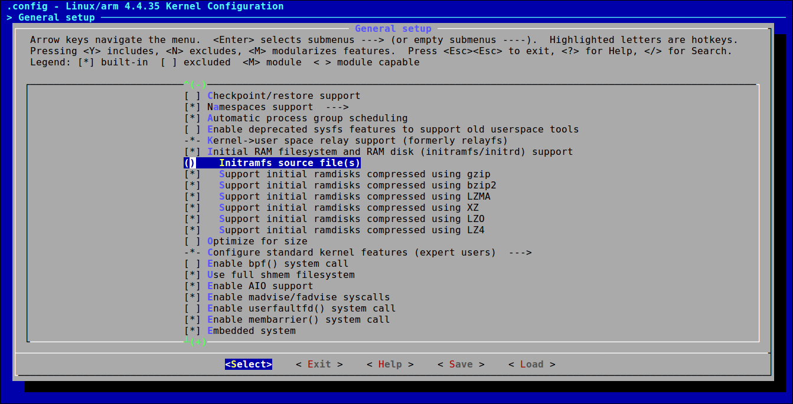

# Chapter 6 : User Space Initialization

###### tags: `gnitnaw` `twlkh`
這章是講系統初始化(請看第5章)以後的事。從現在開始，系統進入所謂的『後初始化』（user space階段）。

## 6.1 Root File System
`Kernel`除了有映像檔(`zImage`，在RPi則為`kernel.img`)要載入外，如果你的系統很複雜，有些時候可能還要載入一些module(你總不能全部塞到`zImage`裡頭讓他爆)，更多時候你還需要做一些自訂檔案輸入輸出(如程式操作或log file等)。所以檔案系統是很必要的。

根據[Filesystem Hierarchy Standard(FHS)](https://zh.wikipedia.org/zh-tw/%E6%96%87%E4%BB%B6%E7%B3%BB%E7%BB%9F%E5%B1%82%E6%AC%A1%E7%BB%93%E6%9E%84%E6%A0%87%E5%87%86)，我們可以知道這些目錄結構的用途。以下以RPi為例：
```
pi@raspberrypi:~ $ tree -L 1 /
/
├── bin
├── boot
├── dev
├── etc
├── home
├── lib
├── lost+found
├── media
├── mnt
├── opt
├── proc
├── root
├── run
├── sbin
├── srv
├── sys
├── tmp
├── usr
└── var

```
| 目錄 | 描述 |
| --- | --- |
|`/`|根目錄|
|`/bin`|**可供所有使用者執行的檔案。通常 Embedded linux 不可省略此部份。**|
|`/boot`|放置啟動程式檔案(如`zImage`或`device tree binary`等)，在RPi時為獨立分割區塊。|
|`/dev`|**`device node`集中處。 Embedded linux 不可省略此部份。**|
|`/etc`|**系統設定檔。 通常Embedded linux 不可省略此部份。**|
|`/home`|使用者的檔案所在目錄。|
|`/lib`|**系統函式庫，包含C標準函式庫(libc)或動態連結器(ld)等。 Embedded linux 不可省略此部份，在一般迷你系統中其也佔了大部份容量。**|
|`/lost+found`|沒法被`fsck`回復的檔案會被複製到此。|
|`/media`|為使用者隨身碟或CD之類的可移除裝置的掛載處，一般不需 super user 權限即可自動掛載。|
|`/mnt`|臨時掛載的檔案系統都掛在此目錄下。|
|`/opt`|沒有被包含在此distribution的第三方軟體可被安裝在此處(不然就是`/usr/local`)。|
|`/proc`|此目錄與其包含的檔案均為虛擬檔案系統(virtual filesystem)，不佔任何硬碟空間，其資料(例如系統核心、行程資訊等)都是在記憶體當中。|
|`/root`|super user的家目錄。|
|`/run`|用以放置系統開機後所產生的各項資訊。早期是放在`/var/run`。新版FHS則改到`/run`並可使用虛擬檔案系統以增進效能。|
|`/sbin`|必要的系統執行檔放置處，唯有super user才能使用這些執行檔去『改變』系統設定，一般使用者最多可用來『查詢』系統設定。|
|`/srv`|放置系統服務的資料或設定(一般不能給人看的資料還是放`/var/lib`)。|
|`/sys`|跟`/proc`跟`/dev`有點像，使用虛擬檔案系統，記錄核心與系統硬體資訊相關資訊。我記得以前使用 device tree 去讀sensor的時候，也是讀取掛在這的虛擬檔案去取值。|
|`/tmp`|所有使用者暫時放置檔案的地方，所有使用者都有權限讀取。|
|`/usr`|放置可分享但不可變動的資料，如函式庫檔案、標頭檔或應用程式等。|
|`/var`|常態性變動的檔案，包括系統中其內容不斷變化的檔案，如記錄檔等。|

:::info
本章關於`busybox`的部份會在Ch11詳細敘述。
:::

### 6.1.4 - 6.1.6 檔案系統的挑戰
要把能讓系統能完整運行的相關程式檔案全部塞進有限大小的flash memory其實沒想像容易。想像我們寫C程式去讀一個I2C介面的sensor好了，寫程式就要用到相關的標準函式庫，大部份標準函式庫又是靠系統呼叫去實作，系統呼叫也要建立在作業系統上，這些全都要塞到flash memory才能讓整個系統正常運作。不要以為現在Micro SD很便宜所以你隨便就有幾G可以用，現在毛利愈壓愈低的情況下你能省多少是多少，搞不好你能運用的儲存容量不到10MB。而現在Linux kernel愈做愈複雜，要能為了系統量身打造出必要的檔案系統也要花很多功夫。

一個很常用的方法是trial-and-Error ~~(真的假的阿？)~~ 。使用rpm或dpkg等套件管理亦可用於瞭解軟體或函式庫等之間的依賴關係(不過還是很麻煩)，不過仍有其侷限性(很難有效地去除不必要的package)。最近比較流行的有用方法是使用buildroot或bitbake等工具去做對硬體的客製化檔案系統。

:::info
本章關於buildroot或bitbake的部份會在Ch16詳細敘述。
:::

## 6.2 Kernel's Last Boot Steps
延續Ch5最後，`./init/main.c`中`kernel_init`最後的部份：
```C
(...)
    if (ramdisk_execute_command) {
        ret = run_init_process(ramdisk_execute_command);
        if (!ret)
            return 0;
        pr_err("Failed to execute %s (error %d)\n",
               ramdisk_execute_command, ret);
    }    

(...)
if (execute_command) {
        ret = run_init_process(execute_command);
        if (!ret)
            return 0;
        panic("Requested init %s failed (error %d).",        // 大家都不想看到的kernel panic
            execute_command, ret);
    }
    if (!try_to_run_init_process("/sbin/init") ||            // 在RPi，/sbin/init被link到/lib/systemd/systemd
        !try_to_run_init_process("/etc/init") ||
        !try_to_run_init_process("/bin/init") ||
        !try_to_run_init_process("/bin/sh"))
        return 0;
        
    panic("No working init found.  Try passing init= option to kernel. "
          "See Linux Documentation/init.txt for guidance.");
```
前面說過，`try_to_run_init_process`或`run_init_process`只是個封裝函式，用意是把引入的檔案名稱用`execve()`執行。如果`kernel_init`在命令列沒有收到關於 `ramdisk_execute_command` 的設定，然後那四個 `try_to_run_init_process` 找到一個可以run成功的執行檔，那個檔案就會被執行並取代原本這個`kernel_init` process(PID不變)。如果這四個地方都找不到那只好接panic了(因為`./init/main.c`內的函式只能被執行一次，失敗了不能重來，除非重開機)。

當然，為了要執行被`try_to_run_init_process`引入的可執行檔，執行`kernel_init`前要先把檔案系統掛載上去才行，不然kernel根本找不到`/sbin/init`或是此執行檔依賴的函式庫。問題就出在這了，有時候由於受限於硬體驅動程式(例如SATA硬碟，其驅動程式一般放在`/lib/modules`而不在Image裏面)，在執行`kernel_init`前根本沒法去掛載儲存裝置，既然還沒有掛載那你上哪找`/sbin/init`？臨時虛擬檔案系統(Initial RAM Disk/initrd 或 Initial RAM Filesystem/initramfs)就是為了解決這個問題：先把必要的檔案載入到記憶體中並虛擬成檔案系統讓系統可以執行，之後再釋放以及掛上真的檔案系統。

## 6.3 The init Process

這節講的[System V runlevel](https://zh.wikipedia.org/zh-tw/%E8%BF%90%E8%A1%8C%E7%BA%A7%E5%88%AB)在目前大多數的Linux系統(包括RPi)上已經被[`systemd`](https://zh.wikipedia.org/zh-tw/Systemd)取代。在RPi可以看到`/sbin/init`被link到`/lib/systemd/systemd`。`kernel_init`用`execve`去執行`/lib/systemd/systemd`後，`systemd`就會取代這個`kernel_init`並成為第1個user space產生的process(PID=1)。

`systemd` 取消了以前的 runlevel 概念改用target(還是有點相容啦)。~~這邊不多說看鳥哥比較快。~~

## 6.4 Initial RAM Disk (`initrd`)

`initrd`是用一部份記憶體模擬成一塊磁碟(就實際意義上它是一個真實的block device)然後把該『磁碟』掛到root上，等初始化差不多結束可以掛真的root的時候再卸載。不過既然是模擬成真實磁碟，那理所當然要有一個檔案系統(例如ext2)，也不能隨便改變大小；然後要使用這塊『磁碟』內的東西時，就要將其中的檔案載入到記憶體中... ~~明明就已經在記憶體的東西還要這樣幹的話就有點像脫褲子放屁~~。

要使用`initrd/initramfs`記得把kernel相關選項打開，如圖：


### 6.4.1 - 6.4.4 `initrd`的流程
- 開發者需將`initrd`的(壓縮過的)映像檔準備好，裏面包含必要的函式庫與執行檔。
- `bootloader`負責將`initrd`映像檔載入到記憶體中，放在`/initrd.image`。
    - 如果`bootloader`將kernel與`initrd`映像檔**分別載入**，那`bootloader`必須將`initrd`在記憶體的位址傳給kernel(可用command line等方式)。
    - 早前有些ARM系統會把kernel與`initrd`映像檔串起來一起載入，然後使用command line將`initrd`在記憶體的位址傳給kernel。不過此方式已被`initramfs`取代。
- `bootloader`將自己的工作結束，交接給`bootstrap loader`。
- `bootstrap loader`將自己的工作結束，交接給kernel(`start_kernel`)，然後一直執行到`rest_init`。
- `rest_init`分出一個`kthread`執行`kernel_init`，然後首先呼叫`kernel_init_freeable()`。
- 由於command line等方式告知kernel要載入`initrd`，`kernel_init_freeable`便呼叫`prepare_namespace()`函式，
- `prepare_namespace()`呼叫`initrd_load()`，將`/initrd.image`解壓縮後的內容塞到`/dev/ram0`，然後卸載`/initrd.image`。
- `initrd_load()`呼叫`handle_initrd()`，把`/dev/ram(0)`掛上根目錄`/`，隨後執行initrd上的`/linuxrc`，此檔案通常為一script，會把必要的module(例如硬碟相關)的modules先行從`/dev/ram(0)`載入。
- `/linuxrc`執行完畢，`/`被卸載，`/dev/ram0`的空間也會被釋放掉。
- `initrd_load()`執行完回到`prepare_namespace()`，mount真正的`/`。
- 跑完繼續`kernel_init_freeable()`然後回到`kernel_init`，根據6.2的步驟可以快快樂樂執行`/sbin/init`。

:::info
命令列(command line)設定中，若是加入`root=/dev/path`的設定，會使得以上步驟有如下改變：
- 執行`./linuxrc`的步驟會被省略。
- kernel不會卸載這個本來應該是臨時的根目錄，他會一直維持在那邊。當然之後的`prepare_namespace()`、`kernel_init_freeable()`和`kernel_init`會繼續跑下去。

RPi就是使用這樣的設定(在`/boot/cmdline.txt`中有`root=/dev/mmcblk0p2`)，`System.map`中也有`bcm2835_mmc_driver`的資訊，猜測在`kernel_init`階段(`do_basic_setup()`)kernel已經搞定了`bcm2835_mmc_driver`所以可以直接掛載`/dev/mmcblk0p2`不需特別準備`initrd`(也就是說一開始本來只是要暫時的假檔案系統但是很乾脆直接給真的)。
:::

:::info
根據jserv的文章：『kernel 永遠保留 PID=1 作為 init process 識別，而 `/linuxrc`執行的 PID 必非為 1』，關於如何執行`/linuxrc`的函式在[`init/do_mounts_initrd.c`](https://github.com/raspberrypi/linux/commit/ba4df2808a86f8b103c4db0b8807649383e9bd13)，這邊說明一下：
- 在kernel 3.6(包含之前)，執行`/linuxrc`是使用`kernel_thread`去新增一個thread去執行(使用`kernel_execve`)的 => 以此方式分出的process，其PPID為呼叫`kernel_thread`產生此process的PID，以本例來說就是PPID=1。
- 從kernel 3.7開始，改用`work queue`(`kworker`)去執行 => 以此方式分出的process，其PPID為`kthreadd`(`kernel_init`第1個分出的process為init，第2個則為`kthreadd`)的PID，以本例來說就是PPID=2。
- 不管是哪個版本，執行`/linuxrc`的process的PID都不會是1。
:::

## 6.5 initramfs
`initramfs`做的事跟`initrd`很像，但他們有本質上的不同：
|項目|`initrd`|`initramfs`|
|---|--------|-----------|
|載入/設定的時機|`prepare_namespace()`|`do_basic_setup()`(較`initrd`更為提前)|
|Image格式|壓縮過的(gzipped)檔案系統(如ext2)|cpio+gzip，使用上較方便，亦可顧及檔案權限(限root)|
|Image製作|跟kernel Image分開(也可串在一起)|被包在kernel image裏面|
|作法|ram disk(block device)|tmpfs(將cache掛載像個檔案系統，並把initramfs放在cache，需要的話直接從cache抓出來執行)|
|先執行的程式|`/linuxrc`|`/init`(若是ramdisk_execute_command沒有發現有另外指定檔案)|

要編譯`initramfs`的話是在`./usr`這個目錄裏面去做：
```
~/git/raspberry_kernel/linux/usr$ ls -l
total 60
-rw-rw-r-- 1 chen chen   988 Nov 18 20:27 built-in.o
-rwxrwxr-x 1 chen chen 19328 Nov 18 20:27 gen_init_cpio
-rw-rw-r-- 1 chen chen 13029 Sep 19 15:10 gen_init_cpio.c
-rw-rw-r-- 1 chen chen   134 Nov 18 20:27 initramfs_data.cpio.gz
-rw-rw-r-- 1 chen chen   916 Nov 18 20:27 initramfs_data.o
-rw-rw-r-- 1 chen chen  1307 Sep 19 15:10 initramfs_data.S
-rw-rw-r-- 1 chen chen  2978 Sep 19 15:10 Kconfig
-rw-rw-r-- 1 chen chen  2358 Sep 19 15:10 Makefile
```
編譯腳本則是放在`./scripts/gen_initramfs_list.sh`，預設的腳本為：
```bash
default_initramfs() {
        cat <<-EOF >> ${output}
                # This is a very simple, default initramfs

                dir /dev 0755 0 0    # 新增/dev 目錄，其權限為755，used-id/group-id 為0 (root)
                nod /dev/console 0600 0 0 c 5 1 #新增一node /dev/console，權限為0600，為character device，major=5，minor = 1
                dir /root 0700 0 0
                # file /kinit usr/kinit/kinit 0755 0 0
                # slink /init kinit 0755 0 0
        EOF
}       
```

若是使用`initramfs`，一般來說第一個執行的程式會是`/init`。但若是在命令列設定`rdinit=`相關指令去設定程式，就會改為執行該指定程式。

## 6.6 Shutdown
雖然關機程序一般來說不是那麼重要，針對shutdown、halt跟reboot還是要有不同的策略。
通常shutdown時要先發一個signal給所有process告知即將shutdown，讓他們有時間結束手上的工作，然後他們會發回`SIGKILL`表示已經終止。然後shutdown可以卸載磁碟然後進行指定的halt或reboot程序。

有一點要注意的是，若是使用ext2檔案系統，如果遇到不正常關機，那重新開機後系統可能會花上幾小時在`fsck`上。

## 參考資料
- [鳥哥第五章、Linux 的檔案權限與目錄配置](http://linux.vbird.org/linux_basic/0210filepermission.php)
- [鳥哥第十七章、認識系統服務 (daemons)](http://linux.vbird.org/linux_basic/0560daemons.php)
- [鳥哥第十九章、開機流程、模組管理與 Loader](http://linux.vbird.org/linux_basic/0510osloader.php)
- [What are the minimum root filesystem applications that are required to fully boot linux?](http://unix.stackexchange.com/questions/136278/what-are-the-minimum-root-filesystem-applications-that-are-required-to-fully-boo)
- [Jserv's bolg: 深入理解 Linux 2.6 的 initramfs 機制 (上)](http://blog.linux.org.tw/~jserv/archives/001954.html)
- [Linux2.6 内核的 Initrd 机制解析](https://www.ibm.com/developerworks/cn/linux/l-k26initrd/)
- [Richman 的雜記 -- initramfs 簡介，一個新的 initial RAM disks 的模型 ](http://blog.linux.org.tw/~jserv/archives/001954.html)
- [Al Viro's new execve/kernel_thread design](https://lwn.net/Articles/520227/)
- [Android 筆記-Linux Kernel SMP (Symmetric Multi-Processors) 開機流程解析 Part(4) Linux 多核心啟動流程-kthreadd 與相關的核心模組](http://loda.hala01.com/2011/09/android-%E7%AD%86%E8%A8%98-linux-kernel-smp-symmetric-multi-processors-%E9%96%8B%E6%A9%9F%E6%B5%81%E7%A8%8B%E8%A7%A3%E6%9E%90-part4-linux-%E5%A4%9A%E6%A0%B8%E5%BF%83%E5%95%9F%E5%8B%95%E6%B5%81/)