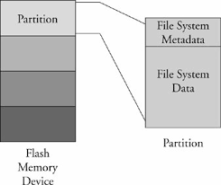
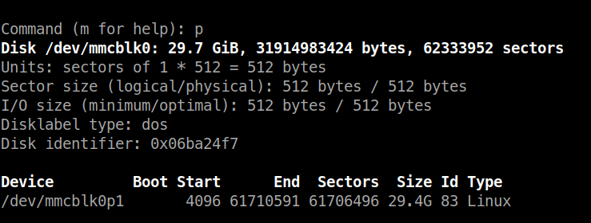
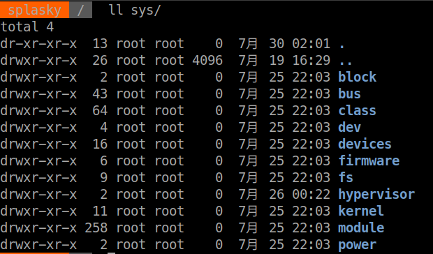

# Chapter 9: File system

# linux 檔案系統概念

## 分割區(partition)
* 把檔案系統的實體裝置做邏輯分割
* 資料存放在切割成數個分割區的實體裝置上
* 一個裝置可以有一個道術個不等的邏輯分割區
* 一個分割區是一個實體裝置(flash,disk)中，一塊邏輯切割區域，區域內的資料照著分割區的類型，按照一定的組織方法擺放。



在linux上我們可以利用`fdisk`來查看分割區資訊

## ext2
### fdisk

### mount
```
sudo mount /dev/mmcblk0 /mnt/sdcard
```
### e2fsck
檢查ext2/ext3/ext4檔案系統的完整性
```
sudo e2fsck /dev/sda
```
-y: fix block

# ext3
和ext2差別於多了日誌(journaling)，和資料庫系統的交易(transaction)作用相同。

## ext2和ext3轉換

```
tnue2fs -j /dev/sdb1
```
完成後會發現目錄下多了一支.journal檔案，下一次重新啟動系統時，會自動執行e2fsck，到時.journal就會被系統隱藏，的資料會被放進一個因特殊用途而保留下來的inode.

我們也可以指定將日誌檔案放於其他檔案系統
```
tnue2fs -J device=/dev/sda1 -j /dev/sdb1
```
# ext4
移除了檔案系統16TB的限制，最大可到1 exbibyte，單一檔案最大可到1024 GB

# ReiserFs 
和ext3一樣有日誌系統，有提供API給程式設計師。

# JFFS2
主要用於Flash的檔案系統

## 建構JFFS2 image
```
sudo apt install mtd-tools
mkfs.jffs2 -d ./jffs2-image-dir -o jffs2.bin
```
* -d:指定檔案系統樣板目錄
* -o:輸出檔名

# cramfs
目的是將檔案系統塞進ROM，所以cramfs是唯讀檔案系統

# NFS
掛載遠端nfs
```
mount -t nfs [HOSTNAME]:/home/xxx/xxx /workspace
```
將HSTNAME機器上的`/home/xxx/xxx`掛載到本地端的`/workspace`

kernel也要有組態支援
```
file system->network file system->root file system on nfs
```

加入核心命令列選項
```
console=ttyS0, 115200
ip=192.168.11.139:192.168.11.1:192.168.11.1:255.255.255.0:HOSTNAME:eht0:off
nfsroot=192.168.11.1:/HOSTNAME-target
root=/dev/nfs
```
ip=的參數定義放在Document/filesystem/nfsroot.txt

```
ip=<client-ip>:<server-ip>:<gw-ip>:<netmask>:<hostname>:<device>:<autoconf>
```

# 虛擬檔案系統(pseudo file systems)

## /proc file system
* 讓linux和process交換訊息的介面
* 利用`mount`(不帶任何參數)可以列出所有已經掛載的檔案系統
* 所有在核心中執行的使用者行程,都有一個/proc中的項目代號(PID)
* /proc本身也是被掛載的檔案系統，類型是proc,因此系統中最上層目錄必須要有一個掛載點/proc讓proc掛載
* 掛載proc:
    * mount -t proc /proc /proc
    * mount -t proc none /proc
    * 需要在核心模組中啟用
        * Pseudo File Systems->File Systems

我們可以從proc中得到一些有趣的資訊，像是`maps`可以得到虛擬記憶體區段和區段的屬性,`stack`可以得知堆疊的區段,`status`可以知道process的狀態。

## sysfs
和proc一樣sysfs並不是實體裝置,sysfs將特定實體裝置,建立模型並表示出來，並提供機制將裝置與裝置驅動程式聯繫。



sysfs存放的大部分資訊是提供給機器而分人類閱讀的格式，但是我們可以透過`systool`來幫助我們瀏覽目錄結構。

# 建構簡單的檔案系統
這裡我們會使用`loopback`裝置，將普通檔案當作一個區快來使用。

1. 從一個簡單的檔案開始
```
dd if=/dev/zero of=./l_image bs=1k count=512
```
2. 格式化檔案系統
```
mkfs.ext4 ./l_image
```
3. 裝置掛載
```
mount -o loop ./l_image /mnt/sdcard
```
完後你就可以對這個裝置~~上下其手了~~
# 參考資料
更多檔案系統的比較資料的資料可以參考[這裡](https://zh.wikipedia.org/wiki/%E6%96%87%E4%BB%B6%E7%B3%BB%E7%BB%9F%E7%9A%84%E5%AF%B9%E6%AF%94)