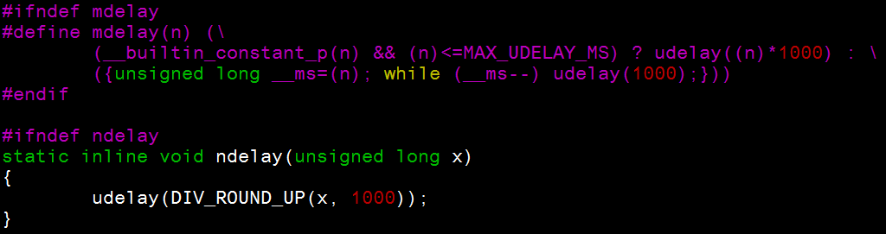
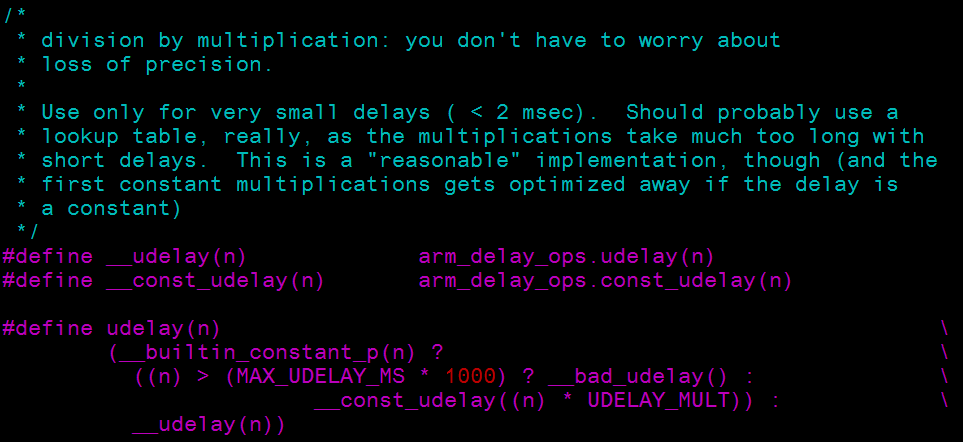
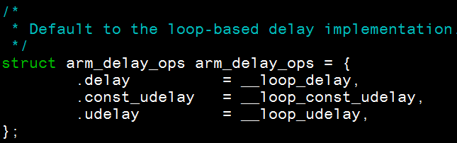
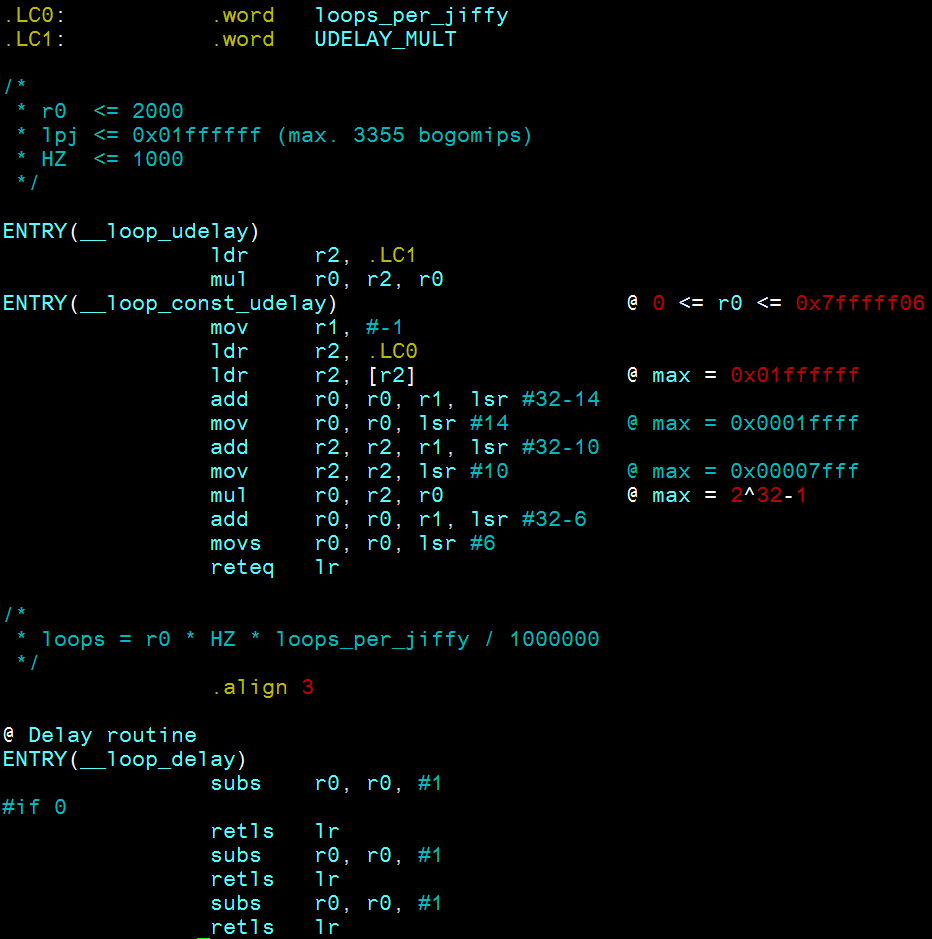
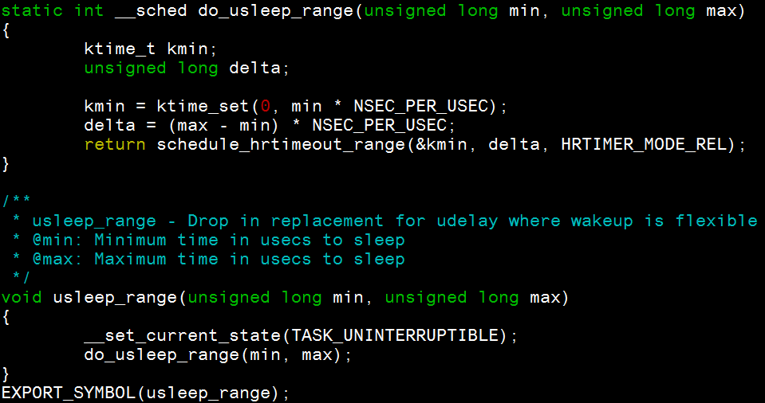
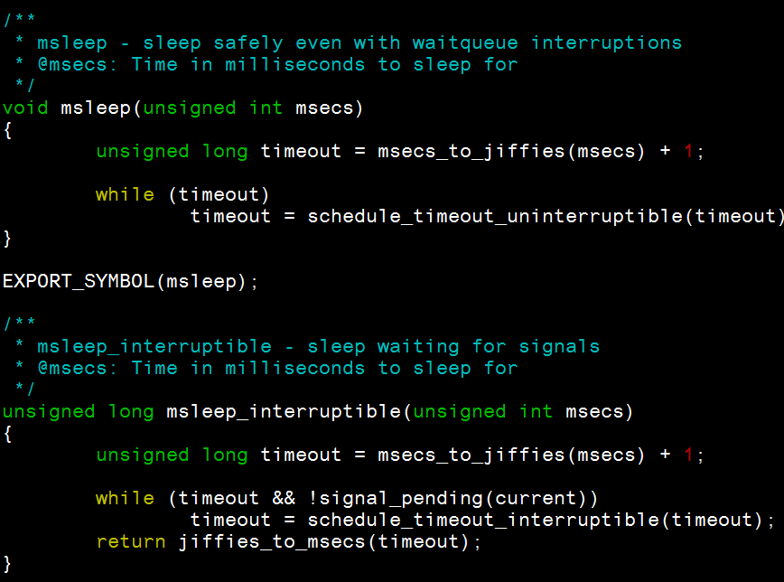

#Linux Kernel delay/ sleep 延遲函式學習筆記

		
在寫 Linux driver 時, 有時候會需要延遲幾秒再往下執行. 由其是處理 device driver 時最容易遇到.

雖然 Linux kernel 提供許多 delay/ sleep 相關延遲函式, 但, 究竟要使用哪一個函式最好 ?

該使用 delay or sleep …? 底下表格供大家參考 [1]

<table class="tg" style="height:168px;" width="769">
<tbody>
<tr>
<th style="text-align:center;" width="20%">程式屬性</th>
<th style="text-align:center;">
<h5><strong>Atomic context</strong></h5>
</th>
<th style="text-align:center;">
<h5><strong>Non-atomic context</strong></h5>
</th>
</tr>
<tr>
<td style="text-align:center;" width="20%"><strong>使用函式</strong></td>
<td style="text-align:center;"><strong>*delay </strong>function</td>
<td style="text-align:center;"><strong>&lt; 10 us </strong>: <strong>udelay </strong>

<strong>10 us ~ 20 ms</strong> : <strong>usleep_range </strong>

<strong>&gt; 10ms</strong> : 
<strong>msleep 或者 msleep_interruptible</strong>

</td>
</tr>
</tbody>
</table>

沒有最好的函式, 只有最適合的函式. 所以說 “<strong>使用時機很重要"</strong>

<h3><strong>使用時機:</strong></h3>

使用前先想想, 這個程式是不是 <strong>“atomic context" (不可以被中斷的連續動作) &nbsp;[1]</strong>

<h4><strong>√ Atomic context&nbsp;</strong></h4>

如果是 atomic context, 那務必使用 delay 相關的函式.

delay 相關函式有下列特點

<ul>
<li>使用 legacy timer (計算 jiffies)</li>
<li>實作為 busy waiting &nbsp;(所以很耗資源, 大量使用會造成效能下降)</li>
<li>建議預設使用 udelay</li>
<li>ndelay 在一些非PC的裝置上 &nbsp;ex: 嵌入式機器上, 也許會無法達到預期的精準</li>
<li>使用 mdelay 的整體程式都要仔細設計, 並且注意溢位的問題.</li>
</ul>

前兩點還可以接受, 個人對於後面幾點充滿了問號. 所以就 trace 了一下 delay 函式

<strong>1. ndelay 以及 mdelay 位於 include/linux/delay.h</strong>

由上圖可得知, ndelay 和 &nbsp;mdelay 實際上都是使用 udelay 來構成

<strong>2. udelay 位於 arch/arm/include/asm/delay.h </strong>

因為需要計算 loops_per_second, 因應每個 CPU 架構不同, 所以需放在 arch 下面.

<h5>

</h5>

udelay 實際上使用到 arm_delay_ops 結構中的 &nbsp;__loop_const_udelay callback 函式

而 __loop_const_udelay callback 函式位於&nbsp;arch/arm/lib/delay-loop.S. 由組合語言所組成 (這邊就不講細部運作內容. 網路上有許多這方面資訊)

看到這其實就可以瞭解, ndelay &amp; mdelay 由 udelay 組成, 需要再進行二次運算. 所以精準度當然不比直接使用組語的 udelay 好. 這也是為什麼建議預設使用 udelay 的原因.

<h4><strong>√&nbsp;</strong><strong>Non-atomic context</strong></h4>

如果程式為非 atomic context, 原則上是建議使用 sleep 函式. 可參考下列時機選用適當的延遲函式. 使用適合的延遲函式, 除了能寫出好的驅動程式外, 也能優化 scheduler/ power management

<h6><strong>1. 延遲時間為 &lt; 10us</strong></h6>

使用 <strong>udelay</strong>&nbsp; – &nbsp;基於busy-wait loop

<ul>
<li>udelay(unsigned long usecs)</li>
</ul>

如同之前所提, udelay 使用 busy-waiting loop. 為什麼用 udelay 而不是&nbsp;usleep 呢

[1] 裡面給的解釋為, 在一些效能較低的系統內, 像 Embedded platform 等等. 若使用 hrtimer 系統的overhead 會過高.

<h6><strong>2. 延遲時間為 10us ~ 20ms</strong></h6>

使用&nbsp;<strong>usleep_range</strong>&nbsp; – &nbsp;基於 hrtimers

<ul>
<li>usleep_range(unsigned long min, unsigned long max)</li>
</ul>

&gt; 為什麼 1ms ~ 20ms 不使用 msleep ?

照理說 ms 等級應該使用 msleep. 但無論 msleep 1~20ms &nbsp;通常結果都會是 20ms (詳情可參考 [2]). 所以才需使用 usleep 等級的延遲函數.

&gt; 為什麼不叫 usleep.

由於 usleep_range 是基於 hrtimers, &nbsp;精準的 usleep 會帶來許多不必要的中斷 [3], 若有一個 range , 除了能讓 scheduler 具備彈性去調整優化執行順序, 也能確保在 upper bound 執行完畢.

至於 lower bound/ upper bound 的大小則會因不同情況有所不同. 這邊的經驗是要根據系統本身以及 device 本身的規格以及行為來加以實驗調校.

usleep_range 位於 kernel/time/timer.c

主要是呼叫 hrtimers 相關函式來達到延遲目的.

<h6><strong>3. 延遲時間為 &gt; 10ms&nbsp;</strong></h6>

使用 <strong>msleep&nbsp;</strong>或者&nbsp;<strong>msleep_interruptible</strong>&nbsp; – &nbsp;基於 jiffies / legacy_timers

<ul>
<li>msleep(unsigned long msecs)</li>
<li>msleep_interruptible(unsigned long msecs)</li>
</ul>

&gt; msleep 和 msleep_interruptible 的差別在哪?

差別是 msleep 關閉中斷, &nbsp;msleep_interrruptible 則可接收中斷. 如果不知道要選哪一個, 則建議使用 msleep. 除非非常確定程式需要接收中斷事件

msleep 相關延遲函式位於&nbsp;kernel/time/timer.c

主要由 legacy timers/ jiffies 所組成的函式.&nbsp;關於 hrtimers 跟 legacy timer 可參考 [4][5].

<h3><strong>心得:</strong></h3>

根據這些基礎知識來搭配不同使用時機, 我們能夠找出較適合的延遲函式.

在處理 device driver 時, 以個人經驗較多使用 usleep_range, 主要是避免週邊元件自身的 state machine 因系統存取資源太快而導致週邊元件上的系統 crash.

但記得, 千萬不能在處理非 thread IRQ 的 interrupt handlers 函式使用 delay/ sleep 等等的延遲函式. 因為關閉中斷的原故, 所有系統都會等你 IRQ function 結束. 因此 interrupt handlers 要越快執行結束越好.

ref:

[1]:&nbsp;https://www.kernel.org/doc/Documentation/timers/timers-howto.txt

[2]:&nbsp;http://lkml.org/lkml/2007/8/3/250

[3]:&nbsp;https://lkml.org/lkml/2010/6/21/267

[4]:&nbsp;https://www.kernel.org/doc/Documentation/timers/hrtimers.txt

[5]:&nbsp;https://hackpad.com/ep/pad/static/6kHr832ZT7S

	