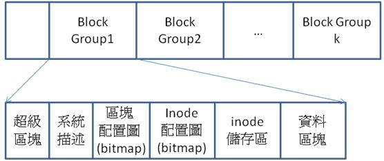
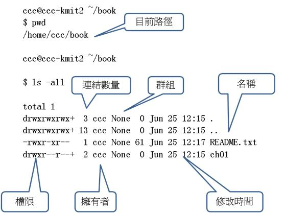
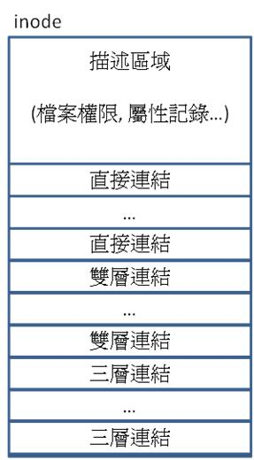
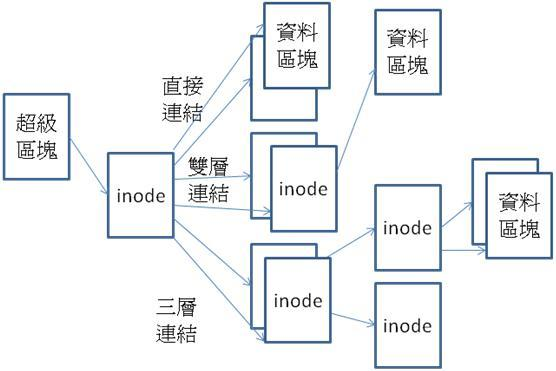
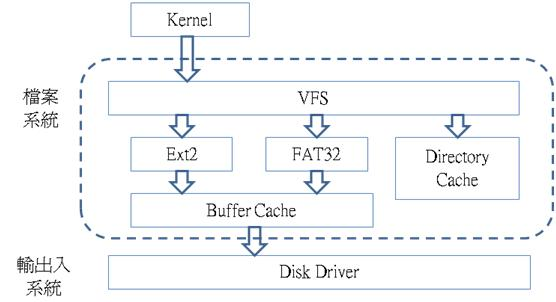

# Linux 的檔案系統

在 UNIX/Linux 的使用者的腦海中，檔案系統是一種邏輯概念，而非實體的裝置。這種邏輯概念包含『檔案』、『目錄』、『路徑』、『檔案屬性』等等。我們可以用物件導向的方式將這些邏輯概念視為物件，表格 1 就顯示了這些物件的範例與意義。

表格 1. 檔案系統中的基本邏輯概念

<table class="wiki-content-table">
<tbody><tr>
<th>概念</th>
<th>範例</th>
<th>說明</th>
</tr>
<tr>
<td>路徑</td>
<td>/home/ccc/hello.txt</td>
<td>檔案在目錄結構中的位置</td>
</tr>
<tr>
<td>目錄</td>
<td>/home/ccc/</td>
<td>資料夾中所容納的項目索引 (包含子目錄或檔案之屬性與連結)</td>
</tr>
<tr>
<td>檔案</td>
<td>Hello!\n…</td>
<td>檔案的內容</td>
</tr>
<tr>
<td>屬性</td>
<td>-rwxr-xr— …ccc None 61 Jun 25&nbsp;12:17 README.txt</td>
<td>檔案的名稱、權限、擁有者、修改日期等資訊</td>
</tr>
</tbody></table>

Linux 檔案系統的第一層目錄如表格 2 所示，認識這些目錄才能有效的運用 Linux 的檔案系統，通常使用者從命令列登入後會到達個人用戶的主目錄，像是使用者 ccc 登入後就會到 /home/ccc 目錄當中。目錄 /dev 所代表的是裝置 (device)，其中每一個子目錄通常代表一個裝置，這些裝置可以被掛載到 /mount 資料夾下，形成一顆邏輯目錄樹。

表格 2. Linux 檔案系統的第一層目錄

<table class="wiki-content-table">
<tbody><tr>
<th>目錄</th>
<th>全名</th>
<th>說明</th>
</tr>
<tr>
<td>/bin</td>
<td>Binary</td>
<td>存放二進位的可執行檔案</td>
</tr>
<tr>
<td>/dev</td>
<td>Device</td>
<td>代表設備，存放裝置相關檔案</td>
</tr>
<tr>
<td>/etc</td>
<td>Etc…</td>
<td>存放系統管理與配置檔案，像是服務程式 httpd 與 host.conf 等檔案。</td>
</tr>
<tr>
<td>/home</td>
<td>Home</td>
<td>用戶的主目錄，每個使用者在其中都會有一個子資料夾，例如用戶 ccc 的資料夾為 /home/ccc/</td>
</tr>
<tr>
<td>/lib</td>
<td>Library</td>
<td>包含系統函式庫與動態連結函式庫</td>
</tr>
<tr>
<td>/sbin</td>
<td>System binary</td>
<td>系統管理程式，通常由系統管理員使用</td>
</tr>
<tr>
<td>/tmp</td>
<td>Temp</td>
<td>暫存檔案</td>
</tr>
<tr>
<td>/root</td>
<td>Root directory</td>
<td>系統的根目錄，通常由系統管理員使用</td>
</tr>
<tr>
<td>/mnt</td>
<td>Mount</td>
<td>用戶所掛載上去的檔案系統，通常放在此目錄下</td>
</tr>
<tr>
<td>/proc</td>
<td>Process</td>
<td>一個虛擬的目錄，代表整個記憶體空間的映射區，可以透過存取此目錄取得系統資訊。</td>
</tr>
<tr>
<td>/var</td>
<td>Variable</td>
<td>存放各種服務的日誌等檔案</td>
</tr>
<tr>
<td>/usr</td>
<td>User</td>
<td>龐大的目錄，所有的使用者程式與檔案都放在底下，像是 /usr/src 中就存放了 Linux 核心的原始碼， 而 /usr/bin 則存放所有的開發工具環境，像是 javac, java, gcc, perl 等。(若類比到 MS. Windows，此資料夾就像是 C:\Program Files)</td>
</tr>
</tbody></table>

然而，檔案畢竟是儲存在區塊裝置中的資料，要如何將這些概念化為區塊資料的組合，必須依賴某些資料結構。為了能將目錄、檔案、屬性、路徑這些物件儲存在區塊當中。這些區塊必須被進一步組織成更巨大的單元，這種巨型單元稱為分割 (Partition)。

在 MS. Windows 中，分割是以 A: B: C: D: 這樣的概念形式呈現的。一個分割概念再 Windows 中通常稱為『槽』。由於歷史的因素，通常 A: B: 槽代表軟碟機，而 C:槽代表第一顆硬碟，D: E: …. 槽則可能是光碟、硬碟、或隨身碟等等。

但是並非一個槽就代表單一的裝置，有時一個裝置會包含好幾個分割，像是許多人都會將主硬碟進一步分割成兩個 Partition，形成 C: D: 兩個槽，但實際上卻儲存在同一個硬碟裝置中，Linux 中的 Partition 的概念也與 Windows 類似，但是命名方式卻有所不同。

在Linux 中並沒有槽的概念，而是直接將裝置映射到 /dev 資料夾的某個檔案路徑中。舉例而言，第一顆硬碟的第一個分割通常稱為 /dev/hda1，第二個分割則為 /dev/hda2, …。而第二顆硬碟的第一個分割區則為 /dev/hdb1，…。軟碟則被映射到 /dev/sda1, /dev/sda2, …./dev/sdb1, ….，以此類推。

在 Linux 中，我們可以利用 mount 這個指令，將某個分割 (槽) 掛載到檔案系統的某個節點中，這樣就不需要知道某個資料夾 (像是 /mnt) 到底是何種檔案系統，整個檔案系統形成一顆與硬體無關的樹狀結構。舉例而言，mount -t ext2 /dev/hda3 /mnt 這個指令可以將Ext2格式的硬碟分割區 /dev/hda3 掛載到 /mnt 目錄下。而 mount -t iso9600 -o ro /dev/cdrom /mnt/cdrom 這樣的指令則可將 iso9600 格式的光碟 /dev/cdrom 以唯讀的方式掛載到 /mnt/cdrom路徑當中。當然，我們也可以用 unmount 指令將這些掛載上去的裝置移除。

當我們使用 ls -all 這樣的指令以列出資料夾中的目錄結構時，看到的就是這些概念所反映出的資訊。圖 1 就顯示了 ls 指令所呈現出的資訊與所對應的概念 。

