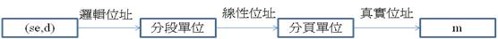
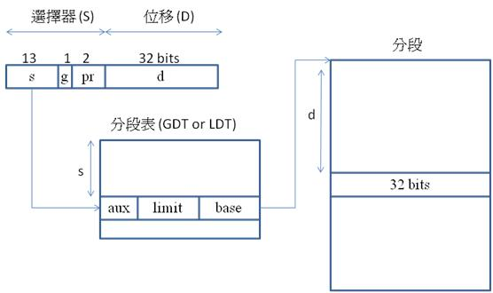
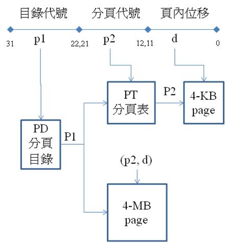
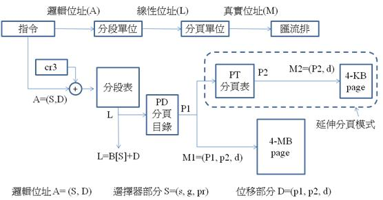
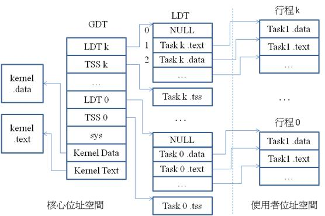

# Linux 的記憶體管理

Linux 作業系統原本是在 IA32 (x86) 處理器上設計的，由於 IA32 具有 MMU 單元，因此大部分的 Linux 都預設支援虛擬記憶體機制。然而，在許多的嵌入式處理器中，並沒有 MMU 單元，於是有 Jeff Dionne 等人於 1998 年開始將 Linux 中的 MMU 機制去除並改寫，後來釋出了不具有 MMU 的 µClinux 版本。

曾經有一段時間，嵌入式的系統開發者必須決定應使用具有 MMU 的 Linux 或不具 MMU 的 µClinux，但是後來在2.5.46版的 Linux 中，決定將 µClinux 納入核心中，所以後來的 Linux 核心已經包含了 µClinux 的功能，可以選擇是否要支援 MMU 單元。

由於 Tovarlds 最早是在 IA32 (x86) 中發展出 Linux 作業系統的，因此 Linux 的記憶體管理機制深受 x86 處理器的影響。要瞭解 Linux 的記憶體管理機制，首先必須先理解 x86 的MMU 記憶體管理單元。

##IA32 (x86) 的記憶體管理單元

Intel 的 IA32 (Pentium處理器) 採用了 GDT 與 LDT 兩種表格，其中的 LDT 分段表 (Local Descriptor Table) 是給一般行程使用的，而 GDT 分段表 (Global Descriptor Table) 則包含各行程共享的分段，通常由作業系統使用。

IA32 同時具有分段與分頁單元，可以支援『純粹分段』、『單層分頁式分段』與『雙層分頁式分段』等三種組合。其『邏輯位址』 (Logical Address) 經過分段單位轉換後，稱為『線性位址』 (Linear Address)，再經過分頁單位轉換後，稱為真實位址 (Physical Address)。其簡要的轉換過程如圖 1 所示。

圖 1. IA32的兩階段位址轉換過程

IA32 邏輯位址 (虛擬位址) 的長度是 48 位元，分為選擇器 S (selector : 16 bits) 與偏移量 D (offset : 32bits) 兩部分。其中的選擇器欄位中的pr兩個位元用來記錄保護屬性，g位元記錄表格代碼 (可指定目標表格為 GDT 或 LDT)，另外13個位元則記錄分段碼 (s)。

IA32的分段表LDT與GDT各自包含4096個項目，每個項目都含有 『分段起始位址』 (base)、『分段長度』 (limit) 與數個『輔助位元』 (aux) 等三種欄位。其中 base 與 limit 的功能與一般分段表相同，而輔助位元則用來記錄分段屬性。這兩個表格都可以用來將邏輯位址轉換成線性位址，是 IA32 中的分段單元。詳細的轉換過程如圖 2 所示。

圖 2. IA32分段模式

除了選擇器 (S) 的分段轉換過程之外，位移 (D) 部分會經過分頁表轉換成真實位址。位移 (D) 可再細分為三段 (p1, p2, d)，其中的 p1 式分頁目錄代號，p2式分頁表代號，而 d 則是分頁內位移。IA32 可以不採用分頁機制，或採用單層分頁機制，甚至可以採用雙層分頁機制。其中的分頁目錄 PD 是第一層分頁，分頁表 PT 則是第二層分頁。當採用單層分頁時，每頁的大小為 4-MB。而採用雙層分頁時，每頁的大小為 4-KB。圖 3 顯示了IA32 的分頁機制之轉換過程。

圖 3. IA32的分頁模式

IA32 可以不使用分頁機制，直接將分段後的線性位址輸出，此時相當於一般的分段模式，其輸出位址如圖 4 中的 L 所示。如果使用單層分頁機制，則相當於一般的分段式分頁，其輸出位址如圖 4 中的 M1 所示。如果採用兩層分頁機制，則形成雙層分頁式分段體系，其輸出位址如圖 4 中的 M2所示。圖 4 顯示了IA32 MMU單元完整的轉換過程。

圖 4. IA32的分頁式分段模式

從 IA32 的 MMU 單元設計中，我們可以看到 IA32 處理器留下了相當大的選擇空間給作業系統，作業系統可以自行選擇使用哪一種分段分頁機制，這與作業系統的設計有密切的關係。

##Linux 的記憶體管理機制

X86 版本的 Linux 利用 GDT 指向核心的分頁，然後用 LDT 指向使用者行程的分頁。LDT 中所記載的是各個行程的分段表，以及行程的狀態段 (Task State Segment : TSS)。而 GDT 中則會記載這些分段表的起始點，TSS 起始點，以及核心的各分段起點。圖 5 顯示了 x86 版的 Linux 的分段記憶體管理機制。

