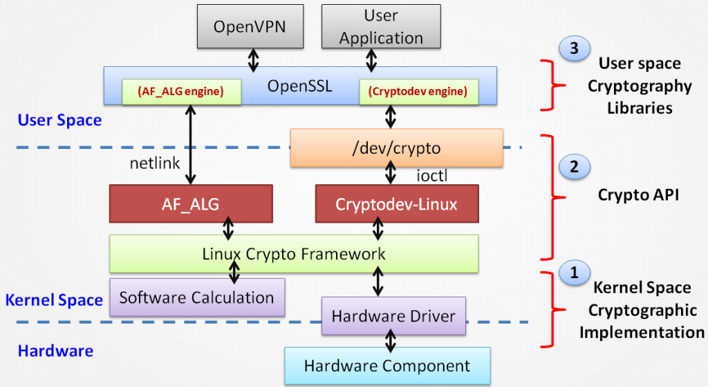

# 密碼學演算法實作流程

		
Linux&nbsp;密碼學演算法實作可分成

<ul>
<li>User space layer 實作</li>
<li>Kernel space layer 實作</li>
</ul>

在 user space 上想要使用密碼學演算法, 只要安裝並且執行 openssl 這類套件即可. 但是加解密的軟體運算在 user space 上實作耗時又費力, 不太適用於嵌入式設備. 所以我們可以透過 kernel space/ 硬體的協助來對加解密的效能進行優化, 並降低 CPU 運算負擔.

此篇文章介紹Linux <strong>Kernel space 密碼學演算法實作流程</strong>為主, 並沒有涵蓋 user space 中純應用程式的實作, 也不會細談各個加解密演算法.

一般而言, 密碼學演算法 (Cryptographic Algorithm) 分成下列三種

<h4><strong>1. 對稱加解密演算法&nbsp; (Symmetric-key algorithm)</strong></h4>

加解密使用同一把金鑰

<ul>
<li>AES [1]</li>
<li>…</li>
</ul>
<h4><strong>2. 非對稱加解密演算法 (Asymmetric key algorithms) [6]&nbsp;</strong></h4>

加解密使用 一對 public/ private 金鑰. 通常使用 public 金鑰加密, private 金鑰解密. 也可以使用 private 金鑰進行信任簽章. public 金鑰進行簽章確認.

<ul>
<li>RSA [2]</li>
<li>Curve25519 [3]</li>
<li>…</li>
</ul>
<h4><strong>3. 雜湊函數 (hash function)</strong></h4>

不以加解密為目的, 而是為了<strong>確保資料完整性 (integrity)</strong>.&nbsp;雜湊函數需具備不可逆性且雜湊值不可碰撞.

<ul>
<li>SHA-2 [4]</li>
<li>SHA-3 [5]</li>
<li>…</li>
</ul>

<strong>note</strong>: 此篇文章目的不在介紹密碼學演算法, 所以以上只是簡略介紹. 有興趣深入瞭解可以私下討論.

在 Linux 中, 有關 kernel space 到 user space 密碼學演算法實作資料路徑, 可見下圖

(以 OpenSSL 為例):

<strong>note</strong>: 不放入廠商私有實作方法

由上圖可知, 在 Linux &nbsp;user space application上使用 kernel space 密碼學演算法, 詳細運作流程可分成下列三個主要步驟

<h4><strong>1. Kernel space 密碼學演算法實作 (Kernel Space Cryptographic Implementation)</strong></h4>

在Kernel space 密碼學演算法實作上, 主要分成軟體以及硬體運算

<h5><strong>√</strong><strong> 軟體運算 (Software calculation)</strong></h5>

由 CPU 進行密碼學演算法運算, 不需額外硬體, 但很耗費 CPU 效能. Linux Kernel 原始碼位於&nbsp;<strong>crypto </strong>subsystem 底下

<h5><strong>√&nbsp;</strong><strong>硬體加速 (Hardware component)</strong></h5>

由硬體輔助進行密碼學演算法運算 (offloading), 不需耗費 CPU 效能, 但需要額外硬體.

<ul>
<li><strong>SoC Component</strong> – 許多 ARM SoC 廠商都會將硬體加解密元件放入 SoC 中,&nbsp;Linux Kernel 原始碼多位於 <strong>drivers/crypt</strong><strong>o</strong> &nbsp;底下. &nbsp;且設計必須遵照 Linux crypto framework, 不能私下修改 [20]</li>
<li><strong>TPM [11] –</strong> 專門針對保護金鑰與密碼運算而設計的一個高安全性的硬體安全晶片,&nbsp;Linux Kernel 原始碼位於 <strong>drivers/char/tpm&nbsp;&nbsp;</strong>底下</li>
</ul>

另外像 Intel 有推出 CPU instructions – Intel® AES NI [9]. 這或許也算硬體加速的一種.

<h4><strong>2.&nbsp;Crypto API – User space interface</strong></h4>

主要的功能是提供介面, 讓 user space 可存取 kernel space. 目前主流為 cryptodev 以及 af_alg

<h5><strong>√&nbsp;CRYPTODEV&nbsp;[12]</strong></h5>
<ul>
<li>不在 Linux Kernel 中, 需要額外下載, 編譯並掛載 kernel module</li>
<li>使用 ioctl 介面</li>
<li>從 OpenBSD Cryptographic Framework 移值過來</li>
<li>OpenSSL 早期即支援&nbsp;cryptodev</li>
</ul>
<h5><strong>√&nbsp;AF_ALG [13][14]</strong></h5>
<ul>
<li>Linux Kernel&nbsp;2.6.38 開始納入, 原始碼位於<strong> crypto/af_alg.c</strong></li>
<li>使用&nbsp;netlink 介面</li>
<li><strong>OpenSSL v1.1.0</strong> 開始支援 AF_ALG [15] (note: 除此之外, OpenSSL v1.1.0 加入 ChaCha20 &amp; Poly1305 加解密演算法並且移除 SSv2)</li>
</ul>

cryptodev 官網上表示使用 cryptodev 效能較 AF_ALG 好, 但根據 [17] 的實驗, 效能其實差異不大.

個人認為新開發的程式可以考慮使用 AF_ALG. 畢竟 AF_ALG 在 mainline Kernel 中 – 穩定性, 相容性以及維護性都會比較好.

<h4><strong>3. User space 密碼學函式庫 (Cryptography libraries) [7]</strong></h4>

以下為較常見的&nbsp;User space 密碼學函式庫 [19],

<ul>
<li>OpenSSL</li>
<li>wolfSSL</li>
<li>GnuTLS</li>
<li>…</li>
</ul>

個人推薦 OpenSSL. 除了牌子老, 使用者眾外. OpenSSL 也被 Linux Foundation 下 Core Infrastructure Initiative 所資助 [8].

OpenSSL 提供 AF_ALG 以及 cryptodev 的 engine, 可透過 engine 來存取 Crypto API. 但這邊要注意的是, <strong>Debian 中 OpenSSL 套件預設關閉&nbsp;AF_ALG 以及 cryptodev 選項</strong>. 所以直接執行會使用 user space 的密碼學演算法實作. 若想要使用kernel&nbsp;space 的密碼學演算法實作,&nbsp;需下載原始碼下來設定並重新編譯.

<h5><strong>√&nbsp;開啟 OpenSSL AF_ALG engine 步驟</strong></h5>

&gt; 修改&nbsp;<strong>debian/rules</strong>, 在 CONFARGS 最後面加入 &nbsp;<strong>enable-afalgeng</strong>

<h5><strong>√&nbsp;開啟 OpenSSL cryptodev engine&nbsp;</strong><strong>步驟</strong></h5>

1. 下載 cryptodev 後, 將<strong> crypto/cryptodev.h&nbsp;</strong>[21] 複製一份到 OpenSSL/crypto 底下

2.&nbsp;修改&nbsp;<strong>debian/rules</strong>, 在 CONFARGS 最前面加入<strong> -DHAVE_CRYPTODEV -DUSE_CRYPTDEV_DIGESTS</strong>

編譯完的 OpenSSL 即可存取 Kernel space 密碼學演算法.

<strong>心得:</strong>

由上述可知, 每一個步驟都有可選用的解決方法.

透過深入瞭解 Linux 密碼學演算法實作流程, 我們就可以根據系統的規格, 週邊裝置以及應用程式需求來找到適合的方法.

說不定到最後用 user space 的加解密函式庫是最佳的解決方案 

ref:

[1]:&nbsp;https://en.wikipedia.org/wiki/Advanced_Encryption_Standard

[2]:&nbsp;https://en.wikipedia.org/wiki/RSA_(cryptosystem)

[3]:&nbsp;https://en.wikipedia.org/wiki/Curve25519

[4]:&nbsp;https://en.wikipedia.org/wiki/SHA-2

[5]:&nbsp;https://en.wikipedia.org/wiki/SHA-3

[6]:&nbsp;https://www.kernel.org/doc/Documentation/crypto/asymmetric-keys.txt

[7]:&nbsp;https://en.wikipedia.org/wiki/Comparison_of_cryptography_libraries

[8]:&nbsp;https://www.coreinfrastructure.org/grants

[9]:&nbsp;https://en.wikipedia.org/wiki/AES_instruction_set

[10]:&nbsp;https://en.wikipedia.org/wiki/Hardware_security_module

[11]:&nbsp;https://szlin.me/2017/01/07/%E5%88%9D%E6%8E%A2-tpm-2-0/

[12]:&nbsp;http://cryptodev-linux.org/

[13]:&nbsp;https://www.kernel.org/doc/Documentation/crypto/userspace-if.rst

[14]:&nbsp;https://lwn.net/Articles/410763/

[15]:&nbsp;https://www.openssl.org/news/openssl-1.1.0-notes.html

[16]:&nbsp;https://events.linuxfoundation.org/sites/events/files/slides/lcj-2014-crypto-user.pdf

[17]: <a href="http://events.linuxfoundation.org/sites/events/files/slides/2017-02%20-%20ELC%20-%20Hudson%20-%20Linux%20Cryptographic%20Acceleration%20on%20an%20MX6.pdf" rel="nofollow">http://events.linuxfoundation.org/sites/events/files/slides/2017-02%20-%20ELC%20-%20Hudson%20-%20Linux%20Cryptographic%20Acceleration%20on%20an%20MX6.pdf</a>

[18]:&nbsp;https://www.slideshare.net/nij05/slideshare-linux-crypto-60753522

[19]:&nbsp;https://en.wikipedia.org/wiki/Comparison_of_cryptography_libraries

[20]:&nbsp;https://patchwork.kernel.org/patch/9192881/

[21]:&nbsp;https://github.com/cryptodev-linux/cryptodev-linux/blob/master/crypto/cryptodev.h

[22]:&nbsp;https://www.slideshare.net/nij05/slideshare-linux-crypto-60753522

