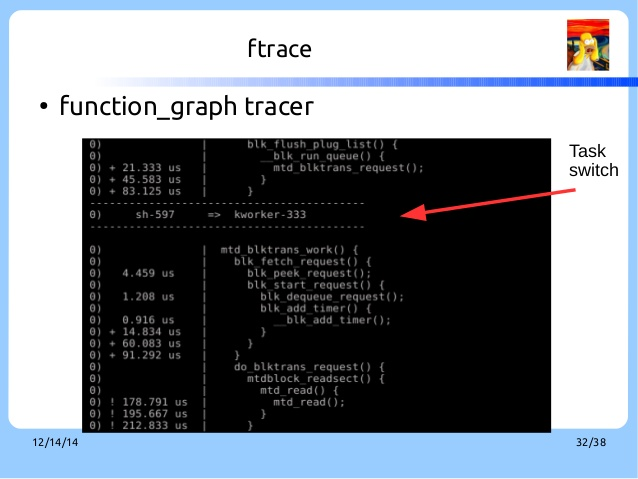

# Trace Kernel 程式的一些小技巧
---

###### tags: `twlkh`, `tracing`
(有些東西懶得打或是截圖，表達不清的地方歡迎自行修改)

由於 kernel 程式龐大，又有各種不同的 configuration 以及除錯程式。對於程式的瞭解常常帶來困擾，這邊整理一下自己以前常用的小技巧。

# 編譯時期的小技巧

C 語言中常常透過 preprocess 時期的 macro 來簡化程式或是在  compile time 來過濾不同的程式碼。但是我們在追蹤程式時就必須去了解這些 macro 何時會被定義？我們目前是否可以直接使用等。 

## 處理 preprocess macro 造成的麻煩
透過 `-save-temps` 的 CFLAGS ，我們可以在編譯時期吐出經過 preprocess 的中間檔，可透過這個檔案過濾掉在我們目前的系統不需要的設定以及擴展 macro，方便我們瞭解目前的程式行為。

## 檢查及搜尋 Kconfig 參數設定
Kconfig 語法中允許我們可以定義 config 變數、文字簡述、完整 help 訊息，另外有相依性的設定（`depend`、`select`）。我們在由最後產生的檔案（`.config`）可以看出哪些變數有被定義哪些沒有。但是要進一步瞭解這些參數的真正意義及在 `menuconfig` 中尋找這些變數的頁面卻像大海撈針。

`menuconfig` 有提供搜尋功能方便我們尋找。使用方式如同 vim 搜尋字串一般，當我們進入選單時，按 `/`，就會跳出搜尋選單，此時輸入欲搜尋的變數，例如 `FOO_EN` （不需完整字串）， `menuconfig` 就可搜尋出相關的變數，以及他們所有的資訊，包含相依性、被哪些變數選取、在 `menuconfig` 中的目錄階層等。

## 透過 kbuild 控制單一檔案的 CFLAGS
透過 gdb 除錯 kenrel 程式通常會需要開啟 `-g -O0` 的 CFLAGS 以減少程式被編譯器最佳化帶來的影響。由於 kernel 程式龐大，若是統一開啟 `-g -O0` 會使得最後編出的 kernel image 過於龐大。若是記憶體受限的話常常發現不能使用的問題。

kbuild 提供一些方面的語法讓我們可以簡單的新增／移除特定的檔案的某個 CFLAGS。假設我們要為 foo.o 新增CFLAGS，語法如下，
~~~
CFLAGS_foo.o= -g -O0
~~~

移除 CFLAGS 則為

~~~
CFLAGS_REMOVE_foo.o= -Os
~~~

透過這個方式可修改某個特定檔案的編譯參數。另外 kbuild 有方式可以對整個目錄修改。

# 善用 ftrace
初期閱讀程式碼時會有一個困難，由於程式碼多，且每個函數在架構上的定位不同，透過 naming rule 我們可以簡單做一些判斷。此外，我們可以透過 ftrace 來知道函數的執行環境。

如下圖的 function graph，我們可以看到函數的 call stack 及被執行的程序等資訊。

ftrace 可以建立一些簡單過濾的條件，包含 `*` 等規則，方便我們只開啟感興趣的子系統函數。可參考 [2] 中的 `available_filter_functions` 與 `set_ftrace_filter`。

# 透過 qemu 來取得 runtime 的結果
透過 Qemu 觀察 kernel 的行為有以下的好處，
1. Qemu 啟動時加入 `-s` 會啟動 gdbserver，可以透過 gdb 連接到模擬的硬體。與一般真實硬體不同的是：透過 gdb 把 target 停下來時，周邊硬體的行為也是停止的。所以我們不會遇到除錯時一停下來就會因為硬體中斷造成的困擾。加入 `-S` 的參數讓硬體剛啟動時就停下來等 gdb 的連接。
2. Qemu 有提供 instruction trace 的功能（啟動時加入參數 `-d op -D /path/to/your/log/file`）。我們可以讓 target 自由執行一段時間，再回頭分析執行流程即可。

詳細使用請看 Qemu 的 help 輸出訊息。

但是使用上也有一些缺點，
1. Qemu 實現的硬體功能有時不是那麼完全，例如有一段時間 Cortex-A 的 secure 相關的硬體功能並沒有實現，MIPS 的 多核心/多執行緒也是最近才有看到相關 patch，開發板要看有支援哪些，周邊支援是否齊全。
2. Qemu 沒有 cache 的概念，所以相關的功能只能大概參考。但是對於瞭解程式流程是沒問題的。

# Reference
1. [kernel kbuild makefile](https://www.kernel.org/doc/Documentation/kbuild/makefiles.txt)
2. [kernel ftrace documenation](https://www.kernel.org/doc/Documentation/trace/ftrace.txt)
3. [small talk about dynamically trace code](http://www.slideshare.net/vh21/trace-kernel-code-tips)