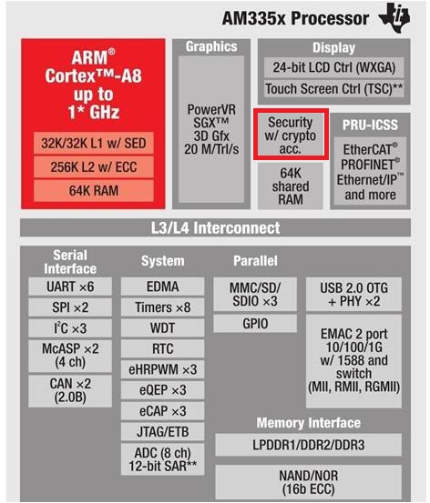
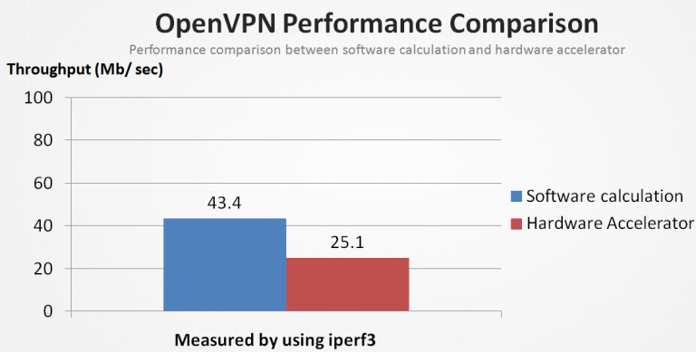
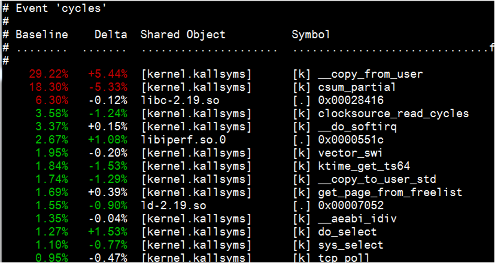
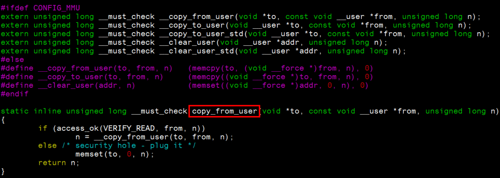
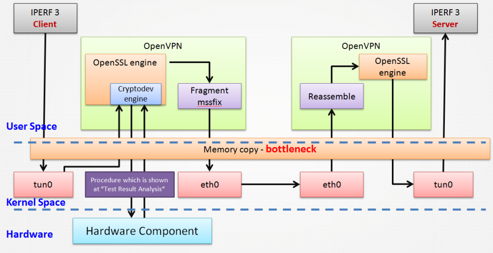
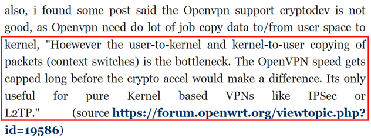

# 效能工具 – perf 來分析探討硬體加密之瓶頸

		
在&nbsp;<a href="https://szlin.me/2017/04/05/linux-kernel-%E5%AF%86%E7%A2%BC%E5%AD%B8%E6%BC%94%E7%AE%97%E6%B3%95%E5%AF%A6%E4%BD%9C%E6%B5%81%E7%A8%8B/" target="_blank" rel="noopener noreferrer">前篇文章</a>&nbsp;有提到 Linux Kernel 密碼學演算法實作流程. 由此得知若由硬體輔助進行密碼學演算法運算 (offloading), 除了不需耗費 CPU 效能外, 也能加快運算速度.

前文也提到許多 ARM SoC 廠商都會將硬體加解密元件放入 SoC 中. 以 Beagleboard [1] 的 SoC – AM335x 為例, TI 有加入處理加解密的元件. 如下圖 [2]

根據 TI 官方文件 [3] 來設定, 即可開始測試.

<h4><strong>Test Environment:</strong></h4>
<ul>
<li>TI AM3352&nbsp; 1GHz</li>
<li>DDR3 512 MB</li>
<li>Kernel 4.1</li>
<li>Cryptodev driver 1.7</li>
<li>OpenVPN&nbsp; 2.3.4-5+deb8u1</li>
<li>iperf-3.1.2</li>
<li>OpenSSL 1.0.1k-3+deb8u2 with cryptodev enabled</li>
<li>100Mbit Ethernet</li>
</ul>

<h4><strong>Test case:</strong></h4>
<h5><strong>1. OpenSSL</strong></h5>

OpenSSL 本身即提供測試指令, 以測試 aes-128-cbc 運算指令如下:

<table border="0" cellpadding="0" cellspacing="0"><tbody><tr><td class="gutter">
1
</td><td class="code">

<code class="bash plain">openssl speed -evp aes-128-cbc</code>

</td></tr></tbody></table>

OpenSSL 執行結果如下圖.

可以看到硬體加速的效能遠遠海放軟體運算. 除此之外, CPU usage 也少了 1x % 左右.

<h5></h5>
<h5><strong>2. OpenVPN</strong></h5>

接著我們用 iperf3 來測量 OpenVPN 效能, 執行結果如下圖.

可以看到<strong>硬體加速的效能遠遠不及軟體運算</strong>.

這結果就怪了, OpenVPN 明明呼叫的是 OpenSSL 的 library 來進行加解密函式運算. 但出來的結果卻跟 OpenSSL 差很大.

<h4><strong>Test Result Analysis:</strong></h4>

分析前, 我們先來看一下 OpenVPN 啟動硬體加速後從底層到上層的執行流程, 如下圖

由流程以及 <a href="https://szlin.me/2017/04/05/linux-kernel-%E5%AF%86%E7%A2%BC%E5%AD%B8%E6%BC%94%E7%AE%97%E6%B3%95%E5%AF%A6%E4%BD%9C%E6%B5%81%E7%A8%8B/" target="_blank" rel="noopener noreferrer">前篇文章</a>&nbsp;可知,&nbsp;硬體加速和軟體運算的差異主要在 kernel space. 所以使用 kernel profiling tool 來對兩者進行分析.

關於 kernel profiling tool, 內建在 kernel source 中的 perf 是一套相當不錯的工具. 位於&nbsp;tools/perf/.

<strong>perf 使用步驟如下:</strong>

1. 開啟 kernel configuration – PERF_EVENTS &nbsp;

2. 進入 tools/perf 編譯 perf

<strong>note:</strong> 如果沒有修改過 kernel , 可直接透過 apt-get install&nbsp;linux-tools 安裝 perf

3. 使用指令 “perf record “&nbsp;分別在軟體運算以及硬體加密程式環境下執行, 並將結果分別存成檔案 <a> 跟 <b>.</b></a>

4. 使用指令 “perf diff <a> <b>" </b></a>來比對兩者差異

其他詳細操作設定可參考 [4][5].

透過 perf diff 比對後, 如下圖可得知使用<strong>硬體加密相對於軟體運算</strong>花了許多時間在 “copy_from_user" 上.

<h5>“copy_from_user" 目的是將 user space 的資料拷貝到 kernel space. 若成功則回傳 0</h5>
<h5><strong>√ copy_from_user 運作原理</strong></h5>

copy_from_user 位於&nbsp;“arch/arm/include/asm/uaccess.h" 中. 如下圖可知, 實作會判斷系統是否有開啟 MMU. 若為沒有 MMU 的系統 (e.g. uclinux) 則是直接執行 memcpy 函式. 若為具備 MMU 的系統, 會先透過 access_ok 函式判斷是否為有效位址, 再進行呼叫 __copy_from_user

 __copy_from_user 以組語來實作, 位於 arch/arm/lib/copy_from_user.S 並呼叫 arch/arm/lib/copy_template.S 下的巨集. 細節詳情可參考 [12][13]

而根據測試結果, 再trace OpenVPN 本身程式並搭配相關文件, 可將 OpenVPN&nbsp;<strong>硬體加密詳細流程</strong>畫成下圖

可以看到瓶頸為 memory copy 這裡. 主要是因為 OpenVPN 的硬體加速實作呼叫太多 memory copy 的函式所造成. 其他人也有相關討論.

雖然說可以透過調整 tun-mtu, fragment, mssfix… 等等的一些方法來優化 OpenVPN 效能, 但比起軟體運算, 效能還是會有所差異.

也許換一套 VPN tool 不失為一個好方法. 以 <strong>softether </strong>[14] 來說, 除了可以相容 OpenVPN&nbsp;protocol, 在硬體加速上也有傑出的效能. 是值得一試的 user space VPN tool.

<h5><strong>心得:</strong></h5>

想要調校系統, 除了瞭解運作原理外, 搭配合適的調校工具能協助盡早定位問題.

若原有方法因先天限制無法加強效能, 也要考慮是否更換方法以達到原本的目標.

ref:

[1] <a href="https://beagleboard.org/" rel="nofollow">https://beagleboard.org/</a>

[2]&nbsp;http://www.ti.com/lsds/ti/processors/sitara/arm_cortex-a8/am335x/overview.page

[3]&nbsp;http://processors.wiki.ti.com/index.php/Linux_Core_Crypto_User_Guide

[4]&nbsp;https://perf.wiki.kernel.org/index.php/Main_Page

[5]&nbsp;http://wiki.csie.ncku.edu.tw/embedded/perf-tutorial

[6] <a href="http://www.edn.com/design/systems-design/4399714/3/Hardware-based-cryptography-offers-innovative-solution-for-security" rel="nofollow">http://www.edn.com/design/systems-design/4399714/3/Hardware-based-cryptography-offers-innovative-solution-for-security</a>

[7]&nbsp;http://www.design-reuse.com/articles/36013/cryptography-hardware-platform-for-socs.html

[8]&nbsp;http://comments.gmane.org/gmane.network.openvpn.devel/9937

[9]&nbsp;http://events.linuxfoundation.org/sites/events/files/slides/HWACC_FOR_NFV_fix_v2.pdf

[10]&nbsp;http://www.slideshare.net/BrunoCastelucci/open-ssl-hwaccelbrunocastelucciptbr

[11] <a href="http://events.linuxfoundation.org/sites/events/files/slides/Dma%20Optimization%20BayLibre%20Guillene%20v4.pdf" rel="nofollow">http://events.linuxfoundation.org/sites/events/files/slides/Dma%20Optimization%20BayLibre%20Guillene%20v4.pdf</a>

[12]&nbsp;https://www.kernel.org/doc/gorman/html/understand/understand007.html

[13]&nbsp;http://blog.rongpmcu.com/copy_from_userfen-xi/

[14]&nbsp;https://www.softether.org/

