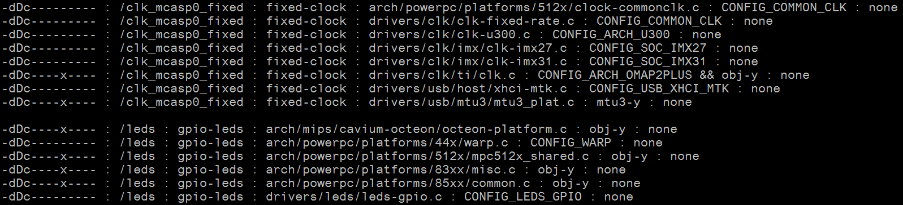
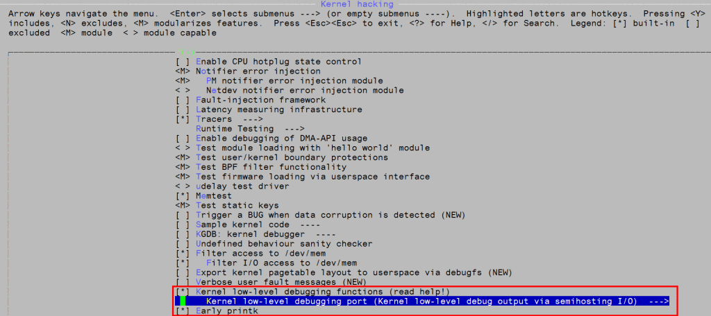
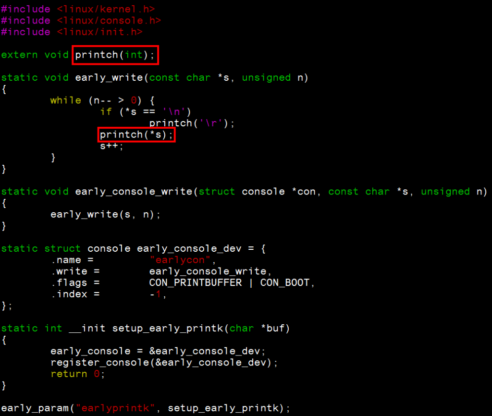
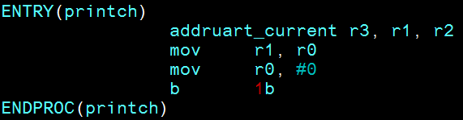
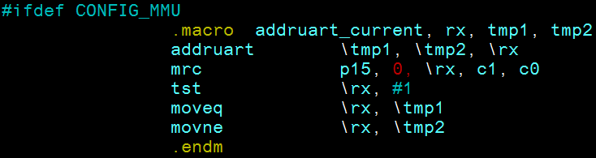
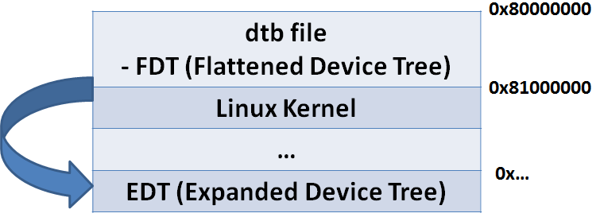
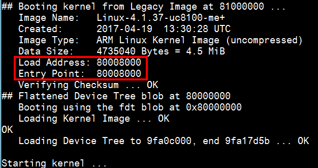
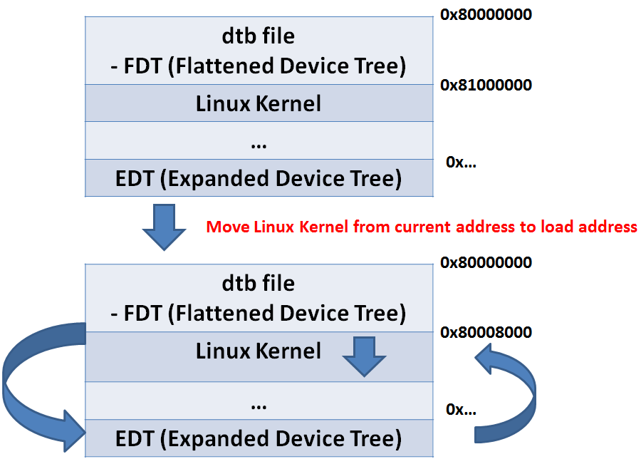

# 移植 Linux Kernel 造成無法開機之解決方案以及除錯工具

		
一般在以下情況, 我們會進行移植 Linux Kernel 的動作.

<h4><strong>1. 將新版 Linux Kernel 移植到全新 SoC 上</strong></h4>

開發人員為 SoC 廠商(e.g. MTK, TI, Allwinner) R&amp;D engineer.

在此階段的移植, 需要寫 dtsi, low-level code (位於 arch// 底下) 以及 SoC 相關的底層驅動程式. 並且須確保 SoC 功能運行正常.

<h4><strong>2. 將新版 Linux Kernel 移植到全新平臺上</strong></h4>

開發人員為硬體廠 的 R&amp;D engineer 或者是開發板 (e.g. beagleboard, RPi) 上游開發人員.

在此階段的移植, 需要建立 dts 來描述硬體資訊, 並適度修改 dtsi. 此外也需要根據硬體/ 週邊/ 平臺資訊來建立屬於板子的 Kernel &nbsp;config. 檔.&nbsp;並且須確保硬體/ 週邊/ 平臺功能運行正常.

<h4></h4>
<h4><strong>3. 將新版 Linux Kernel 移植到舊有平臺上進行 Kernel 版本升級</strong></h4>

開發人員為任何有興趣的 Maker. 只要有開發版即可進行 (e.g. beagleboard, RPi).&nbsp;一般來說, Linux Kernel 移植大多屬於此範疇.

在此階段的移植, 需要根據 dtsi 的版本差異來微調 dts 格式. 此外也需要根據 Kernel 版本差異資訊來微調板子的 Kernel &nbsp;config. 檔.

此外也須參照舊有 Kernel source 上的 in-house patch 來修改新版 Kernel source.

* &nbsp;另外還有像將 Linux Kernel 移值到全新 CPU architecture 上面這種較罕見的情況.

在移植 Linux Kernel 時, 最重要的第一步就是讓機器可以 <strong>" 開機 “</strong>. Kernel 能正常開機往下執行, 我們才能進行後續移植動作.

在無法開機的情況下 (請見下圖), 由於沒有任何錯誤訊息, 所以除錯上會比較困難.

一旦可以開機, 畫面有訊息列印出來, 即便有其他問題, 相對起來也比較好解.

最常遇到開不了機的現象就是 hang 在 “<strong>Starting Kernel" </strong>這邊.

在這個階段 bootloader 把 Linux Kernel 載入 Memory 位址 0x80008000, 並將 CPU 控制權交給 Linux Kernel. 此時理因跳轉到 Linux Kernel 第一條指令 [1], 接著 Kernel 開始自解壓縮進行後續開機流程 [2].

如果在這個階段卡住, 代表 Linux Kernel 沒有正確運行, 原因可分成下列幾點

<table class="tg" style="height:168px;" width="769">
<tbody>
<tr>
<th style="text-align:center;" width="20%">無法開機根因</th>
<th style="text-align:center;"><b>可能發生時機</b></th>
<th style="text-align:center;"><b>解決方法</b></th>
</tr>
<tr>
<td style="text-align:center;" width="20%"><strong>SoC&nbsp;low-level code 有問題</strong></td>
<td style="text-align:center;">將 Linux&nbsp;移植到新 SoC 上</td>
<td style="text-align:center;">

修改 low-level code, 並確保 SoC 裡功能可正常運行. 有可能需要在 driver 中以 work-around 手法避掉問題.

</td>
</tr>
<tr>
<td style="text-align:center;" width="20%"><strong>舊有 DTS 與 新板 DTSI不相容</strong></td>
<td>

將新 Linux Kernel 移植到舊有平臺上進行Kernel 升級

</td>
<td style="text-align:left;">閱讀 dtsi git 修改歷程, 並詳細閱讀 “Documentation/devicetree/bindings/" 相關文件.</td>
</tr>
<tr>
<td style="text-align:center;" width="20%"><strong>硬體設計有問題</strong></td>
<td style="text-align:center;">
<ul>
<li style="text-align:left;">將 Linux&nbsp;移植到新 SoC上</li>
<li style="text-align:left;">將新 Linux Kernel 移植到全新平臺上</li>
</ul>
</td>
<td style="text-align:left;">和 Hardware/ Bootloader 部門 R&amp;D 工程師協同合作, 一起看硬體線路除蟲</td>
</tr>
<tr>
<td style="text-align:center;" width="20%"><strong>Console port 設定錯誤</strong></td>
<td style="text-align:left;">
<ul>
<li>將 Linux&nbsp;移植到新 SoC上</li>
<li>將新 Linux Kernel 移植到全新平臺上</li>
<li>將新 Linux Kernel 移植到舊有平臺上進行Kernel 升級</li>
</ul>
</td>
<td style="text-align:left;">

每一塊板子的 Console port device node 都需根據硬體設計以及 driver 設計來進行設定. 如果設定錯誤, 會導致訊息出不來

一般情況下 console device node 為 ttyS0, baud: 115200

</td>
</tr>
<tr>
<td style="text-align:center;" width="20%"><strong>Boot code program (包含bootloader) 與 Kernel 不相容</strong></td>
<td style="text-align:center;">
<ul>
<li style="text-align:left;">將 Linux&nbsp;移植到新 SoC上</li>
<li style="text-align:left;">將新 Linux Kernel 移植到全新平臺上</li>
<li style="text-align:left;">將新 Linux Kernel 移植到舊有平臺上進行Kernel 升級</li>
</ul>
</td>
<td style="text-align:center;">

需確認 boot code program 版本與 Kernel 版本是相對應的. 尤其有些 SoC 的設計會有多個 boot code program.

</td>
</tr>
<tr>
<td style="text-align:center;" width="20%"><strong>DTB 跟 Kernel memory 位址衝突</strong></td>
<td style="text-align:center;">
<ul>
<li style="text-align:left;">將 Linux&nbsp;移植到新 SoC上</li>
<li style="text-align:left;">將新 Linux Kernel 移植到全新平臺上</li>
<li style="text-align:left;">將新 Linux Kernel 移植到舊有平臺上進行Kernel 升級</li>
</ul>
</td>
<td style="text-align:left;">boot code program 需要注意避免將兩者&nbsp;memory 位址設太近導致衝突.</td>
</tr>
<tr>
<td style="text-align:center;" width="20%"><strong>DTB 檔跟 Kernel 並不相容</strong></td>
<td>
<ul>
<li>將 Linux&nbsp;移植到新 SoC上</li>
<li>將新 Linux Kernel 移植到全新平臺上</li>
<li>將新 Linux Kernel 移植到舊有平臺上進行Kernel 升級</li>
</ul>
</td>
<td style="text-align:left;">記得重新編譯 Kernel 時, 也要一併重新編譯 DTB. 並確保兩者是成對的.</td>
</tr>
<tr>
<td style="text-align:center;" width="20%"><strong>Kernel config 檔中的 ARCH 相關資訊設定錯誤 </strong></td>
<td>
<ul>
<li>將 Linux&nbsp;移植到新 SoC上</li>
<li>將新 Linux Kernel 移植到全新平臺上</li>
<li>將新 Linux Kernel 移植到舊有平臺上進行Kernel 升級</li>
</ul>
</td>
<td style="text-align:left;">確定 SoC 種類, 並到Kernel 選單 – &nbsp;System Type 中選取對應的選項</td>
</tr>
</tbody>
</table>
<h4></h4>
<h4><strong>下列為一些除錯工具以及技巧</strong></h4>
<h4><strong>1. 檢查 dtsi/ dts 是否正確</strong></h4>

除了閱讀 dtsi git 修改歷程, 並詳細閱讀 “Documentation/devicetree/bindings/" 相關文件外, 也可以使用 debug tool 來檢查

<ul>
<li><strong>dtx_diff</strong> – 用來比較不同 device trees 的差異. 支援 dts/dtsi, dtb 以及 file system tree 格式.</li>
</ul>

⇒ 位於 scripts/dtc/dtx_diff, 於 Kernel 4.6 加入

<ul>
<li><strong>dt_to_config</strong> – 能根據 device tree 資訊來找相對應的 driver, 確認兩邊是相對應的.</li>
</ul>

⇒ 位於 scripts/dtc/dt_to_config,&nbsp;於 Kernel 4.8 加入

其他還有像 dt_stat, dt_node_info&nbsp;[3][4][5] 等等的除錯工具可使用.

<h4><strong>2. 開啟 early printk</strong></h4>

Kernel 啟動時, 有可能因為 console&nbsp;還沒初始化, 導致一些錯誤訊息無法輸出顯示. 這時可以使用 earlyprintk [6] 提早輸出錯誤訊息.

<h5><strong>√ 開啟 Kernel 選項</strong></h5>

<h5><strong>√ 設定 bootargs</strong></h5>

在 bootargs 中加入 “earlyprintk" 字串

<table border="0" cellpadding="0" cellspacing="0"><tbody><tr><td class="gutter">
1
</td><td class="code">

<code class="bash plain">setenv bootargs ${bootargs} earlyprintk</code>

</td></tr></tbody></table>

設定完重開機即啟動 earlyprintk 功能.

下圖為開啟 earlyprintk 才能印出的錯誤訊息 – <strong>這段訊息代表 Kernel&nbsp;ARCH 相關資訊設定錯誤.&nbsp;</strong>

<blockquote>
Error: unrecognized/unsupported machine ID (r1 = 0x00000e05).

Available machine support:

ID (hex)&nbsp;&nbsp;&nbsp;&nbsp;&nbsp;&nbsp;&nbsp; NAME 
ffffffff&nbsp;&nbsp;&nbsp;&nbsp;&nbsp;&nbsp;&nbsp; Generic DT based system 
ffffffff&nbsp;&nbsp;&nbsp;&nbsp;&nbsp;&nbsp;&nbsp; Generic DRA72X (Flattened Device Tree) 
ffffffff&nbsp;&nbsp;&nbsp;&nbsp;&nbsp;&nbsp;&nbsp; Generic DRA74X (Flattened Device Tree) 
ffffffff&nbsp;&nbsp;&nbsp;&nbsp;&nbsp;&nbsp;&nbsp; Generic AM43 (Flattened Device Tree) 
ffffffff&nbsp;&nbsp;&nbsp;&nbsp;&nbsp;&nbsp;&nbsp; Generic OMAP5 (Flattened Device Tree) 
ffffffff&nbsp;&nbsp;&nbsp;&nbsp;&nbsp;&nbsp;&nbsp; Generic AM33XX (Flattened Device Tree)
</blockquote>

<h5><strong>√ earlyprintk 運作原理</strong></h5>

earlyprintk 位於 arch/arm/kernel/early_printk.c

由下圖可得知, 主要呼叫 printch() 來輸出字元

printch() 位於 arch/arm/kernel/debug.S

由下圖可知 printch() 呼叫 addruart_current

addruart_current 為巨集, 會再呼叫 addruart&nbsp;

addruart 則位於&nbsp;arch/arm/include/debug/&lt;SoC&gt;.S 中

addruart&nbsp; 實作上會因不同 SoC 特性而有所差異. 但大多是以組語設定 <strong>UART_PHYS </strong>以及 <strong>UART_VIRT</strong>.

<h4><strong>3. 檢查 DTB 跟 Kernel memory 位址</strong></h4>

我們可以在 bootloader 底下執行下列指令來進行開機

<table border="0" cellpadding="0" cellspacing="0"><tbody><tr><td class="gutter">
1

2

3
</td><td class="code">

<code class="bash plain">fatload mmc 0 80000000 board.dtb</code>

<code class="bash plain">fatload mmc 0 81000000 uImage</code>

<code class="bash plain">bootm 81000000 - 80000000</code>

</td></tr></tbody></table>

&nbsp;

原本都可以正常運作, 但某次發現如果在 device tree 中新增項目, 會無法開機

依照指令來看, 記憶體會是這樣:

但是實際開機卻會卡住.

仔細分析後才發現, 原來 Kernel 實際執行的記憶體位址會是load address 0x80008000, 而不是 bootm 設定的 0x81000000. 而 load address 可透過 mkimage 或者 Kernel Makefile 來進行設定.

如果 bootm 位址和 load address 不一樣, bootloader 會先把 Kernel move 到 load address, 接著從 entry point 開始執行

回過來, 那當初為什麼在 device tree 中新增項目, 會造成無法開機呢 ?

我們來算一下記憶體空間

<blockquote>
Load Address: 0x80008000

DTB Address: 0x80000000

0x80008000 – 0x80000000 = 0x8000 = <strong>32768</strong>
</blockquote>

由上述可知, 只要 dtb 檔案大小 &gt; 32768, 就會覆蓋到 Linux Kernel. 造成檔案毀損而導致無法開機. 所以只要修改 Load address 即可解決.

<strong>心得:</strong>

移植 Linux Kernel 時, 除了要熟悉 SoC/ 週邊/ 硬體資訊外, 也要多閱讀 Linux Documentation 的資料.

魔鬼藏在細節, 只要有一個地方疏忽掉, 就會導致開不了機. 所以要移植 Linux Kernel 時, 最重要的事 – <strong>請睡飽 </strong>

&nbsp;

ref:

[1]:&nbsp;https://www.kernel.org/doc/Documentation/arm/Booting

[2]:&nbsp;https://szlin.me/2016/06/11/linux-fast-boot-%E5%BF%AB%E9%80%9F%E9%96%8B%E6%A9%9F%E8%AA%BF%E6%A0%A1/

[3]:&nbsp;http://www.elinux.org/images/8/88/Dt_stat.patch

[4]:&nbsp;http://elinux.org/images/b/ba/Dt_stat_150811_1802.patch

[5]:&nbsp;http://elinux.org/Device_Tree_frowand

[6]:&nbsp;https://www.kernel.org/doc/Documentation/driver-model/platform.txt

