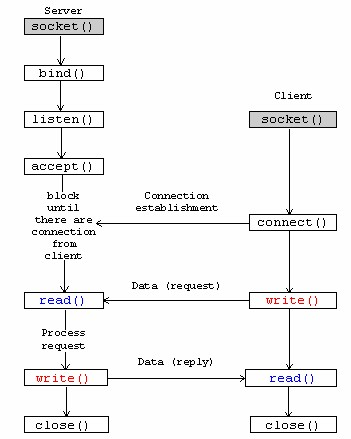
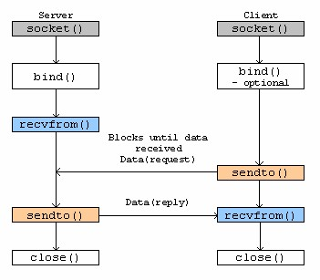

# Socket programming 筆記


這系列是閱讀[ The Linux socket TCP/IP protocols network programming tutorials](http://www.tenouk.com/cnlinuxsockettutorials.html)所記錄的筆記，這份tutorial寫的相當好，如果有不清楚的地方，建議大家看看原文，寫的非常詳細，這裡只節錄重點。

 

##Socket
### TCP
```
1. socket是IPC所使用的一種API。
2. 也稱為Berkeley Socket或BSD Socket
3. Connection-oriented socket (TCP)
```



### UDP
```
4.Connectionless socket (UDP)
```




###Data structure for socket
```sh
1. protocol family: 建socket 的一個參數
2. Service type: 建socket 的一個參數 (Stream, Datagram)
3. Local IP address: 用bind()設定
4. Local port: 用bind()設定
5. Remote IP address: 用connect()設定
6. Remote port: 用connect()設定
```

###Socket endpoint

TCP/IP 的communication是由2個endpoint組成。一個endpoint是由一個ip加一個port，所以一臺電腦可以有很多的endpoint。PF_INET是internet protocol family; AF_INET是internet address family (Normally PF_INET = AF_INET = 2)。


###Host / Hostname
host指的是internet上的一臺電腦 (computer, file server, etc)，而hostname則是用來識別此電腦的名稱，有時會跟domain name混用，雖然有些技術上的差異，如www.google.com，主要是用來uniquely identify。


### Host address data type
hostaddress是由4byte的數字組成，如140.113.23.3，前3個稱為network number，最後1個叫local address。hostaddress可用一個unsigned long int表示。scoket中的struct in_addr將這個整數包裝起來，定義在in.h。

```c
/* Internet address. */
struct in_addr {
    __be32    s_addr;
};
```


這個s_addr用unsigned long int 所表示的host address number。
特殊的host address number:
```sh
1. INADDR_LOOPBACK: 指本機的address，也就是127.0.0.1 (localhost)，而不需去查其真實的address。只在本機的IPC，使用INADDR_LOOPBACK可避免不必要的traffic。
2. INADDR_ANY: 指任何連上來的address。如果要接受所有來自 internet的connection可使用。
3. INADDR_BROADCAST: 傳送broadcast訊息可使用。
4. INADDR_NONE: 某些function錯誤時的回傳值。
```

### host address的處理函數

```sh
定義在arpa/inet.h。(network byte order v.s. host byte order??)
1.int inet_aton(const char *name, struct in_addr *addr): 將像140.113.23.3這樣的adress轉成binary，並且存入struct in_addr。成功時傳回非零，失敗傳0。
2. unsigned long int inet_addr(const char *name):也是將address轉成binary，但錯誤時傳回 INADDR_NONE。這是inet_aton的舊版，因為INADDR_NONE也是合法的address (255.255.255.255)，而inet_aton有比較好的error return處理。
3. unsigned long int inet_network(const char *name): 將像140.113.23.3的address轉成host byte order的number，成功傳回轉換結果，失敗傳回-1。
4. char * inet_ntoa(struct in_addr addr): 將internet host address轉回像140.113.23.3的address，傳回轉換結果的pointer。

接下來的函數是處理同一塊buffer，連續呼叫會覆寫之前的結果。因此要將處理結果先存下來。

5. struct in_addr inet_makeaddr(int net, int local)
6. int inet_lnaof(struct in_addr addr)
7. Function int inet_netof(struct in_addr addr)
```

### socket的API

###structure

```c
struct sockaddr {
    sa_family_t    sa_family;    /* address family, AF_xxx    */
    char        sa_data[14];    /* 14 bytes of protocol address    */
};

struct sockaddr_in {
    sa_family_t        sin_family;    /* Address family        */
    __be16        sin_port;    /* Port number            */
    struct in_addr    sin_addr;    /* Internet address        */

    /* Pad to size of `struct sockaddr'. */
    unsigned char        __pad[__SOCK_SIZE__ - sizeof(short int) -
                               sizeof(unsigned short int) - sizeof(struct in_addr)];
};
```

```sh
1. To deal with struct sockaddr, programmers created a parallel structure: struct sockaddr_in ("in" for "Internet".)
2. The sin_zero field is reserved, and you must set it to hexadecimal zeroes.
3. sockaddr_in is a "specialized" sockaddr.
4. The sin_port and sin_addr must be in Network Byte Order.
```

##函數
- socket()

```sh
NAME
       socket() - create an endpoint for communication
SYNOPSIS
       #include <sys/types.h>
       #include <sys/socket.h>
       int socket(int domain, int type, int protocol);
1. 由server和client使用
2. domain: 設AF_INET
3. type: SOCK_STREAM或SOCK_DGRAM
4. protocol: 0 (讓socket()根據type自動設定)。更好的方式是使用getprotobyname()。
5. 成功傳回socket descriptor，失敗傳回-1 (並使用errno的macro)
6. 正確使用為在struct sockaddr_in使用AF_INET，在socket()使用PF_INET。但AF_INET可用在任何地方。
```

- bind()

```sh
NAME
       bind() - bind a name to a socket
SYNOPSIS
       #include <sys/types.h>
       #include <sys/socket.h>
       int bind(int sockfd, struct sockaddr *my_addr, int addrlen);
1. 由server使用
2. sockfd為socket()的回傳值。
3. myaddr 須指定port和ip後傳入，注意是用struct sockaddr_in宣告，傳入時轉為struct sockaddr。
4. addrlen直接用 sizeof(struct sockaddr)
5. bind就是將local的endpoint attach到一個socket
```

- connect()

```sh
NAME
       connect() - initiate a connection on a socket.
SYNOPSIS
       #include <sys/types.h>
       #include <sys/socket.h>
       int connect(int sockfd, struct sockaddr *serv_addr, int addrlen);
1. connect()由client呼叫
2. sockfd由socket()產生，serv_addr指定server的ip和port後傳入
3. addrlen直接用 sizeof(struct sockaddr)
```

- listen()

```sh
NAME
       listen() - listen for connections on a socket
SYNOPSIS
       #include <sys/socket.h>
       int listen(int sockfd, int backlog);
1. 由server使用
2. sockfd由socket()產生，backlog設定可queue住的connection數量 (等待accept())。
3. 失敗傳回-1，並使用errno
```

- accept()


```sh
NAME
       accept() - accept a connection on a socket
SYNOPSIS
       #include <sys/types.h>
       #include <sys/socket.h>
       int accept(int sockfd, struct sockaddr *addr, int *addrlen);
 
1. sockfd: listen()所使用的那個sockfd
2. addr 宣告完就拿來用，將存放client的資訊
3. addrlen直接用 sizeof(struct sockaddr)
4. 失敗傳回-1，並使用errno
5. server listen()完後開始等待accept()。accept()傳回一個file descriptor以供此connection的I/O之用。accpet完之後，server繼續使用listen()的fd等待下一個connection。
```

- send()

```sh
int send(int sockfd, const void *msg, int len, int flags);
1. sockfd可以是listen()的fd或是accpet的fd。
2. msg就是data，len就是data 的length (sizeof(msg))，flag就設0。
3. 回傳值為送出去的大小
4. 失敗傳回-1，並使用errno
```

- recv()

```sh
The recv() call is similar in many respects:
int recv(int sockfd, void *buf, int len, unsigned int flags);
1. sockfd: 要從哪個fd接收。
2. 回傳值為收到的大小。若回傳0，表示對方把connection切了。
```

- write()

```sh
NAME
       write() - write to a file descriptor
SYNOPSIS
       #include <unistd.h>
       ssize_t write(int fd, const void *buf, size_t count);
1. 可寫到file，device或socket
```


- read()

```sh
NAME
       read() - read from a file descriptor
SYNOPSIS
       #include <unistd.h>
       ssize_t read(int fd, void *buf, size_t count);
1. 從file，device或socket讀取
2. 沒有data則read會block
3. count指定要讀的長度，如果沒有那麼多，則return，不會block
 
 
int shutdown(int sockfd, int how);
1. 0: 不允許將來的receive; 1: 不允許將來的send; 2: 不允許將來的send和receice (跟close()一樣，但沒有真的的close fd，將fd free掉)
```

##Byte order

不同的架構在communication時，其word會使用不同的byte order==>Big-endian(MSB)和Little-endian。 Internet protocols 有其標準的byte order，即network byte order。建立socket時，必須確定ip和port (sin_addr和sin_port)是用network byte order來表示。
getservbyname()，gethostbyname和inet_addr都是network byte order，因此可直接使用。
轉換的函數如下，並定義在netinet/in.h:
```c
htons() / ntohs(): 轉換sin_port
htonl()/ ntohl: 轉換sin_addr
```

ex: ina.sin_addr.s_addr = inet_addr("10.12.110.57"); //obsolete of inet_aton (ascii to network)，但不是每個平臺都有implement inet_aton()
Typical use:

```c
struct sockaddr_in my_addr;
/* host byte order */
my_addr.sin_family = AF_INET;
/* short, network byte order */
my_addr.sin_port = htons(MYPORT);
inet_aton("10.12.110.57", &(my_addr.sin_addr));
/* zero the rest of the struct */
memset(&(my_addr.sin_zero), 0, 8);
reverse function:
printf("%s", inet_ntoa(ina.sin_addr));
要注意的是，inet_ntoa使用的是靜態的buffer，所以會有如下的情形:
char *a1, *a2;
...
...
a1 = inet_ntoa(ina1.sin_addr); /* this is 192.168.4.1 */
a2 = inet_ntoa(ina2.sin_addr); /* this is 10.11.110.55 */
printf("address 1: %s\n", a1);
printf("address 2: %s\n", a2);
```

- Will print:

```c
address 1: 10.11.110.55
address 2: 10.11.110.55
```

因此可先用strcpy將a1存起來。<br>

Endian -- `0x01020304`<br>
Big-endian: 01, 02, 03, 04 ((MSB)-first, network byte order) <br>
Little-endian: 04, 03, 02, 01 (intel)<br>

## Name resolution
```sh
1. symbolic name比numbers-and-dots notation好記。
2. db的來源是/etc/hosts或是dns server。
3. 相關定義在netdb.h。
4. structure:
```
hostent: 用來表示db中的entry

<table class="MsoTableGrid" style="border: medium none; margin-left: 47.95pt; border-collapse: collapse; width: 946px;" border="1" cellspacing="0" cellpadding="0">
<tbody>
<tr>
<td style="border: 1pt solid windowtext; padding: 0mm 5.4pt; background: none repeat scroll 0% 0% #d9d9d9; width: 175px;">
<p class="MsoNormal" style="text-align: center; margin-top: 0pt; margin-bottom: 0pt;" align="center">
<strong><span style="font-family: Arial;"><span style="font-size: small;">Data Type</span></span></strong></p>
</td>
<td style="padding: 0mm 5.4pt; background: none repeat scroll 0% 0% #d9d9d9; width: 740px;">
<p class="MsoNormal" style="text-align: center; margin-top: 0pt; margin-bottom: 0pt;" align="center">
<strong><span style="font-family: Arial;"><span style="font-size: small;">Description</span></span></strong></p>
</td>
</tr>
<tr>
<td style="padding: 0mm 5.4pt; width: 175px;">
<p class="MsoNormal" style="margin-top: 0pt; margin-bottom: 0pt;">
<code><span style="font-size: small;">char *h_name</span></code></p>
</td>
<td style="padding: 0mm 5.4pt; width: 740px;">
<p class="MsoNormal" style="margin-top: 0pt; margin-bottom: 0pt;">
<span style="font-family: Arial; font-size: small;">host 的正式名稱 (如www.google.com.tw)<br></span></p>
</td>
</tr>
<tr>
<td style="padding: 0mm 5.4pt; width: 175px;">
<p class="MsoNormal" style="margin-top: 0pt; margin-bottom: 0pt;">
<code><span style="font-size: small;">char **h_aliases</span></code></p>
</td>
<td style="padding: 0mm 5.4pt; width: 740px;">該host的別名</td>
</tr>
<tr>
<td style="padding: 0mm 5.4pt; width: 175px;">
<p class="MsoNormal" style="margin-top: 0pt; margin-bottom: 0pt;">
<code><span style="font-size: small;">int h_addrtype</span></code></p>
</td>
<td style="padding: 0mm 5.4pt; width: 740px;">
<p class="MsoNormal" style="margin-top: 0pt; margin-bottom: 0pt;">
<span style="font-family: Arial; font-size: small;">host 的address type。通常是</span><span style="font-size: small;"><code><span style="font-family: Arial;">AF_INET</span></code><span style="font-family: Arial;">.&nbsp;</span></span></p>
</td>
</tr>
<tr>
<td style="padding: 0mm 5.4pt; width: 175px;">
<p class="MsoNormal" style="margin-top: 0pt; margin-bottom: 0pt;">
<code><span style="font-size: small;">int h_length</span></code></p>
</td>
<td style="padding: 0mm 5.4pt; width: 740px;">
<p class="MsoNormal" style="margin-top: 0pt; margin-bottom: 0pt;">
<span style="font-family: Arial; font-size: small;">address 的長度，以byte為單位<br></span></p>
</td>
</tr>
<tr>
<td style="padding: 0mm 5.4pt; width: 175px;">
<p class="MsoNormal" style="margin-top: 0pt; margin-bottom: 0pt;">
<code><span style="font-size: small;">char **h_addr_list</span></code></p>
</td>
<td style="padding: 0mm 5.4pt; width: 740px;">
<p class="MsoNormal" style="margin-top: 0pt; margin-bottom: 0pt;">如果host連到不同的網路，就會有不同的address，這是所有address的pointer</p>
</td>
</tr>
<tr>
<td style="padding: 0mm 5.4pt; width: 175px;">
<p class="MsoNormal" style="margin-top: 0pt; margin-bottom: 0pt;">
<code><span style="font-size: small;">char *h_addr</span></code></p>
</td>
<td style="padding: 0mm 5.4pt; width: 740px;">
<p class="MsoNormal" style="margin-top: 0pt; margin-bottom: 0pt;">
<span style="font-size: small;"><code><span style="font-family: Arial;">h_addr_list[0]</span></code></span><span style="font-family: Arial; font-size: small;">;;就是第一個host address <br></span></p>
</td>
</tr>
</tbody>
</table>

```sh
5. 在hostent裡的host address是network byte order。
6. 使用static的buffer，連續呼叫需先將結果存起來。
7. 失敗傳回nul，使用h_errno (用extern  int   h_errno宣告)，error code如下:
```

<table class="MsoTableGrid" style="border: medium none; margin-left: 69.6pt; border-collapse: collapse; width: 838px;" border="1" cellspacing="0" cellpadding="0">
<tbody>
<tr>
<td style="border: 1pt solid windowtext; padding: 0mm 5.4pt; background: none repeat scroll 0% 0% #cccccc; width: 92.15pt;" width="123">
<p class="MsoNormal" style="text-align: center; margin-top: 0pt; margin-bottom: 0pt;" align="center">
<code><strong><span style="font-family: Arial;"><span style="font-size: small;">h_errno</span></span></strong></code></p>
</td>
<td style="padding: 0mm 5.4pt; background: none repeat scroll 0% 0% #cccccc; width: 658px;">
<p class="MsoNormal" style="text-align: center; margin-top: 0pt; margin-bottom: 0pt;" align="center">
<strong><span style="font-family: Arial;"><span style="font-size: small;">Description</span></span></strong></p>
</td>
</tr>
<tr>
<td style="padding: 0mm 5.4pt; width: 92.15pt;" width="123">
<p class="MsoNormal" style="margin-top: 0pt; margin-bottom: 0pt;">
<code><span style="font-size: small;">HOST_NOT_FOUND</span></code></p>
</td>
<td style="padding: 0mm 5.4pt; width: 658px;">
<p class="MsoNormal" style="margin-top: 0pt; margin-bottom: 0pt;">
<span style="font-family: Arial; font-size: small;">No such host is known in the data base.</span></p>
</td>
</tr>
<tr>
<td style="padding: 0mm 5.4pt; width: 92.15pt;" width="123">
<p class="MsoNormal" style="margin-top: 0pt; margin-bottom: 0pt;">
<code><span style="font-size: small;">TRY_AGAIN</span></code></p>
</td>
<td style="padding: 0mm 5.4pt; width: 658px;">
<p class="MsoNormal" style="margin-top: 0pt; margin-bottom: 0pt;">
<span style="font-family: Arial; font-size: small;">This condition happens when the name server could 
not be contacted. If you try again later, you may succeed then.</span></p>
</td>
</tr>
<tr>
<td style="padding: 0mm 5.4pt; width: 92.15pt;" width="123">
<p class="MsoNormal" style="margin-top: 0pt; margin-bottom: 0pt;">
<code><span style="font-size: small;">NO_RECOVERY</span></code></p>
</td>
<td style="padding: 0mm 5.4pt; width: 658px;">
<p class="MsoNormal" style="margin-top: 0pt; margin-bottom: 0pt;">
<span style="font-family: Arial; font-size: small;">A non-recoverable error occurred.</span></p>
</td>
</tr>
<tr>
<td style="padding: 0mm 5.4pt; width: 92.15pt;" width="123">
<p class="MsoNormal" style="margin-top: 0pt; margin-bottom: 0pt;">
<code><span style="font-size: small;">NO_ADDRESS</span></code></p>
</td>
<td style="padding: 0mm 5.4pt; width: 658px;">
<p class="MsoNormal" style="margin-top: 0pt; margin-bottom: 0pt;">
<span style="font-family: Arial; font-size: small;">The host database contains an entry for the name, 
but it doesn't have an associated Internet address.</span></p>
</td>
</tr>
</tbody>
</table>

## 函數

### Looking Up a Computer Name

```sh
NAME
       gethostbyname() - get network host entry
SYNOPSIS
       #include <netdb.h>
       extern int h_errno;
       struct hostent
       *gethostbyname(const char *name);
 
1. name可以是name / dot decimal address
```

### Looking Up a Port Number by Name

```sh
NAME
   getservbyname() - get service entry
SYNOPSIS
   #include <netdb.h>
   struct servent *getservbyname(const char *name, const char *proto);
struct servent {
   char  *s_name;
   char  **s_aliases;
   int   s_port;
   char  *s_proto;
}
1. s_port: 是用network byte order表示
```
### Looking Up a Protocol by Name

```sh 
NAME
       getprotobyname() - get protocol entry
SYNOPSIS
       #include <netdb.h>
       struct protoent
       *getprotobyname(const char *name);
struct protoent {
   char  *p_name;
   char  **p_aliases;
   int   p_proto;
}
p_proto: protocol number (可用在socket())
```

## Reference

[byte order convention](http://www.gnu.org/s/libc/manual/html_node/Byte-Order.html)
 


