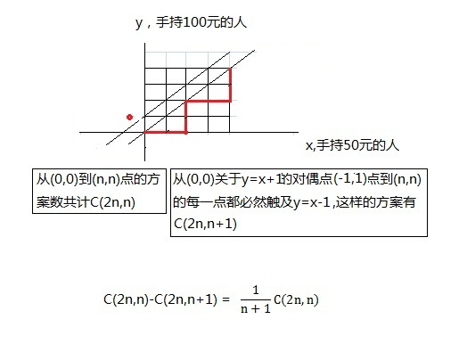

# 12(存儲計算)


有時候，我們可以將計算好的值進行存儲，需要的時候取出，這樣可以大大降低計算量，用空間代替時間。

 

我們從一個問題出發，農夫John和他的朋友們一同去參加Cownty展會，這個展會的門票是50元，排隊購票的人

有2n個人，其中n個人拿著100元的鈔票，另外n個人拿著50元的鈔票，農夫john想知道在這種情況下著2n個人共有

多少種排隊的方式，使得售票處在不準備零錢的情況下，也能把票賣給這2n個人，而不會出現找不開錢的局面。

這是一個經典的組合問題，最後可以通過求解catalan數一步解決，我們這裡通過深入搜索，寫通項和存儲計算三種方法來實現。

通過實現，存儲計算的這種方法最好，但需要對計算的順序精心設計。

 

在動態規劃等很多場合都會用到將計算存儲在一個數組中，此前的關於pfordelta的實現中也出現了將計算存儲在數組中的方式，這是很常見的技巧，該問題前兩種方法只所以慢一方面是因為大量重複冗餘的計算，另一方面是過多的跳轉，通過第三種方法改寫後，計算的效率大大提高了，沒有組合數學背景的同學仔細研讀，應該也可以讀懂，該題來自吳文虎的《程序設計中的組合數學》，實現也部分參考了這本書，但有較多不同。


```c
#include <stdio.h>

#if defined(__i386__)

static __inline__ unsigned long long rdtsc(void)
{
    unsigned long long int x;
    __asm__ volatile("rdtsc" : "=A"(x));
    return x;
}
#elif defined(__x86_64__)
static __inline__ unsigned long long rdtsc(void)
{
    unsigned hi, lo;
    __asm__ __volatile__("rdtsc" : "=a"(lo), "=d"(hi));
    return ((unsigned long long)lo) | (((unsigned long long)hi) << 32);
}

#endif


int all_n = 20;
int five_cnt = 10;
int ten_cnt = 10;

int dfs(int i, int change_cnt, int fi, int tj,
        int& all_cases_cnt) //fi表示拿50元鈔票的人數，tj表示拿100元鈔票的人數
{
    if (i == 1) {
        if (change_cnt == 1 && tj == 1 && fi == 0) {
            all_cases_cnt += 1;
            tj -= 1;
        } else if (change_cnt == 0 && tj == 0 && fi == 1) {
            all_cases_cnt += 1;
            fi -= 1;
        }
    } else {
        for (int k = 0; k < 2; ++k) {
            if (k == 0) {
                if (fi >= 1) {
                    dfs(i - 1, change_cnt + 1, fi - 1, tj, all_cases_cnt);
                }
            }

            if (k == 1) {
                if (tj >= 1) {
                    if (change_cnt > 0) {
                        dfs(i - 1, change_cnt - 1, fi, tj - 1, all_cases_cnt);
                    }
                }
            }
        }

    }

};

int f(int m, int n)
{
    if (m < n) {                                 //50元的人數少於100元的人數必然無解
        return 0;
    } else if (n ==
               0) {                     //100元的人已經不存在了，後續的都是50元的算1種
        return 1;
    } else {
        return f(m, n - 1) + f(m - 1,
                               n); //否則方案數為先用100元的，再用50元的方案之和.
    }
}

int fast_f(int m, int n)
{
    int fast[m + 1][n + 1];

    for (int i = 0; i <= n;
         ++i) {        //直接改寫自f函數的第一個條件分支
        for (int j = 0; j < i && j <= m; ++j) {
            fast[j][i] = 0;
        }
    }

    for (int i = 0; i <= m;
         ++i) {     //直接改寫自f函數的第二個分支，計算可以合併到上一個循環中，這裡為清晰起見，拆開。
        fast[i][0] = 1;
    }

    for (int i = 1 ; i <= m;
         ++i) {    //這一步的計算有很高的技巧，每一層的計算依賴的另外兩個數恰好都是已經計算好的
        for (int j = 1; j <= i && j <= n; ++j) {
            fast[i][j] = fast[i][j - 1] + fast[i - 1][j];
        }
    }

    return fast[m][n - 1] + fast[m - 1][n];
}


int main(void)
{
    int all_cases_cnt = 0;

    int start = rdtsc();
    dfs(all_n, 0, five_cnt, ten_cnt, all_cases_cnt);
    int end = rdtsc();
    printf("方案數%d,cycle:%d/n", all_cases_cnt, end - start);

    start = rdtsc();
    all_cases_cnt = f(five_cnt, ten_cnt);
    end = rdtsc();
    printf("方案數%d,cycle:%d/n", all_cases_cnt, end - start);

    start = rdtsc();
    all_cases_cnt = fast_f(five_cnt, ten_cnt);
    end = rdtsc();
    printf("方案數%d,cycle:%d/n", all_cases_cnt, end - start);

    return 0;
}
```

關於購票問題其實是一個組合數學的問題，有通解可以直接求出。

我們假定X軸為手持50元的人，Y軸為手持100元的人，那麼一個正確的解等價於從（0，0）到(n,n)的格路問題，每次只能走一格，要麼X加1，要麼Y加1，如下所示的一條紅線為一個8個人的解，即{50，50,100,100,50,50,100,100}，先來2個50元的購票者，在來2個100元的購票者，與不例舉。

由格路問題的定義，從(0,0)到(n,n)的方案數如下圖，但同時要扣除跨過y=x這條對角線的解方案，這等價於從(1,-1)到(n,n)的方案數。因此解得結果為兩數之差，這個值就是Catalan數，因此沒有必要向我們上面給出的方法，而是直接計算即可，在求解階層的實際計算中為了防止大數溢出，可以遍歷一遍找到乘積中2和5的個數，湊成1對，結果末尾就加個0，這樣可以避免一定程度的溢出。

當然本文主要是為了介紹存儲計算的技巧，借用了這個例子，上文中我們用存儲計算的方法把著每一個方案都枚舉出來。存儲計算就介紹到這裡。





