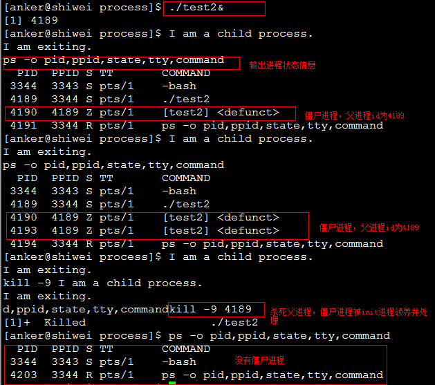
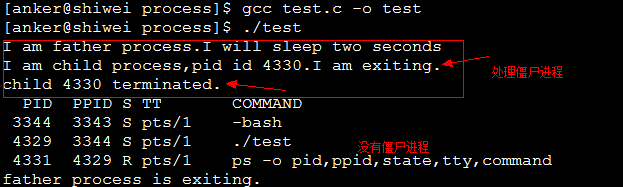
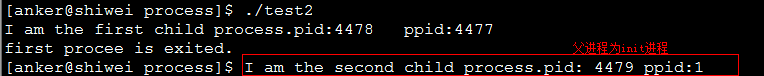

# 孤兒進程與殭屍進程[總結]


##1、前言

　　之前在看《unix環境高級編程》第八章進程時候，提到孤兒進程和殭屍進程，一直對這兩個概念比較模糊。今天被人問到什麼是孤兒進程和殭屍進程，會帶來什麼問題，怎麼解決，我只停留在概念上面，沒有深入，倍感慚愧。晚上回來google了一下，再次參考APUE，認真總結一下，加深理解。

##2、基本概念

　　我們知道在unix/linux中，正常情況下，子進程是通過父進程創建的，子進程在創建新的進程。子進程的結束和父進程的運行是一個異步過程,即父進程永遠無法預測子進程 到底什麼時候結束。 當一個 進程完成它的工作終止之後，它的父進程需要調用wait()或者waitpid()系統調用取得子進程的終止狀態。

　　**孤兒進程：一個父進程退出，而它的一個或多個子進程還在運行，那麼那些子進程將成為孤兒進程。孤兒進程將被init進程(進程號為1)所收養，並由init進程對它們完成狀態收集工作。**

　　**殭屍進程：一個進程使用fork創建子進程，如果子進程退出，而父進程並沒有調用wait或waitpid獲取子進程的狀態信息，那麼子進程的進程描述符仍然保存在系統中。這種進程稱之為僵死進程。**


##3、問題及危害

　　unix提供了一種機制可以保證只要父進程想知道子進程結束時的狀態信息， 就可以得到。這種機制就是: 在每個進程退出的時候,內核釋放該進程所有的資源,包括打開的文件,佔用的內存等。 但是仍然為其保留一定的信息(包括進程號the process ID,退出狀態the termination status of the process,運行時間the amount of CPU time taken by the process等)。直到父進程通過wait / waitpid來取時才釋放。 但這樣就導致了問題，**如果進程不調用wait / waitpid的話， 那麼保留的那段信息就不會釋放，其進程號就會一直被佔用，但是系統所能使用的進程號是有限的，如果大量的產生僵死進程，將因為沒有可用的進程號而導致系統不能產生新的進程. 此即為殭屍進程的危害，應當避免。**

`孤兒進程是沒有父進程的進程，孤兒進程這個重任就落到了init進程身上`，init進程就好像是一個民政局，專門負責處理孤兒進程的善後工作。每當出現一個孤兒進程的時候，內核就把孤 兒進程的父進程設置為init，而init進程會循環地wait()它的已經退出的子進程。這樣，當一個孤兒進程淒涼地結束了其生命週期的時候，init進程就會代表黨和政府出面處理它的一切善後工作。因此孤兒進程並不會有什麼危害。

　　`任何一個子進程(init除外)在exit()之後，並非馬上就消失掉，而是留下一個稱為殭屍進程(Zombie)的數據結構` `，等待父進程處理。`這是每個 子進程在結束時都要經過的階段。如果子進程在exit()之後，父進程沒有來得及處理，這時用ps命令就能看到子進程的狀態是“Z”。如果父進程能及時 處理，可能用ps命令就來不及看到子進程的殭屍狀態，但這並不等於子進程不經過殭屍狀態。  如果父進程在子進程結束之前退出，則子進程將由init接管。init將會以父進程的身份對殭屍狀態的子進程進行處理。


　**殭屍進程危害場景：**

　　例如有個進程，它定期的產 生一個子進程，這個子進程需要做的事情很少，做完它該做的事情之後就退出了，因此這個子進程的生命週期很短，但是，父進程只管生成新的子進程，至於子進程 退出之後的事情，則一概不聞不問，這樣，系統運行上一段時間之後，系統中就會存在很多的僵死進程，倘若用ps命令查看的話，就會看到很多狀態為Z的進程。 嚴格地來說，僵死進程並不是問題的根源，罪魁禍首是產生出大量僵死進程的那個父進程。因此，當我們尋求如何消滅系統中大量的僵死進程時，答案就是把產生大 量僵死進程的那個元凶槍斃掉（也就是通過kill發送SIGTERM或者SIGKILL信號啦）。槍斃了元凶進程之後，它產生的僵死進程就變成了孤兒進 程，這些孤兒進程會被init進程接管，init進程會wait()這些孤兒進程，釋放它們佔用的系統進程表中的資源，這樣，這些已經僵死的孤兒進程 就能瞑目而去了。

3、孤兒進程和殭屍進程測試

孤兒進程測試程序如下所示：
```c
#include <stdio.h>
#include <stdlib.h>
#include <errno.h>
#include <unistd.h>

int main()
{
    pid_t pid;
    //創建一個進程
    pid = fork();
    //創建失敗
    if (pid < 0)
    {
        perror("fork error:");
        exit(1);
    }
    //子進程
    if (pid == 0)
    {
        printf("I am the child process.\n");
        //輸出進程ID和父進程ID
        printf("pid: %d\tppid:%d\n",getpid(),getppid());
        printf("I will sleep five seconds.\n");
        //睡眠5s，保證父進程先退出
        sleep(5);
        printf("pid: %d\tppid:%d\n",getpid(),getppid());
        printf("child process is exited.\n");
    }
    //父進程
    else
    {
        printf("I am father process.\n");
        //父進程睡眠1s，保證子進程輸出進程id
        sleep(1);
        printf("father process is  exited.\n");
    }
    return 0;
}
```
測試結果如下：


殭屍進程測試程序如下所示：
```c
#include <stdio.h>
#include <unistd.h>
#include <errno.h>
#include <stdlib.h>

int main()
{
    pid_t pid;
    pid = fork();
    if (pid < 0)
    {
        perror("fork error:");
        exit(1);
    }
    else if (pid == 0)
    {
        printf("I am child process.I am exiting.\n");
        exit(0);
    }
    printf("I am father process.I will sleep two seconds\n");
    //等待子進程先退出
    sleep(2);
    //輸出進程信息
    system("ps -o pid,ppid,state,tty,command");
    printf("father process is exiting.\n");
    return 0;
}
```
測試結果如下所示：


殭屍進程測試2：父進程循環創建子進程，子進程退出，造成多個殭屍進程，程序如下所示：
```c
#include <stdio.h>
#include <stdlib.h>
#include <unistd.h>
#include <errno.h>

int main()
{
    pid_t  pid;
    //循環創建子進程
    while(1)
    {
        pid = fork();
        if (pid < 0)
        {
            perror("fork error:");
            exit(1);
        }
        else if (pid == 0)
        {
            printf("I am a child process.\nI am exiting.\n");
            //子進程退出，成為殭屍進程
            exit(0);
        }
        else
        {
            //父進程休眠20s繼續創建子進程
            sleep(20);
            continue;
        }
    }
    return 0;
}
```

程序測試結果如下所示：



4、殭屍進程解決辦法

`（1）通過信號機制`

　　子進程退出時向父進程發送SIGCHILD信號，父進程處理SIGCHILD信號。在信號處理函數中調用wait進行處理殭屍進程。測試程序如下所示：

```c
include <stdio.h>
#include <unistd.h>
#include <errno.h>
#include <stdlib.h>
#include <signal.h>

static void sig_child(int signo);

int main()
{
    pid_t pid;
    //創建捕捉子進程退出信號
    signal(SIGCHLD,sig_child);
    pid = fork();
    if (pid < 0)
    {
        perror("fork error:");
        exit(1);
    }
    else if (pid == 0)
    {
        printf("I am child process,pid id %d.I am exiting.\n",getpid());
        exit(0);
    }
    printf("I am father process.I will sleep two seconds\n");
    //等待子進程先退出
    sleep(2);
    //輸出進程信息
    system("ps -o pid,ppid,state,tty,command");
    printf("father process is exiting.\n");
    return 0;
}

static void sig_child(int signo)
{
    pid_t        pid;
    int        stat;
    //處理殭屍進程
    while ((pid = waitpid(-1, &stat, WNOHANG)) >0)
        printf("child %d terminated.\n", pid);
}
```
測試結果如下所示：



`（2）fork兩次`
　　《Unix 環境高級編程》8.6節說的非常詳細。原理是將子進程成為孤兒進程，從而其的父進程變為init進程，通過init進程可以處理殭屍進程。測試程序如下所示：

```c
#include <stdio.h>
#include <stdlib.h>
#include <unistd.h>
#include <errno.h>

int main()
{
    pid_t  pid;
    //創建第一個子進程
    pid = fork();
    if (pid < 0)
    {
        perror("fork error:");
        exit(1);
    }
    //第一個子進程
    else if (pid == 0)
    {
        //子進程再創建子進程
        printf("I am the first child process.pid:%d\tppid:%d\n",getpid(),getppid());
        pid = fork();
        if (pid < 0)
        {
            perror("fork error:");
            exit(1);
        }
        //第一個子進程退出
        else if (pid >0)
        {
            printf("first procee is exited.\n");
            exit(0);
        }
        //第二個子進程
        //睡眠3s保證第一個子進程退出，這樣第二個子進程的父親就是init進程裡
        sleep(3);
        printf("I am the second child process.pid: %d\tppid:%d\n",getpid(),getppid());
        exit(0);
    }
    //父進程處理第一個子進程退出
    if (waitpid(pid, NULL, 0) != pid)
    {
        perror("waitepid error:");
        exit(1);
    }
    exit(0);
    return 0;
}
```
測試結果如下圖所示：




## 5、參考資料

《unix環境高級編程》第八章

http://www.rosoo.net/a/201109/15071.html

http://blog.chinaunix.net/uid-1829236-id-3166986.html

http://forkhope.diandian.com/post/2012-10-01/40040574200

http://blog.csdn.net/metasearch/article/details/2498853

http://blog.csdn.net/yuwenliang/article/details/6770750
