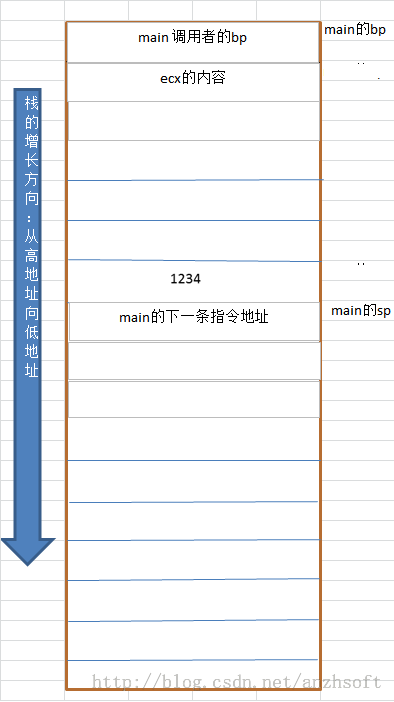
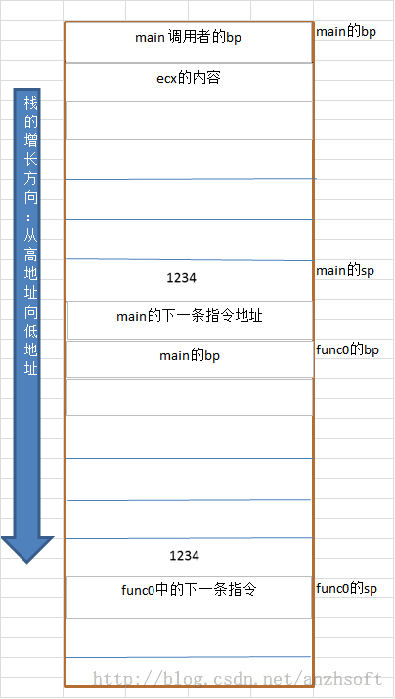
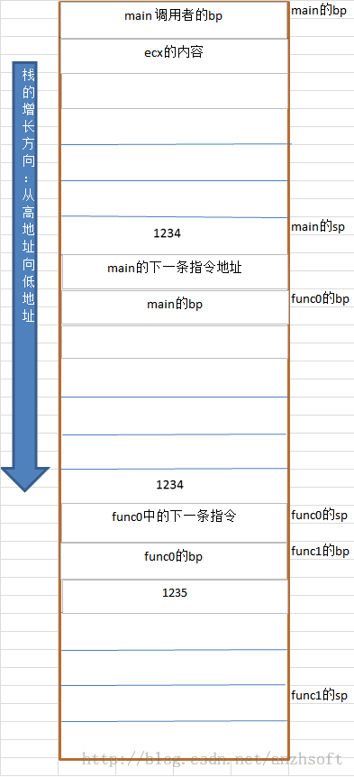

# 使用反汇编理解C++程序函数调用栈


拿到CoreDump后，如果看到的地址都是？？？？，那么基本上可以确定，程序的栈被破坏掉了。GDB也是使用函数的调用栈去还原“事故现场”的。因此理解函数调用栈，是使用GDB进行现场调试或者事后调试的基础，如果不理解调用栈，基本上也从GDB得不到什么有用的信息。当然了，也有可能你非常“幸运”， 一个bt就把哪儿越界给标出来了。但是，大多数的时候你不够幸运，通过log，通过简单的code walkthrough，得不到哪儿出的问题；或者说只是推测，不能确诊。我们需要通过GDB来最终确定CoreDump产生的真正原因。

本文还可以帮助你深入理解C++函数的局部变量。我们学习时知道局部变量是是存储到栈里的，内存管理对程序员是透明的。通过本文，你将明白这些结论是如何得出的。

栈，是LIFO（Last In First Out）的数据结构。C++的函数调用就是通过栈来传递参数，保存函数返回后下一步的执行地址。接下来我们通过一个具体的例子来探究。
```cpp
int func1(int a)
{
  int b = a + 1;
  return b;
}
int func0(int a)
{
  int b = func1(a);
  return b;
}

int main()
{
  int a = 1234;
  func0(a);
  return 0;
}
```
可以使用以下命令将上述code编程成汇编代码：
```
g++ -g -S -O0 -m32 main.cpp -o-|c++filt >main.format.s
```

c++filt 是为了Demangle symbols。-m32是为了编译成x86-32的。因为对于x86-64来说，函数的参数是通过寄存器传递的。

main的汇编代码：
```
main:
        leal    4(%esp), %ecx
        andl    $-16, %esp
        pushl   -4(%ecx)

        pushl   %ebp           #1：push %ebp指令把ebp寄存器的值压栈，同时把esp的值减4
        movl    %esp, %ebp     #2  把esp的值传送给ebp寄存器。
                               #1 + #2 合起来是把原来ebp的值保存在栈上，然后又给ebp赋了新值。
                               #2+ ebp指向栈底，而esp指向栈顶，在函数执行过程中esp
                               #2++随着压栈和出栈操作随时变化，而ebp是不动的
        pushl   %ecx
        subl    $20, %esp      #3 现在esp地址-20/4 = 5, 及留出5个地址空间给main的局部变量
        movl    $1234, -8(%ebp)#4 局部变量1234 存入ebp - 8 的地址
        movl    -8(%ebp), %eax #5 将地址存入eax
        movl    %eax, (%esp)   #6 将1234存入esp指向的地址
        call    func0(int)     #7 调用func0，注意这是demangle后的函数名，实际是一个地址
        movl    $0, %eax
        addl    $20, %esp
        popl    %ecx
        popl    %ebp
        leal    -4(%ecx), %esp
        ret
```

对于call指令，这个指令有两个作用：

func0函数调用完之后要返回到call的下一条指令继续执行，所以把call的下一条指令的地址压栈，同时把esp的值减4。

修改程序计数器eip，跳转到func0函数的开头执行。

至此，调用func0的栈就是下面这个样子：



下面看一下func0的汇编代码：
```
func0(int):
        pushl   %ebp
        movl    %esp, %ebp
        subl    $20, %esp
        movl    8(%ebp), %eax
        movl    %eax, (%esp)
        call    func1(int)
        movl    %eax, -4(%ebp)
        movl    -4(%ebp), %eax
        leave
        ret
```

需要注意的是esp也是留了5个地址空间给func0使用。并且ebp的下一个地址就是留给局部变量b的，调用栈如图：


通过调用栈可以看出，8(%ebp)其实就是传入的参数1234。
func1的代码：
```
func1(int):
        pushl   %ebp
        movl    %esp, %ebp
        subl    $16, %esp
        movl    8(%ebp), %eax #去传入的参数，即1234
        addl    $1, %eax # +1 运算
        movl    %eax, -4(%ebp)
        movl    -4(%ebp), %eax #将计算结果存入eax，这就是返回值
        leave
        ret
```

leave指令，这个指令是函数开头的push %ebp和mov %esp,%ebp的逆操作：
把ebp的值赋给esp

现在esp所指向的栈顶保存着foo函数栈帧的ebp，把这个值恢复给ebp，同时esp增加4。注意，现在esp指向的是这次调用的返回地址，即上次调用的下一条执行指令。

最后是ret指令，它是call指令的逆操作：

现在esp所指向的栈顶保存着返回地址，把这个值恢复给eip，同时esp增加4，esp指向了当前frame的栈顶。

修改了程序计数器eip，因此跳转到返回地址继续执行。

调用栈如下：



至此，func1返回后，控制权交还给func0，当前的栈就退化成func0的栈的情况，因为栈保存了一切信息，因此指令继续执行。直至func0执行

leave

ret

以同样的方式将控制权交回给main。


到这里，你应该知道下面问题的答案了：

1. 局部变量的生命周期，

2. 局部变量是怎么样使用内存的；

3. 为什么传值不会改变原值（因为编译器已经帮你做好拷贝了）

4. 为什么会有栈溢出的错误

5. 为什么有的写坏栈的程序可以运行，而有的却会crash（如果栈被破坏的是数据，那么数据是脏的，不应该继续运行；如果破坏的是上一层调用的bp，或者返回地址，那么程序会crash，or unexpected behaviour...）

小节一下：

   1. 在32位的机器上，C++的函数调用的参数是存到栈上的。当然gcc可以在函数声明中添加_attribute__((regparm(3)))使用eax， edx，ecx传递开头三个参数。
   2. 通过bp可以访问到调用的参数值。

   3. 函数的返回地址（函数返回后的执行指令）也是存到栈上的，有目的的修改它可以使程序跳转到它不应该的地方。。。

   4. 如果程序破坏了上一层的bp的地址，或者程序的返回地址，那么程序就很有可能crash

   5. 拿到一个CoreDump，应该首先先看有可能出问题的线程的的frame的栈是否完整。

   6. 64位的机器上，参数是通过寄存器传递的，当然寄存器不够用就会通过栈来传递
