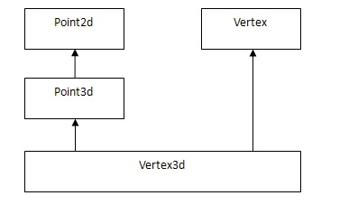
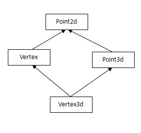

# 使用GDB來理解C++ 對象的內存佈局（多重繼承，虛繼承）

  前一段時間再次拜讀《Inside the C++ Object Model》 深入探索C++對象模型，有了進一步的理解，因此我也寫了四篇博文算是讀書筆記：
```
Program Transformation Semantics （程序轉換語義學）
The Semantics of Copy Constructors(拷貝構造函數之編譯背後的行為）
The Semantics of Constructors: The Default Constructor （默認構造函數什麼時候會被創建出來）
The Semantics of Data: Data語義學 深入探索C++對象模型
```
這些文章都獲得了很大的瀏覽量，雖然類似的博文原來都有，可能不容易被現在仍活躍在CSDN Blog的各位同仁看到吧。因此萌生了接著將這這本書讀完的同時，再接著談一下我的理解，或者說讀書筆記。

關於C++虛函數，很多博文從各個角度來探究虛函數是如何實現的，或者說編譯器是如何實現虛函數的。比較經典的文章有陳皓先生的`《C++虛函數表解析》`和`《C++對象內存佈局》`。本文通過GDB來從另外一個角度來理解C++ object的內存佈局，一來熟悉語言背後編譯器為了實現語言特性為我們做了什麼；二來熟悉使用GDB來調試程序。

同時，本文也將對如何更好的理解C++語言提供了一個方法：使用GDB，可以很直觀的理解編譯器的實現，從根本上掌握C++！我們不單單隻會開車，還應該知道車的內部的構造。

## 2、帶有虛函數的單一繼承

```cpp
class Parent
{
public:
  Parent():numInParent(1111)
  {}
  virtual void Foo(){
  };
  virtual void Boo(){
  };
private:
  int numInParent;
};

class Child: public Parent
{
public:
  Child():numInChild(2222){}
  virtual void Foo(){
  }
  int numInChild;
};
```
編譯時不要忘記-g，使得gdb可以把各個地址映射成函數名。
```c
(gdb) set p obj on
(gdb) p *this
$2 = (Child) {<Parent> = {_vptr.Parent = 0x400a30, numInParent = 1111}, numInChild = 2222}
(gdb) set p pretty on
(gdb) p *this
$3 = (Child) {
  <Parent> = {
    _vptr.Parent = 0x400a30,
    numInParent = 1111
  },
  members of Child:
  numInChild = 2222
}
(gdb)  p /a (*(void ***)this)[0]@3
$4 = {0x4008ec <Child::Foo()>, 0x4008b4 <Parent::Boo()>, 0x6010b0 <_ZTVN10__cxxabiv120__si_class_type_infoE@@CXXABI_1.3+16>}
```
解釋一下gdb的命令：
set p obj <on/off>: 在C++中，如果一個對象指針指向其派生類，如果打開這個選項，GDB會自動按照虛方法調用的規則顯示輸出，如果關閉這個選項的話，GDB就不管虛函數表了。這個選項默認是off。 使用show print object查看對象選項的設置。

set p pertty <on/off>: 按照層次打印結構體。可以從設置前後看到這個區別。on的確更容易閱讀。

p /a (*(void ***)this)[0]@3
就是打印虛函數表了。因為知道是兩個，可以僅僅打印2個元素。為了知道下一個存儲了什麼信息，我們打印了3個值。實際上後幾個元素存儲了Parent 和Child的typeinfo name和typeinfo。

總結：

對於單一繼承，
```
1. vptr存儲到了object的開始。
2. 在vptr之後，從Parent開始的data member按照聲明順序依次存儲。
```

## 3. 多重繼承，包含有相同的父類


對應的C++codes：
```cpp
class Point2d{
public:
  virtual void Foo(){}
  virtual void Boo(){}
  virtual void non_overwrite(){}
protected:
  float _x, _y;
};

class Vertex: public  Point2d{
public:
  virtual void Foo(){}
  virtual void BooVer(){}
protected:
  Vertex *next;
};

class Point3d: public Point2d{
public:
  virtual void Boo3d(){}
protected:
  float _z;
};

class Vertex3d: public Vertex, public Point3d{
public:
  void test(){}
protected:
  float mumble;
};
```
使用GDB打印的對象內存佈局：

```cpp
<Vertex> = {
    <Point2d> = {
      _vptr.Point2d = 0x400ab0,
      _x = 5.88090213e-39,
      _y = 0
    },
    members of Vertex:
    next = 0x0
  },
  <Point3d> = {
    <Point2d> = {
      _vptr.Point2d = 0x400ae0,
      _x = -nan(0x7fe180),
      _y = 4.59163468e-41
    },
    members of Point3d:
    _z = 0
  },
  members of Vertex3d:
  mumble = 0
}
```
可見v3d有兩個vptr，指向不同的vtable。首先看一下第一個：

```c
(gdb) p /a (*(void ***)this)[0]@5
$9 =   {0x4008be <Vertex::Foo()>,
  0x4008aa <Point2d::Boo()>,
  0x4008b4 <Point2d::non_overwrite()>,
  0x4008c8 <Vertex::BooVer()>,
  0xffffffffffffffe8}
(gdb) p /a (*(void ***)this)[0]@6
$10 =   {0x4008be <Vertex::Foo()>,
  0x4008aa <Point2d::Boo()>,
  0x4008b4 <Point2d::non_overwrite()>,
  0x4008c8 <Vertex::BooVer()>,
  0xffffffffffffffe8,
  0x400b00 <_ZTI8Vertex3d>}
(gdb) info addr _ZTI8Vertex3d
Symbol "typeinfo for Vertex3d" is at 0x400b00 in a file compiled without debugging.
```
你可以注意到了，vtable打印分行了，可以使用 set p array on將打印的數組分行，以逗號結尾。

注意到該虛函數表以
0xffffffffffffffe8
結尾。

在單一繼承中是沒有這個結束標識的。
接著看第二個vtable：

```c
(gdb) p /a (*(void ***)this)[1]@5
$11 =   {0x4008b2 <Point2d::Boo()>,
  0x4008bc <Point2d::non_overwrite()>,
  0x4008d0 <Vertex::BooVer()>,
  0xffffffffffffffe8,
  0x400b00 <_ZTI8Vertex3d>}
(gdb) info addr _ZTI8Vertex3d
Symbol "typeinfo for Vertex3d" is at 0x400b00 in a file compiled without debugging.
```

當然這個只是為了舉個例子。現實中很少有人這麼幹吧。比如訪問Foo，下面的code將會導致歧義性錯誤：
```
v3d.Boo();
```
`error: request for member Boo is ambiguous
multiInheritance.cpp:8: error: candidates are: virtual void Point2d::Boo()`
只能指定具體的subobject才能進行具體調用：
```
v3d.::Vertex::Boo();
```

## 4. 虛擬繼承
C++ codes:
```cpp
class Point2d{
public:
  virtual void Foo(){}
  virtual void Boo(){}
  virtual void non_overwrite(){}
protected:
  float _x, _y;
};

class Vertex: public virtual  Point2d{
public:
  virtual void Foo(){}
  virtual void BooVer(){}
protected:
  Vertex *next;
};

class Point3d: public virtual Point2d{
public:
  virtual void Boo3d(){}
protected:
  float _z;
};

class Vertex3d: public Vertex, public Point3d{
public:
  void test(){}
protected:
  float mumble;
};
```

繼承關係圖：



使用gdb打印object的內存佈局：

```c
(gdb) p *this
$10 = (Vertex3d) {
  <Vertex> = {
    <Point2d> = {
      _vptr.Point2d = 0x400b70,
      _x = 0,
      _y = 0
    },
    members of Vertex:
    _vptr.Vertex = 0x400b18,
    next = 0x4009c0
  },
  <Point3d> = {
    members of Point3d:
    _vptr.Point3d = 0x400b40,
    _z = 5.87993804e-39
  },
  members of Vertex3d:
  mumble =  0
}
```
gdb打印的vptr相關：
```c
(gdb) p /a (*(void ***)this)[0]@60
$25 =   {0x400870 <Vertex::Foo()>,
  0x40087a <Vertex::BooVer()>,
  0x10,
  0xfffffffffffffff0,
  0x400c80 <_ZTI8Vertex3d>, #"typeinfo for Vertex3d"
  0x400884 <Point3d::Boo3d()>,
  0x0,
  0x0,
  0xffffffffffffffe0,
  0xffffffffffffffe0,
  0x400c80 <_ZTI8Vertex3d>, #"typeinfo for Vertex3d"
  0x400866 <_ZTv0_n24_N6Vertex3FooEv>, #"virtual thunk to Vertex::Foo()"
  0x400852 <Point2d::Boo()>,
  0x40085c <Point2d::non_overwrite()>,
  0x0,
  0x0,
  0x0,
  0x20,
  0x0,
  0x400cc0 <_ZTI6Vertex>, #"typeinfo for Vertex"
  0x400870 <Vertex::Foo()>,
  0x40087a <Vertex::BooVer()>,
  0x0,
  0x0,
  0xffffffffffffffe0,
  0xffffffffffffffe0,
  0x400cc0 <_ZTI6Vertex>, #"typeinfo for Vertex"
  0x400866 <_ZTv0_n24_N6Vertex3FooEv>, #"virtual thunk to Vertex::Foo()"
  0x400852 <Point2d::Boo()>,
  0x40085c <Point2d::non_overwrite()>,
  0x0,
  0x0,
  0x0,
  0x10,
  0x0,
  0x400d00 <_ZTI7Point3d>, #"typeinfo for Point3d"
  0x400884 <Point3d::Boo3d()>,
  0x0,
  0x0,
  0x0,
  0xfffffffffffffff0,
  0x400d00 <_ZTI7Point3d>, #"typeinfo for Point3d"
  0x400848 <Point2d::Foo()>,
  0x400852 <Point2d::Boo()>,
  0x40085c <Point2d::non_overwrite()>,
  0x6020b0 <_ZTVN10__cxxabiv121__vmi_class_type_infoE@@CXXABI_1.3+16>,
  0x400d28 <_ZTS8Vertex3d>,
  0x200000002,
  0x400cc0 <_ZTI6Vertex>, #"typeinfo for Vertex"
  0x2,
  0x400d00 <_ZTI7Point3d>, #"typeinfo for Point3d"
  0x1002,
  0x0,
  0x6020b0 <_ZTVN10__cxxabiv121__vmi_class_type_infoE@@CXXABI_1.3+16>,
  0x400d32 <_ZTS6Vertex>,
  0x100000000,
  0x400d40 <_ZTI7Point2d>,
  0xffffffffffffe803,
  0x0,
  0x0}
```
有興趣的話可以看一下反彙編的vtable的構成。

###參考：
```
1. http://stackoverflow.com/questions/6191678/print-c-vtables-using-gdb
2. http://stackoverflow.com/questions/18363899/how-to-display-a-vtable-by-name-using-gdb
```


