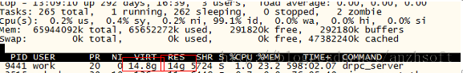
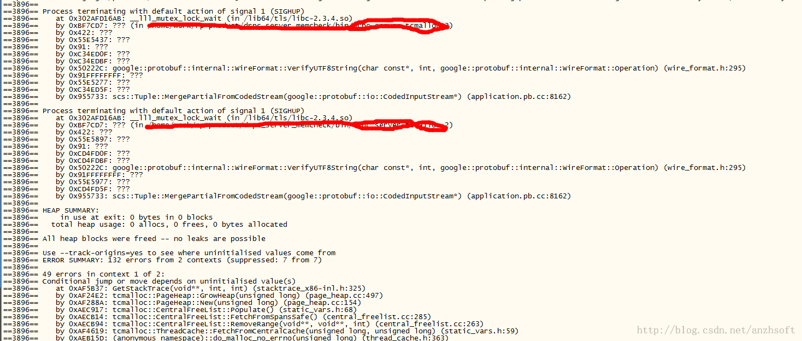

# 一次生產環境下的“內存洩露”

一個偶然的機會，發現一個進程使用了超過`14G`的內存。這個進程是一個`RPC server`，只是作為中轉，絕對不應該使用這麼多內存的。即使併發量太多，存在內存中的數據太多，那麼在併發減少的情況下，這個內存使用肯定會降下來。但是事實上，這個內存會一直漲，直到被`OOM Killer`殺掉。



由於這個`rpc server`的邏輯比較簡單，先走讀源碼，除了發現一些簡單的編程上面的問題外，沒有大的問題。先上`valgrind`：

```c
valgrind --tool=memcheck --leak-check=full -v ./rpc_server
```

原來的情況是，一般都會檢查出內存洩露的。這次沒有（否則也不會有本文了）：




實際上至少`10G`的“內存洩露”。既然沒有檢查出，說明這些內存還是活著的。設想一下這個場景：每個請求都`new`一塊內存，放到一個列表中。正常的話請求處理完需要從這個列表中刪除這塊內存。如果沒有刪除，那麼這就算是內存洩露。但是`valgrind`檢查不出來。

由於上面這個進程使用了`tcmalloc`，是不是`tcmalloc`的問題？我們知道`tcmalloc`的效率要優於`malloc`，那麼是不是`tcmalloc`的問題，如果它一直申請內存，不釋放，就會造成這種”內存洩露“。注意下面一段話：

```
Releasing Memory Back to the System

By default, tcmalloc will release no-longer-used memory back to the kernel gradually,
over time.
The tcmalloc_release_rate flag controls how quickly this happens.
You can also force a release at a given point in the progam execution like so:

   MallocExtension::instance()->ReleaseFreeMemory();
You can also call SetMemoryReleaseRate() to change the tcmalloc_release_rate value
 at runtime, or GetMemoryReleaseRate to see what the current release rate is.
```


簡單翻譯一下，就是`tcmalloc`將內存交回OS的機制：默認情況下，`tcmalloc`會將長時間未用的內存交還系統。`tcmalloc_release_rate`這個`flag`控制了這個交回頻率。你可以在運行時通過這個語句強制這個release發生：
```cpp
MallocExtension::instance()->ReleaseFreeMemory();
```
當然了，你可以通過`SetMemoryReleaseRate()` 來設置這個`tcmalloc_release_rate`. 如果設置為`0`，代表永遠不交回。數字越大代表交回的頻率越大。一般合理的值就是設置一個`0 - 10` 之間的一個數。也可以通過設置環境變量`TCMALLOC_RELEASE_RATE`來設置這個`rate`。
帶著這個懷疑，首先還是通過`Google's gpreftools`檢查一下heap的使用情況：

```c
1.  export HEAPCHECK=draconian
2.  export PPROF_PATH=/usr/local/bin/pprof
```
直接啟動即可。

之所以設置為draconian，因為想得到更詳細的統計信息。更將相信的解釋如下：`Flavors of Heap Checking`

```
These are the legal values when running a whole-program heap check:

1. minimal
2. normal
3. strict
4. draconian

"Minimal" heap-checking starts as late as possible in a initialization, meaning you can leak some memory in your initialization routines (that run before main(), say), and not trigger a leak message. If you frequently (and purposefully) leak data in one-time global initializers, "minimal" mode is useful for you. Otherwise, you should avoid it for stricter modes.

"Normal" heap-checking tracks live objects and reports a leak for any data that is not reachable via a live object when the program exits.

"Strict" heap-checking is much like "normal" but has a few extra checks that memory isn't lost in global destructors. In particular, if you have a global variable that allocates memory during program execution, and then "forgets" about the memory in the global destructor (say, by setting the pointer to it to NULL) without freeing it, that will prompt a leak message in "strict" mode, though not in "normal" mode.

"Draconian" heap-checking is appropriate for those who like to be very precise about their memory management, and want the heap-checker to help them enforce it. In "draconian" mode, the heap-checker does not do "live object" checking at all, so it reports a leak unless all allocated memory is freed before program exit. (However, you can use IgnoreObject() to re-enable liveness-checking on an object-by-object basis.)

"Normal" mode, as the name implies, is the one used most often at Google. It's appropriate for everyday heap-checking use.

In addition, there are two other possible modes:

as-is
local
as-is is the most flexible mode; it allows you to specify the various knobs of the heap checker explicitly. local activates the explicit heap-check instrumentation, but does not turn on any whole-program leak checking.
```

但是很不幸，還是沒有檢查出來：

上面的洩露統計不是預期的，因為“洩露”了至少`10G`的內存了。

那麼還是強制的釋放不用的`buffer`吧：

```cpp
MallocExtension::instance()->ReleaseFreeMemory();
```

問題解決了。

