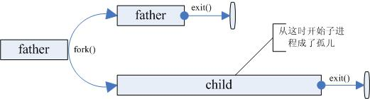
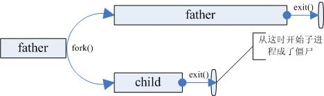
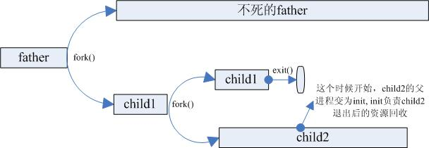

# 服務器進程為何通常fork()兩次

首先，要了解什麼叫殭屍進程，什麼叫孤兒進程，以及服務器進程運行所需要的一些條件。兩次fork()就是為了解決這些相關的問題而出現的一種編程方法。

### 孤兒進程

孤兒進程是指父進程在子進程結束之前死亡(return 或exit)。如下圖1所示：




但是孤兒進程並不會像上面畫的那樣持續很長時間，當系統發現孤兒進程時，init進程就收養孤兒進程，成為它的父親，child進程exit後的資源回收就都由init進程來完成。


### 殭屍進程

 殭屍進程是指子進程在父進程之前結束了，但是父進程沒有用wait或waitpid回收子進程。如下圖所示：

 


父進程沒有用wait回收子進程並不說明它不會回收子進程。子進程在結束的時候會給其父進程發送一個SIGCHILD信號，父進程默認是忽略SIGCHILD信號的，如果父進程通過signal()函數設置了SIGCHILD的信號處理函數，則在信號處理函數中可以回收子進程的資源。

事實上，即便是父進程沒有設置SIGCHILD的信號處理函數，也沒有關係，因為在父進程結束之前，子進程可以一直保持殭屍狀態，當父進程結束後，init進程就會負責回收殭屍子進程。

但是，如果父進程是一個服務器進程，一直循環著不退出，那子進程就會一直保持著殭屍狀態。雖然殭屍進程不會佔用任何內存資源，但是過多的殭屍進程總還是會影響系統性能的。黔驢技窮的情況下，該怎麼辦呢？

這個時候就需要一個英雄來拯救整個世界，它就是兩次fork()技法。

### 兩次fork()技法

兩次fork()的流程如下所示：





如上圖3所示，為了避免子進程child成為殭屍進程，我們可以人為地創建一個子進程child1，再讓child1成為工作子進程child2的父進程，child2出生後child1退出，這個時候child2相當於是child1產生的孤兒進程，這個孤兒進程由系統進程init回收。這樣，當child2退出的時候，init就會回收child2的資源，child2就不會成為孤魂野鬼禍國殃民了。


<unix環境高級編程>這本書裡提供了兩次fork的一個例子，代碼如下：

```cpp
int main(void)
{
	pid_t        pid;

	if ( (pid = fork()) < 0)
          err_sys("fork error");
	else if (pid == 0)
		{                /* first child */
           if ( (pid = fork()) < 0)
                        err_sys("fork error");
           else if (pid > 0)
                 exit(0);        /* parent from second fork == first child */

                /* We're the second child; our parent becomes init as soon
                   as our real parent calls exit() in the statement above.
                   Here's where we'd continue executing, knowing that when
                   we're done, init will reap our status. */

            sleep(2);
            printf("second child, parent pid = %d\n", getppid());
            exit(0);
        }

    if (waitpid(pid, NULL, 0) != pid)        /* wait for first child */
            err_sys("waitpid error");

        /* We're the parent (the original process); we continue executing,
           knowing that we're not the parent of the second child. */

    exit(0);
}
```
理所當然，第二個子進程的父進程是進程號為1的init進程。

一言以蔽之，兩次fork()是人為地創建一個工作子進程的父進程，然後讓這個人為父進程退出，之後工作子進程就由init回收，避免了工作子進程成為殭屍進程。

參考文獻：《UNIX環境高級編程》
