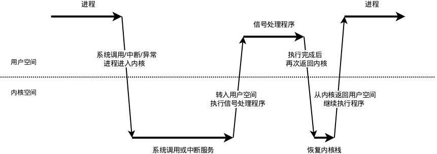

# Linux信號處理機制

在Linux中，信號是進程間通訊的一種方式，它採用的是異步機制。當信號發送到某個進程中時，操作系統會中斷該進程的正常流程，並進入相應的信號處理函數執行操作，完成後再回到中斷的地方繼續執行。

需要說明的是，信號只是用於通知進程發生了某個事件，除了信號本身的信息之外，並不具備傳遞用戶數據的功能。

##1 信號的響應動作
每個信號都有自己的響應動作，當接收到信號時，進程會根據信號的響應動作執行相應的操作，信號的響應動作有以下幾種：

- 中止進程(Term)
- 忽略信號(Ign)
- 中止進程並保存內存信息(Core)
- 停止進程(Stop)
- 繼續運行進程(Cont)

用戶可以通過signal或sigaction函數修改信號的響應動作（也就是常說的“註冊信號”，在文章的後面會舉例說明）。另外，在多線程中，各線程的信號響應動作都是相同的，不能對某個線程設置獨立的響應動作。

##2 信號類型
Linux支持的信號類型可以參考下面給出的列表。

###2.1 在POSIX.1-1990標準中的信號列表
<table>
<thead>
<tr>
<th>信號</th>
<th>值</th>
<th>動作</th>
<th>說明</th>
</tr>
</thead>
<tbody>
<tr>
<td>SIGHUP</td>
<td>1</td>
<td>Term</td>
<td>終端控制進程結束(終端連接斷開)</td>
</tr>
<tr>
<td>SIGINT</td>
<td>2</td>
<td>Term</td>
<td>用戶發送INTR字符(Ctrl+C)觸發</td>
</tr>
<tr>
<td>SIGQUIT</td>
<td>3</td>
<td>Core</td>
<td>用戶發送QUIT字符(Ctrl+/)觸發</td>
</tr>
<tr>
<td>SIGILL</td>
<td>4</td>
<td>Core</td>
<td>非法指令(程序錯誤、試圖執行數據段、棧溢出等)</td>
</tr>
<tr>
<td>SIGABRT</td>
<td>6</td>
<td>Core</td>
<td>調用abort函數觸發</td>
</tr>
<tr>
<td>SIGFPE</td>
<td>8</td>
<td>Core</td>
<td>算術運行錯誤(浮點運算錯誤、除數為零等)</td>
</tr>
<tr>
<td>SIGKILL</td>
<td>9</td>
<td>Term</td>
<td>無條件結束程序(不能被捕獲、阻塞或忽略)</td>
</tr>
<tr>
<td>SIGSEGV</td>
<td>11</td>
<td>Core</td>
<td>無效內存引用(試圖訪問不屬於自己的內存空間、對只讀內存空間進行寫操作)</td>
</tr>
<tr>
<td>SIGPIPE</td>
<td>13</td>
<td>Term</td>
<td>消息管道損壞(FIFO/Socket通信時，管道未打開而進行寫操作)</td>
</tr>
<tr>
<td>SIGALRM</td>
<td>14</td>
<td>Term</td>
<td>時鐘定時信號</td>
</tr>
<tr>
<td>SIGTERM</td>
<td>15</td>
<td>Term</td>
<td>結束程序(可以被捕獲、阻塞或忽略)</td>
</tr>
<tr>
<td>SIGUSR1</td>
<td>30,10,16</td>
<td>Term</td>
<td>用戶保留</td>
</tr>
<tr>
<td>SIGUSR2</td>
<td>31,12,17</td>
<td>Term</td>
<td>用戶保留</td>
</tr>
<tr>
<td>SIGCHLD</td>
<td>20,17,18</td>
<td>Ign</td>
<td>子進程結束(由父進程接收)</td>
</tr>
<tr>
<td>SIGCONT</td>
<td>19,18,25</td>
<td>Cont</td>
<td>繼續執行已經停止的進程(不能被阻塞)</td>
</tr>
<tr>
<td>SIGSTOP</td>
<td>17,19,23</td>
<td>Stop</td>
<td>停止進程(不能被捕獲、阻塞或忽略)</td>
</tr>
<tr>
<td>SIGTSTP</td>
<td>18,20,24</td>
<td>Stop</td>
<td>停止進程(可以被捕獲、阻塞或忽略)</td>
</tr>
<tr>
<td>SIGTTIN</td>
<td>21,21,26</td>
<td>Stop</td>
<td>後臺程序從終端中讀取數據時觸發</td>
</tr>
<tr>
<td>SIGTTOU</td>
<td>22,22,27</td>
<td>Stop</td>
<td>後臺程序向終端中寫數據時觸發</td>
</tr>
</tbody>
</table>

注：其中`SIGKILL`和`SIGSTOP`信號不能被捕獲、阻塞或忽略。

###2.2 在SUSv2和POSIX.1-2001標準中的信號列表

<table>
<thead>
<tr>
<th>信號</th>
<th>值</th>
<th>動作</th>
<th>說明</th>
</tr>
</thead>
<tbody>
<tr>
<td>SIGTRAP</td>
<td>5</td>
<td>Core</td>
<td>Trap指令觸發(如斷點，在調試器中使用)</td>
</tr>
<tr>
<td>SIGBUS</td>
<td>0,7,10</td>
<td>Core</td>
<td>非法地址(內存地址對齊錯誤)</td>
</tr>
<tr>
<td>SIGPOLL</td>
<td></td>
<td>Term</td>
<td>Pollable event (Sys V). Synonym for SIGIO</td>
</tr>
<tr>
<td>SIGPROF</td>
<td>27,27,29</td>
<td>Term</td>
<td>性能時鐘信號(包含系統調用時間和進程佔用CPU的時間)</td>
</tr>
<tr>
<td>SIGSYS</td>
<td>12,31,12</td>
<td>Core</td>
<td>無效的系統調用(SVr4)</td>
</tr>
<tr>
<td>SIGURG</td>
<td>16,23,21</td>
<td>Ign</td>
<td>有緊急數據到達Socket(4.2BSD)</td>
</tr>
<tr>
<td>SIGVTALRM</td>
<td>26,26,28</td>
<td>Term</td>
<td>虛擬時鐘信號(進程佔用CPU的時間)(4.2BSD)</td>
</tr>
<tr>
<td>SIGXCPU</td>
<td>24,24,30</td>
<td>Core</td>
<td>超過CPU時間資源限制(4.2BSD)</td>
</tr>
<tr>
<td>SIGXFSZ</td>
<td>25,25,31</td>
<td>Core</td>
<td>超過文件大小資源限制(4.2BSD)</td>
</tr>
</tbody>
</table>

注：在Linux 2.2版本之前，`SIGSYS`、`SIGXCPU`、`SIGXFSZ`以及`SIGBUS`的默認響應動作為Term，Linux 2.4版本之後這三個信號的默認響應動作改為Core。

### 2.3 其它信號

<table>
<thead>
<tr>
<th>信號</th>
<th>值</th>
<th>動作</th>
<th>說明</th>
</tr>
</thead>
<tbody>
<tr>
<td>SIGIOT</td>
<td>6</td>
<td>Core</td>
<td>IOT捕獲信號(同SIGABRT信號)</td>
</tr>
<tr>
<td>SIGEMT</td>
<td>7,-,7</td>
<td>Term</td>
<td>實時硬件發生錯誤</td>
</tr>
<tr>
<td>SIGSTKFLT</td>
<td>-,16,-</td>
<td>Term</td>
<td>協同處理器棧錯誤(未使用)</td>
</tr>
<tr>
<td>SIGIO</td>
<td>23,29,22</td>
<td>Term</td>
<td>文件描述符準備就緒(可以開始進行輸入/輸出操作)(4.2BSD)</td>
</tr>
<tr>
<td>SIGCLD</td>
<td>-,-,18</td>
<td>Ign</td>
<td>子進程結束(由父進程接收)(同SIGCHLD信號)</td>
</tr>
<tr>
<td>SIGPWR</td>
<td>29,30,19</td>
<td>Term</td>
<td>電源錯誤(System V)</td>
</tr>
<tr>
<td>SIGINFO</td>
<td>29,-,-</td>
<td></td>
<td>電源錯誤(同SIGPWR信號)</td>
</tr>
<tr>
<td>SIGLOST</td>
<td>-,-,-</td>
<td>Term</td>
<td>文件鎖丟失(未使用)</td>
</tr>
<tr>
<td>SIGWINCH</td>
<td>28,28,20</td>
<td>Ign</td>
<td>窗口大小改變時觸發(4.3BSD, Sun)</td>
</tr>
<tr>
<td>SIGUNUSED</td>
<td>-,31,-</td>
<td>Core</td>
<td>無效的系統調用(同SIGSYS信號)</td>
</tr>
</tbody>
</table>

注意：列表中有的信號有三個值，這是因為部分信號的值和CPU架構有關，這些信號的值在不同架構的CPU中是不同的，三個值的排列順序為：1，Alpha/Sparc；2，x86/ARM/Others；3，MIPS。

例如`SIGSTOP`這個信號，它有三種可能的值，分別是17、19、23，其中第一個值（17）是用在Alpha和Sparc架構中，第二個值（19）用在x86、ARM等其它架構中，第三個值（23）則是用在MIPS架構中的。

##3 信號機制
文章的前面提到過，信號是異步的，這就涉及信號何時接收、何時處理的問題。

我們知道，函數運行在用戶態，當遇到系統調用、中斷或是異常的情況時，程序會進入內核態。信號涉及到了這兩種狀態之間的轉換，過程可以先看一下下面的示意圖：


接下來圍繞示意圖，將信號分成接收、檢測和處理三個部分，逐一講解每一步的處理流程。

###3.1 信號的接收

接收信號的任務是由內核代理的，當內核接收到信號後，會將其放到對應進程的信號隊列中，同時向進程發送一箇中斷，使其陷入內核態。

注意，此時信號還只是在隊列中，對進程來說暫時是不知道有信號到來的。

###3.2 信號的檢測

進程陷入內核態後，有兩種場景會對信號進行檢測：

- 進程從內核態返回到用戶態前進行信號檢測
- 進程在內核態中，從睡眠狀態被喚醒的時候進行信號檢測

當發現有新信號時，便會進入下一步，信號的處理。

### 3.3 信號的處理

信號處理函數是運行在用戶態的，調用處理函數前，內核會將當前內核棧的內容備份拷貝到用戶棧上，並且修改指令寄存器（eip）將其指向信號處理函數。

接下來進程返回到用戶態中，執行相應的信號處理函數。

信號處理函數執行完成後，還需要返回內核態，檢查是否還有其它信號未處理。如果所有信號都處理完成，就會將內核棧恢復（從用戶棧的備份拷貝回來），同時恢復指令寄存器（eip）將其指向中斷前的運行位置，最後回到用戶態繼續執行進程。

至此，一個完整的信號處理流程便結束了，如果同時有多個信號到達，上面的處理流程會在第2步和第3步驟間重複進行。


##4 信號的使用
### 4.1 發送信號

用於發送信號的函數有`raise`、`kill`、`killpg`、`pthread_kill`、`tgkill`、`sigqueue`，這幾個函數的含義和用法都大同小異，這裡主要介紹一下常用的`raise`和`kill`函數。

**raise** 函數：向進程本身發送信號

函數聲明如下：
```cpp
#include <signal.h>
int raise(int sig);
```

函數功能是向當前程序(自身)發送信號，其中參數sig為信號值。

**kill** 函數：向指定進程發送信號

函數聲明如下：
```cpp
#include <sys/types.h>
#include <signal.h>
int kill(pid_t pid, int sig);
```

函數功能是向特定的進程發送信號，其中參數pid為進程號，sig為信號值。

在這裡的參數pid，根據取值範圍不同，含義也不同，具體說明如下：

- pid > 0 ：向進程號為pid的進程發送信號
- pid = 0 ：向當前進程所在的進程組發送信號
- pid = -1 ：向所有進程(除PID=1外)發送信號(權限範圍內)
- pid < -1 ：向進程組號為-pid的所有進程發送信號

另外，當sig值為零時，實際不發送任何信號，但函數返回值依然有效，可以用於檢查進程是否存在。

### 4.2 等待信號被捕獲

等待信號的過程，其實就是將當前進程(線程)暫停，直到有信號發到當前進程(線程)上並被捕獲，函數有pause和sigsuspend。

**pause** 函數：將進程(或線程)轉入睡眠狀態，直到接收到信號

函數聲明如下：
```cpp
#include <unistd.h>
int pause(void);
```

該函數調用後，調用者(進程或線程)會進入睡眠(Sleep)狀態，直到捕獲到(任意)信號為止。該函數的返回值始終為-1，並且調用結束後，錯誤代碼(errno)會被置為EINTR。

**sigsuspend** 函數：將進程(或線程)轉入睡眠狀態，直到接收到特定信號

函數聲明如下：
```cpp
#include <signal.h>
int sigsuspend(const sigset_t *mask);
```

該函數調用後，會將進程的信號掩碼臨時修改(參數`mask`)，然後暫停進程，直到收到符合條件的信號為止，函數返回前會將調用前的信號掩碼恢復。該函數的返回值始終為-1，並且調用結束後，錯誤代碼(errno)會被置為EINTR。

### 4.3 修改信號的響應動作

用戶可以自己重新定義某個信號的處理方式，即前面提到的修改信號的默認響應動作，也可以理解為對信號的註冊，可以通過`signal`或`sigaction`函數進行，這裡以`signal`函數舉例說明。

首先看一下函數聲明：
```cpp
#include <signal.h>
typedef void (*sighandler_t)(int);
sighandler_t signal(int signum, sighandler_t handler);
```

第一個參數`signum`是信號值，可以從前面的信號列表中查到，第二個參數`handler`為處理函數，通過回調方式在信號觸發時調用。

下面為示例代碼：
```cpp
#include <stdio.h>
#include <signal.h>
#include <unistd.h>

/* 信號處理函數 */
void sig_callback(int signum) {
    switch (signum) {
        case SIGINT:
            /* SIGINT: Ctrl+C 按下時觸發 */
            printf("Get signal SIGINT. \r\n");
            break;
        /* 多個信號可以放到同一個函數中進行 通過信號值來區分 */
        default:
            /* 其它信號 */
            printf("Unknown signal %d. \r\n", signum);
            break;
    }

    return;
}

/* 主函數 */
int main(int argc, char *argv[]) {
    printf("Register SIGINT(%u) Signal Action. \r\n", SIGINT);

    /* 註冊SIGINT信號的處理函數 */
    signal(SIGINT, sig_callback);

    printf("Waitting for Signal ... \r\n");

    /* 等待信號觸發 */
    pause();

    printf("Process Continue. \r\n");

    return 0;
}
```


源文件下載：[鏈接](./src/linux_signal.c)

例子中，將`SIGINT`信號（`Ctrl+C`觸發）的動作接管(打印提示信息)，程序運行後，按下`Ctrl+C`，命令行輸出如下：

```sh
./linux_signal_example
Register SIGINT(2) Signal Action.
Waitting for Signal ...
^CGet signal SIGINT.
Process Continue.
```
進程收到`SIGINT`信號後，觸發響應動作，將提示信息打印出來，然後從暫停的地方繼續運行。這裡需要注意的是，因為我們修改了`SIGINT`信號的響應動作（只打印信息，不做進程退出處理），所以我們按下`Ctrl+C`後，程序並沒有直接退出，而是繼續運行並將"Process Continue."打印出來，直至程序正常結束。
