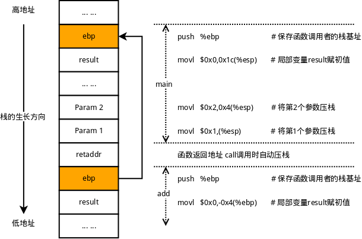
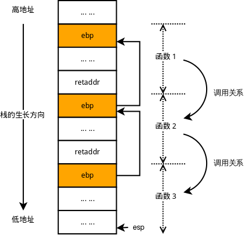

# 函數調用棧的獲取原理分析

本篇文章主要介紹一下獲取函數調用棧的原理，並給出相應的實現方式。

要了解調用棧，首先需要了解函數的調用過程，下面用一段代碼作為例子：

```cpp
#include <stdio.h>

int add(int a, int b) {
    int result = 0;

    result = a + b;

    return result;
}

int main(int argc, char *argv[]) {
    int result = 0;

    result = add(1, 2);

    printf("result = %d \r\n", result);

    return 0;
}
```

使用gcc編譯，然後gdb反彙編main函數，看看它是如何調用add函數的：

```cpp
(gdb) disassemble main
Dump of assembler code for function main:
   0x08048439 <+0>:     push   %ebp
   0x0804843a <+1>:     mov    %esp,%ebp
   0x0804843c <+3>:     and    $0xfffffff0,%esp
   0x0804843f <+6>:     sub    $0x20,%esp
   0x08048442 <+9>:     movl   $0x0,0x1c(%esp)  # 給result變量賦0值
   0x0804844a <+17>:    movl   $0x2,0x4(%esp)   # 將第2個參數壓棧(該參數偏移為esp+0x04)
   0x08048452 <+25>:    movl   $0x1,(%esp)      # 將第1個參數壓棧(該參數偏移為esp+0x00)
   0x08048459 <+32>:    call   0x804841c <add>  # 調用add函數
   0x0804845e <+37>:    mov    %eax,0x1c(%esp)  # 將add函數的返回值賦給result變量
   0x08048462 <+41>:    mov    0x1c(%esp),%eax
   0x08048466 <+45>:    mov    %eax,0x4(%esp)
   0x0804846a <+49>:    movl   $0x8048510,(%esp)
   0x08048471 <+56>:    call   0x80482f0 <printf@plt>
   0x08048476 <+61>:    mov    $0x0,%eax
   0x0804847b <+66>:    leave
   0x0804847c <+67>:    ret
End of assembler dump.
```

可以看到，參數是在add函數調用前壓棧，換句話說，參數壓棧由調用者進行，參數存儲在調用者的棧空間中，下面再看一下進入add函數後都做了什麼：

```cpp
(gdb) disassemble add
Dump of assembler code for function add:
   0x0804841c <+0>:     push   %ebp             # 將ebp壓棧(保存函數調用者的棧基址)
   0x0804841d <+1>:     mov    %esp,%ebp        # 將ebp指向棧頂esp(設置當前函數的棧基址)
   0x0804841f <+3>:     sub    $0x10,%esp       # 分配棧空間(棧向低地址方向生長)
   0x08048422 <+6>:     movl   $0x0,-0x4(%ebp)  # 給result變量賦0值(該變量偏移為ebp-0x04)
   0x08048429 <+13>:    mov    0xc(%ebp),%eax   # 將第2個參數的值賦給eax(準備運算)
   0x0804842c <+16>:    mov    0x8(%ebp),%edx   # 將第1個參數的值賦給edx(準備運算)
   0x0804842f <+19>:    add    %edx,%eax        # 加法運算(edx+eax)，結果保存在eax中
   0x08048431 <+21>:    mov    %eax,-0x4(%ebp)  # 將運算結果eax賦給result變量
   0x08048434 <+24>:    mov    -0x4(%ebp),%eax  # 將result變量的值賦給eax(eax將作為函數返回值)
   0x08048437 <+27>:    leave                   # 恢復函數調用者的棧基址(pop %ebp)
   0x08048438 <+28>:    ret                     # 返回(準備執行下條指令)
End of assembler dump.
```

進入add函數後，首先進行的操作是將當前的棧基址ebp壓棧(此棧基址是調用者main函數的)，然後將ebp指向棧頂esp，接下來再進行函數內的處理流程。函數結束前，會將函數調用者的棧基址恢復，然後返回準備執行下一指令。這個過程中，棧上的空間會是下面的樣子：



可以發現，每調用一次函數，都會對調用者的棧基址(ebp)進行壓棧操作，並且由於棧基址是由當時棧頂指針(esp)而來，會發現，各層函數的棧基址很巧妙的構成了一個鏈，即當前的棧基址指向下一層函數棧基址所在的位置，如下圖所示：




瞭解了函數的調用過程，想要回溯調用棧也就很簡單了，首先獲取當前函數的棧基址(寄存器ebp)的值，然後獲取該地址所指向的棧的值，該值也就是下層函數的棧基址，找到下層函數的棧基址後，重複剛才的動作，即可以將每一層函數的棧基址都找出來，這也就是我們所需要的調用棧了。

下面是根據原理實現的一段獲取函數調用棧的代碼，供參考。


```cpp
#include <stdio.h>

/* 打印調用棧的最大深度 */
#define DUMP_STACK_DEPTH_MAX 16

/* 獲取寄存器ebp的值 */
void get_ebp(unsigned long *ebp) {
    __asm__ __volatile__ (
        "mov %%ebp, %0"
        :"=m"(*ebp)
        ::"memory");
}

/* 獲取調用棧 */
int dump_stack(void **stack, int size) {
    unsigned long ebp = 0;
    int depth = 0;

    /* 1.得到首層函數的棧基址 */
    get_ebp(&ebp);

    /* 2.逐層回溯棧基址 */
    for (depth = 0; (depth < size) && (0 != ebp) && (0 != *(unsigned long *)ebp) && (ebp != *(unsigned long *)ebp); ++depth) {
        stack[depth] = (void *)(*(unsigned long *)(ebp + sizeof(unsigned long)));
        ebp = *(unsigned long *)ebp;
    }

    return depth;
}

/* 測試函數 2 */
void test_meloner() {
    void *stack[DUMP_STACK_DEPTH_MAX] = {0};
    int stack_depth = 0;
    int i = 0;

    /* 獲取調用棧 */
    stack_depth = dump_stack(stack, DUMP_STACK_DEPTH_MAX);

    /* 打印調用棧 */
    printf(" Stack Track: \r\n");
    for (i = 0; i < stack_depth; ++i) {
        printf(" [%d] %p \r\n", i, stack[i]);
    }

    return;
}

/* 測試函數 1 */
void test_hutaow() {
    test_meloner();
    return;
}

/* 主函數 */
int main(int argc, char *argv[]) {
    test_hutaow();
    return 0;
}
```

源文件下載：[鏈接](./src/dumpstack.c)

執行gcc dumpstack.c -o dumpstack 編譯並運行，執行結果如下：
```
 Stack Track:
 [0] 0x8048475
 [1] 0x8048508
 [2] 0x804855c
 [3] 0x804856a
```
