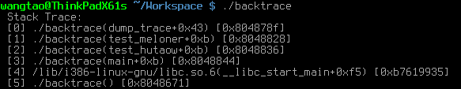

# 在Linux程序中輸出函數調用棧

程序發生異常時，將函數的調用棧打印出來，可以大大提高定位效率。

Linux中提供了三個函數用來獲取調用棧：

```cpp
/* 獲取函數調用棧 */
int backtrace(void **buffer, int size);

/* 將調用棧中的函數地址轉化為函數名稱 並返回一個字符串數組 */
char **backtrace_symbols(void *const *buffer, int size);

/* 將調用棧中的函數地址轉化為函數名稱 並將其定入到文件中 */
void backtrace_symbols_fd(void *const *buffer, int size, int fd);
```
示例代碼：
```cpp
#include <execinfo.h>
#include <stdio.h>
#include <stdlib.h>

/* 打印調用棧的最大深度 */
#define DUMP_STACK_DEPTH_MAX 16

/* 打印調用棧函數 */
void dump_trace() {
    void *stack_trace[DUMP_STACK_DEPTH_MAX] = {0};
    char **stack_strings = NULL;
    int stack_depth = 0;
    int i = 0;

    /* 獲取棧中各層調用函數地址 */
    stack_depth = backtrace(stack_trace, DUMP_STACK_DEPTH_MAX);

    /* 查找符號表將函數調用地址轉換為函數名稱 */
    stack_strings = (char **)backtrace_symbols(stack_trace, stack_depth);
    if (NULL == stack_strings) {
        printf(" Memory is not enough while dump Stack Trace! \r\n");
        return;
    }

    /* 打印調用棧 */
    printf(" Stack Trace: \r\n");
    for (i = 0; i < stack_depth; ++i) {
        printf(" [%d] %s \r\n", i, stack_strings[i]);
    }

    /* 獲取函數名稱時申請的內存需要自行釋放 */
    free(stack_strings);
    stack_strings = NULL;

    return;
}

/* 測試函數 2 */
void test_meloner() {
    dump_trace();
    return;
}

/* 測試函數 1 */
void test_hutaow() {
    test_meloner();
    return;
}

/* 主函數 */
int main(int argc, char *argv[]) {
    test_hutaow();
    return 0;
}
```

源文件下載：[鏈接](./src/backtrace.c)

編譯時需要加上-rdynamic參數，以得到符號名稱，像下面這樣：


