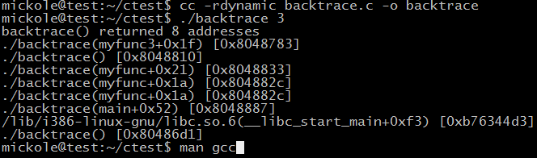

# 利用backtrace和backtrace_symbols函數打印調用棧信息


在頭文件"execinfo.h"中聲明瞭三個函數用於獲取當前線程的函數調用堆棧。

```c
#include <execinfo.h>
int backtrace(void **buffer, int size);
char **backtrace_symbols(void *const *buffer, int size);
void backtrace_symbols_fd(void *const *buffer, int size, int fd);
```
man 幫助：

```c
DESCRIPTION        
       backtrace() returns a backtrace for the calling program, in the array
       pointed to by buffer.  A backtrace is the series of currently active
       function calls for the program.  Each item in the array pointed to by
       buffer is of type void *, and is the return address from the
       corresponding stack frame.  The size argument specifies the maximum
       number of addresses that can be stored in buffer.  If the backtrace
       is larger than size, then the addresses corresponding to the size
       most recent function calls are returned; to obtain the complete
       backtrace, make sure that buffer and size are large enough.

       Given the set of addresses returned by backtrace() in buffer,
       backtrace_symbols() translates the addresses into an array of strings
       that describe the addresses symbolically.  The size argument
       specifies the number of addresses in buffer.  The symbolic
       representation of each address consists of the function name (if this
       can be determined), a hexadecimal offset into the function, and the
       actual return address (in hexadecimal).  The address of the array of
       string pointers is returned as the function result of
       backtrace_symbols().  This array is malloc(3)ed by
       backtrace_symbols(), and must be freed by the caller.  (The strings
       pointed to by the array of pointers need not and should not be
       freed.)

       backtrace_symbols_fd() takes the same buffer and size arguments as
       backtrace_symbols(), but instead of returning an array of strings to
       the caller, it writes the strings, one per line, to the file
       descriptor fd.  backtrace_symbols_fd() does not call malloc(3), and
       so can be employed in situations where the latter function might
       fail.

```


```c
int backtrace(void **buffer,int size)
```

該函數用與獲取當前線程的調用堆棧,獲取的信息將會被存放在buffer中,它是一個指針數組。參數 size 用來指定buffer中可以保存多少個void* 元素。函數返回值是實際獲取的指針個數,最大不超過size大小在buffer中的指針實際是從堆棧中獲取的返回地址,每一個堆棧框架有一個返回地址。
注意某些編譯器的優化選項對獲取正確的調用堆棧有干擾,另外內聯函數沒有堆棧框架;刪除框架指針也會使無法正確解析堆棧內容

```c
char ** backtrace_symbols (void *const *buffer, int size)
```

backtrace_symbols將從backtrace函數獲取的信息轉化為一個字符串數組. 參數buffer應該是從backtrace函數獲取的數組指針,size是該數組中的元素個數(backtrace的返回值)，函數返回值是一個指向字符串數組的指針,它的大小同buffer相同.每個字符串包含了一個相對於buffer中對應元素的可打印信息.它包括函數名，函數的偏移地址,和實際的返回地址
現在,只有使用ELF二進制格式的程序和苦衷才能獲取函數名稱和偏移地址.在其他系統,只有16進制的返回地址能被獲取.另外,你可能需要傳遞相應的標誌給鏈接器,以能支持函數名功能(比如,在使用GNU ld的系統中,你需要傳遞(-rdynamic))

backtrace_symbols生成的字符串都是malloc出來的，但是不要最後一個一個的free，因為backtrace_symbols是根據backtrace給出的call stack層數，一次性的malloc出來一塊內存來存放結果字符串的，所以，像上面代碼一樣，只需要在最後，free backtrace_symbols的返回指針就OK了。這一點backtrace的manual中也是特別提到的。
注意:如果不能為字符串獲取足夠的空間函數的返回值將會為NULL

```c
void backtrace_symbols_fd (void *const *buffer, int size, int fd)
```

backtrace_symbols_fd與backtrace_symbols 函數具有相同的功能,不同的是它不會給調用者返回字符串數組,而是將結果寫入文件描述符為fd的文件中,每個函數對應一行.它不需要調用malloc函數,因此適用於有可能調用該函數會失敗的情況。
man手冊中示例：

```c
#include <execinfo.h>
#include <stdio.h>
#include <stdlib.h>
#include <unistd.h>

void
myfunc3(void)
{
   int j, nptrs;
#define SIZE 100
   void *buffer[100];
   char **strings;

   nptrs = backtrace(buffer, SIZE);
   printf("backtrace() returned %d addresses\n", nptrs);

   /* The call backtrace_symbols_fd(buffer, nptrs, STDOUT_FILENO)
      would produce similar output to the following: */

   strings = backtrace_symbols(buffer, nptrs);
   if (strings == NULL) {
       perror("backtrace_symbols");
       exit(EXIT_FAILURE);
   }

   for (j = 0; j < nptrs; j++)
       printf("%s\n", strings[j]);

   free(strings);
}

static void   /* "static" means don't export the symbol... */
myfunc2(void)
{
   myfunc3();
}

void
myfunc(int ncalls)
{
   if (ncalls > 1)
       myfunc(ncalls - 1);
   else
       myfunc2();
}

int
main(int argc, char *argv[])
{
   if (argc != 2) {
       fprintf(stderr, "%s num-calls\n", argv[0]);
       exit(EXIT_FAILURE);
   }

   myfunc(atoi(argv[1]));
   exit(EXIT_SUCCESS);
}
```

結果：



總結：使用以下幾個函數既可完成堆棧信息的打印 

```c
int backtrace(void** buffer, int size)

char** backtrace_symbols(void* const* buffer, int size)

char* abi::__cxa_demangle
(
    const char* mangled_name,
    char* output_buffer,
    size_t* length,
    int* status
)

```

1. backtrace可以在程序運行的任何地方被調用，返回各個調用函數的返回地址，可以限制最大調用棧返回層數。

2. 在backtrace拿到函數返回地址之後，backtrace_symbols可以將其轉換為編譯符號，這些符號是編譯期間就確定的

3. 根據backtrace_symbols返回的編譯符號，abi::__cxa_demangle可以找到具體地函數方法

