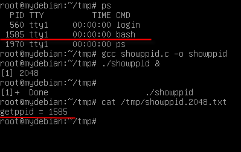
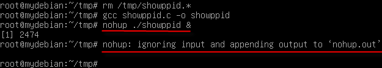
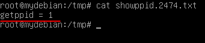
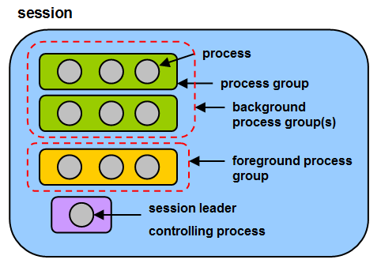
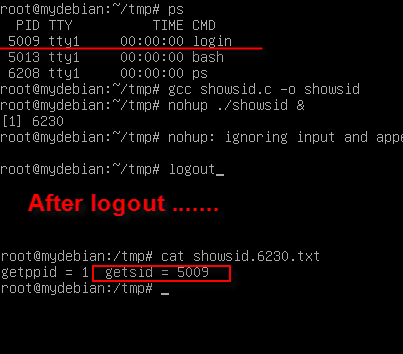
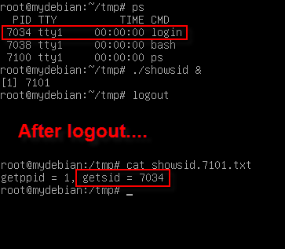

# Linux Note: daemon 與 background process 的差異


daemon 與 background process 從外觀看非常相像，筆者初學 Linux 時還當成一樣的東西。

令人驚訝的是，翻了很多 Linux 的書(看的不夠多?)，幾乎沒有一本能講清楚兩者的差異。因此，筆者興起一股念頭看是不是可以寫一篇文章說清楚、講明白？甚至是 background process 在某種程度上可以替代  daemon？

##實驗環境

- VirtualBox 5.0.20
- Debian 8.0 Jessie AMD64


daemon sample

下列原始碼為標準 Linux daemon 範本，取自 Linux System Programming 2nd(LSP)：

```cpp
#include <fnctl.h>
#include <unistd.h>
#include <linux/fs.h>
 
int main(void)
{
    pid_t pid;
    int i;
     
    /* create new process */
    pid = fork();
    if(pid == -1)
        return -1;
    else if(pid != 0)
        exit(EXIT_SUCCESS);
     
    /* create new session and process group */
    if(setsid() == -1)
        return -1;
     
    /* set the working directory to the root directory */
    if(chdir("/") == -1)
        return -1;
     
    /* close all open files --NR_OPEN is overkill, but works */
    if(i = 0; i < NR_OPEN; ++i)
        close(i);
     
    /* redirect fd's 0,1,2 to /dev/null */
    open("/dev/null", O_RDWR); /* stdin */
    dup(0);                    /* stdout */
    dup(0);                    /* stderr */
     
    /* do its daemon thing ... */
     
    return 0;
}
```

-  11-15: fork() 後 parent process 自殺，child process 的 parent process 變為 init process。
- Line 18: 呼叫 setsid()，使得 daemon 有新 process group 與新 session。保證不存在與 daemon 相關的控制終端。
- Line 22: 把當前工作目錄改為根目錄。
- Line 26-27: 關閉所有繼承來的 file descriptor(s)。
- Line 30-32: 把 stdin, stdout, stderr 導向 /dev/null


Line 22,26-27,30-32 不難理解，Line 11-15, 18 比較令人迷惑，接下來會針對這兩點做比較與討論。

background process 的 parent process 是誰？

Line 11-15 我們知道 daemon parent process = init process(pid = 1)，那 background process 的 parent process 是誰？寫個小程式實驗看看就知道了：

```cpp
/* showppid.c */
#include <unistd.h>
#include <stdio.h>
 
int main(void)
{
    FILE *fp;
    char path[80];
     
    //sleep(30);
    snprintf(path, sizeof(path) - 1, "/tmp/showppid.%d.txt", getpid());    
    fp = fopen(path, "w+");
    if(fp == 0)
        return 0;
     
    fprintf(fp, "getppid = %d\n", getppid());
    fclose(fp);
    return 0;
}
```

測試結果： 




parent process 仍然是 bash，但稍懂 Linux 的人都知道，如果要讓 background process 在 logout 之後繼續執行可以使用 nohup 指令，我們改用 nohup 再實驗一次(為了有時間打字 logout，請把 Line 9 註解拿掉)。

實驗結果：



After Logout...


從上圖可以看到，bash 已經主動幫我們重導了 stdin & stdout，登出再登入後檢查檔案也可以發現 parent process 變成了 init process。那 nohup 的效果等同於 daemon 嗎？非也，我們接著往下看。

setsid() ？

要弄懂 setsid() 必須先了解什麼是 session：





- session & process groups 的主要用途為 shell job control。
- login shell 會變成 session leader 與 terminal 的 controlling process，此時 sid = login shell pid。
- 一個 session 中所有 processes 共享一個 controlling terminal。
- 任一時刻 session 中某個 process group 會成為 foreground process group，其餘變成 background process group。
- 只有 foreground process group 可以讀取 stdin。
- 當 terminal 斷開時(例如 logout)，則 kernel 會向 controlling process(例如 bash)發射 SIGHUP signal。如果以 exec 命令執行程式，該程式會取代 shell 成為新 controlling process。

controlling process 收到 SIGHUP 會引起連鎖反應，controlling process 會發射 SIGHUP 給他建立的每個 job。

所以可以很清楚的知道 nohup 指令的由來了，也知道為何 daemon 要呼叫 setsid() 斷開魂結，斷開鎖鏈，斷開一切的牽連...

但至此我們還不算做好做滿，把前面的程式做點小修改，觀察 nohup 的結果是否與 setsid()  一樣。

```cpp
/* showsid.c */
#include <unistd.h>
#include <stdio.h>
 
int main(void)
{
    FILE *fp;
    char path[80];
     
    sleep(30);
    snprintf(path, sizeof(path) - 1, "/tmp/showsid.%d.txt", getpid());    
    fp = fopen(path, "w+");
    if(fp == 0)
        return 0;
     
    fprintf(fp, "getppid = %d, getsid = %d\n", getppid(), getsid(0));
    fclose(fp);
    return 0;
}
```
實驗結果：



從上圖可以看到 sid 仍然是上一個 login pid，大家可能會奇怪為何 sid 不是 bash pid(5013)？筆者實驗的結果是如果是 Desktop 下的終端機就會是 bash pid，不過這不是這裡要討論的重點，筆者也沒研究清楚，未來有機會再說。

由此可知為何 daemon 要呼叫 setsid()，因為這才是最謹慎的作法。另外一般 SIGHUP 在 daemon 的慣用法是 reload configuration，所以收到 SIGHUP 就把 process 結束對 daemon 也不是常見行為。

##模擬 nohup

重點：`「shell 不會向不是由他建立的 process group 發送 SIGHUP」`，所以我們只要換個 process group 就行了：

```cpp
/* showsid.c */
#include <unistd.h>
#include <stdio.h>
 
int main(void)
{
    FILE *fp;
    char path[80];
     
    setpgid(0, 0); //create new process group and becomes leader
    sleep(30);
    snprintf(path, sizeof(path) - 1, "/tmp/showsid.%d.txt", getpid());    
    fp = fopen(path, "w+");
    if(fp == 0)
        return 0;
     
    fprintf(fp, "getppid = %d, getsid = %d\n", getppid(), getsid(0));
    fclose(fp);
    return 0;
}
```

實驗結果： 



在 Practical UNIX Programming:
A Guide to Concurrency, Communication, and Multithreading 這本書中有一個 shell 範例就是用 setpgid 設定 background process。事實上不是每個 shell 都會在 logout 後發送 SIGHUP 發送給以「&」 創建的 background process ，目前手邊的資料是 bash、korn shell 會有此行為。

對此議題有興趣的朋友可以參考 The Linux Programming Interface Ch.34，我們也可以看到 background process 某種程度上可以替代 daemon(在你很確切的知道該程式的行為下)。
