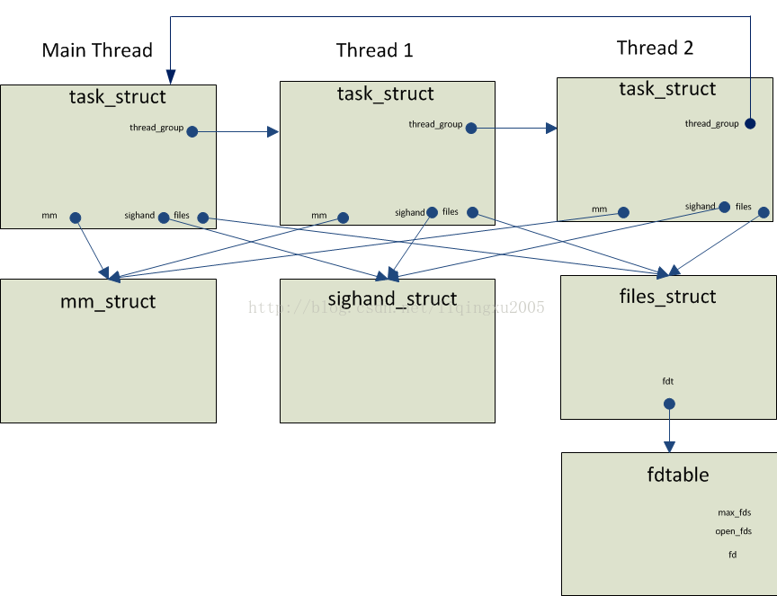

# Linux內核中線程的實現方式


本文通過對Linux內核源碼的研究和兩個C/C++程序，探討了 Linux內核對線程的支持。並得出了一個結論：Linux內核的線程實現是貨真價實的。因此，Linux上的多線程實現是真正的多線程實現。所謂Linux內核其實並不支持線程的說法是錯誤的。

##1.    前言
關於Linux 內核中線程的實現方式，有一種說法認為：Linux內核其實並不支持線程，因此，Linux上的多線程實現其實是“偽多線程”。

這種說法到底正確嗎？Linux內核到底是否支持多線程？本文作者通過對Linux內核源碼的研究和一些C/C++程序來回答這一問題。

##2.    進程與線程
按照操作系統教科書中的定義。進程與線程有以下特點：

1） 進程是程序的執行。<br>
2） 在一個進程中，可以有一到多個線程。<br>
3） 這些線程共享同一個地址空間。<br>
4） 但是每個線程有自己獨立的運行棧。<br>
5） 每個線程可以被操作系統獨立地調度。<br>

##3.    描述線程的數據結構
根據http://en.wikipedia.org/wiki/Multithreading_(computer_architecture),多線程編程模式興起於90年代末。因此，當Linus Torvalds於1991年實現Linux的第一個版本是，他根本沒有考慮對線程的支持。

在早期的Linux版本中，Linux只支持進程，不支持線程。在早期的Linux的版本中，描述進程的數據結構式struct task_struct，這也就是操作系統教科書中所說的PCB（Process Control Block）。

為了支持線程，當代Linux採用的方式是用struct task_struct既描述進程，也描述線程。圖1給出了2.6.32.27內核中描述進程/線程關係的數據結構。




圖1：描述進程/線程關係的數據結構

從上圖我們可以看出：

1） 每個線程都用一個獨立的task_struct來描述。<br>
2） 同一個進程的多個線程通過task_struct的thread_group指針字段鏈接成一個雙向循環鏈表。為了清晰起見，上圖只是畫出了一個方向的鏈接。<br>
3） 同一個進程的多個線程共享同一個內存地址空間，因為它們task_struct的mm指針字段都指向了同一個mm_struct結構。<br>
4） 對於每個信號，同一個進程的多個線程共享同一個信號處理程序。因為它們task_struct的sighand字段都指向了同一個sighand_struct結構。<br>
5） 同一個進程的多個線程共享同一個文件描述表。因此，一個線程打開的文件，對其它線程也是可見的。<br>


為了驗證上面的結論，我們下面通過一個用戶態的多線程程序和一個內核態的模塊來進行驗證。本文的實驗環境如下：

1） Cent OS 版本: 6.5<br>
2） Linux內核2.6.32<br>
3） GCC版本：4.4.7<br>

##4.    一個用戶態的多線程程序

下面是該用戶態程序的源碼：

```c
#include <stdio.h>
#include <unistd.h>
#include <pthread.h>
#include <signal.h>
static void handler(int sig)
{
    printf("CTRL+C captured\n");
}
static void* threadFunc(void* arg)
{
    printf("In threadFunc()\n");
    int fd = dup(0);
    printf("fd = %d\n", fd);
    struct sigaction sa;
    sigemptyset(&sa.sa_mask);
    sa.sa_flags = 0;
    sa.sa_handler = handler;

    if (sigaction(SIGINT, &sa, NULL) == -1) {
        printf("Set SIGINT handler error\n");
    }

    sleep(60 * 10); // in seconds
    return (void*)1;
}
int main(void)
{
    pthread_t t[100];
    void* res;
    int s;
    int thread_count = 2;
    int i;

    for (i = 0; i < thread_count; i++) {
        s = pthread_create(&t[i], NULL, threadFunc, NULL);

        if (s != 0) {
            printf("pthread_create() call failed. Return value:%d.\n", s);
        }
    }

    for (i = 0; i < thread_count; i++) {
        s = pthread_join(t[i], &res);

        if (s != 0) {
            printf("pthread_join() call failed. Return value: %d\n", s);
        } else {
            printf("pthread_join() call suceeded. Thread exit code: %ld\n", (long)res);
        }
    }

    return 0;
}
```

下面是編譯該程序的Makefile：

```sh
TARGET = pthread_test
SOURCES = main.cpp
CC = g++
FLAGS = -g -Wall
LIBS = -lm -lstdc++ -pthread
# Objs are all the sources, with .cpp replaced by .o
OBJS := $(SOURCES:.cpp=.o)

all: $(TARGET)

$(TARGET): $(OBJS)
	$(CC) $(CFLAGS) -o $(TARGET) $(OBJS) $(FLAGS) $(LIBS)

.cpp.o:
	$(CC) $(FLAGS) $(INCLUDES) -c $<

clean:
	rm -f *.o
	rm -f $(TARGET)
```


該用戶態程序在主線程中通過POSIX Thread庫創建了兩個線程。在每個線程中：

1） 調用dup(0)複製一個新的標準輸入的描述符。<br>
2） 設置了SIGINT信號的處理程序。<br>
3） 睡眠一個小時。<br>

##5.    一個內核態的模塊
該內核態模塊的源碼：


```c
#include <linux/module.h>   // included for all kernel modules
#include <linux/kernel.h>   // included for KERN_INFO
#include <linux/init.h>     // included for __init and __exit macros
#include <linux/sched.h>
#include <linux/fdtable.h>

MODULE_LICENSE("GPL");

void dump_schedule_info(struct task_struct* task)
{
    printk("sched_class of task id(%d, comm='%s'):0x%x\n", task->pid, task->comm,
           task->sched_class);
}
void dump_file_struct(struct files_struct* files)
{
    int max_fds = files->fdt->max_fds;
    int fd;
    printk("files->fdt->max_fds=%d\n", max_fds);

    for (fd = 0; fd < max_fds; fd++) {
        if (FD_ISSET(fd, files->fdt->open_fds)) {
            printk("fd %d is open\n", fd);
        } // if
    } // for
}
void dump_sighand_struct(struct sighand_struct* sighand)
{
    int i;

    for (i = 0; i < _NSIG; i++) {
        struct k_sigaction* sigaction = &sighand->action[i];

        if (sigaction->sa.sa_handler == SIG_DFL) {
            printk("SIG %d: SIG_DFL\n", i);
        } else if (sigaction->sa.sa_handler == SIG_IGN) {
            printk("SIG %d: SIG_IGN\n", i);
        } else {
            printk("SIG %d: 0x%x\n", i, sigaction->sa.sa_handler);
        }
    } // for
}
void enum_threads_in_process(struct task_struct* proc)
{
    struct task_struct* t;
    printk("Start enumerating threads in process:%d\n", proc->pid);
    int count = 0;
    t = proc;

    do {
        printk("Thread id=%d, comm='%s', files=0x%x, mm=0x%x, active_mm=0x%x, sighand=0x%x\n",
               t->pid, t->comm, t->files, t->mm, t->active_mm, t->sighand);
        dump_schedule_info(t);
        dump_file_struct(t->files);
        dump_sighand_struct(t->sighand);
        count ++;
        t = next_thread(t);
    } while (t != proc);

    printk("Thread count in proc(pid=%d):%d\n", proc->pid, count);
}
void enum_processes()
{
    struct task_struct* proc;
    printk("\n\nStart enumerating processes:\n");
    int count = 0;
    for_each_process(proc) {
        printk("pid=%d, comm='%s', files=0x%x\n", proc->pid, proc->comm, proc->files);
        enum_threads_in_process(proc);
        printk("\n");
        count ++;
    } // for_each_process
    printk("Process count:%d\n", count);
}
int init_module(void)
{
    enum_processes();
    return 0;    // Non-zero return means that the module couldn't be loaded.
}
void cleanup_module(void)
{
    printk(KERN_INFO "Cleaning up module.\n");
}
```

下面是編譯該模塊的Makefile：

```sh
obj-m += enum_processes.o
all:
	make -C /lib/modules/$(shell uname -r)/build M=$(PWD) modules
clean:
	make -C /lib/modules/$(shell uname -r)/build M=$(PWD) clean
```

在內核加載該內核態模塊時，該模塊：

1） 枚舉出系統中的每一個進程。<br>
2） 對於每個進程，枚舉出其每一個線程。<br>
3） 對於每個線程，打印其task_struct的mm指針字段。<br>
4） 對於每個線程，打印其文件描述符表。<br>
5） 對於每個線程，打印其每個信號的處理程序。<br>

##6.    實驗


###6.1  運行用戶態程序pthread_test
我們運行pthread_test，然後按CTRL+C。

```sh
[liqingxu@localhost posix_thread]$ ./pthread_test
In threadFunc()
fd = 3
In threadFunc()
fd = 4
^CCTRL+C captured
```

通過上面的輸出，我們可以看到：

1） 線程成功的設置了SIGINT信號的處理程序。<br>
2） 第一個線程的dup(0)調用返回的文件描述符為3。<br>
3） 第二個線程的dup(0)調用返回的文件描述符為4。<br>

下面是該模塊註冊時打印的一部分信息。通過下面highlight出的信息，我們可以看出：

1） 每個線程都共享同一個地址空間，因為其task_struct 的mm字段指向了同樣的mm_struct結構。<br>
2） 每個線程都共享同一個信號處理程序。因為它們task_struct的sighand字段都指向了同一個sighand_struct結構。<br>
3） 每個線程都共享同一個文件描述表。<br>

這驗證了我們前面討論描述線程的數據結構時得到的結論。<br>

```sh
Nov 10 03:43:30 localhost kernel: pid=5703, comm='pthread_test', files=0x4f12b200
Nov 10 03:43:30 localhost kernel: Start enumerating threads in process:5703
Nov 10 03:43:30 localhost kernel: Thread id=5703, comm='pthread_test', files=0x4f12b200,mm=0x4f00c180, active_mm=0x4f00c180, sighand=0x6462b540
Nov 10 03:43:30 localhost kernel: sched_class of task id(5703, comm='pthread_test'):0x8160be60
Nov 10 03:43:30 localhost kernel: files->fdt->max_fds=256
Nov 10 03:43:30 localhost kernel: fd 0 is open
Nov 10 03:43:30 localhost kernel: fd 1 is open
Nov 10 03:43:30 localhost kernel: fd 2 is open
Nov 10 03:43:30 localhost kernel: fd 3 is open
Nov 10 03:43:30 localhost kernel: fd 4 is open
Nov 10 03:43:30 localhost kernel: SIG 0: SIG_DFL
Nov 10 03:43:30 localhost kernel: SIG 1: 0x4007e4
Nov 10 03:43:30 localhost kernel: SIG 2: SIG_DFL
......
Nov 10 03:43:30 localhost kernel: Thread id=5704, comm='pthread_test', files=0x4f12b200,mm=0x4f00c180, active_mm=0x4f00c180, sighand=0x6462b540
Nov 10 03:43:30 localhost kernel: sched_class of task id(5704, comm='pthread_test'):0x8160be60
Nov 10 03:43:30 localhost kernel: files->fdt->max_fds=256
Nov 10 03:43:30 localhost kernel: fd 0 is open
Nov 10 03:43:30 localhost kernel: fd 1 is open
Nov 10 03:43:30 localhost kernel: fd 2 is open
Nov 10 03:43:30 localhost kernel: fd 3 is open
Nov 10 03:43:30 localhost kernel: fd 4 is open
Nov 10 03:43:30 localhost kernel: SIG 0: SIG_DFL
Nov 10 03:43:30 localhost kernel: SIG 1: 0x4007e4
Nov 10 03:43:30 localhost kernel: SIG 2: SIG_DFL
......
Nov 10 03:43:30 localhost kernel: Thread id=5705, comm='pthread_test', files=0x4f12b200,mm=0x4f00c180, active_mm=0x4f00c180, sighand=0x6462b540
Nov 10 03:43:30 localhost kernel: sched_class of task id(5705, comm='pthread_test'):0x8160be60
Nov 10 03:43:30 localhost kernel: files->fdt->max_fds=256
Nov 10 03:43:30 localhost kernel: fd 0 is open
Nov 10 03:43:30 localhost kernel: fd 1 is open
Nov 10 03:43:30 localhost kernel: fd 2 is open
Nov 10 03:43:30 localhost kernel: fd 3 is open
Nov 10 03:43:30 localhost kernel: fd 4 is open
Nov 10 03:43:30 localhost kernel: SIG 0: SIG_DFL
Nov 10 03:43:30 localhost kernel: SIG 1: 0x4007e4
Nov 10 03:43:30 localhost kernel: SIG 2: SIG_DFL
......
Nov 10 03:43:30 localhost kernel: Thread count in proc(pid=5703):3
```

##7.    PThread線程庫是如何創建線程的
###7.1  Glibc源程序RPM包的下載
Pthread library的實現在glibc中。

wget http://vault.centos.org/6.5/os/Source/SPackages/glibc-2.12-1.132.el6.src.rpm

###7.2  從RPM包中獲取Glibc的源碼
1)      需要先安裝rpm-build包 yum install rpm-build<br>
2)      mkdir -p ~/rpmbuild/{BUILD,RPMS,SOURCES,SPECS,SRPMS}<br>
3)      編譯但編譯完成後不刪除源程序 rpmbuild --recompile glibc-2.12-1.132.el6.src.rpm<br>
4)      編譯完成後，Pthread的源程序在~/rpmbuild/BUILD/glibc-2.12-2-gc4ccff1/nptl目錄下<br>

###7.3  pthread_create()的實現

Linux內核提供了一個系統調用clone()可以創建線程。該系統調用的實現函數是sys_clone()。

在文件nptl/sysdeps/pthread/createthread.c中，我們可以看到傳遞給clone()系統調用的flags參數如下：

```c
int clone_flags = (CLONE_VM | CLONE_FS | CLONE_FILES | CLONE_SIGNAL
                   | CLONE_SETTLS | CLONE_PARENT_SETTID
                   | CLONE_CHILD_CLEARTID | CLONE_SYSVSEM
#if __ASSUME_NO_CLONE_DETACHED == 0
                   | CLONE_DETACHED
#endif
                   | 0);
```

我們可以看出，因為pthread_create()傳遞給sys_clone()的flags參數中包含了CLONE_VM |  CLONE_FILES | CLONE_SIGNAL標誌，所以其創建出來的線程都共享一個地址空間、一套文件描述符表和一套信號處理程序表。

##8.    結論
通過前面對Linux內核源碼的分析和實驗，我們可以得出來一個結論：Linux內核的線程實現是貨真價實的。因此，Linux上的多線程實現是真正的多線程實現。

##9.    參考資料
- 1.       Daniel P. Bovet & Marco Cesati著.  Uderstanding the Linux Kernel. O’Reilly Media, Inc. 2006.

- 2.       Michael KerrisK. The Linux Programming Interface. No Starch Press, Inc. 2010.

Syscalls on x86/x64: http://stackoverflow.com/questions/9506353/how-to-invoke-a-system-call-via-sysenter-in-inline-assembly-x86-amd64-linux