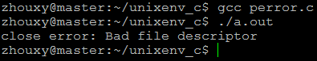
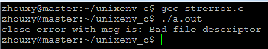

# linux系统编程之错误处理：perror,strerror和errno


### 1. 在系统编程中错误通常通过函数返回值来表示，并通过特殊变量errno来描述。

errno这个全局变量在<errno.h>头文件中声明如下：extern int errno;

errno是一个由POSIX和ISO C标准定义的符号，看（用）起来就好像是一个整形变量。当系统调用或库函数发生错误的时候，比如以只读方式打开一个不存在的文件时，它的值将会被改变，根据errno值的不同，我们就可以知道自己的程序发生了什么错误，然后进行相应的处理。

为什么，要强调errno看起来好像是一个整形变量呢？因为有的标准(如ISO C)只规定了errno的作用，而没有规定它的实现方式，它可能被定义成一个变量，也有可能被定义成一个宏，这个具体要看编译器自己的实现。早些时候，POSIX.1曾把errno定义成extern int errno这种形式，但现在这种方式比较少见了。因为以这种形式来实现errno，在多线程环境下errno变量是被多个线程共享的，这样可能线程A发生某些错误改变了errno的值，线程B虽然没有发生任何错误，但是当它检测errno的值的时候，线程B会以为自己发生了错误。所以现在errno在Linux中被实现成extern int * __errno_location(void): #define errno (*__errno_location())，这样每个线程都有自己的errno，不会再发生混乱了。

 

- 关于errno有三点需要特别注意：
    - 如果系统调用或库函数正确执行的话，errno的值是不会被清零（置0，注意这里是不会被清零，不是不会被改变）的，假若执行函数A的时候发生了错误errno被改变，接下来直接执行函数B，如果函数B正确执行的话，errno还保留函数A发生错误时被设置的值。所以，在利用errno之前，最好先对函数的返回值进行判断，看是否发生了错误，返回值错误再利用errno判断时哪里发生了错误。所以如果一个函数无法从返回值上判断正误，而只能通过errno来判断出错，那你在调用它之前必须手动将errno清零！
    
    - 系统调用或库函数正确执行，并不保证errno的值不会被改变！
    
    - 任何错误号（即发生错误时errno的取值）都是非0的。
    

### 2. 错误处理函数

- perror
- strerror

perror和strerror函数都是用来打印错误提示信息的，它们的原型分别是：

```c
#include <stdio.h>
void perror(const char *s);
```

它先打印s指向的字符串，然后输出当前errno值所对应的错误提示信息，例如当前errno若为12，调用perror("ABC")，会输出"ABC: Cannot allocate memory"。

测试程序：

```c
#include <stdio.h>
#include <unistd.h>

int main(void)
{
    int fd = 10;
    int ret;
    ret = close(fd);
    if(ret == -1)
        perror("close error");
    return 0;
}
```

测试结果：




```c
#include <string.h>
char *strerror(int errnum);
```

它返回errnum的值所对应的错误提示信息，例如errnum等于12的话，它就会返回"Cannot allocate memory"。

测试程序：

```
#include <stdio.h>
#include <string.h>
#include <unistd.h>
#include <errno.h>

int main(void)
{
    int fd = 10;
    int ret;
    ret = close(fd);
    if(ret == -1)
        fprintf(stderr, "close error with msg is: %s\n",strerror(errno));
    return 0;
}
```

测试结果：


